# Лекция 1. Первая игра в Godot

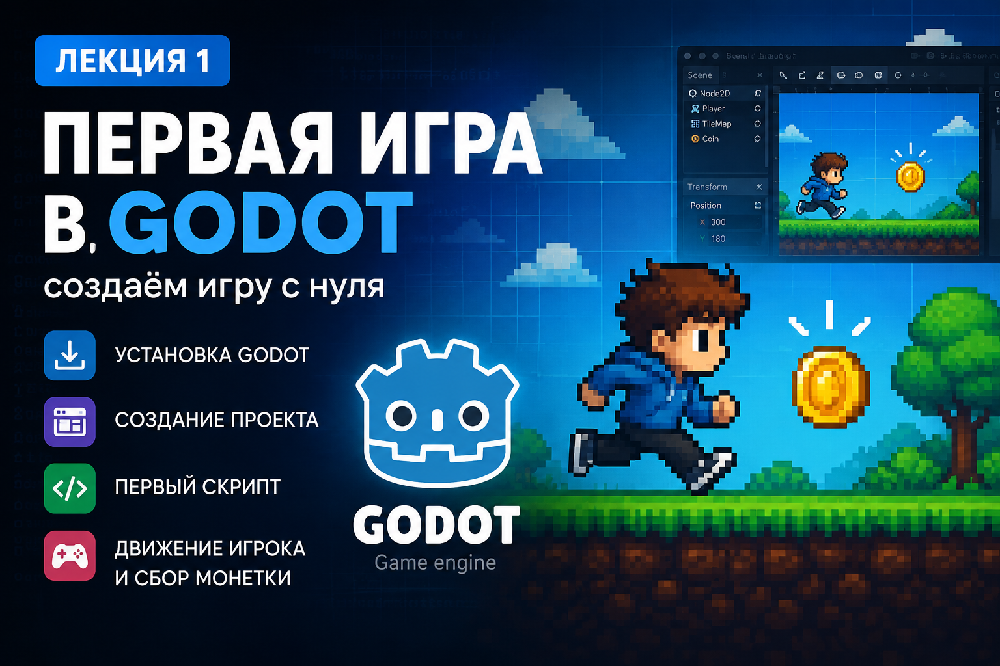

Сегодня мы начинаем знакомство с разработкой игр. За время курса мы будем не просто смотреть, как устроены игры, а **создавать их самостоятельно**:

- писать код;
- создавать персонажей;
- добавлять игровые объекты;
- придумывать правила игры;
- работать с анимациями;
- добавлять звуки;
- создавать уровни;
- запускать игры на компьютере и телефоне.

Для разработки мы будем использовать игровой движок **Godot** и язык программирования **GDScript**. Если вы уже немного знакомы с Python - это будет большим плюсом. Многие конструкции GDScript похожи на Python.

Например, в Python переменная может выглядеть так:

```python
speed = 300
```

В GDScript похожая переменная записывается так:

```gdscript
var speed = 300
```

Пока не нужно запоминать разницу между этими вариантами. Мы будем знакомиться с GDScript постепенно, когда код понадобится нам для создания конкретных игровых механик.

---

## Что мы создадим сегодня

Наша первая игра будет называться **Catch the Coin**. В дальнейшем мы добавим в неё монетки, столкновения, очки и другие игровые механики. Но начнём с самого главного - создадим **игрока и научим его двигаться**.

Сегодня мы пройдём путь от пустого проекта до первого управляемого игрового объекта:

```text
Новый проект
      ↓
первая Scene
      ↓
Player
      ↓
изображение
      ↓
первый скрипт
      ↓
движение
      ↓
форма столкновения
```

Во время работы мы познакомимся с основными понятиями Godot:

- `Scene` и `Node`;
- `Parent` и `Child`;
- `Sprite2D`;
- `CharacterBody2D`;
- `Inspector`;
- координатами `X` и `Y`;
- первым скриптом на GDScript;
- обработкой нажатий клавиш;
- `CollisionShape2D`.

В результате наша Scene будет иметь такую структуру:

```text
Game
└── Player
    ├── Sprite2D
    └── CollisionShape2D
```

Где:

- `Game` - основная Scene;
- `Player` - игровой персонаж;
- `Sprite2D` - изображение персонажа;
- `CollisionShape2D` - его физическая форма.

К `Player` также будет подключён первый скрипт:

```text
Player
   ↓
player.gd
   ↓
получаем нажатия клавиш
   ↓
определяем направление
   ↓
двигаем персонажа
```

В конце занятия у нас ещё не будет готовой игры **Catch the Coin**. Зато будет создана её основа - **персонаж, которым уже можно управлять и который готов к дальнейшему взаимодействию с игровым миром**. На следующих занятиях мы продолжим развивать этот проект:

```text
Player
   ↓
Coin
   ↓
столкновение
   ↓
сбор монетки
   ↓
очки и правила игры
```

Так шаг за шагом из отдельных Node, Scene и небольших участков кода будет появляться полноценная игра.

---

## Из чего будет состоять наша игра

Даже самая простая игра состоит из нескольких частей. Для `Catch the Coin` нам понадобятся:

```text
Catch the Coin

├── игровой мир
├── игрок
├── монетка
└── игровая логика
```

Разберём каждую часть.

### Игровой мир

Игровой мир - это пространство, внутри которого происходит игра. Сегодня он будет очень простым. Позже внутри игрового мира могут находиться:

- стены;
- платформы;
- враги;
- здания;
- предметы;
- препятствия;
- фон;
- уровни.

Например:

```text
Game

├── Player
├── Enemy
├── Coin
├── Wall
└── Background
```

Мы постепенно научимся создавать такие игровые миры самостоятельно.

### Игрок

Игрок - это объект, которым мы управляем. На первом занятии наш персонаж будет максимально простым. Позже у него могут появиться:

- скорость;
- здоровье;
- оружие;
- способности;
- анимации;
- звуки;
- инвентарь.

Но в первую очередь мы должны научить его двигаться.

### Монетка

Монетка - ещё один объект нашей игры. Игрок должен иметь возможность подойти к ней и подобрать её. Мы как люди легко понимаем ситуацию:

```text
🙂 → 🪙
```

Персонаж подошёл к монетке. Но компьютер сам по себе не знает:

- где находится персонаж;
- где находится монетка;
- коснулись ли они друг друга;
- что должно произойти после столкновения.

Все эти правила должен задать разработчик.

---

## Игра - это набор правил

Это одна из самых важных идей всего курса. Компьютерная игра состоит не только из:

- красивых картинок;
- персонажей;
- музыки;
- эффектов;
- уровней.

В основе любой игры находятся **правила**.

Например:

```text
Игрок нажал клавишу вправо
            ↓
Персонаж двигается вправо
```

Другой пример:

```text
Игрок коснулся монетки
            ↓
Монетка исчезает
```

Ещё один пример:

```text
Игрок получил урон
            ↓
Здоровье уменьшается
```

Или:

```text
Здоровье стало равно 0
            ↓
Game Over
```

Компьютер самостоятельно не знает этих правил. Разработчик должен их придумать и описать с помощью программы.

---

## Разбиваем игру на маленькие задачи

Представим простую игру:

> Игрок должен собрать 10 монеток.

На первый взгляд это одна задача. Но её можно разбить на несколько маленьких:

1. Показать игрока на экране.
2. Научить игрока двигаться.
3. Показать монетку.
4. Определить столкновение игрока и монетки.
5. Удалить собранную монетку.
6. Увеличить количество очков.
7. Проверить количество собранных монет.
8. Если собрано 10 монет - показать победу.

Получается:

```text
Большая задача
      ↓
Несколько маленьких задач
      ↓
Решаем их по очереди
      ↓
Получаем готовую игру
```

Такой подход называется **декомпозицией задачи**. Декомпозиция - это разделение большой задачи на несколько небольших и понятных частей. С этим принципом мы ещё много раз встретимся во время курса.

---

## Зачем нам программирование

Сам игровой движок не знает, какие правила мы придумали. Например, если просто добавить персонажа на экран, он не начнёт двигаться самостоятельно. Нам нужно описать его поведение:

```text
ЕСЛИ нажата клавиша вправо
    двигать персонажа вправо

ЕСЛИ нажата клавиша влево
    двигать персонажа влево
```

Это уже небольшой алгоритм. Позже мы переведём его на язык GDScript.

Например, в коде появятся конструкции вроде:

```gdscript
if Input.is_action_pressed("ui_right"):
    # двигаем персонажа вправо
```

Пока разбирать этот код подробно не нужно. До него мы доберёмся постепенно во время практики.

Главное сейчас понять:

> Программирование позволяет нам описывать поведение игры и её объектов.

---

## Как мы будем изучать программирование

Мы не будем изучать команды только ради того, чтобы их запомнить. Сначала у нас будет появляться задача.

Например:

> Нам нужно хранить количество здоровья игрока.

Для этого понадобится переменная:

```gdscript
var health = 100
```

Потом появится новая задача:

> Что произойдёт, если здоровье закончится?

Тогда понадобится условие:

```gdscript
if health <= 0:
    game_over()
```

Позже нам понадобится создать много врагов.

Тогда мы познакомимся с:

- массивами;
- циклами;
- объектами;
- функциями.

То есть новые возможности программирования будут появляться тогда, когда они действительно нужны нашей игре. Наша цель - не заучивать команды, а понимать, **какую задачу решает каждая из них**.

---

## Что должно получиться к концу занятия

К концу первой лекции мы постараемся:

- установить Godot;
- создать первый проект;
- познакомиться с интерфейсом Godot;
- создать первую игровую сцену;
- добавить игрока;
- подключить первый скрипт;
- научить игрока двигаться;
- разобраться с координатами `X` и `Y`;
- добавить монетку;
- настроить столкновение;
- определить момент, когда игрок касается монетки;
- удалить монетку после её подбора.

Игра пока не будет большой или красивой. Это нормально.

Наша первая цель:

> **Понять, как из игровых объектов, правил и кода постепенно появляется настоящая игра.**

---

## Что такое GameDev и игровой движок

Прежде чем устанавливать Godot и создавать первый проект, разберёмся, что вообще означает разработка игр и зачем разработчикам нужны игровые движки.

### Что такое GameDev

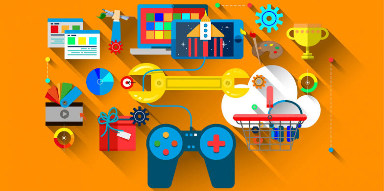

**GameDev** - это сокращение от английского `Game Development`, то есть **разработка компьютерных игр**.

Когда мы запускаем готовую игру, мы видим персонажей, уровни, меню, музыку, противников и различные эффекты. Но всё это не появляется само по себе. Даже для небольшой игры разработчику приходится решить множество задач.

Представим простую игру:

> Игрок управляет космическим кораблём и уничтожает астероиды.

Из одной этой идеи сразу появляется много вопросов:

- Как корабль будет двигаться?
- Как игрок будет стрелять?
- Откуда появляются астероиды?
- Как определить попадание пули во врага?
- Что произойдёт после попадания?
- Сколько здоровья будет у корабля?
- Как считать очки?
- Когда игра заканчивается?
- Как показать проигрыш?
- Как запустить игру заново?

Получается, разработка игры - это не одна большая задача. Это множество небольших задач, которые постепенно соединяются в один проект.

---

### Из чего состоит разработка игры

Разработку игры можно условно представить так:

```text
Идея игры
    ↓
Правила
    ↓
Игровые объекты
    ↓
Программирование
    ↓
Графика и анимации
    ↓
Звуки
    ↓
Уровни
    ↓
Тестирование
    ↓
Готовая игра
```

Не обязательно выполнять эти этапы строго по очереди. Например, во время разработки мы можем несколько раз менять правила игры, переделывать уровни или переписывать код. Это нормальная часть разработки.

---

### Зачем тогда нужен игровой движок

Возникает вопрос:

> Если поведение игры всё равно нужно программировать, зачем нам Godot?

Можно попробовать создать игру вообще без игрового движка. Но тогда разработчику пришлось бы самостоятельно решать огромное количество технических задач. Например, нам нужно показать персонажа на экране. Без готового движка пришлось бы самостоятельно разбираться, как:

- создать окно программы;
- работать с графикой;
- загрузить изображение;
- вывести его на экран;
- обновлять изображение много раз в секунду.

Теперь мы хотим управлять персонажем. Нужно самостоятельно написать систему, которая будет:

- получать нажатия клавиатуры;
- определять, какая клавиша нажата;
- изменять положение персонажа;
- обновлять изображение на экране.

Потом понадобится столкновение со стеной.

Снова новая задача:

```text
Где находится игрок?

Где находится стена?

Какие у них размеры?

Пересекаются ли они?

Можно ли игроку двигаться дальше?
```

А ведь мы ещё даже не начали создавать саму игру.

---

### Что такое игровой движок

**Игровой движок** - это программа, которая предоставляет готовые инструменты для создания игр. Он берёт на себя большую часть технической работы.Например, игровой движок уже умеет работать с:

- графикой;
- клавиатурой и мышью;
- геймпадами;
- сенсорным экраном;
- физикой;
- столкновениями;
- анимациями;
- звуками;
- интерфейсом;
- игровыми объектами;
- уровнями.

Вместо того чтобы создавать все эти системы самостоятельно, мы можем использовать уже готовые возможности движка.

---

### Пример без движка и с движком

Допустим, нам нужно определить, коснулся ли игрок монетки. Без игрового движка пришлось бы самостоятельно вычислять положение и размеры обоих объектов.

Условно это выглядело бы так:

```text
Получить координаты Player
        ↓
Получить размеры Player
        ↓
Получить координаты Coin
        ↓
Получить размеры Coin
        ↓
Сравнить их положение
        ↓
Определить столкновение
```

Игровой движок уже умеет работать со столкновениями. Поэтому мы можем создать область столкновения для игрока и монетки, а затем получить событие:

```text
Player коснулся Coin
```

После этого начинается уже наша игровая логика:

```text
Player коснулся Coin
        ↓
Удалить Coin
        ↓
Добавить игроку очко
```

---

### Движок не создаёт игру вместо разработчика

Важно понимать, что игровой движок - это **инструмент**. Он не придумывает правила игры за нас.

Допустим, Godot сообщил:

```text
Player столкнулся с Coin
```

Что произойдёт дальше? Это решает разработчик.

Можно сделать так:

```text
Player + Coin
    ↓
Score + 1
```

А можно:

```text
Player + Coin
    ↓
Speed + 100
```

Или:

```text
Player + Coin
    ↓
Открыть секретную дверь
```

Godot помогает определить столкновение. Но смысл этого столкновения задаём уже мы.

---

### Простая аналогия

Игровой движок можно сравнить с набором инструментов. Представим, что мы хотим собрать мебель.

Можно сначала самостоятельно изготовить:

- молоток;
- отвёртку;
- пилу;
- дрель.

А уже после этого начать собирать стол. Но гораздо удобнее взять готовые инструменты и сразу работать над столом. С игровым движком похожая ситуация.

```text
Игровой движок
        ↓
даёт инструменты

Разработчик
        ↓
создаёт правила

Вместе
        ↓
получается игра
```

---

### Какие игровые движки существуют

Godot - не единственный игровой движок. Существуют и другие популярные решения, например:

- Unity;
- Unreal Engine;
- GameMaker;
- Construct;
- Godot.

У каждого движка есть свои особенности. Одни чаще используют для больших 3D-проектов, другие удобны для небольших 2D-игр, третьи позволяют создавать игры практически без программирования. В нашем курсе мы будем использовать **Godot**. Почему именно его - разберём дальше.

---

### Небольшая практика

Представьте игру:

> Игрок управляет машиной и должен первым закончить три круга.

Попробуйте определить, что может сделать игровой движок, а что должен придумать разработчик.

Например, движок может помочь:

- показать машину на экране;
- получить нажатие клавиш;
- определить столкновение со стеной;
- проиграть звук двигателя;
- показать интерфейс.

А разработчик должен решить:

- с какой скоростью едет машина;
- сколько кругов нужно пройти;
- где находятся контрольные точки;
- когда засчитывается круг;
- что происходит после финиша.

Главная идея:

> **Игровой движок предоставляет возможности, а правила игры создаёт разработчик.**

---

### Что важно запомнить

**GameDev** - это процесс разработки компьютерных игр. Даже простая игра состоит из множества небольших задач.

**Игровая логика** определяет правила поведения игры и её объектов.

**Игровой движок** предоставляет разработчику готовые инструменты для работы с графикой, звуком, физикой, управлением, столкновениями и другими системами.

Но игровой движок не придумывает игру вместо нас.

---

### Почему Godot

Для курса мы выбрали Godot по нескольким причинам:

- он бесплатный и с открытым исходным кодом;
- хорошо подходит для создания 2D-игр;
- GDScript по синтаксису во многом похож на Python;
- позволяет создавать игры для компьютеров и мобильных устройств;
- для начала работы не требуется сложная настройка.

Для первых проектов этого более чем достаточно, а позже мы сможем использовать и более продвинутые возможности движка.

---

## Установка Godot

Для курса нам понадобится **Godot 4**. Скачать его можно бесплатно [на официальном сайте](https://godotengine.org/download/).

Выберите версию для своей операционной системы и скачайте обычный **Godot Engine**. Версия **Godot Engine .NET** нам не нужна, так как в курсе мы будем писать код на `GDScript`, а не на `C#`.

### Windows

Скачайте архив с Godot, распакуйте его в удобную папку и запустите файл Godot. Дополнительная установка обычно не требуется.

### Linux

Скачайте версию Godot для Linux, распакуйте архив и запустите файл Godot. Если система не позволяет запустить файл, нужно разрешить его выполнение в свойствах файла или через терминал:

```bash
chmod +x Godot*
```

### macOS

Скачайте версию для macOS, откройте архив и перенесите Godot в папку `Applications`.

После запуска откроется окно **Project Manager**. Если оно появилось, значит Godot установлен правильно и можно переходить к созданию первого проекта.

---

## Знакомство с интерфейсом Godot

После запуска Godot первым открывается не редактор игры, а отдельное окно - **Project Manager**.

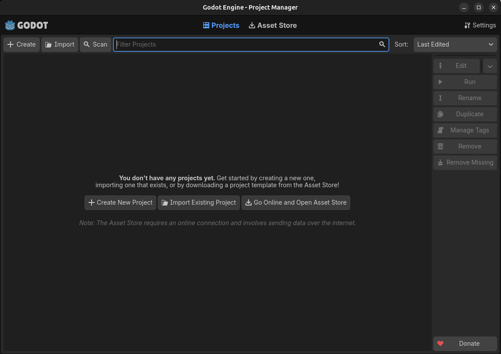

Project Manager - это окно, в котором мы будем создавать новые проекты и открывать уже существующие. В нём можно:

- создать новый проект;
- открыть уже существующий;
- импортировать проект, скачанный или полученный от другого разработчика;
- найти проекты на компьютере;
- переименовать или удалить проект из списка;
- открыть настройки Godot.

При первом запуске Project Manager будет пустым. В нём не будет ни одного проекта. Мы можем создать новый проект или открыть уже существующий.

Разберем основные элементы интерфейса Project Manager. Нас будут интересовать две вкладки:

- **Projects** - список проектов, которые мы создавали или открывали ранее;
- **Asset Store** - библиотека готовых проектов, шаблонов, плагинов и других ресурсов для Godot.

### Вкладка Projects

Здесь отображаются все проекты Godot, которые были добавлены в Project Manager. Пока список пустой, но после создания нашей первой игры здесь появится проект:

```
CatchTheCoin
```

При дальнейшем добавлении новых проектов они будут отображаться в этом списке. Мы сможем открывать их, удалять или переименовывать.

Основные элементы вкладки **Projects**:

- **Create New Project** - кнопка для создания нового проекта. После нажатия открывается окно, в котором нужно указать имя проекта и путь к папке, где он будет храниться.
- **Import Existing Project** - кнопка для открытия уже существующего проекта. После нажатия открывается окно, в котором нужно указать путь к папке с проектом.
- **Go Online and Open Asset Store** - здесь можно найти готовые проекты, шаблоны, плагины и другие игровые ресурсы, которые можно использовать в своих проектах.

Нас пока будет интересовать только кнопка **Create New Project**. С её помощью мы создадим нашу первую игру.

## Создание нового проекта

Теперь мы готовы создать наш первый проект. Для этого нажмём кнопку **Create New Project**.

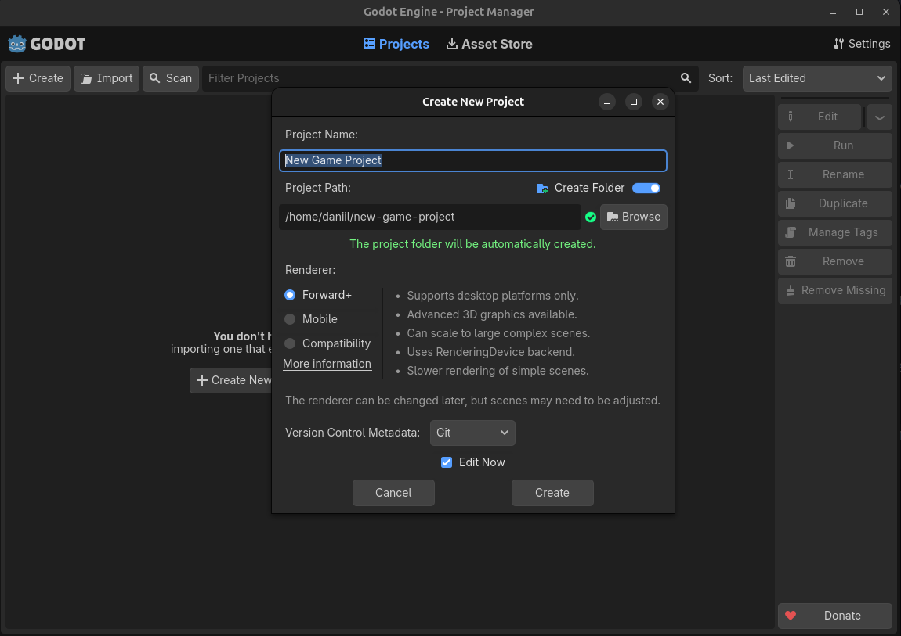

Здесь нужно указать:

- **Project Name** - имя проекта. Мы назовём его `CatchTheCoin`.
- **Project Path** - путь к папке, в которой будет храниться проект. Лучше создавать отдельную папку для каждого проекта и называть её так же, как и сам проект.
- **Renderer** - режим рендеринга. Для проектов курса выбираем `Mobile`, так как в дальнейшем будем ориентироваться в том числе на запуск игр на телефонах.
- **Version Control Metadata** - оставляем `Git`. Godot создаст служебные файлы `.gitignore` и `.gitattributes`, которые пригодятся нам позже при работе с `Git`.
- **Edit Now** - оставляем включённым, чтобы после создания проект сразу открылся в редакторе.

Проверяем настройки и нажимаем **Create**. После этого Godot создаст проект и откроет основное окно редактора.

## Основное окно редактора Godot

После создания проекта открывается главное рабочее окно Godot. Именно здесь мы будем проводить большую часть времени: создавать игровые сцены, добавлять объекты, писать код и запускать игру.

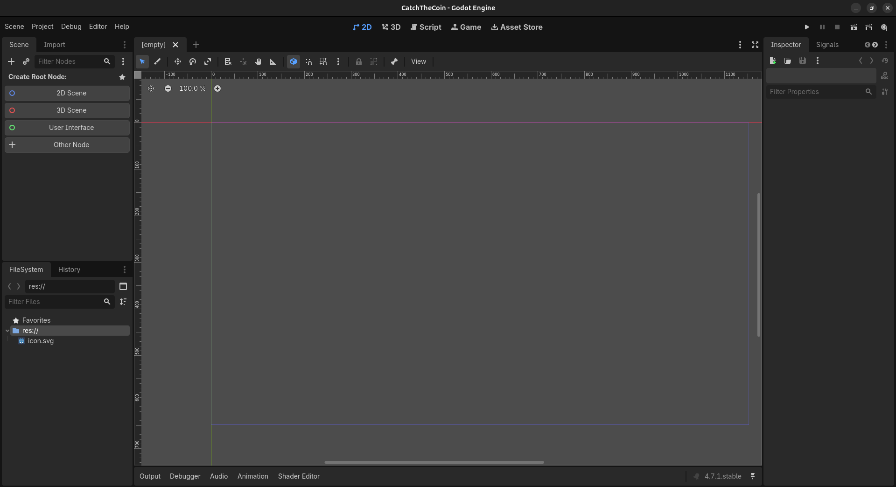

На первый взгляд элементов довольно много, но запоминать весь интерфейс сразу не нужно. Разберём только основные части, которыми мы будем пользоваться постоянно.

### Рабочие режимы


В верхней части окна находятся основные режимы редактора:

- **2D** - работа с двумерными играми. Здесь мы будем размещать персонажей, предметы, стены и другие игровые объекты.
- **3D** - режим для создания трёхмерных игр. В нашем курсе пока практически не понадобится.
- **Script** - редактор кода. Здесь мы будем писать программы на GDScript.
- **Game** - позволяет просматривать запущенную игру внутри редактора.
- **Asset Store** - библиотека готовых ресурсов и дополнений для Godot.

Так как мы начинаем с 2D-игры, большую часть времени будем переключаться между:

- **2D**
- **Script**
- **Game**

### Панель Scene

Слева сверху находится панель **Scene**.

Сейчас наша сцена пустая, поэтому Godot предлагает создать первый объект:

- **2D Scene**
- **3D Scene**
- **User Interface**
- **Other Node**

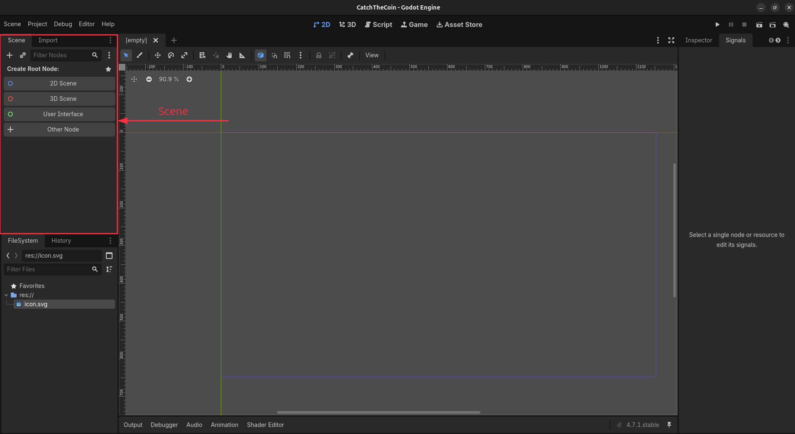

Панель `Scene` показывает все объекты, которые находятся в текущей сцене. Например, позже наша сцена может выглядеть так:

```text
Game
├── Player
├── Coin
└── Background
```

Каждый такой элемент в Godot называется **Node**. С понятием `Node` мы подробно познакомимся немного позже, когда начнём создавать нашу игровую сцену.

### Панель FileSystem

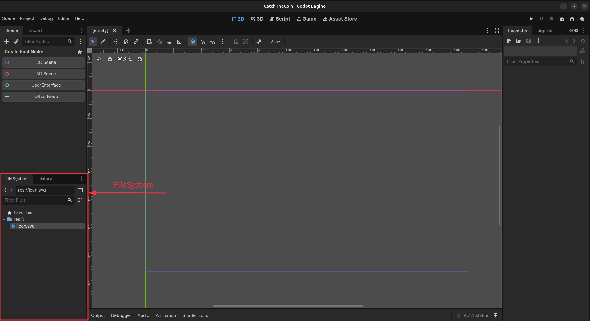

Слева снизу находится панель **FileSystem**. Здесь отображаются файлы нашего проекта. Сейчас в проекте практически ничего нет:

```text
res://
└── icon.svg
```

`res://` означает корневую папку текущего проекта. То есть всё, что находится внутри проекта `CatchTheCoin`, будет отображаться здесь.

Позже у нас появятся:

```text
res://
├── scenes/
├── scripts/
└── assets/
```

Через `FileSystem` мы будем открывать сцены, скрипты, изображения, звуки и другие файлы игры.

---

### Центральная рабочая область

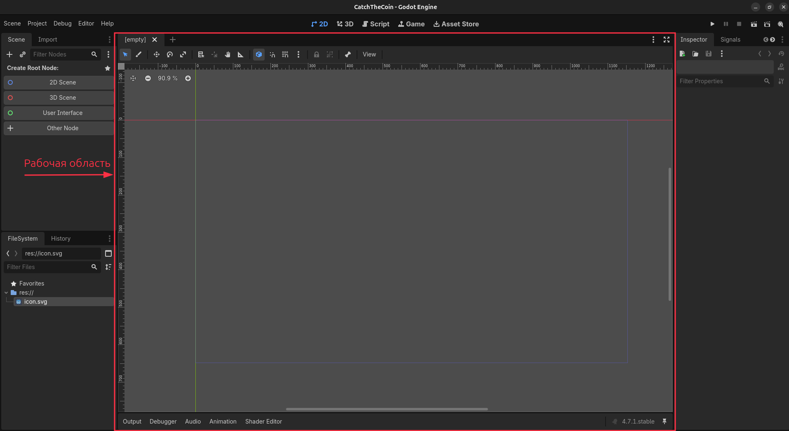

Самая большая часть окна - это рабочая область. Сейчас выбран режим **2D**, поэтому перед нами находится двумерное пространство.

Здесь мы будем:

- размещать игровые объекты;
- перемещать их;
- изменять размер;
- создавать уровни;
- настраивать расположение персонажей и предметов.

На рабочем поле уже видны две оси:

- **X** - горизонтальная ось. Значения увеличиваются слева направо.
- **Y** - вертикальная ось. Значения увеличиваются сверху вниз.

Подробно с координатами `X` и `Y` мы познакомимся чуть позже, когда будем создавать игровую сцену.

---

### Inspector

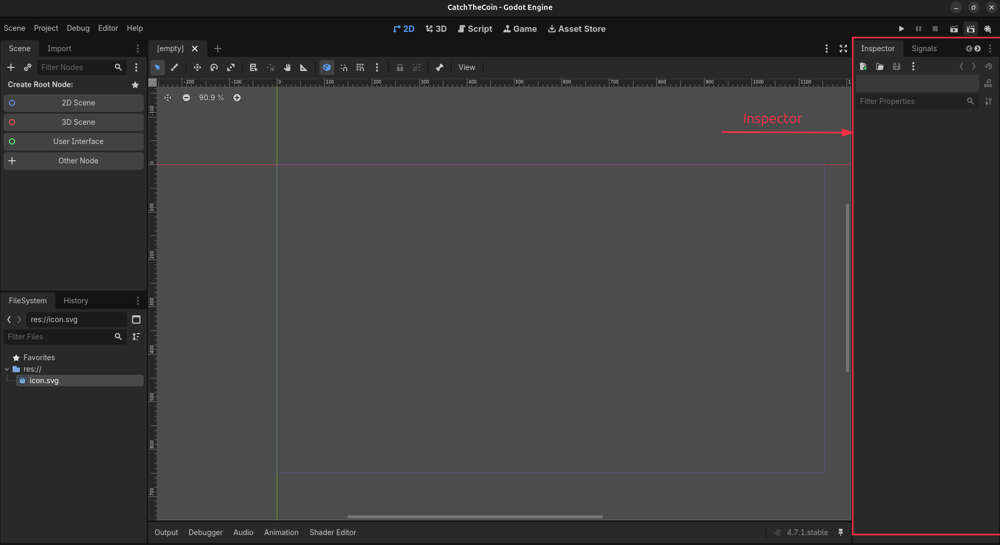

Справа находится панель **Inspector**. `Inspector` показывает свойства выбранного объекта. Сейчас никакого объекта не выбрано, поэтому панель практически пустая.
Позже, если мы выберем персонажа, здесь можно будет изменить его параметры, например:

- положение;
- размер;
- поворот;
- изображение;
- другие свойства.

Принцип работы очень простой: мы выбираем объект на сцене, а в `Inspector` видим его свойства. Если нужно что-то изменить, делаем это в `Inspector`. Панель `Inspector` будет одной из самых часто используемых частей Godot.

---

### Signals

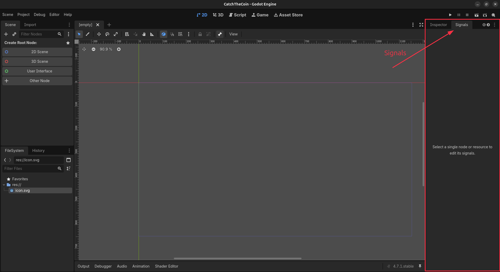

Рядом с `Inspector` находится вкладка **Signals**. Сигналы позволяют объектам сообщать о произошедших событиях. Например, когда игрок коснётся монетки, монетка может отправить сигнал:

```text
Coin сигнализирует: "Игрок коснулся меня"
```

На первом этапе достаточно знать, где находится эта вкладка. С сигналами мы познакомимся на практике, когда будем программировать сбор монетки.

---

### Нижняя панель

В нижней части редактора находятся дополнительные инструменты:

- **Output**
- **Debugger**
- **Audio**
- **Animation**
- **Shader Editor**

На первых занятиях особенно важны две вкладки. **Output** показывает сообщения, которые выводит наша программа. **Debugger** помогает находить ошибки в программе. Если игра перестала работать или Godot сообщает об ошибке, эту панель стоит проверить одной из первых.

---

### Запуск игры

Справа сверху находятся кнопки управления запуском проекта.

С их помощью можно:

- запустить игру;
- приостановить выполнение;
- остановить игру;
- запустить отдельную сцену.

Пока запускать нам нечего - в проекте ещё нет ни одной сцены. Совсем скоро мы это исправим.

---

### Что важно запомнить

На данный момент достаточно ориентироваться в пяти основных частях редактора:

| Панель                            | Для чего нужна                                    |
| --------------------------------------- | ------------------------------------------------------------- |
| **Scene**                         | Объекты текущей сцены                      |
| **FileSystem**                    | Файлы проекта                                     |
| **Рабочая область** | Создание и расположение объектов |
| **Inspector**                     | Настройки выбранного объекта        |
| **Output / Debugger**             | Сообщения программы и ошибки         |

Не нужно специально заучивать расположение всех кнопок. Во время создания игры мы будем постоянно пользоваться этими панелями, поэтому интерфейс быстро станет привычным. Теперь можно перейти к первой важной части Godot - разобраться, что такое **Scene** и **Node**, а затем создать нашу первую игровую сцену.

---

## Scene и Node

В Godot игра собирается из **Node** и **Scene**. **Node** - это отдельный строительный элемент игры, который выполняет определённую задачу.

Например, Node может отвечать за:

- изображение персонажа;
- столкновения;
- камеру;
- звук;
- интерфейс;
- движение объекта.

При этом полноценный игровой объект часто состоит сразу из нескольких Node. Например, позже наш игрок может выглядеть так:

```text
Player
├── Sprite2D
└── CollisionShape2D
```

Один Node отвечает за изображение игрока, другой - за область столкновения. **Scene** - это сохранённое дерево из одного или нескольких Node.

Scene может быть:

- уровнем;
- главным меню;
- меню паузы;
- игроком;
- противником;
- монеткой;
- другим самостоятельным элементом игры.

Одни Scene также можно использовать внутри других. Например, отдельную сцену `Coin.tscn` можно несколько раз добавить на уровень. Пока начнём с самой простой Scene и одного Node.

### Создаём первую Scene

В левой части редактора нажмём:

**2D Scene**

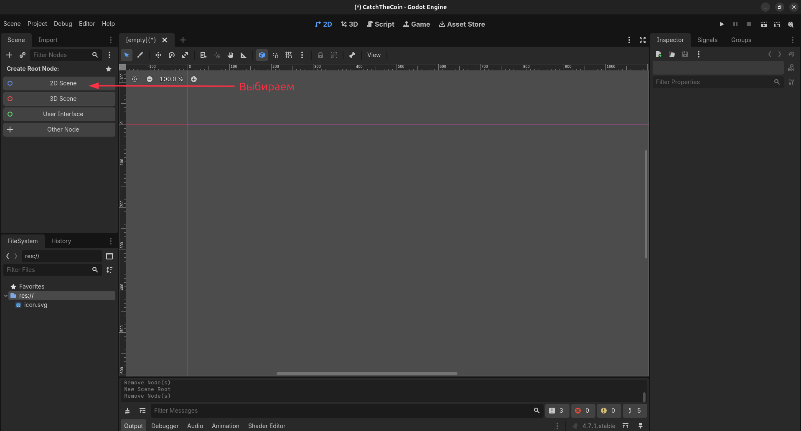

Godot автоматически создаст первый Node типа `Node2D`. Это будет **корневой Node** нашей Scene.

Переименуем его в:

```text
Game
```

В результате дерево Scene пока состоит только из одного элемента:

```text
Game
```

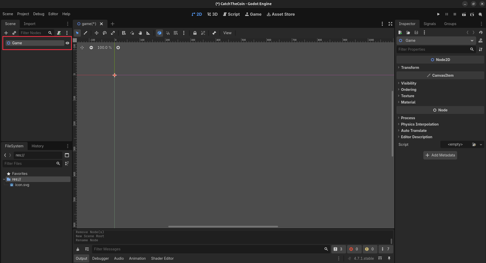

---

### Добавляем первый Node

Теперь добавим объект, который будет изображать нашего первого игрока. Выбираем `Game` и нажимаем кнопку **Add Child Node**:

```text
+
```

В строке поиска вводим:

```text
Sprite2D
```

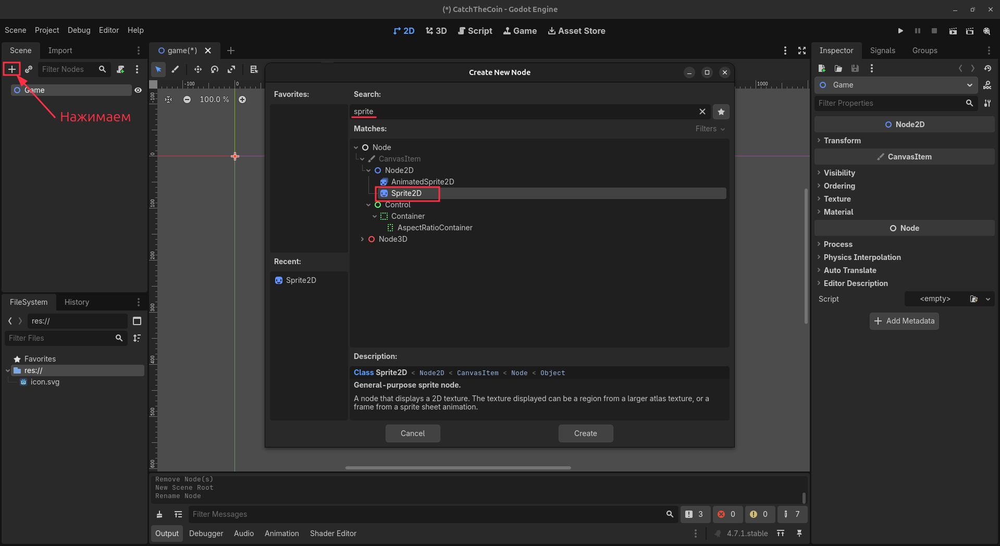

`Sprite2D` - это Node, предназначенный для отображения изображения в 2D-игре. Добавляем его и переименовываем:

```text
Sprite2D → Player
```

Теперь дерево нашей Scene выглядит так:

```text
Game
└── Player
```

Здесь между Node появилась связь:

- `Game` - **Parent**, родительский Node;
- `Player` - **Child**, дочерний Node.

Такая структура называется **деревом Node**. Если выбрать другой Node в панели `Scene`, справа в `Inspector` будут отображаться свойства именно выбранного объекта.

---

### Добавляем изображение

Сейчас `Player` существует, но у него ещё нет изображения. Выбираем `Player`.

В `Inspector` находим свойство:

```text
Texture
```

В новом проекте Godot уже находится стандартный файл:

```text
icon.svg
```

Перетащим `icon.svg` из панели `FileSystem` в поле `Texture`.

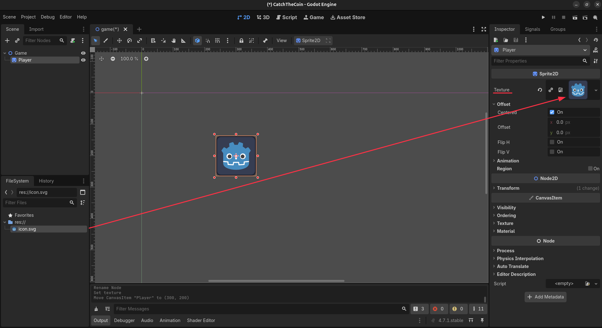

После этого изображение появляется в рабочей области. Получается простая связь:

```text
Player
↓
Sprite2D
↓
Texture
↓
изображение на сцене
```

Позже вместо стандартной иконки Godot мы будем использовать настоящие игровые изображения персонажей.

Сохраним Scene с помощью:

```text
Ctrl + S
```

Создадим папку:

```text
scenes
```

и сохраним файл как:

```text
scenes/game.tscn
```

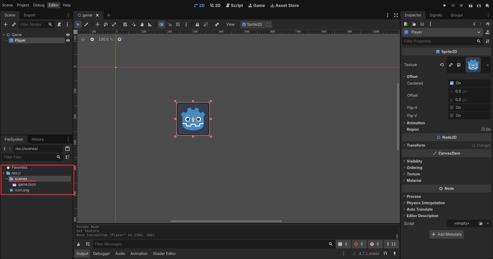

Расширение `.tscn` используется Godot для файлов Scene.

---

### Изменяем положение Player

Каждый Node имеет собственные свойства. Выбираем `Player` и в `Inspector` открываем:

```text
Transform
```

Находим:

```text
Position
```

Укажем:

```text
X = 300
Y = 200
```

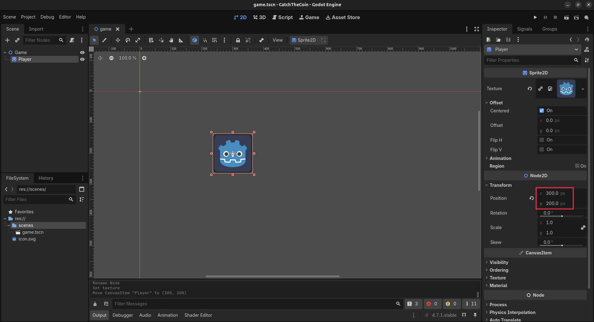

Player переместится в соответствующую точку Scene. В 2D координаты используются для определения положения объектов:

- `X` отвечает за положение по горизонтали;
- `Y` отвечает за положение по вертикали.

Попробуйте самостоятельно изменить значения `X` и `Y` и посмотреть, как меняется положение объекта.

После эксперимента верните:

```text
X = 300
Y = 200
```

---

### Сохраняем и запускаем Scene

Сохраним изменения:

```text
Ctrl + S
```

Теперь можно запустить нашу Scene.

Нажимаем:

```text
F6
```

`F6` запускает **текущую открытую Scene**.

Откроется отдельное окно игры, в котором появится наш `Player`.

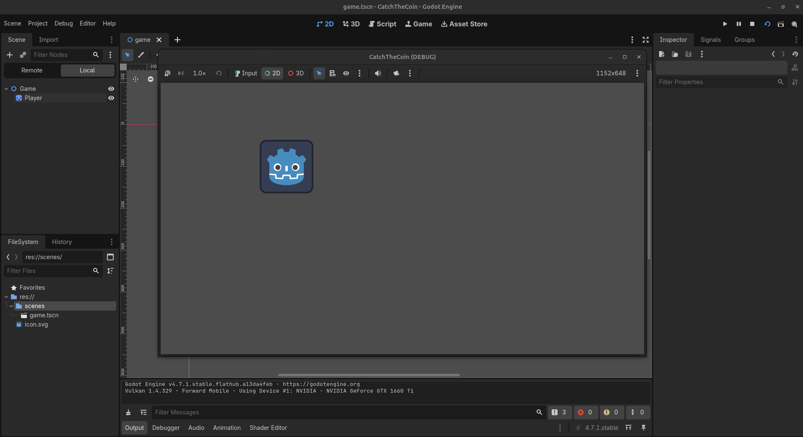

Мы пока не написали ни одной строки кода, но уже создали первую рабочую Scene:

```text
Game
└── Player
```

И прошли полный путь:

```text
создали Scene
↓
добавили Node
↓
назначили Texture
↓
изменили Position
↓
сохранили Scene
↓
запустили её
```

Теперь мы знаем две основные части, из которых строятся проекты в Godot:

- **Node** - отдельный строительный элемент игры;
- **Scene** - сохранённое дерево Node, которое можно использовать как самостоятельную часть игры.

---

## Создаём Player

Ранее наш `Player` был обычным `Sprite2D`. Этого было достаточно, чтобы познакомиться с Node, Texture и Position.

Но настоящий игровой персонаж должен не только отображаться на экране. Позже он будет:

- двигаться;
- сталкиваться с другими объектами;
- взаимодействовать с игровым миром.

Для такого персонажа в Godot удобно использовать `CharacterBody2D`.

### Добавляем CharacterBody2D

Удалим предыдущий `Player`, который был создан как `Sprite2D`, для этого кликаем правой кнопкой мыши и выбираем **Delete**. В Scene пока снова останется только:

```text
Game
```

Выбираем `Game`, нажимаем **Add Child Node** и в поиске вводим:

```text
CharacterBody2D
```

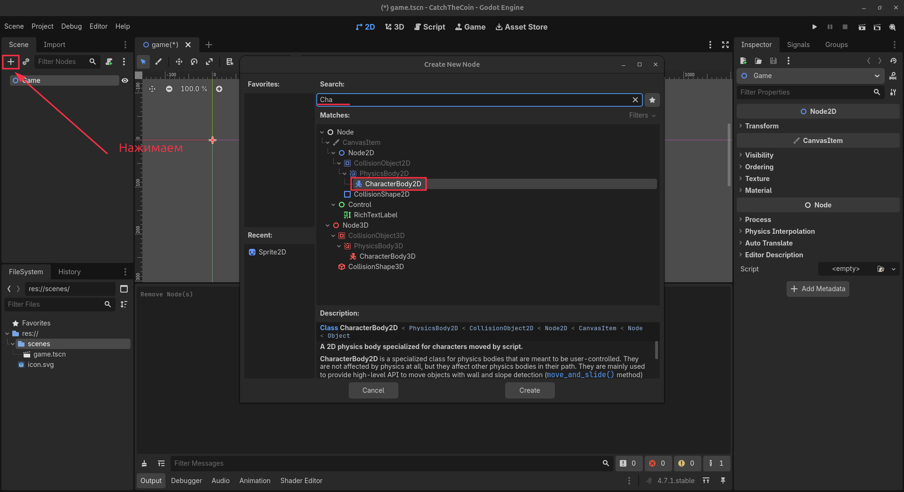

Добавляем Node и переименовываем его:

```text
CharacterBody2D → Player
```

Теперь наша Scene выглядит так:

```text
Game
└── Player
```

`CharacterBody2D` будет основным Node нашего персонажа. Именно его мы позже будем двигать с помощью кода.

---

### Добавляем изображение персонажа

Сам `CharacterBody2D` не имеет изображения. Поэтому внутри `Player` добавим ещё один Node:

```text
Sprite2D
```

Получится такая структура:

```text
Game
└── Player
    └── Sprite2D
```

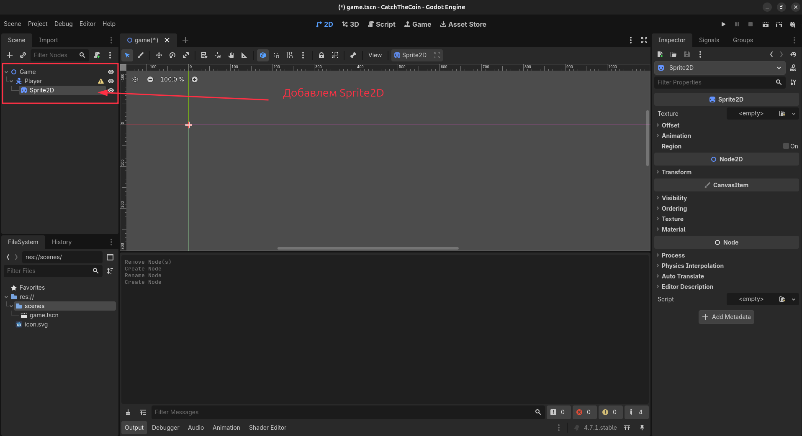

Теперь `Player` - родительский Node, а `Sprite2D` - его дочерний Node.

У каждого из них своя задача:

- `Player` будет отвечать за самого игрового персонажа и его движение;
- `Sprite2D` отвечает только за отображение изображения.

Выбираем `Sprite2D` и перетаскиваем стандартный:

```text
icon.svg
```

из `FileSystem` в свойство:

```text
Texture
```

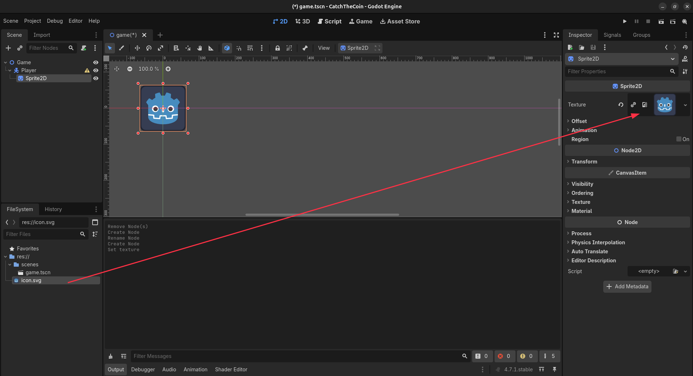

Теперь наш `Player` снова виден на сцене, но его структура уже отличается от предыдущего варианта. Раньше было:

```text
Game
└── Player (Sprite2D)
```

Теперь:

```text
Game
└── Player (CharacterBody2D)
    └── Sprite2D
```

Мы отделили сам игровой объект от его изображения.

---

### Position родителя и дочернего Node

Выберем `Sprite2D` и откроем:

```text
Transform
→ Position
```

Оставим:

```text
X = 0
Y = 0
```

Это означает, что изображение находится точно в центре своего родительского `Player`. Теперь выберем уже сам:

```text
Player
```

и установим:

```text
Transform
→ Position

X = 300
Y = 200
```

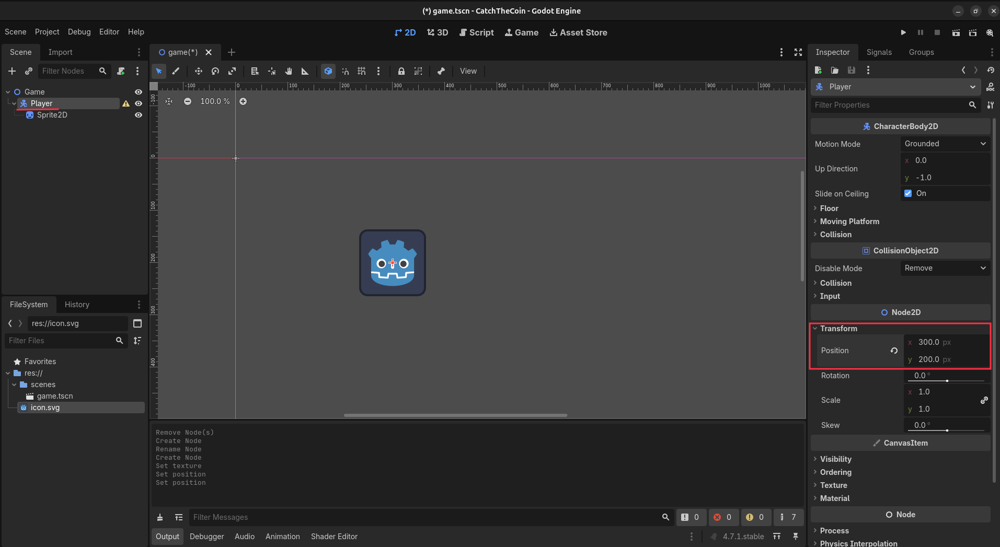

На сцене переместился не только `Player`, но и находящийся внутри него `Sprite2D`. Это важное свойство связи **Parent → Child**:

> когда перемещается родительский Node, его дочерние Node перемещаются вместе с ним.

Получается:

```text
Player
Position: 300, 200
│
└── Sprite2D
    Position: 0, 0
```

Положение `Sprite2D` считается относительно его родителя.

---

### Проверяем Parent и Child

Попробуем немного поэкспериментировать. Выберем `Player` и изменим его Position:

```text
X = 500
Y = 300
```

Изображение переместится вместе с ним. Теперь выберем `Sprite2D` и изменим только его Position:

```text
X = 50
Y = 0
```

В этот раз переместится только изображение относительно `Player`.

Таким образом:

```text
двигаем Player
↓
двигается Player вместе с дочерними Node
```

А если:

```text
двигаем Sprite2D
↓
изменяется положение Sprite2D относительно Player
```

После эксперимента вернём значения:

```text
Player
X = 300
Y = 200

Sprite2D
X = 0
Y = 0
```

---

### Запускаем Scene

Сохраняем изменения:

```text
Ctrl + S
```

и запускаем текущую Scene:

```text
F6
```

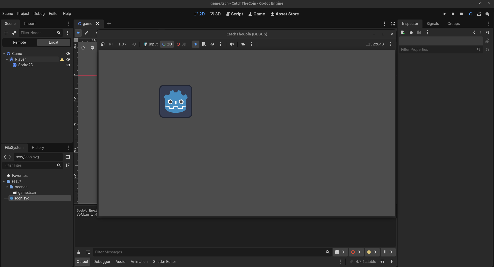

В окне игры снова появляется наш персонаж. Внешне результат почти не изменился, но внутри Scene теперь находится более правильная структура:

```text
Game
└── Player
    └── Sprite2D
```

У каждого Node есть своя задача:

| Node         | Задача                               |
| ------------ | ------------------------------------------ |
| `Game`     | основная Scene нашей игры |
| `Player`   | игровой персонаж            |
| `Sprite2D` | изображение персонажа  |

Пока `Player` всё ещё стоит на месте.

Следующий шаг - подключить к нему первый скрипт и заставить персонажа двигаться.

---

## Первый скрипт и движение Player

Сейчас наш `Player` уже является `CharacterBody2D`, но пока он ничего не умеет делать. Чтобы объект начал реагировать на действия игрока, ему понадобится **скрипт**.

**Скрипт** - это файл с программным кодом, который определяет поведение объекта.

Например, с помощью скрипта мы можем заставить Player:

- двигаться;
- прыгать;
- получать урон;
- собирать предметы;
- реагировать на столкновения.

Начнём с самого простого - научим персонажа двигаться в четырёх направлениях.

---

### Создаём папку для скриптов

Чтобы файлы проекта не лежали все вместе, создадим отдельную папку:

```text
scripts
```

Структура проекта теперь будет выглядеть примерно так:

```text
res://
├── scenes/
│   └── game.tscn
├── scripts/
└── icon.svg
```

Позже в папке `scripts` будут храниться и другие файлы с кодом.

---

### Подключаем скрипт к Player

Выбираем в дереве Scene именно:

```text
Player
```

Важно подключить скрипт к `Player`, а не к его `Sprite2D`.

Напомним структуру:

```text
Game
└── Player
    └── Sprite2D
```

`Sprite2D` отвечает только за изображение. Движением всего персонажа должен управлять `Player`. Нажимаем кнопку **Attach Script**.

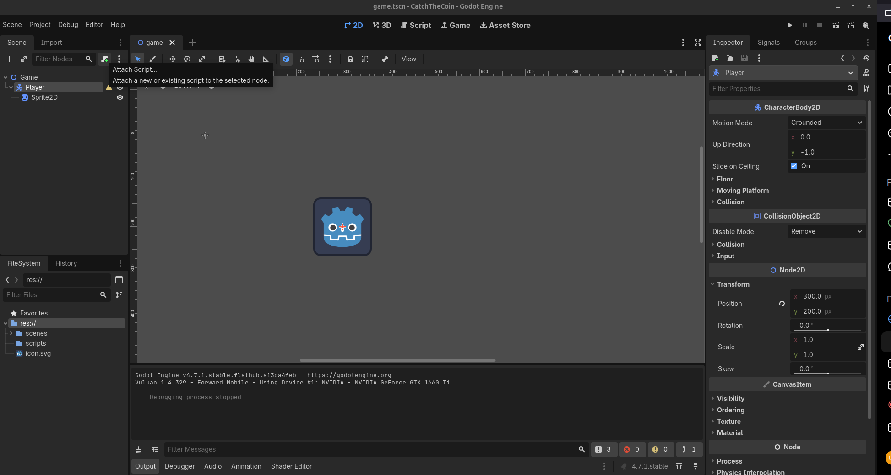

Откроется окно создания нового скрипта.

Указываем:

```text
Language: GDScript
Inherits: CharacterBody2D
Path: res://scripts/player.gd
```

Шаблон готового движения нам пока не нужен, поэтому отключаем:

```text
Template
```

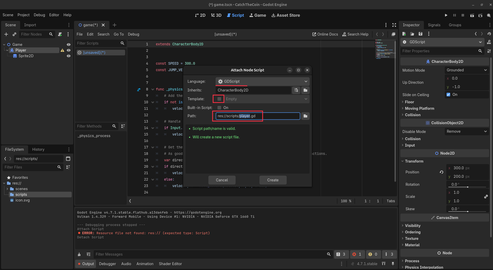

Нажимаем:

```text
Create
```

Godot автоматически переключит нас в режим `Script`.

---

### Первый GDScript

В созданном файле появится строка:

```gdscript
extends CharacterBody2D
```

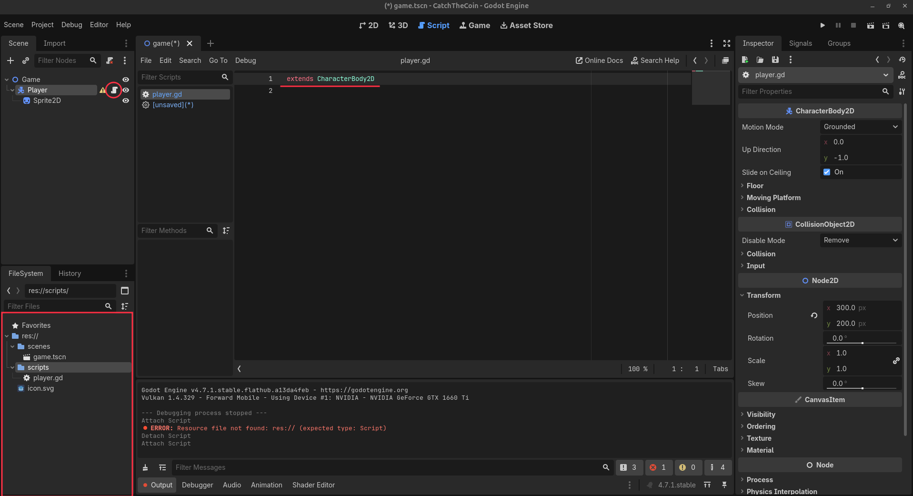

Также возле `Player` в дереве Scene появится значок скрипта.

Это означает, что файл:

```text
player.gd
```

теперь подключён к нашему `Player`. Начнём писать движение.

```gdscript
extends CharacterBody2D

var speed = 300.0


func _physics_process(_delta):
	var direction = Input.get_vector(
		"ui_left",
		"ui_right",
		"ui_up",
		"ui_down"
	)

	velocity = direction * speed

	move_and_slide()
```

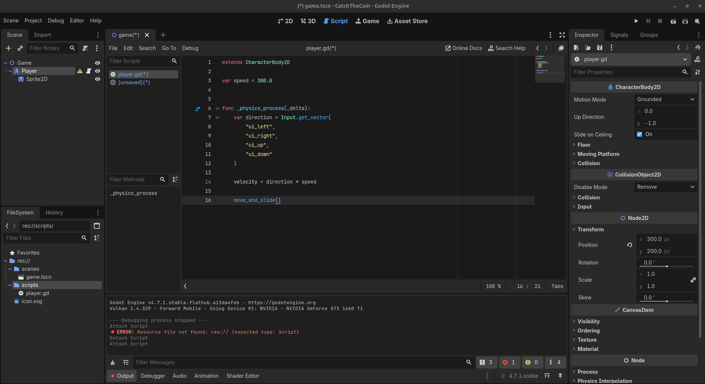

На первый взгляд кода стало довольно много, поэтому разберём его постепенно.

---

### extends CharacterBody2D

Первая строка:

```gdscript
extends CharacterBody2D
```

говорит Godot, для какого типа Node предназначен этот скрипт. Наш скрипт подключён к:

```text
Player (CharacterBody2D)
```

Поэтому он получает возможности `CharacterBody2D`, в том числе свойства и методы для движения. Пока достаточно запомнить простую связь:

```text
Player
↓
CharacterBody2D
↓
player.gd
```

---

### Скорость Player

Создадим переменную:

```gdscript
var speed = 300.0
```

В ней хранится скорость нашего персонажа.

```text
speed = скорость
```

Чем больше значение, тем быстрее будет двигаться Player. Например:

```gdscript
var speed = 100.0
```

даст медленное движение. А:

```gdscript
var speed = 600.0
```

сделает персонажа намного быстрее.

Мы оставим:

```gdscript
var speed = 300.0
```

---

### Функция _physics_process()

Следующая часть:

```gdscript
func _physics_process(_delta):
```

создаёт функцию. Функция - это блок кода, который выполняет определённую задачу. `_physics_process()` - специальная функция Godot, которая автоматически вызывается много раз в секунду во время работы игры. Поэтому она хорошо подходит для движения игровых объектов. Упрощённо можно представить:

```text
игра запущена
↓
_physics_process()
↓
_physics_process()
↓
_physics_process()
↓
_physics_process()
↓
...
```

На каждом таком шаге мы можем проверить клавиатуру и изменить движение Player.

Параметр:

```text
_delta
```

нам пока не понадобится. К нему мы вернёмся позже.

---

### Получаем направление движения

Теперь посмотрим на эту часть:

```gdscript
var direction = Input.get_vector(
	"ui_left",
	"ui_right",
	"ui_up",
	"ui_down"
)
```

Мы создаём переменную:

```text
direction
```

Она будет хранить **направление движения Player**.

Метод:

```gdscript
Input.get_vector()
```

проверяет четыре направления:

```text
ui_left
ui_right
ui_up
ui_down
```

Они соответствуют движению:

```text
        ↑
        up

left ←      → right

       down
        ↓
```

Если ничего не нажато, направление будет примерно:

```text
(0, 0)
```

Если движемся вправо:

```text
(1, 0)
```

Влево:

```text
(-1, 0)
```

Вверх:

```text
(0, -1)
```

Вниз:

```text
(0, 1)
```

Таким образом, `direction` отвечает на вопрос:

> В какую сторону сейчас хочет двигаться игрок?

---

### Задаём velocity

Теперь используем полученное направление:

```gdscript
velocity = direction * speed
```

У `CharacterBody2D` уже есть специальное свойство:

```text
velocity
```

Оно хранит скорость движения по двум координатам:

```text
X
Y
```

Мы берём:

```text
direction
```

и умножаем его на:

```text
speed
```

Например, если игрок движется вправо:

```text
direction = (1, 0)
speed = 300
```

получаем:

```text
velocity = (300, 0)
```

Если игрок движется вверх:

```text
direction = (0, -1)
```

получаем:

```text
velocity = (0, -300)
```

То есть эта строка определяет:

```text
куда двигаться
+
с какой скоростью
```

---

### Выполняем движение

Осталась последняя строка:

```gdscript
move_and_slide()
```

Мы уже рассчитали:

```text
velocity
```

Но само по себе это ещё не перемещает персонажа.

Метод:

```gdscript
move_and_slide()
```

говорит `CharacterBody2D` выполнить движение с текущим значением `velocity`.

Получается следующая последовательность:

```text
нажали клавишу
↓
Input.get_vector()
↓
получили direction
↓
direction * speed
↓
получили velocity
↓
move_and_slide()
↓
Player переместился
```

---

### Запускаем игру

Сохраняем изменения:

```text
Ctrl + S
```

и запускаем текущую Scene:

```text
F6
```

Попробуем стрелки:

```text
      ↑

←     ↓     →
```

Теперь `Player` должен двигаться по экрану.

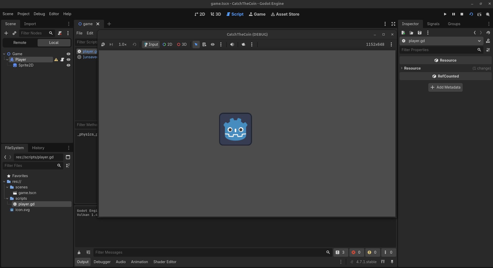

Если игра запускается прямо внутри редактора Godot, убедитесь, что в окне игры включён:

```text
Input
```

Без него встроенное окно игры может не принимать нажатия клавиатуры. После включения `Input` снова попробуйте стрелки.

---

### Экспериментируем со скоростью

Теперь попробуем самостоятельно изменить:

```gdscript
var speed = 300.0
```

Например:

```gdscript
var speed = 100.0
```

Запускаем игру ещё раз. Что изменилось? Теперь попробуем:

```gdscript
var speed = 600.0
```

Снова запускаем игру. После эксперимента вернём:

```gdscript
var speed = 300.0
```

Так мы можем менять поведение персонажа всего через одну переменную.

---

### Что происходит во время движения

Теперь весь наш код можно представить как небольшую последовательность:

```text
Player
↓
player.gd
↓
проверяем клавиши
↓
получаем направление
↓
задаём скорость
↓
перемещаем Player
```

За каждую часть отвечает свой элемент:

| Код                 | Задача                                                             |
| ---------------------- | ------------------------------------------------------------------------ |
| `speed`              | скорость Player                                                  |
| `Input.get_vector()` | определяет направление                              |
| `direction`          | хранит направление                                      |
| `velocity`           | хранит направление и скорость движения |
| `move_and_slide()`   | перемещает Player                                              |

Наш `Player` впервые получил настоящее игровое поведение. Теперь структура проекта выглядит примерно так:

```text
res://
├── scenes/
│   └── game.tscn
├── scripts/
│   └── player.gd
└── icon.svg
```

А Scene:

```text
Game
└── Player
    └── Sprite2D
```

Мы уже умеем:

```text
создавать Node
↓
собирать их в Scene
↓
добавлять изображение
↓
подключать GDScript
↓
обрабатывать нажатия клавиш
↓
двигать Player
```

Следующий шаг - добавить персонажу форму столкновения, чтобы он мог взаимодействовать с другими объектами игры.

---

## Добавляем Player форму столкновения

Наш `Player` уже отображается на экране и умеет двигаться. Но пока для Godot у него нет физической формы. `Sprite2D` отвечает только за изображение персонажа. Чтобы Player мог сталкиваться с другими объектами, ему понадобится:

```text
CollisionShape2D
```

Он задаёт область, которую Godot будет считать физическим телом объекта.

Получается:

```text
Sprite2D
→ как объект выглядит

CollisionShape2D
→ где находится его физическое тело
```

---

### Добавляем CollisionShape2D

Выбираем в дереве Scene:

```text
Player
```

и нажимаем:

```text
+
```

В поиске вводим:

```text
CollisionShape2D
```

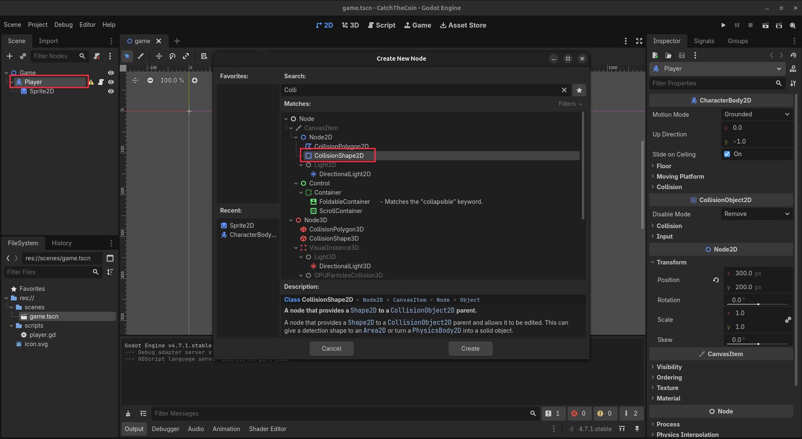

Добавляем Node. Теперь структура Player выглядит так:

```text
Game
└── Player
    ├── Sprite2D
    └── CollisionShape2D
```

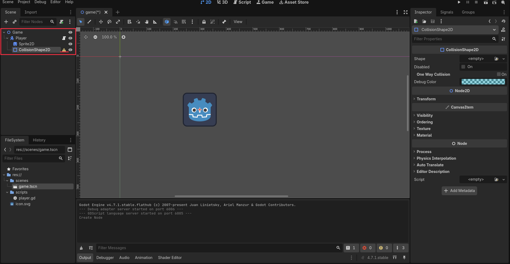

`Player` теперь состоит из нескольких частей:

- `CharacterBody2D` - основной объект персонажа;
- `Sprite2D` - его изображение;
- `CollisionShape2D` - его физическая форма.

---

> Обратите внимание что возле `CollisionShape2D` в дереве Scene появился значок предупреждения ⚠. Это означает, что Godot не знает, какую форму столкновения использовать для Player. Пока мы добавили только сам Node, но ещё не выбрали его форму.

### Выбираем форму столкновения

Сам `CollisionShape2D` ещё не знает, какую именно форму должен иметь Player. Выбираем:

```text
CollisionShape2D
```

В `Inspector` находим свойство:

```text
Shape
```

По умолчанию оно пустое:

```text
<empty>
```

Нажимаем на него и выбираем:

```text
RectangleShape2D
```

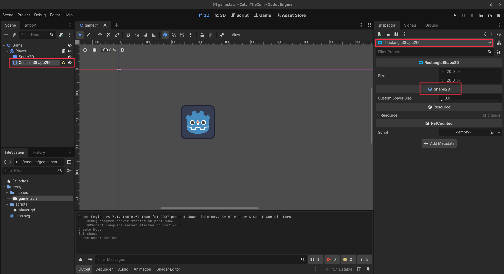

Мы выбрали прямоугольную форму, потому что она хорошо подходит для нашей тестовой иконки. Позже для разных объектов можно будет использовать разные формы столкновения.

---

### Настраиваем размер Collision

После создания `RectangleShape2D` на сцене появится область столкновения. Её нужно подогнать примерно под размер изображения Player. Можно изменить размер прямо в `Inspector`:

```text
RectangleShape2D
→ Size
```

Для нашей иконки мы использовали примерно:

```text
X = 130
Y = 130
```

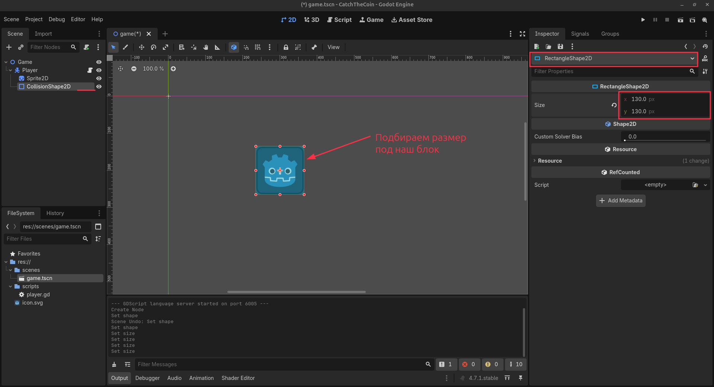

Форма не обязана идеально повторять каждый пиксель изображения. Главное, чтобы она примерно соответствовала той части персонажа, которая должна участвовать в столкновениях. Например, если у персонажа будет большой меч или длинные волосы, Collision необязательно растягивать на всё изображение.

---

### Почему CollisionShape2D важен

Сейчас визуально игра почти не изменилась. Player всё так же выглядит и двигается. Но теперь Godot знает, где находится его физическое тело. Например, позже мы сможем сделать:

```text
Player касается Coin
↓
Godot обнаруживает столкновение
↓
Coin исчезает
```

Или:

```text
Player касается стены
↓
не может пройти сквозь неё
```

Или:

```text
Player касается Enemy
↓
получает урон
```

Без `CollisionShape2D` у нас была просто движущаяся картинка. Теперь Player готов к взаимодействию с другими объектами игры.

---

### Проверяем структуру Player

В результате наша Scene должна выглядеть так:

```text
Game
└── Player
    ├── Sprite2D
    └── CollisionShape2D
```

У дочерних Node оставляем:

```text
Sprite2D
Position: 0, 0

CollisionShape2D
Position: 0, 0
```

А положение всего персонажа по-прежнему задаём через:

```text
Player
→ Transform
→ Position
```

Так изображение и Collision будут перемещаться вместе с Player. Сохраняем изменения:

```text
Ctrl + S
```

и запускаем Scene:

```text
F6
```

Player должен двигаться точно так же, как раньше. Сам `CollisionShape2D` в обычном режиме игры не отображается - это техническая область, которую использует Godot для физики и столкновений. Теперь наш первый Player имеет всё необходимое для дальнейшего взаимодействия с игровым миром:

```text
изображение
+
движение
+
форма столкновения
```

---

## Практика

Теперь попробуем самостоятельно изменить нашего Player и сделать его больше похожим на настоящего игрового персонажа. Для графики в проектах курса мы будем использовать бесплатные игровые ресурсы с сайта: [Kenney](https://kenney.nl/assets)

На сайте находится большое количество готовых игровых ресурсов:

- персонажи;
- предметы;
- окружение;
- интерфейсы;
- платформы;
- декоративные элементы;
- звуки.

Откройте сайт, найдите подходящий набор и выберите персонажа, который вам нравится. Для этого в поисковой строке введите ключевое слово, например ***"characters"*.**

### Задание

Необходимо:

- найти на сайте Kenney подходящее изображение персонажа;
- скачать выбранный набор;
- создать в проекте папку `assets`;
- добавить изображение персонажа в проект;
- заменить стандартный `icon.svg` на выбранного персонажа;
- подобрать подходящий размер персонажа;
- настроить `CollisionShape2D` под новое изображение;
- изменить стартовую позицию Player;
- подобрать подходящую скорость движения;
- запустить игру и проверить результат.

В результате структура Scene должна остаться такой:

```text
Game
└── Player
    ├── Sprite2D
    └── CollisionShape2D
```

Но внешний вид, положение и скорость Player каждый сможет подобрать самостоятельно.

---

## Домашнее задание

Создайте новый проект Godot самостоятельно и повторите основные действия первой лекции.

### Задание

Необходимо:

- создать новый 2D-проект;
- создать Scene `Game`;
- добавить `Player` на основе `CharacterBody2D`;
- добавить ему `Sprite2D`;
- самостоятельно подобрать изображение персонажа на сайте [Kenney](https://kenney.nl/assets);
- добавить `CollisionShape2D`;
- настроить форму столкновения под персонажа;
- создать скрипт `player.gd`;
- реализовать движение в четырёх направлениях;
- самостоятельно выбрать скорость Player;
- самостоятельно выбрать его стартовую позицию.

Структура Scene должна выглядеть так:

```text
Game
└── Player
    ├── Sprite2D
    └── CollisionShape2D
```

### Дополнительное задание

Поэкспериментируйте с проектом:

- попробуйте несколько значений `speed`;
- измените размер персонажа;
- попробуйте другую форму `CollisionShape2D`;
- выберите другого персонажа и сравните результат.

Главное условие - после всех изменений Player должен продолжать правильно двигаться во всех четырёх направлениях.

---

## Итоги

На первой лекции мы познакомились с Godot и создали основу нашей первой игры. Мы разобрались, что такое `Scene` и `Node`, научились добавлять объекты на сцену, работать с `Inspector`, координатами и изображениями.

Также мы создали `Player` на основе `CharacterBody2D`, подключили первый скрипт на GDScript, реализовали движение в четырёх направлениях и добавили `CollisionShape2D`. Теперь у нас есть управляемый персонаж, готовый к дальнейшему взаимодействию с игровым миром.

На следующем занятии мы продолжим развивать проект и добавим в игру первые объекты, с которыми Player сможет взаимодействовать.