# Лекция 2. Монетки и взаимодействие объектов

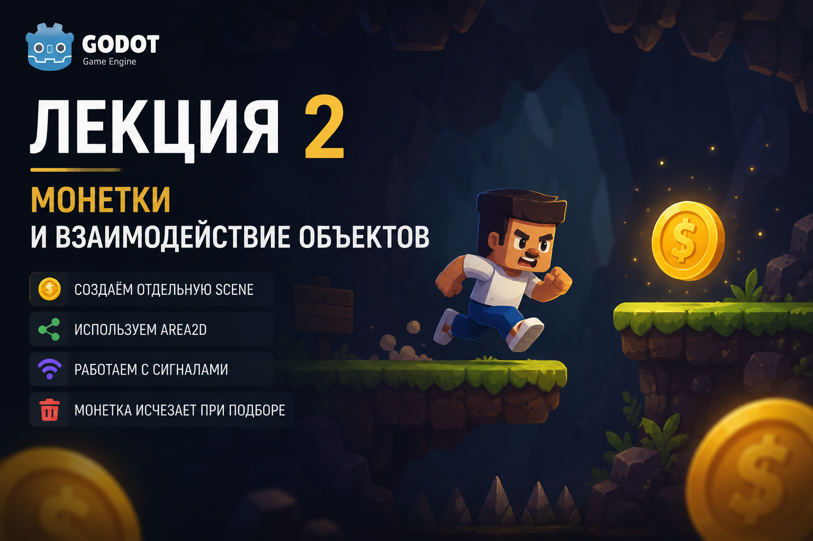

На прошлом занятии мы создали `Player`, научили его двигаться и добавили форму столкновения. Теперь у персонажа есть движение, но пока нет цели. Сегодня добавим в игру монетку, научимся использовать отдельные Scene внутри основной Scene и сделаем первое взаимодействие между игровыми объектами.

В результате Player сможет подойти к монетке и подобрать её:

```text
Player
   ↓
касается Coin
   ↓
Coin исчезает
```

Начнём с создания самой монетки.

---

## Создаём монетку

На прошлом занятии мы уже создали `Player`, который умеет двигаться. Теперь добавим первый игровой объект, с которым он сможет взаимодействовать - **монетку**. Монетку мы создадим не прямо внутри `Game`, а как отдельную Scene:

```text
coin.tscn
```

Это позволит использовать одну и ту же монетку в игре несколько раз.

Например:

```text
Game
├── Player
├── Coin
├── Coin
├── Coin
└── Coin
```

При этом все монетки будут созданы на основе одной Scene.

---

### Создаём новую Scene

В верхнем меню выбираем:

```text
Scene
→ New Scene
```

Откроется новая пустая Scene. Для корневого Node выбираем:

```text
Other Node
```

В поиске вводим:

```text
Area2D
```

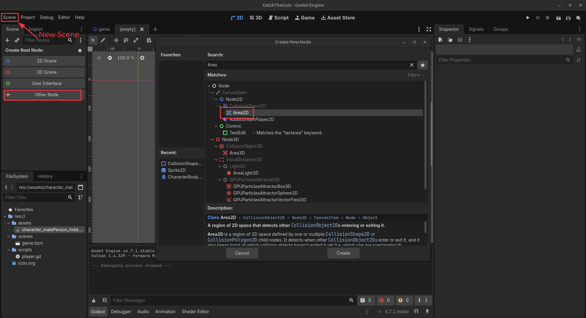

Добавляем Node и переименовываем его:

```text
Area2D → Coin
```

Почему именно `Area2D`? `Player` должен двигаться, поэтому для него мы использовали:

```text
CharacterBody2D
```

Монетка двигаться не будет. Нам нужно, чтобы она могла определить:

```text
Player вошёл в область Coin
```

Для таких объектов в Godot используется `Area2D`. Позже именно с его помощью мы определим момент, когда Player коснулся монетки.

---

### Сохраняем Coin как отдельную Scene

Сохраним новую Scene:

```text
Ctrl + S
```

В папке:

```text
scenes
```

создаём файл:

```text
coin.tscn
```

Теперь в проекте находятся две Scene:

```text
scenes/
├── game.tscn
└── coin.tscn
```

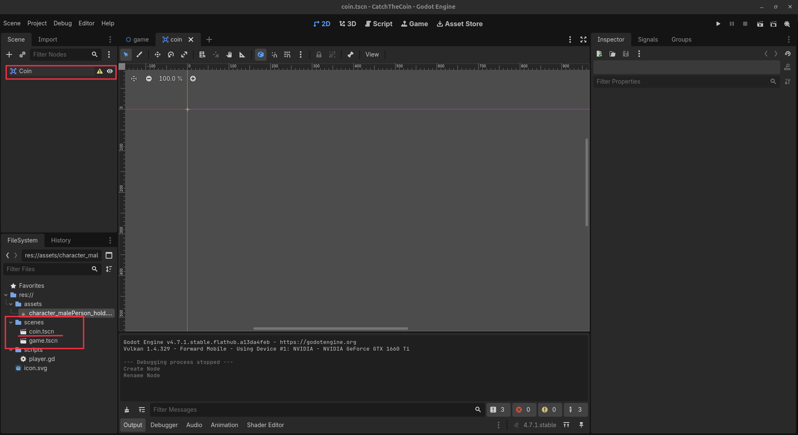

Получается:

```text
game.tscn
→ основная игровая Scene

coin.tscn
→ отдельная Scene монетки
```

Позже мы добавим `coin.tscn` внутрь `game.tscn`.

---

### Добавляем изображение монетки

Сам `Area2D` не имеет изображения. Поэтому выбираем:

```text
Coin
```

и добавляем дочерний Node:

```text
Sprite2D
```

Получится:

```text
Coin
└── Sprite2D
```

Для монетки используем подходящее изображение из игровых ресурсов и добавляем его в папку:

```text
assets
```

После этого выбираем `Sprite2D` и назначаем изображение в:

```text
Texture
```

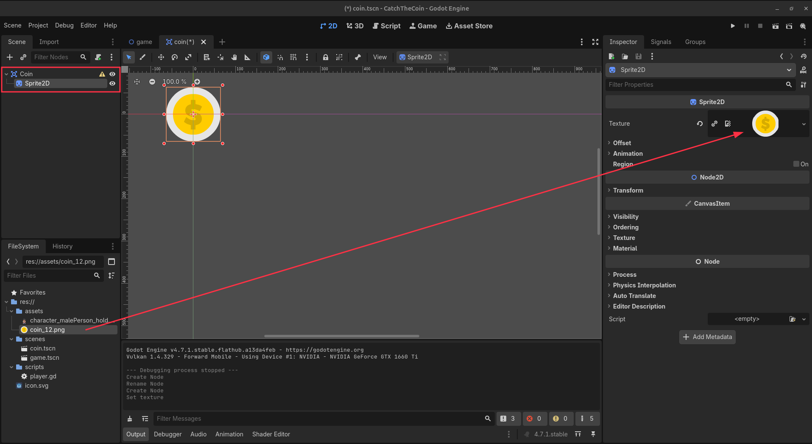

Теперь наша монетка появилась на сцене.

---

### Уменьшаем монетку

Исходное изображение оказалось слишком большим для нашего игрового поля. Выбираем:

```text
Sprite2D
```

В `Inspector` открываем:

```text
Transform
→ Scale
```

Установим:

```text
X = 0.3
Y = 0.3
```

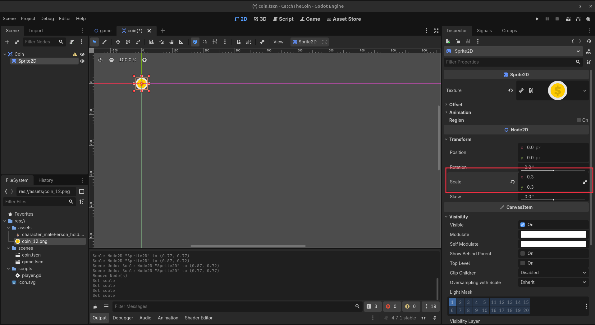

Монетка стала значительно меньше. `Scale` определяет масштаб объекта.

Например:

```text
Scale = 1
→ обычный размер

Scale = 0.5
→ объект в два раза меньше

Scale = 0.3
→ объект ещё меньше
```

Мы изменяем `Scale` именно у:

```text
Sprite2D
```

Корневой:

```text
Coin (Area2D)
```

оставляем с обычным масштабом:

```text
X = 1
Y = 1
```

То есть мы изменили только внешний вид монетки.

---

### Добавляем CollisionShape2D

Теперь Coin видно на экране, но для определения взаимодействия ей понадобится форма столкновения.

Выбираем:

```text
Coin
```

и добавляем:

```text
CollisionShape2D
```

Получается:

```text
Coin
├── Sprite2D
└── CollisionShape2D
```

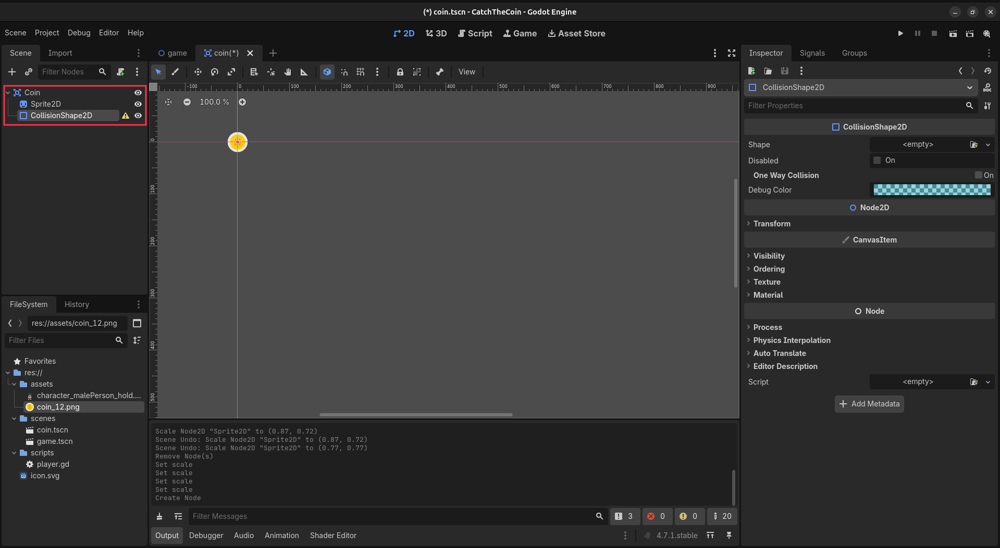

Здесь у каждого Node своя задача:

| Node                 | Задача                                                         |
| -------------------- | -------------------------------------------------------------------- |
| `Coin`             | основа объекта и область обнаружения |
| `Sprite2D`         | изображение монетки                                |
| `CollisionShape2D` | форма взаимодействия                              |

Как и раньше, рядом с `CollisionShape2D` сначала появится предупреждение. Это происходит потому, что мы добавили Node, но ещё не указали его форму.

---

### Выбираем форму монетки

У Player мы использовали:

```text
RectangleShape2D
```

Но наша монетка круглая.Поэтому для неё лучше подходит:

```text
CircleShape2D
```

Выбираем:

```text
CollisionShape2D
```

В `Inspector` находим:

```text
Shape
```

и выбираем:

```text
CircleShape2D
```

После этого на сцене появится круглая область столкновения. Теперь подгоняем её размер примерно под изображение монетки.

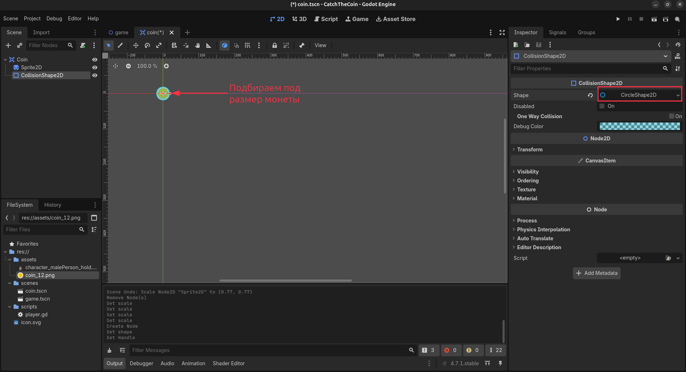

Получается:

```text
Sprite2D
→ показывает монетку

CollisionShape2D
→ определяет её область взаимодействия
```

Форма Collision не обязана идеально совпадать с каждым пикселем изображения. Главное, чтобы она примерно соответствовала размеру игрового объекта.

---

### Проверяем структуру Coin

В результате наша Scene должна выглядеть так:

```text
Coin (Area2D)
├── Sprite2D
└── CollisionShape2D
```

Сохраняем изменения:

```text
Ctrl + S
```

Теперь в проекте уже есть два самостоятельных игровых объекта:

```text
game.tscn
```

и:

```text
coin.tscn
```

Структура проекта выглядит примерно так:

```text
res://
├── assets/
│   ├── персонаж
│   └── монетка
│
├── scenes/
│   ├── game.tscn
│   └── coin.tscn
│
└── scripts/
    └── player.gd
```

Мы впервые создали отдельную Scene специально для одного игрового объекта. Следующий шаг - добавить `coin.tscn` внутрь `game.tscn` и использовать одну Scene внутри другой.

---

## Добавляем Coin в Game

Монетка уже создана как отдельная Scene:

```text
coin.tscn
```

Но пока она существует отдельно от основной игры. Теперь добавим её внутрь:

```text
game.tscn
```

Возвращаемся к Scene `game.tscn`. Сейчас её структура выглядит примерно так:

```text
Game
└── Player
    ├── Sprite2D
    └── CollisionShape2D
```

---

### Добавляем готовую Scene

В панели `FileSystem` находим:

```text
scenes/coin.tscn
```

и перетаскиваем её мышкой в рабочую область `Game`. После этого в дереве Scene появится новый объект:

```text
Game
├── Player
│   ├── Sprite2D
│   └── CollisionShape2D
│
└── Coin
```

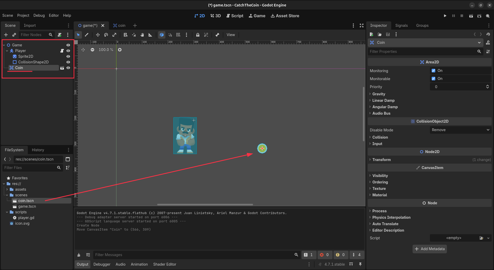

Обратите внимание: мы не создавали монетку заново. Нам не пришлось ещё раз добавлять:

```text
Area2D
├── Sprite2D
└── CollisionShape2D
```

Вместо этого мы использовали уже готовую Scene:

```text
coin.tscn
```

---

### Scene внутри другой Scene

В Godot одну Scene можно использовать внутри другой. Сейчас получилось:

```text
game.tscn
│
├── Player
│
└── Coin
    ↓
  coin.tscn
```

Объект `Coin`, который появился внутри `Game`, называется **экземпляром Scene**.

Можно представить это так:

```text
coin.tscn
    ↓
готовая Scene монетки
    ↓
создаём экземпляр
    ↓
Coin появляется внутри Game
```

Исходная Scene продолжает храниться отдельно:

```text
scenes/coin.tscn
```

А `Game` использует созданный на её основе объект.

---

### Размещаем монетку

Выбираем:

```text
Coin
```

В `Inspector` открываем:

```text
Transform
→ Position
```

Для нашей монетки установим:

```text
X = 700
Y = 300
```

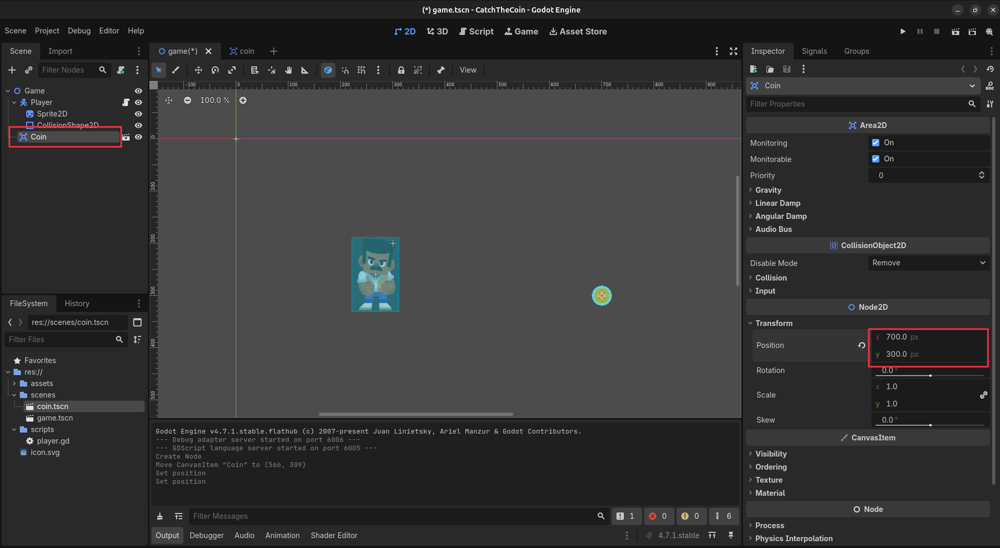

Теперь монетка находится отдельно от стартовой позиции Player, поэтому персонажу придётся до неё добраться. Положение можно выбрать и самостоятельно.

---

### Запускаем игру

Сохраняем Scene:

```text
Ctrl + S
```

и запускаем:

```text
F6
```

Теперь в игровом окне находятся сразу два объекта:

```text
Player

Coin
```

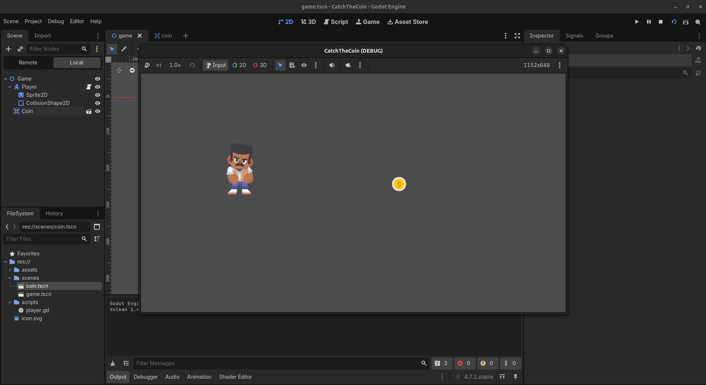

Player по-прежнему может двигаться, а Coin остаётся на месте. Попробуйте подойти персонажем к монетке. Пока ничего не произойдёт. Это нормально. У Player и Coin уже есть `CollisionShape2D`, но мы ещё не создали правило:

```text
Player коснулся Coin
        ↓
что должно произойти?
```

К этому взаимодействию мы перейдём немного позже.

---

### Создаём несколько монеток

Теперь становится понятно, зачем мы создавали Coin как отдельную Scene. Одну и ту же:

```text
coin.tscn
```

можно добавить в `Game` несколько раз. Добавим ещё две монетки и разместим их в разных частях игрового поля. Получится:

```text
Game
├── Player
├── Coin
├── Coin2
└── Coin3
```

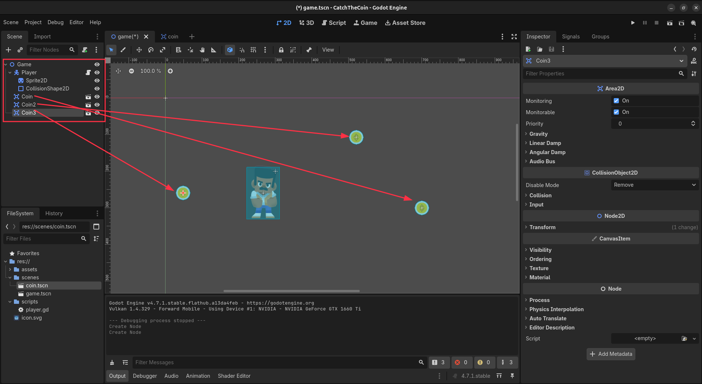

Все три объекта являются отдельными экземплярами одной Scene:

```text
                 coin.tscn
                     ↓
          ┌──────────┼──────────┐
          ↓          ↓          ↓
        Coin       Coin2      Coin3
```

Каждый экземпляр можно расположить в своей точке:

```text
Coin
→ одна Position

Coin2
→ другая Position

Coin3
→ третья Position
```

При этом устройство самой монетки мы создали только один раз.

---

### Зачем нужны экземпляры

Представим, что на уровне должно находиться 50 монеток. Если создавать каждую вручную, пришлось бы 50 раз добавлять:

```text
Area2D
├── Sprite2D
└── CollisionShape2D
```

Вместо этого мы один раз создаём:

```text
coin.tscn
```

а затем используем её столько раз, сколько необходимо. Так же в дальнейшем можно создавать отдельные Scene для других игровых объектов:

```text
Player.tscn
Enemy.tscn
Bullet.tscn
Potion.tscn
Door.tscn
```

А затем собирать из них игровой мир:

```text
Game
├── Player
├── Enemy
├── Enemy
├── Coin
├── Coin
├── Potion
└── Door
```

Так большие Scene постепенно собираются из небольших готовых частей.

---

Теперь Player и Coin находятся в одной игровой Scene. Следующая задача:

```text
Player движется
        ↓
касается Coin
        ↓
Coin должна это обнаружить
```

Для этого нам понадобится первое событие между игровыми объектами.

---

## Первое взаимодействие Player и Coin

Теперь `Player` и `Coin` находятся в одной игровой Scene, но пока никак не взаимодействуют. Наша следующая задача:

```text
Player касается Coin
        ↓
Coin исчезает
```

Для этого подключим к монетке сигнал и добавим небольшой скрипт.

---

### Подключаем скрипт к Coin

Открываем:

```text
scenes/coin.tscn
```

Выбираем корневой Node:

```text
Coin
```

и нажимаем **Attach Script**. Создаём файл:

```text
res://scripts/coin.gd
```

Параметры:

```text
Language: GDScript
Inherits: Area2D
Template: выключен
Path: res://scripts/coin.gd
```

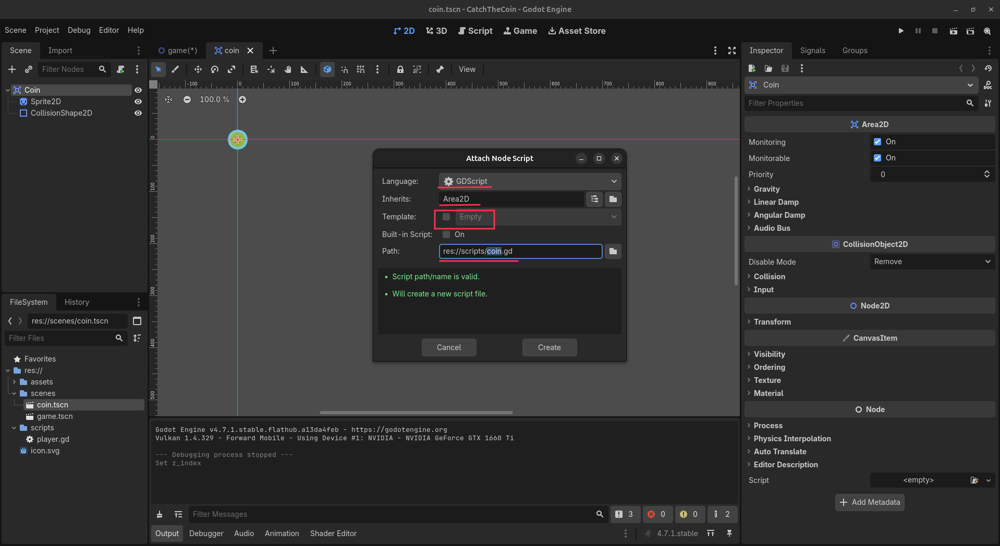

После создания скрипта в нём появится:

```gdscript
extends Area2D
```

Теперь поведение нашей монетки можно будет описывать с помощью кода.

---

### Подключаем сигнал body_entered

Возвращаемся в режим `2D` и выбираем:

```text
Coin
```

Справа открываем вкладку:

```text
Signals
```

У `Area2D` есть несколько готовых сигналов. Нас интересует:

```text
body_entered
```

Он срабатывает, когда в область `Area2D` входит физический объект. В нашем случае таким объектом будет:

```text
Player (CharacterBody2D)
```

Дважды нажимаем на:

```text
body_entered
```

Откроется окно подключения сигнала. Проверяем:

```text
Connect to Script: Coin
Receiver Method: _on_body_entered
```

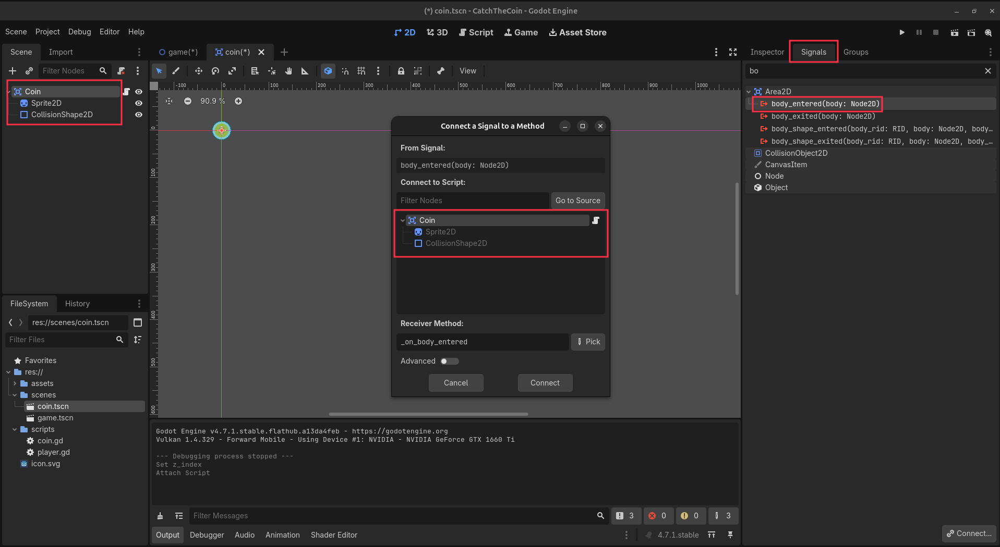

Нажимаем:

```text
Connect
```

После этого Godot автоматически создаст функцию, которая будет выполняться при срабатывании сигнала.

---

### Функция обработки сигнала

После подключения Godot переключит нас в режим `Script`. В `coin.gd` появится функция примерно такого вида:

```gdscript
func _on_body_entered(body: Node2D) -> void:
	pass
```


Пока не нужно подробно разбирать устройство функций и сигналов. Сейчас достаточно понять сам принцип:

```text
Player входит в область Coin
        ↓
Area2D отправляет сигнал body_entered
        ↓
Godot вызывает _on_body_entered()
```

Строка:

```gdscript
pass
```

означает, что пока функция ничего не делает. Нам нужно изменить это.

---

### Удаляем Coin после подбора

Заменяем:

```gdscript
pass
```

на:

```gdscript
queue_free()
```

Получится:

```gdscript
extends Area2D


func _on_body_entered(body: Node2D) -> void:
	queue_free()
```

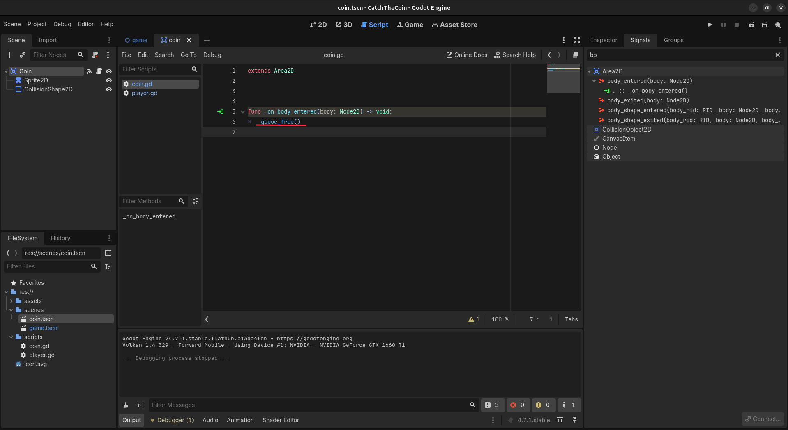

`queue_free()` говорит Godot удалить объект из игры. Теперь цепочка выглядит так:

```text
Player касается Coin
        ↓
body_entered
        ↓
_on_body_entered()
        ↓
queue_free()
        ↓
Coin исчезает
```

Сохраняем скрипт:

```text
Ctrl + S
```

---

### Настраиваем Z Index Player

Перед запуском игры настроим порядок отображения объектов. Возвращаемся в:

```text
game.tscn
```

Выбираем:

```text
Player
```

В `Inspector` открываем:

```text
CanvasItem
→ Ordering
→ Z Index
```

Устанавливаем:

```text
Z Index = 1
```

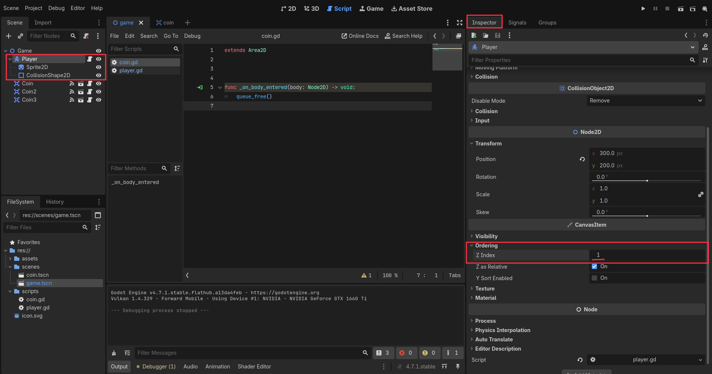

Монетки оставляем:

```text
Z Index = 0
```

Получается:

```text
Player → Z Index 1
Coin   → Z Index 0
```

Чем больше `Z Index`, тем выше объект отображается относительно других объектов. В нашем случае Player будет визуально находиться поверх монеток.

---

### Проверяем сбор монеток

Сохраняем:

```text
Ctrl + S
```

и запускаем:

```text
F6
```

Если игра запускается внутри редактора Godot, не забываем включить:

```text
Input
```

Теперь подводим Player к одной из монеток. Как только Player войдёт в её область:

```text
Coin исчезнет
```

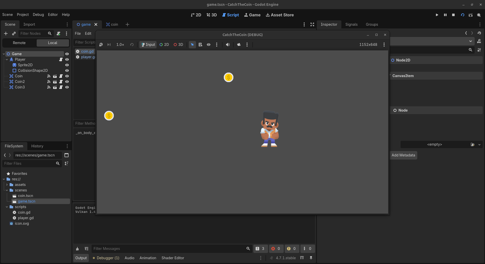

При этом остальные экземпляры Coin останутся на месте. Например, сначала:

```text
Coin
Coin
Coin
```

после сбора одной:

```text
Coin
Coin
```

Каждая монетка является отдельным экземпляром `coin.tscn`, поэтому удаляется независимо от остальных.

---

Теперь в нашей игре появилось первое настоящее взаимодействие между объектами:

```text
Player
   ↓
движется
   ↓
касается Coin
   ↓
Coin реагирует
   ↓
Coin исчезает
```

Мы впервые использовали сигнал для связи между игровыми объектами. Подробно разбирать сигналы и функции пока не будем. Сейчас достаточно понимать, что сигнал сообщает о произошедшем событии, а функция выполняет нужное действие.

---

## Границы игрового мира

Сейчас Player может свободно двигаться по сцене и даже выйти за пределы игрового окна. Для настоящей игры это проблема:

```text
Player
↓
доходит до края экрана
↓
продолжает двигаться дальше
↓
исчезает из игрового поля
```

Нам нужно ограничить игровое пространство и сделать так, чтобы Player не мог выйти за его границы. Для этого познакомимся с новым типом Node - `StaticBody2D`.

---

### Размер игрового пространства

Сначала нужно узнать размер нашего игрового окна. Открываем:

```text
Project
→ Project Settings
→ Display
→ Window
```

В параметрах `Size` находятся размеры игровой области:

```text
Viewport Width  = 1152
Viewport Height = 648
```

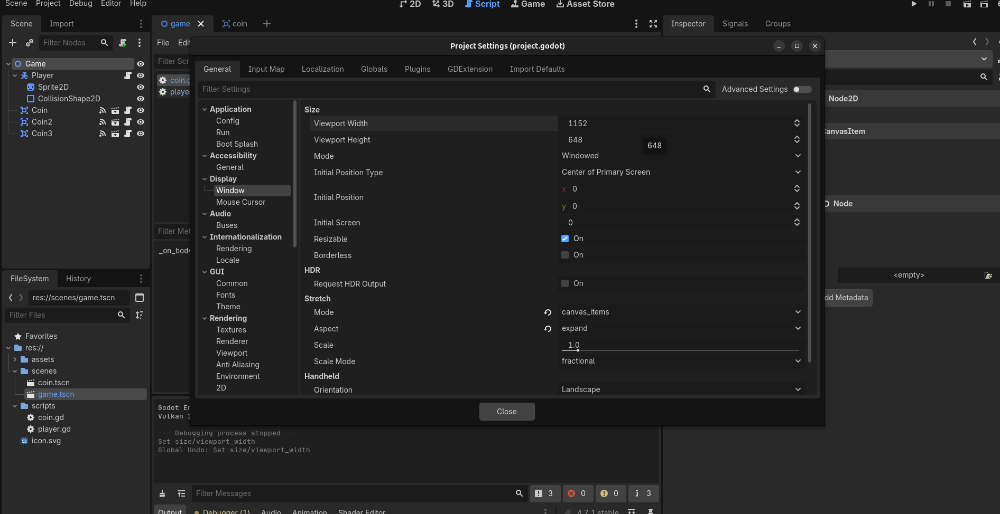

Это означает, что игровое пространство имеет размер:

```text
1152 × 648 px
```

Начало координат находится в левом верхнем углу:

```text
(0, 0)
```

А противоположный угол находится примерно здесь:

```text
(1152, 648)
```

Эти значения понадобятся нам для правильного расположения границ.

---

### Добавляем StaticBody2D

Возвращаемся в:

```text
game.tscn
```

Выбираем корневой Node:

```text
Game
```

и добавляем новый:

```text
StaticBody2D
```

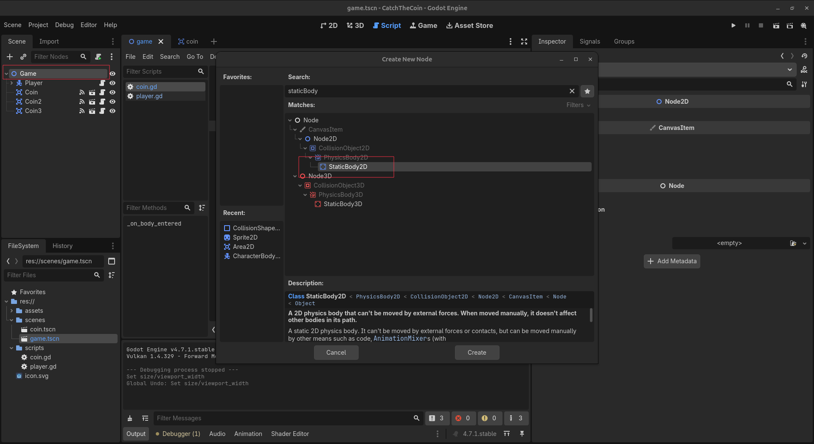

Переименовываем его:

```text
Borders
```

`StaticBody2D` - это неподвижный физический объект. Он подходит для объектов, которые сами не должны двигаться:

```text
стены
границы
пол
платформы
препятствия
```

Наш `Player` создан на основе:

```text
CharacterBody2D
```

поэтому он сможет сталкиваться со `StaticBody2D`.

---

### Создаём верхнюю границу

Выбираем:

```text
Borders
```

и добавляем:

```text
CollisionShape2D
```

Переименовываем его:

```text
Top
```

В `Shape` создаём:

```text
RectangleShape2D
```

Для верхней стены устанавливаем размер:

```text
Size

X = 1152
Y = 20
```

Ширина `1152` соответствует ширине игрового окна. Толщина стены будет всего:

```text
20 px
```

Теперь устанавливаем позицию:

```text
Position

X = 576
Y = -10
```

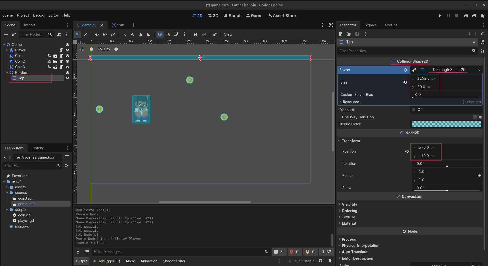

Почему `X = 576`? Ширина окна:

```text
1152
```

Чтобы найти середину:

```text
1152 / 2 = 576
```

Поэтому центр верхней стены располагаем в:

```text
X = 576
```

Значение:

```text
Y = -10
```

помещает половину стены за пределами экрана. Получается примерно так:

```text
██████████████████████████
──────────────────────────  ← верх игрового окна

          GAME
```

Игрок увидит обычный край экрана, но физически выйти за него уже не сможет.

---

### Создаём остальные границы

Теперь по тому же принципу создаём ещё три `CollisionShape2D`:

```text
Borders
├── Top
├── Bottom
├── Left
└── Right
```

Для каждой используем:

```text
RectangleShape2D
```

Параметры:

| Граница | Size           | Position      |
| -------------- | -------------- | ------------- |
| `Top`        | `1152 × 20` | `576, -10`  |
| `Bottom`     | `1152 × 20` | `576, 658`  |
| `Left`       | `20 × 648`  | `-10, 324`  |
| `Right`      | `20 × 648`  | `1162, 324` |

Для горизонтальных стен:

```text
Top
Bottom
```

используем ширину всего игрового окна. Для вертикальных:

```text
Left
Right
```

используем всю высоту окна. После создания всех четырёх границ получаем:

```text
Game
├── Player
├── Coin
├── Coin2
├── Coin3
└── Borders
    ├── Top
    ├── Bottom
    ├── Left
    └── Right
```

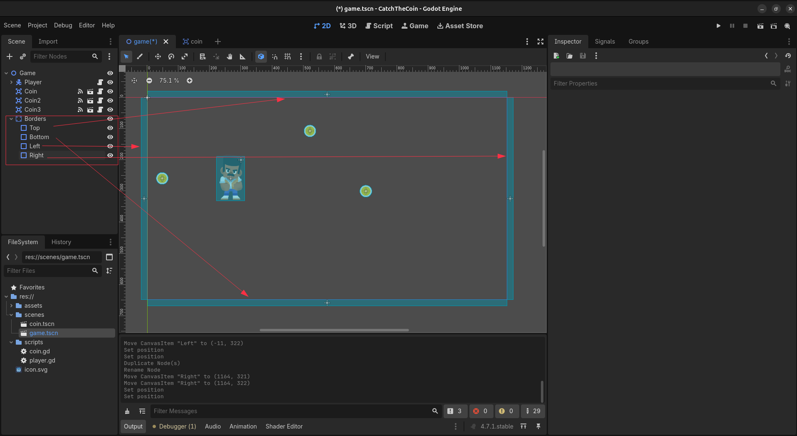

В редакторе границы видны благодаря `CollisionShape2D`, но в самой игре эти прямоугольники отображаться не будут. Это **невидимые физические стены**.

---

### Почему Player теперь не может выйти за экран

Вспомним структуру Player:

```text
Player (CharacterBody2D)
├── Sprite2D
└── CollisionShape2D
```

У него уже есть физическая форма. Теперь у игрового мира тоже появились физические формы:

```text
Borders (StaticBody2D)
├── Top
├── Bottom
├── Left
└── Right
```

Когда Player пытается выйти за пределы уровня:

```text
Player движется
        ↓
его CollisionShape2D
сталкивается с границей
        ↓
StaticBody2D останавливает Player
```

При этом нам не пришлось писать новый код. В скрипте Player уже используется:

```gdscript
move_and_slide()
```

Эта функция двигает `CharacterBody2D` и одновременно учитывает физические столкновения.

---

### Проверяем границы

Сохраняем Scene:

```text
Ctrl + S
```

и запускаем игру:

```text
F6
```

Проверяем каждую сторону:

```text
↑ верхняя граница

↓ нижняя граница

← левая граница

→ правая граница
```

Player должен доходить до края игрового пространства и останавливаться. Чтобы увидеть невидимые физические формы, можно включить:

```text
Debug
→ Visible Collision Shapes
```

После этого Godot покажет Collision всех физических объектов.

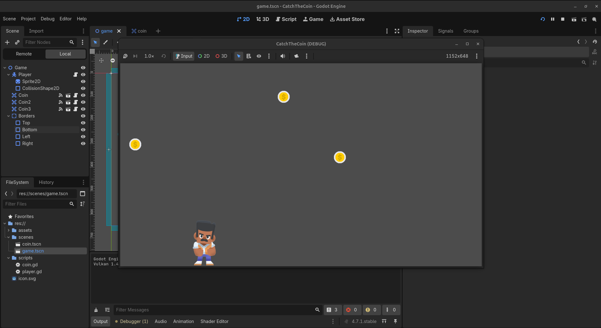

Теперь хорошо видно, что Player не просто останавливается возле края экрана - его `CollisionShape2D` действительно сталкивается с физической границей.

---

Теперь в нашей игре есть три разных типа физических объектов:

```text
CharacterBody2D
→ Player
→ двигается и сталкивается с другими объектами

Area2D
→ Coin
→ обнаруживает Player и реагирует на него

StaticBody2D
→ Borders
→ не двигается и не позволяет Player пройти
```

Игровое пространство больше не бесконечное - у нашего уровня появились настоящие физические границы.

---

## Создаём стены и препятствия

Границы игрового мира уже не позволяют Player выйти за пределы экрана. Но `StaticBody2D` можно использовать не только для внешних границ уровня. Создадим настоящую стену внутри игрового пространства:

```text
Player движется
        ↓
встречает Wall
        ↓
сталкивается с ней
        ↓
не может пройти насквозь
```

---

### Создаём отдельную Scene Wall

Создаём новую Scene:

```text
New Scene
→ Other Node
→ StaticBody2D
```

Переименовываем корневой Node:

```text
Wall
```

и сохраняем Scene:

```text
res://scenes/wall.tscn
```

Мы снова используем `StaticBody2D`, потому что стена:

- не должна самостоятельно двигаться;
- должна участвовать в физических столкновениях;
- должна останавливать Player.

---

### Добавляем изображение стены

Выбираем:

```text
Wall
```

и добавляем:

```text
Sprite2D
```

Получаем:

```text
Wall (StaticBody2D)
└── Sprite2D
```

Добавляем подходящее изображение стены, блока, ящика или другого препятствия. При необходимости изменяем:

```text
Transform
→ Scale
```

чтобы подобрать подходящий размер.

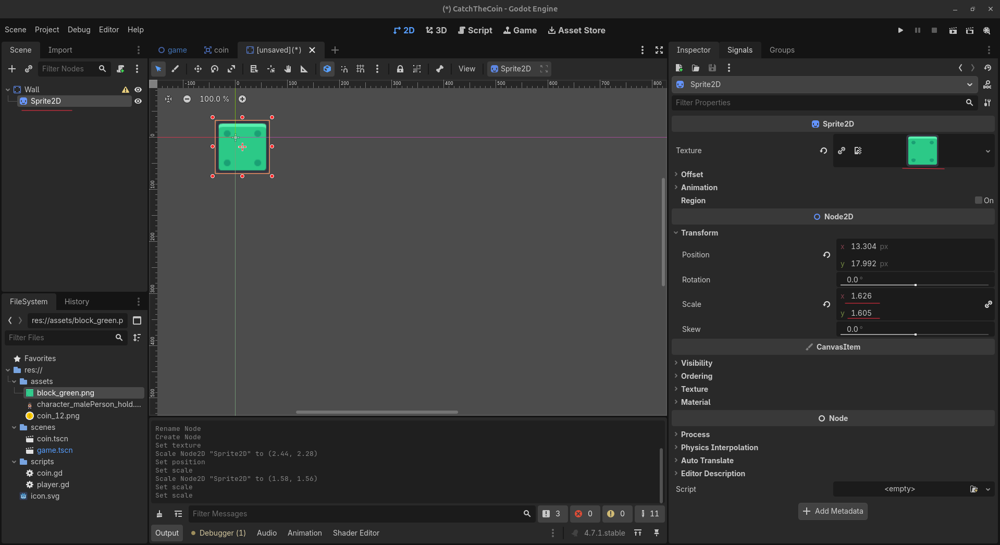

Пока у стены есть только внешний вид. Player всё ещё сможет пройти прямо через неё, потому что `Sprite2D` отвечает только за изображение объекта.

---

### Добавляем физическую форму

Выбираем:

```text
Wall
```

и добавляем:

```text
CollisionShape2D
```

Структура Scene становится такой:

```text
Wall (StaticBody2D)
├── Sprite2D
└── CollisionShape2D
```

Для `Shape` создаём:

```text
RectangleShape2D
```

и подгоняем его под размер изображения.

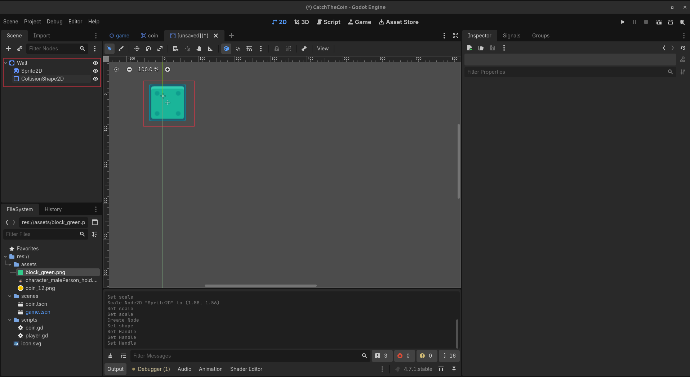

Теперь у стены есть две части:

```text
Sprite2D
→ то, что видит игрок

CollisionShape2D
→ физическая форма стены
```

Сам `StaticBody2D` объединяет их и превращает объект в неподвижное физическое препятствие.

Сохраняем:

```text
Ctrl + S
```

---

### Добавляем Wall в Game

Возвращаемся в:

```text
game.tscn
```

В `FileSystem` находим:

```text
scenes/wall.tscn
```

и перетаскиваем её внутрь `Game`. Получаем:

```text
Game
├── Player
├── Borders
├── Coin
├── Coin2
├── Coin3
└── Wall
```

Размещаем Wall внутри игрового пространства.

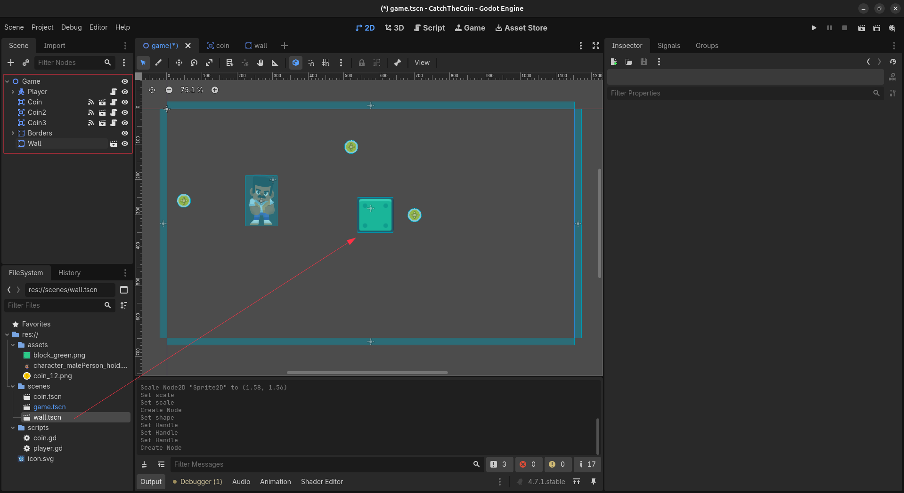

Теперь `Wall` является экземпляром отдельной Scene:

```text
wall.tscn
```

Так же, как раньше мы добавляли экземпляры:

```text
coin.tscn
```

Это значит, что одну готовую Scene стены можно использовать много раз.

---

### Создаём несколько препятствий

Выбираем `Wall` и дублируем её:

```text
Ctrl + D
```

Создаём несколько экземпляров:

```text
Game
├── Player
├── Borders
├── Coin
├── Coin2
├── Coin3
├── Wall
├── Wall2
└── Wall3
```

Размещаем стены в разных частях игрового поля.

Например, можно поставить их так, чтобы Player пришлось обходить препятствия по пути к монеткам.

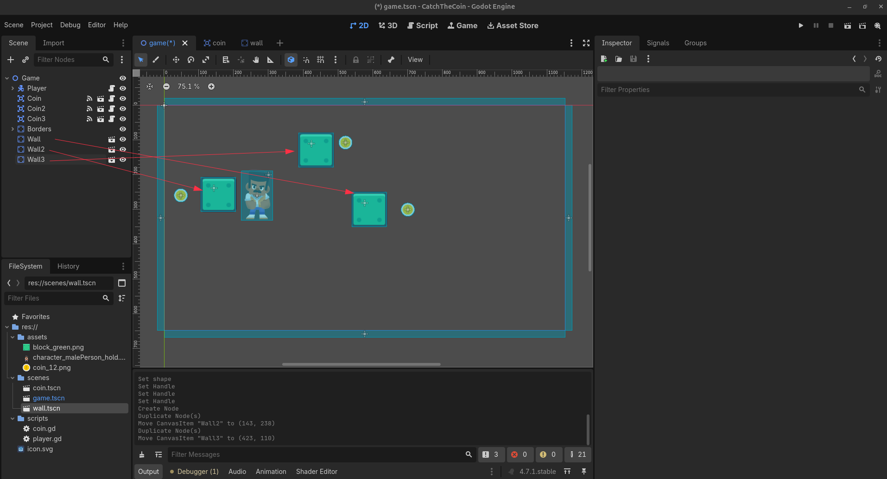

Все стены создаются на основе одной Scene:

```text
wall.tscn
        ↓
Wall

wall.tscn
        ↓
Wall2

wall.tscn
        ↓
Wall3
```

Но каждый экземпляр можно расположить в своей позиции.

---

### Проверяем столкновения

Сохраняем Scene:

```text
Ctrl + S
```

и запускаем игру:

```text
F6
```

Теперь пробуем пройти Player через одну из стен. Player должен остановиться перед препятствием:

```text
Player → → → Wall
              ↓
             STOP
```

Нового кода для этого писать не понадобилось. У Player уже есть:

```text
CharacterBody2D
+
CollisionShape2D
+
move_and_slide()
```

А у Wall:

```text
StaticBody2D
+
CollisionShape2D
```

Когда их физические формы сталкиваются, Godot автоматически учитывает столкновение.

---

### Смотрим физические формы

Чтобы увидеть коллизии во время игры, включаем:

```text
Debug
→ Visible Collision Shapes
```

Подводим Player к стене.

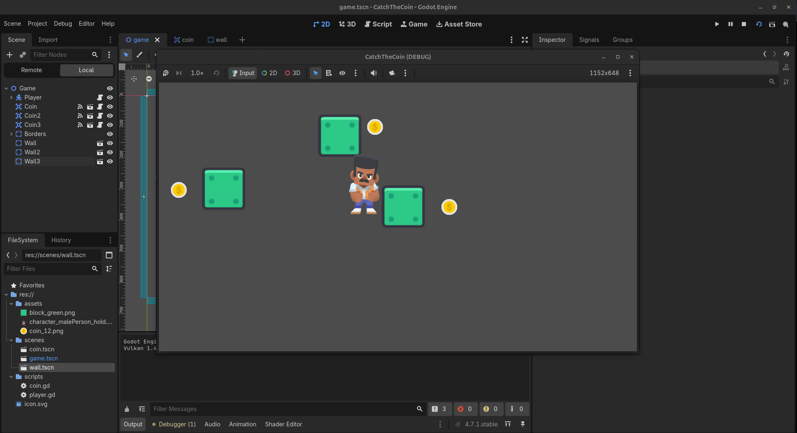

Теперь хорошо видно:

```text
CollisionShape2D Player
        ↓
сталкивается
        ↓
CollisionShape2D Wall
```

Поэтому Player не может пройти сквозь препятствие.

---

Теперь мы использовали `StaticBody2D` уже для двух разных задач:

```text
StaticBody2D

├── Borders
│   └── ограничивают игровой мир
│
└── Wall
    └── создаёт препятствие внутри уровня
```

Принцип при этом остаётся одинаковым:

```text
StaticBody2D
+
CollisionShape2D
=
неподвижный физический объект
```

Так с помощью одной и той же системы можно создавать стены, платформы, препятствия и многие другие элементы игрового мира.

---

## Добавляем опасный объект - Bomb

Теперь в нашей игре уже есть:

- `Coin`, который Player может собирать;
- `Wall`, через которую Player не может пройти;
- границы игрового пространства.

Добавим ещё один тип взаимодействия - **опасный объект**. Создадим бомбу:

```text
Player касается Bomb
        ↓
Bomb обнаруживает Player
        ↓
в Output появляется BOOM!
```

При этом Bomb не должна работать как стена. Player сможет войти в её область, а `Area2D` обнаружит это событие.

---

### Создаём отдельную Scene Bomb

Создаём новую Scene на основе:

```text
Area2D
```

Корневой Node называем:

```text
Bomb
```

Сохраняем Scene:

```text
res://scenes/bomb.tscn
```

Добавляем к Bomb два дочерних Node:

```text
Bomb (Area2D)
├── Sprite2D
└── CollisionShape2D
```

В `Sprite2D` устанавливаем изображение бомбы.

Для `CollisionShape2D` выбираем:

```text
CircleShape2D
```

и подгоняем размер Collision под изображение.

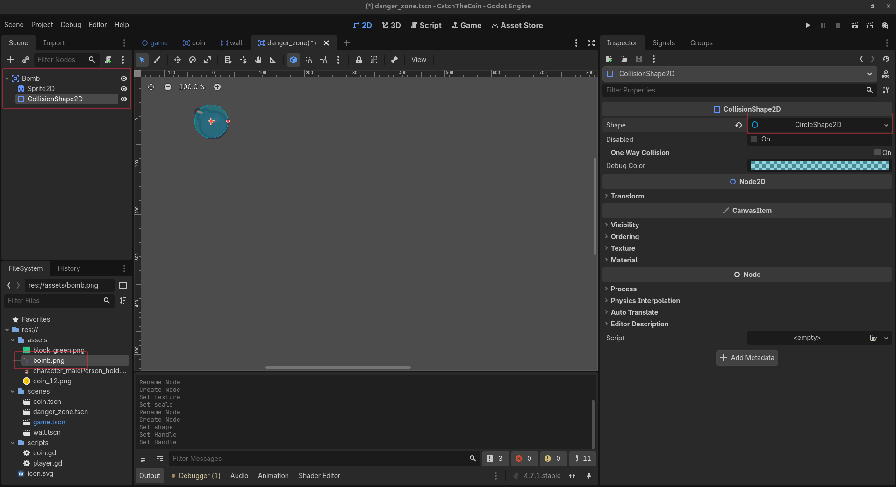

В результате у Bomb есть:

```text
Sprite2D
→ внешний вид

CollisionShape2D
→ область взаимодействия
```

Но в отличие от `Wall`, корневой Node здесь - не `StaticBody2D`, а:

```text
Area2D
```

Поэтому Bomb не будет физически останавливать Player.

---

### Добавляем Bomb в игровое поле

Возвращаемся в:

```text
game.tscn
```

и перетаскиваем:

```text
bomb.tscn
```

в основную Scene. Теперь структура игры выглядит примерно так:

```text
Game
├── Player
├── Coin
├── Coin2
├── Coin3
├── Borders
├── Wall
├── Wall2
├── Wall3
└── Bomb
```

Размещаем Bomb внутри игрового пространства.

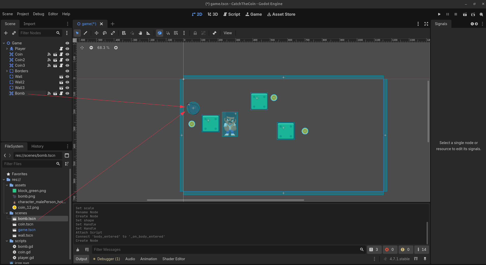

Теперь на одном уровне находятся разные игровые объекты:

```text
Coin
→ можно собрать

Wall
→ нужно обходить

Bomb
→ опасный объект
```

Но пока Bomb ещё никак не реагирует на Player.

---

### Подключаем Signal body_entered

Чтобы Bomb могла определить момент столкновения с Player, используем уже знакомый сигнал:

```text
body_entered
```

Выбираем:

```text
Bomb
```

переходим во вкладку:

```text
Signals
```

и находим:

```text
body_entered(body: Node2D)
```

Дважды нажимаем на него. Godot откроет окно подключения сигнала. В качестве функции оставляем:

```text
_on_body_entered
```

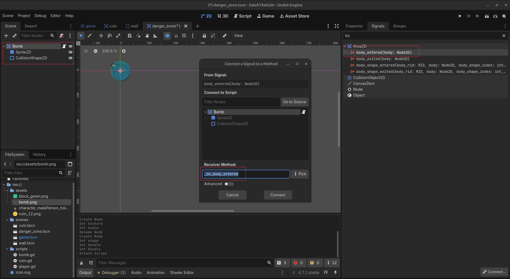

Нажимаем:

```text
Connect
```

Теперь Godot будет вызывать `_on_body_entered()`, когда физический объект войдёт в область Bomb.

---

### Добавляем реакцию Bomb

После подключения сигнала открываем скрипт Bomb. Получаем функцию:

```gdscript
func _on_body_entered(body: Node2D) -> void:
```

Добавляем:

```gdscript
print("BOOM!")
```

Готовый код:

```gdscript
extends Area2D


func _on_body_entered(body: Node2D) -> void:
	print("BOOM!")
```

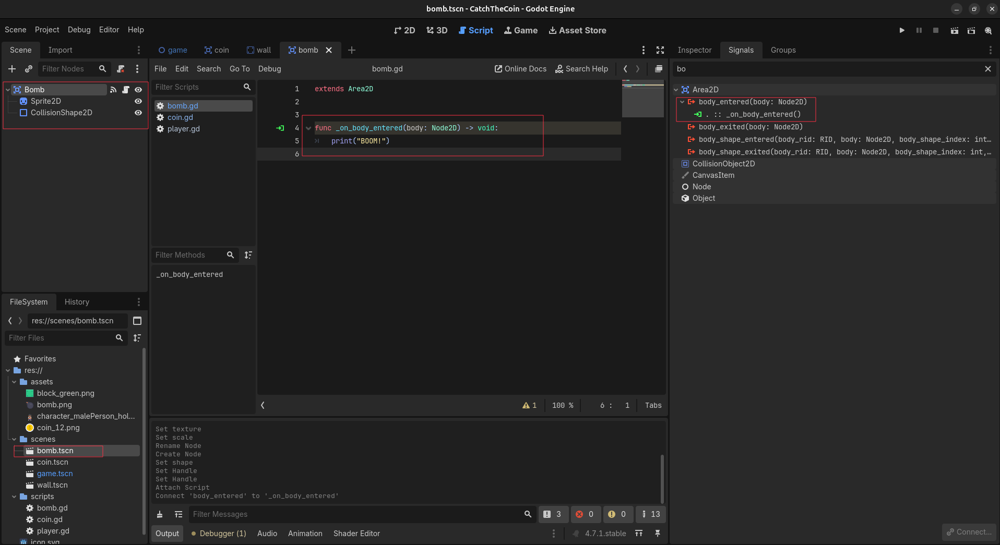

Теперь логика Bomb выглядит так:

```text
Player входит в CollisionShape2D Bomb
        ↓
Area2D обнаруживает Player
        ↓
срабатывает body_entered
        ↓
запускается _on_body_entered()
        ↓
print("BOOM!")
```

Пока Bomb ничего не делает с Player. Она только сообщает нам, что столкновение произошло.

---

### Проверяем Bomb

Сохраняем проект:

```text
Ctrl + S
```

и запускаем:

```text
F6
```

Подводим Player к Bomb. В отличие от `Wall`, Bomb не должна останавливать Player. Player может войти прямо в её область:

```text
Player
   ↓
  Bomb
```

При этом в `Output` появляется:

```text
BOOM!
```

Чтобы лучше увидеть взаимодействие физических областей, включаем:

```text
Debug
→ Visible Collision Shapes
```

Теперь можно увидеть Collision Player и Collision Bomb.

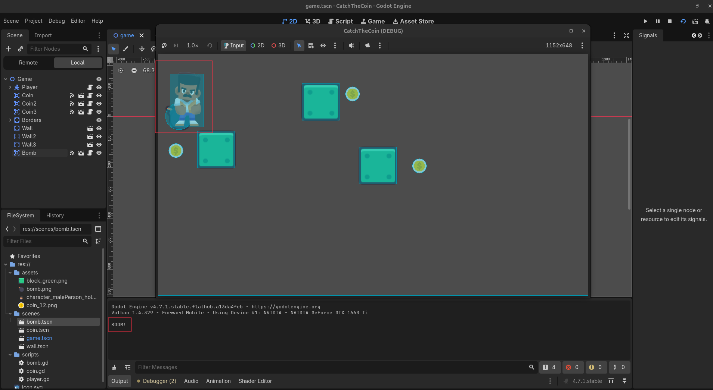

На скриншоте видно, что физические области пересеклись, а в `Output` появился:

```text
BOOM!
```

Значит, сигнал работает правильно.

---

### Чем Bomb отличается от Wall

Теперь мы можем сравнить два объекта.

```text
Wall
StaticBody2D
        ↓
Player сталкивается
        ↓
Player останавливается
```

А Bomb работает иначе:

```text
Bomb
Area2D
        ↓
Player входит внутрь области
        ↓
body_entered
        ↓
происходит событие
```

То есть:

| Объект | Тип           | Что происходит                                        |
| ------------ | ---------------- | ------------------------------------------------------------------ |
| `Wall`     | `StaticBody2D` | Player не может пройти                                |
| `Bomb`     | `Area2D`       | Player может войти, Bomb обнаруживает его |
| `Coin`     | `Area2D`       | Player входит, после чего Coin исчезает     |

Получается, что один и тот же `Area2D` можно использовать для разных игровых механик:

```text
Area2D

├── Coin
│   └── подобрать предмет
│
└── Bomb
    └── обнаружить опасное столкновение
```

Разница находится уже не в самом `Area2D`, а в том, **что мы делаем после срабатывания Signal**.

У Coin:

```gdscript
queue_free()
```

У Bomb:

```gdscript
print("BOOM!")
```

На следующем занятии мы сможем заменить простой `print("BOOM!")` настоящей игровой логикой:

```text
Player касается Bomb
        ↓
Game Over
        ↓
Restart
```

Так Bomb станет полноценным опасным объектом нашей игры.

---

## Добавляем фон для игрового уровня

Сейчас наш уровень уже работает, но визуально он всё ещё выглядит довольно просто. Добавим фоновое изображение, чтобы игровое пространство стало больше похоже на настоящий уровень.

---

### Добавляем Background

Открываем:

```text
game.tscn
```

Выбираем корневой Node:

```text
Game
```

и добавляем:

```text
Sprite2D
```

Переименовываем его:

```text
Background
```

В параметр:

```text
Texture
```

добавляем изображение фона из папки:

```text
res://assets/
```

После этого Background появится на игровой сцене.

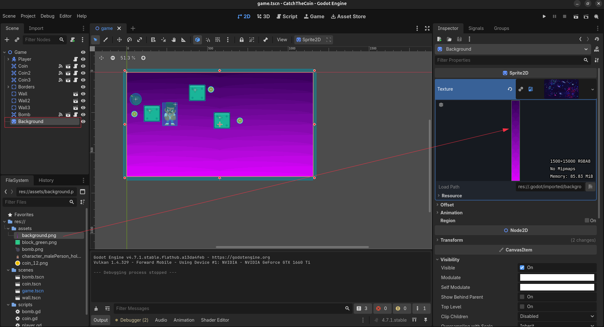

Структура `Game` теперь выглядит примерно так:

```text
Game
├── Background
├── Player
├── Coin
├── Coin2
├── Coin3
├── Borders
├── Wall
├── Wall2
├── Wall3
└── Bomb
```

---

### Размещаем фон

Размер нашего игрового окна:

```text
1152 × 648
```

Поэтому центр игрового пространства:

```text
X = 576
Y = 324
```

У `Background` в:

```text
Transform
→ Position
```

устанавливаем:

```text
X = 576
Y = 324
```

Если изображение слишком большое или маленькое, его можно подогнать через:

```text
Transform
→ Scale
```

Главное, чтобы фон закрывал всё игровое пространство.

---

### Отправляем Background назад

После добавления Background может перекрывать Player, Coin, Wall и остальные объекты.

Чтобы этого не происходило, снова используем:

```text
Z Index
```

Выбираем:

```text
Background
```

и открываем:

```text
CanvasItem
→ Ordering
→ Z Index
```

Устанавливаем:

```text
Z Index = -1
```

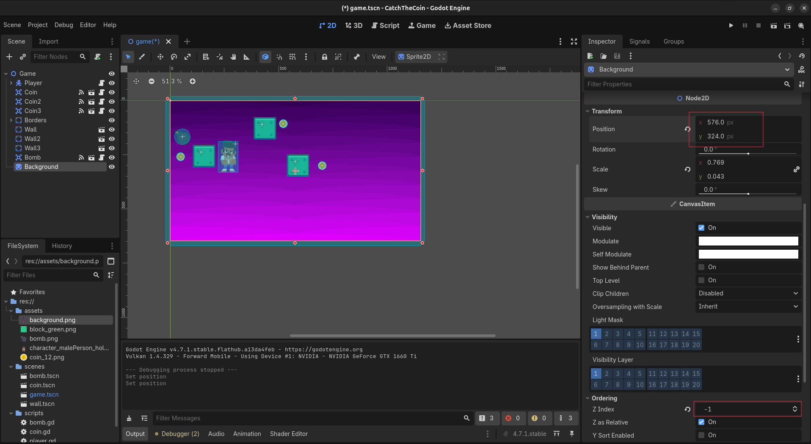

Теперь порядок отображения выглядит так:

```text
Player
Z Index = 1

        ↑

Coin / Wall / Bomb
Z Index = 0

        ↑

Background
Z Index = -1
```

Чем меньше `Z Index`, тем дальше объект отображается относительно остальных. Поэтому Background оказывается позади всего игрового уровня.

---

### Проверяем игру

Сохраняем:

```text
Ctrl + S
```

и запускаем:

```text
F6
```

Проверяем, что:

- Background находится позади игровых объектов;
- Player отображается поверх фона;
- Coin хорошо видны;
- Wall хорошо видны;
- Bomb хорошо видна;
- границы и столкновения продолжают работать.

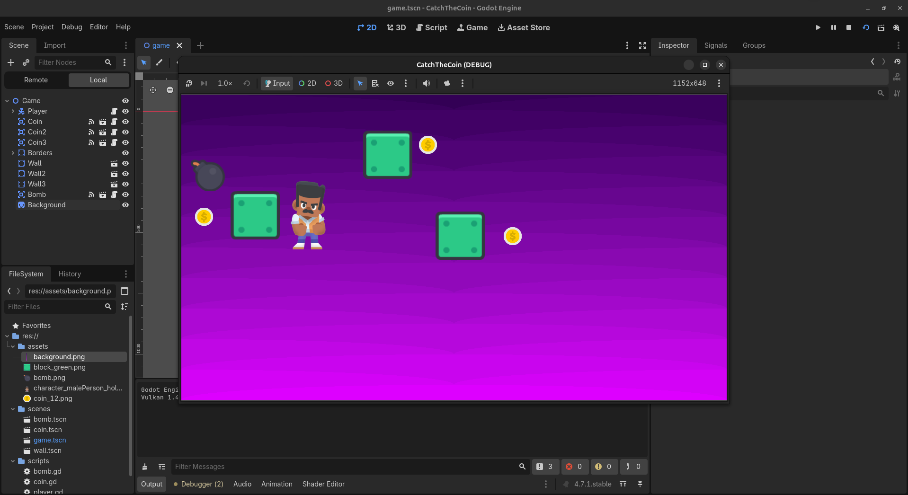

Фон является только визуальной частью уровня. Он не участвует в столкновениях, потому что у него нет:

```text
CollisionShape2D
```

Теперь наш уровень состоит не только из игровых механик, но и имеет полноценное визуальное оформление.

---

## Практика

Теперь самостоятельно расширьте игровой уровень, используя уже созданные `Wall` и `Bomb`.

### Задание

Измените уровень так, чтобы игроку было интереснее добираться до монеток.

Необходимо:

- добавить минимум `5` монеток;
- добавить минимум `4` блока `Wall`;
- добавить минимум `3` бомбы `Bomb`;
- расположить стены так, чтобы Player приходилось их обходить;
- разместить Bomb в разных частях уровня;
- убедиться, что Player не может проходить сквозь стены;
- проверить, что при касании Bomb в `Output` появляется:

```text
BOOM!
```

- проверить, что каждая Coin исчезает после сбора;
- убедиться, что Player не может выйти за границы игрового поля.

Уровень не должен состоять из случайно разбросанных объектов. Попробуйте расположить стены, бомбы и монетки так, чтобы появился небольшой маршрут.

Например:

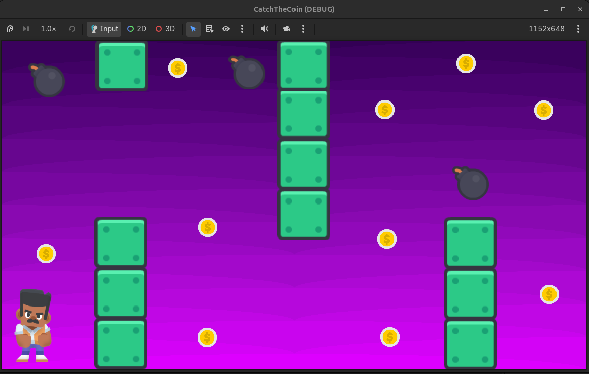

Это только пример. Расположение своего уровня придумайте самостоятельно.

### Challenge

Попробуйте сделать уровень сложнее:

- создать узкий проход между стенами;
- поставить Bomb рядом с монеткой;
- спрятать Coin за препятствием;
- сделать несколько возможных маршрутов;
- добавить больше стен и построить небольшой лабиринт.

Главное условие - уровень должен оставаться проходимым: Player должен иметь возможность собрать все монетки.

## Домашнее задание

Продолжите проект, который вы создали после первой лекции. Не создавайте новый проект. Используйте своего Player и расширьте уже существующую игру с помощью знаний второй лекции.

### Задание

Создайте собственный небольшой игровой уровень.

В игре должны появиться:

- несколько собираемых предметов;
- несколько неподвижных препятствий;
- минимум один опасный объект;
- границы игрового пространства;
- фон.

Собираемый предмет выберите самостоятельно.

Например:

- монетка;
- ключ;
- звезда;
- кристалл;
- фрукт;
- подарок.

При касании Player предмет должен исчезать. Препятствия тоже выберите самостоятельно.

Например:

- стены;
- камни;
- ящики;
- деревья;
- колонны.

Player не должен иметь возможности проходить сквозь них. Добавьте опасный объект.

Например:

- бомбу;
- шипы;
- огонь;
- ловушку;
- другой объект по своей идее.

При касании опасного объекта в `Output` должно появляться сообщение, например:

```text
BOOM!
```

или:

```text
DANGER!
```

Самостоятельно расположите все объекты на игровом поле. Не повторяйте уровень, созданный на занятии. Придумайте собственное расположение препятствий, предметов и опасных объектов.

Уровень должен оставаться проходимым, а Player должен иметь возможность добраться до всех собираемых предметов.

### Результат

После выполнения домашнего задания у вас должна получиться собственная версия игрового уровня, в которой:

- Player двигается в четырёх направлениях;
- Player не может выйти за пределы игрового пространства;
- собираемые предметы исчезают после касания;
- препятствия блокируют движение;
- опасные объекты реагируют на Player;
- игровой уровень имеет фон;
- все объекты образуют небольшой маршрут, который можно пройти.

Главное - продолжить именно проект из первой домашней работы и самостоятельно применить механики, которые мы разобрали на второй лекции.

### Дополнительное задание

Сделайте свой уровень интереснее.

Например:

- создайте небольшой лабиринт;
- спрячьте один из предметов за препятствиями;
- сделайте несколько возможных маршрутов;
- разместите опасный объект возле короткого пути;
- добавьте больше собираемых предметов;
- придумайте собственный тип препятствия или опасного объекта.

---

## Итоги

На второй лекции мы превратили простую сцену с Player в полноценный игровой уровень.

Мы научились создавать отдельные Scene и использовать их экземпляры, добавили собираемые предметы, стены, границы игрового пространства и опасные объекты. Разобрались, чем отличаются `Area2D` и `StaticBody2D`, и увидели, как `CollisionShape2D` позволяет объектам взаимодействовать друг с другом.

Также мы впервые использовали сигнал `body_entered`, сделали сбор монеток через `queue_free()`, добавили реакцию Bomb на Player, настроили `Z Index` и оформили уровень с помощью Background.

Теперь наша игра уже содержит настоящий игровой мир:

```text
Player
↓
двигается внутри уровня
↓
обходит препятствия
↓
собирает предметы
↓
взаимодействует с опасными объектами
```

На следующей лекции мы добавим игре интерфейс, подсчёт очков, таймер, Game Over и Restart и превратим `Catch the Coin` в законченную мини-игру.