# Лекция 3. UI, Score и завершение Catch the Coin

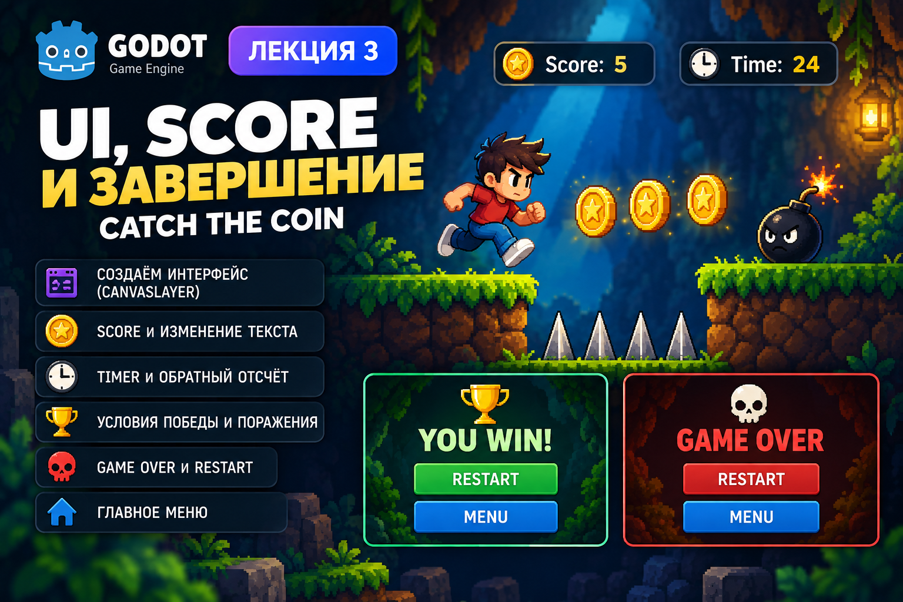

На прошлых занятиях мы создали игровой мир: Player умеет двигаться, собирать монетки, сталкиваться со стенами и реагировать на Bomb. Теперь механики уже работают, но игра пока не показывает результат игроку и не умеет определять победу или поражение.

На этой лекции мы добавим интерфейс, Score и Timer, создадим условия победы и Game Over, добавим Restart и постепенно превратим `Catch the Coin` в законченную мини-игру.

Но перед добавлением новых объектов сначала приведём структуру нашей Scene в порядок.

---

## Организуем объекты в Scene

За время разработки в `Game` появилось много объектов:

```text
Coin
Coin2
Coin3
Coin4
...

Wall
Wall2
Wall3
...

Bomb
Bomb2
Bomb3
...
```

Пока объектов было мало, такая структура не мешала. Но по мере развития игры `Scene Tree` становится всё длиннее, и найти нужный объект становится сложнее. Поэтому похожие объекты лучше объединять в отдельные группы.

### Группируем Coin

Создаём внутри `Game` новый:

```text
Node2D
```

и называем его:

```text
Coins
```

Переносим внутрь него все экземпляры `Coin`. В результате получаем:

```text
Coins
├── Coin
├── Coin2
├── Coin3
├── Coin4
└── ...
```

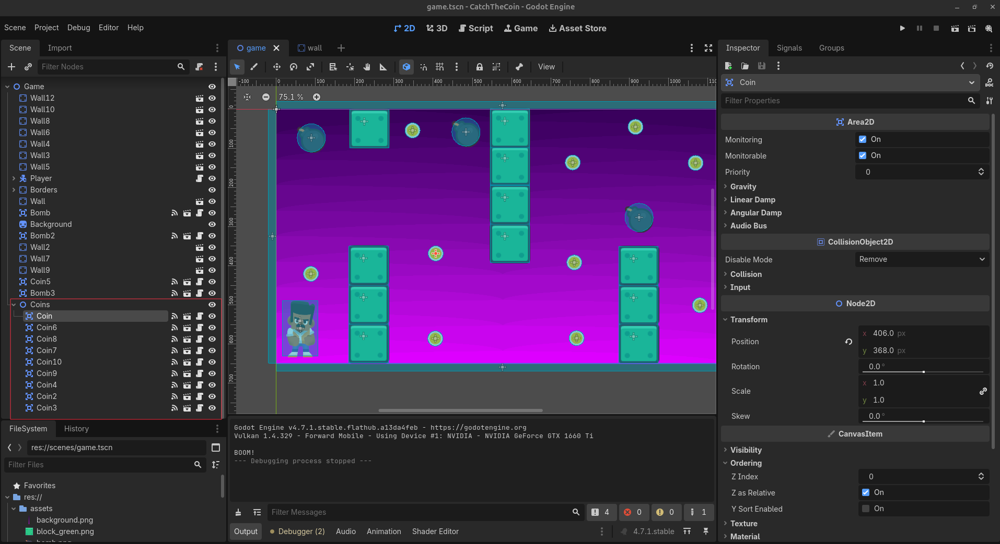

`Coins` сам по себе не добавляет новой игровой механики. Он нужен для того, чтобы удобно хранить похожие объекты внутри одной части Scene. По такому же принципу группируем стены и бомбы:

```text
Walls
├── Wall
├── Wall2
├── Wall3
└── ...
```

```text
Bombs
├── Bomb
├── Bomb2
├── Bomb3
└── ...
```

---

### Приводим Scene Tree в порядок

После группировки структура игры становится намного понятнее:

```text
Game
├── Background
├── Player
├── Borders
├── Coins
├── Walls
└── Bombs
```

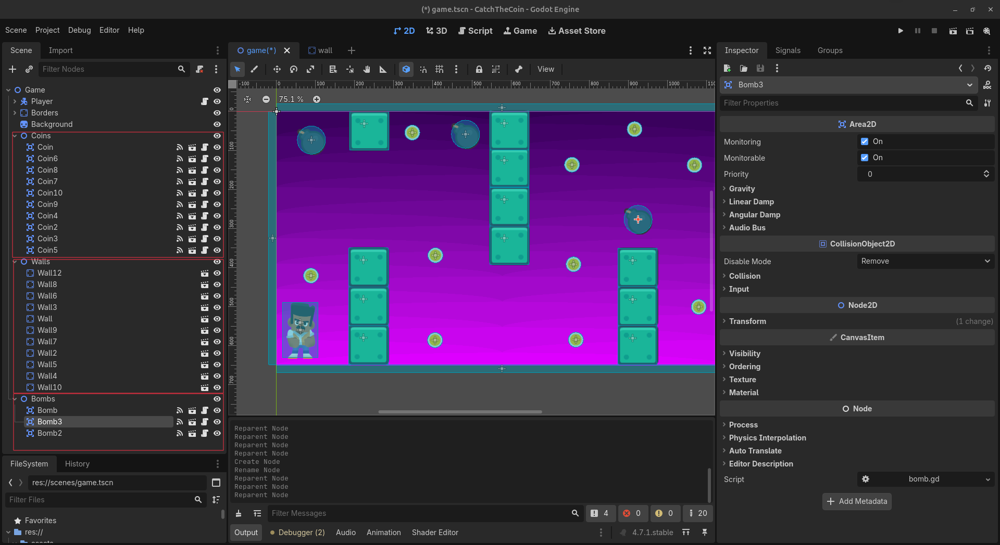

При необходимости каждую группу можно раскрыть:

```text
Game
├── Background
├── Player
├── Borders
│   ├── Top
│   ├── Bottom
│   ├── Left
│   └── Right
├── Coins
│   ├── Coin
│   ├── Coin2
│   └── ...
├── Walls
│   ├── Wall
│   ├── Wall2
│   └── ...
└── Bombs
    ├── Bomb
    ├── Bomb2
    └── ...
```

Такая организация особенно полезна в больших играх, где на одной Scene могут находиться десятки или даже сотни объектов. Вместо длинного списка:

```text
Coin
Coin2
Coin3
Wall
Wall2
Bomb
Bomb2
...
```

мы видим понятные части игрового мира:

```text
Coins
Walls
Bombs
Borders
```

Игровая логика при этом не меняется. Мы только делаем структуру проекта более удобной для дальнейшей работы. Теперь Scene готова к следующему этапу - добавлению игрового интерфейса.

---

## Создаём игровой интерфейс

Теперь добавим в игру интерфейс, который будет отображаться поверх игрового мира. На экране появятся два значения:

```text
Score: 0
Time: 30
```

Позже они станут изменяться во время игры, но сначала создадим сам интерфейс.

---

### Добавляем CanvasLayer

Открываем:

```text
game.tscn
```

Выбираем корневой Node:

```text
Game
```

и добавляем:

```text
CanvasLayer
```

Переименовываем его:

```text
UI
```

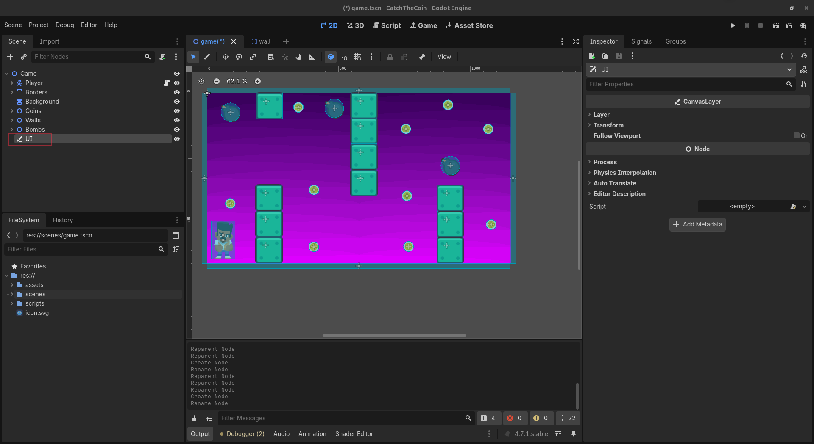

`CanvasLayer` удобно использовать для элементов интерфейса. Игровые объекты находятся внутри игрового мира:

```text
Player
Coins
Walls
Bombs
```

А элементы интерфейса будем хранить отдельно:

```text
UI
```

Структура Scene теперь выглядит примерно так:

```text
Game
├── Background
├── Player
├── Borders
├── Coins
├── Walls
├── Bombs
└── UI
```

---

### Добавляем ScoreLabel

Выбираем:

```text
UI
```

и добавляем:

```text
Label
```

Переименовываем его:

```text
ScoreLabel
```

В параметре `Text` указываем:

```text
Score: 0
```

Размещаем надпись в правой верхней части игрового окна. Чтобы текст было хорошо видно, увеличиваем размер шрифта:

```text
Theme Overrides
→ Font Sizes
→ Font Size
```

Например:

```text
28
```

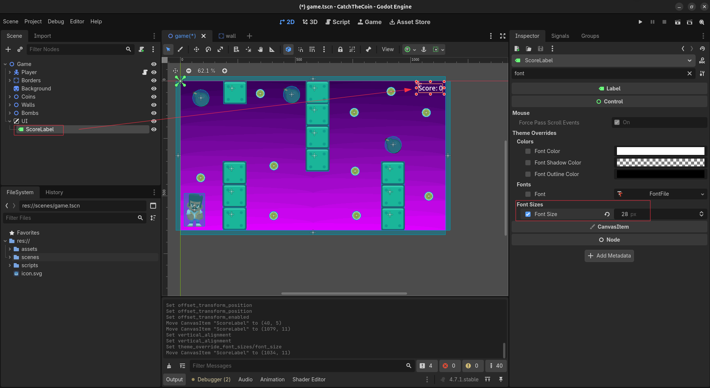

`Label` используется для отображения текста на экране.

Сейчас:

```text
Score: 0
```

является обычной надписью. Позже мы сделаем так, чтобы число изменялось после сбора каждой монетки.

---

### Добавляем TimerLabel

Дублируем `ScoreLabel` и переименовываем копию:

```text
TimerLabel
```

Меняем текст:

```text
Time: 30
```

Размещаем его под `ScoreLabel`. Получаем:

```text
UI
├── ScoreLabel
└── TimerLabel
```

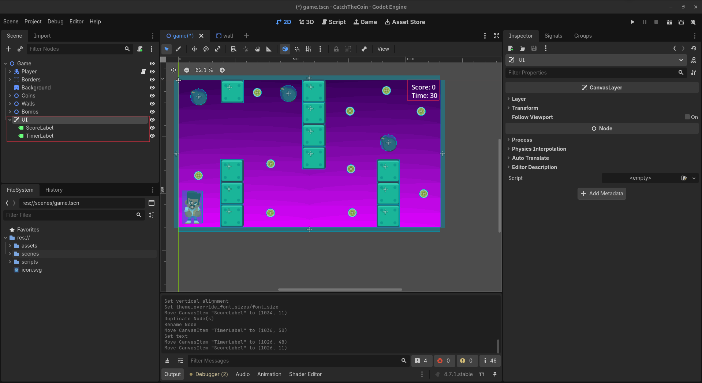

Теперь интерфейс находится в одном месте:

```text
Score: 0
Time: 30
```

Так игрок сразу сможет видеть текущий результат и оставшееся время.

---

### Проверяем интерфейс

Сохраняем Scene:

```text
Ctrl + S
```

и запускаем игру:

```text
F6
```

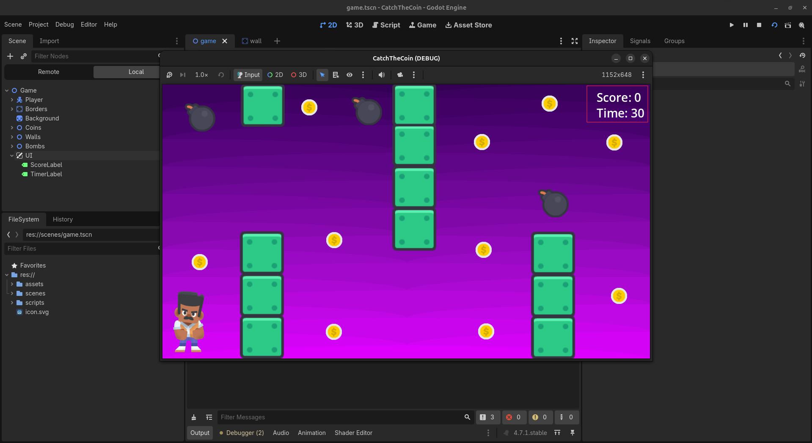

На экране должны отображаться:

```text
Score: 0
Time: 30
```

При этом `Player`, `Coin`, `Wall` и `Bomb` продолжают работать как раньше. Пока значения не изменяются - это просто элементы интерфейса. На следующем шаге сделаем первую настоящую связь между игровой механикой и `UI`:

```text
Player собирает Coin
        ↓
Score увеличивается
        ↓
ScoreLabel обновляется
```

---

## Добавляем Score

Теперь интерфейс уже есть, но значение:

```text
Score: 0
```

пока никак не связано с игровым процессом. Сделаем так, чтобы после сбора каждой монетки Score увеличивался на `1`. Игровая логика будет такой:

```text
Player собирает Coin
        ↓
Score увеличивается
        ↓
ScoreLabel обновляется
        ↓
Coin исчезает
```

---

### Добавляем переменную Score

Открываем:

```text
game.tscn
```

и подключаем к корневому Node `Game` новый скрипт:

```text
res://scripts/game.gd
```

В начале скрипта создаём переменную:

```gdscript
extends Node2D


var score = 0
```

Переменная:

```text
score
```

будет хранить количество собранных монет. В начале игры:

```text
score = 0
```

После первой монетки:

```text
score = 1
```

После второй:

```text
score = 2
```

и так далее.

---

### Создаём функцию увеличения Score

Теперь добавляем функцию:

```gdscript
func add_score() -> void:
	score += 1
	$UI/ScoreLabel.text = "Score: " + str(score)
```

Получаем:

```gdscript
extends Node2D


var score = 0


func add_score() -> void:
	score += 1
	$UI/ScoreLabel.text = "Score: " + str(score)
```

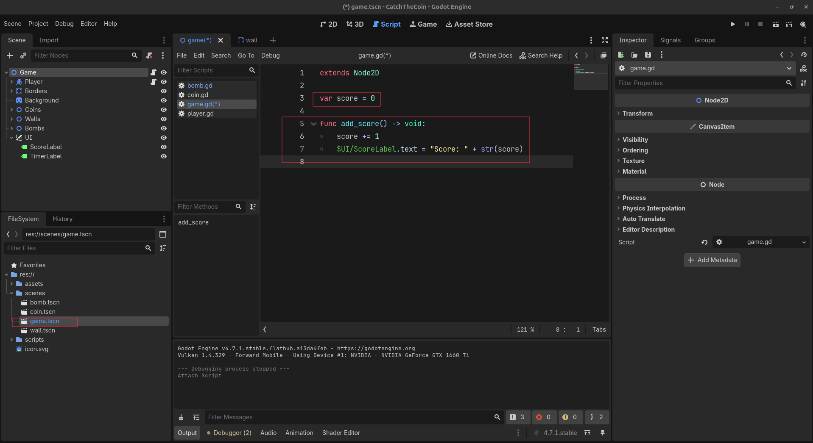

Строка:

```gdscript
score += 1
```

увеличивает текущее значение Score на `1`. Например:

```text
0 → 1 → 2 → 3 → 4
```

После этого нужно показать новое значение на экране.

Для этого обращаемся к:

```text
UI
└── ScoreLabel
```

через:

```gdscript
$UI/ScoreLabel
```

и изменяем его текст:

```gdscript
$UI/ScoreLabel.text = "Score: " + str(score)
```

`score` является числом, поэтому `str(score)` превращает его в текст, который можно добавить к:

```text
Score:
```

Например:

```text
score = 3
```

на экране превращается в:

```text
Score: 3
```

---

### Сообщаем Game о сборе Coin

Теперь нужно связать монетку с новой функцией. Открываем:

```text
scripts/coin.gd
```

Раньше Coin просто исчезала после касания Player:

```gdscript
func _on_body_entered(body: Node2D) -> void:
	queue_free()
```

Теперь перед удалением Coin вызываем:

```gdscript
get_tree().current_scene.add_score()
```

Код становится таким:

```gdscript
extends Area2D


func _on_body_entered(body: Node2D) -> void:
	get_tree().current_scene.add_score()
	queue_free()
```

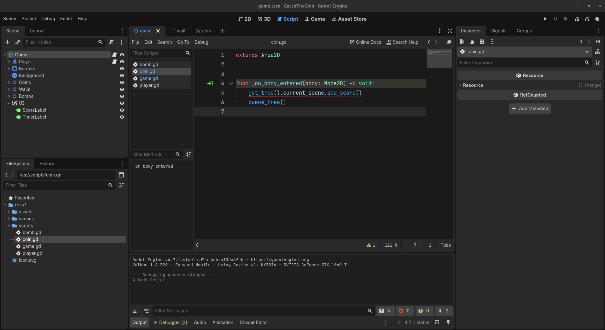

Здесь:

```gdscript
get_tree().current_scene
```

обращается к текущей запущенной Scene. В нашем случае это:

```text
Game
```

После этого вызывается функция:

```gdscript
add_score()
```

То есть Coin сообщает Game:

```text
Меня собрали - увеличь Score.
```

Только после этого выполняется:

```gdscript
queue_free()
```

и монетка исчезает.

---

### Что происходит при сборе Coin

Теперь весь процесс выглядит так:

```text
Player касается Coin
        ↓
body_entered
        ↓
Coin вызывает add_score()
        ↓
score += 1
        ↓
ScoreLabel получает новый текст
        ↓
Coin удаляется
```

Важно, что все наши монетки являются экземплярами одной Scene:

```text
coin.tscn
```

Поэтому изменение `coin.gd` работает сразу для всех Coin на уровне.

---

### Проверяем Score

Сохраняем изменения:

```text
Ctrl + S
```

и запускаем игру:

```text
F6
```

В начале:

```text
Score: 0
```

Собираем первую монетку:

```text
Score: 1
```

Вторую:

```text
Score: 2
```

Третью:

```text
Score: 3
```

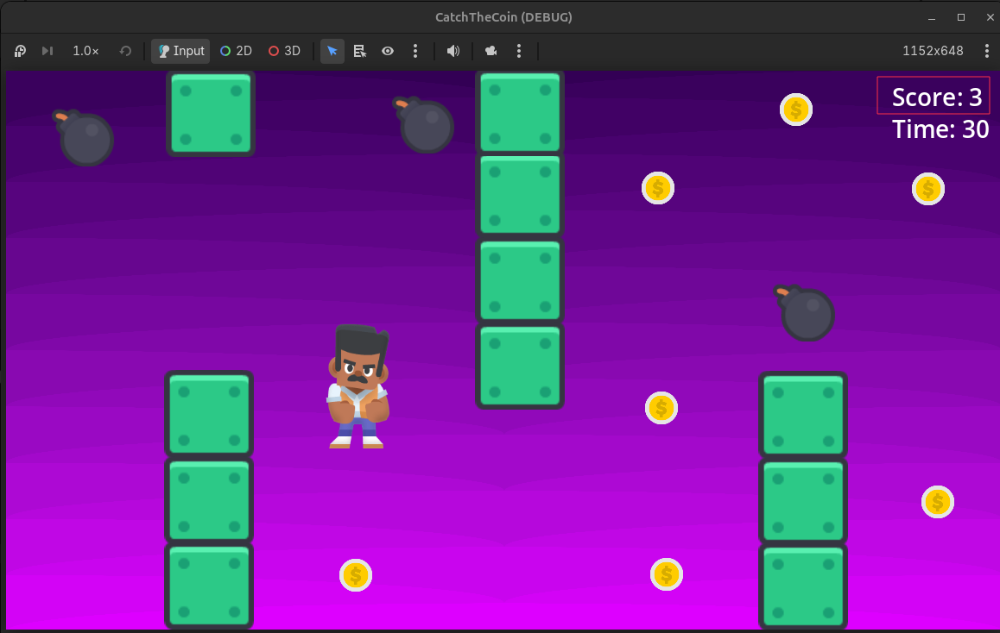

Теперь **Score** действительно связан с игровым процессом. Мы получили первую механику, в которой интерфейс автоматически меняется во время игры:

```text
игровое событие
↓
изменяется переменная
↓
обновляется UI
```

Это один из основных принципов работы игрового интерфейса.

---

## Добавляем Timer и обратный отсчёт

Сейчас в интерфейсе уже отображается:

```text
Time: 30
```

Но это пока обычный текст.Сделаем настоящий обратный отсчёт:

```text
Time: 30
↓
Time: 29
↓
...
↓
Time: 0
```

Для этого используем специальный Node:

```text
Timer
```

---

### Добавляем GameTimer

Открываем:

```text
game.tscn
```

Выбираем корневой:

```text
Game
```

и добавляем:

```text
Timer
```

Переименовываем его:

```text
GameTimer
```

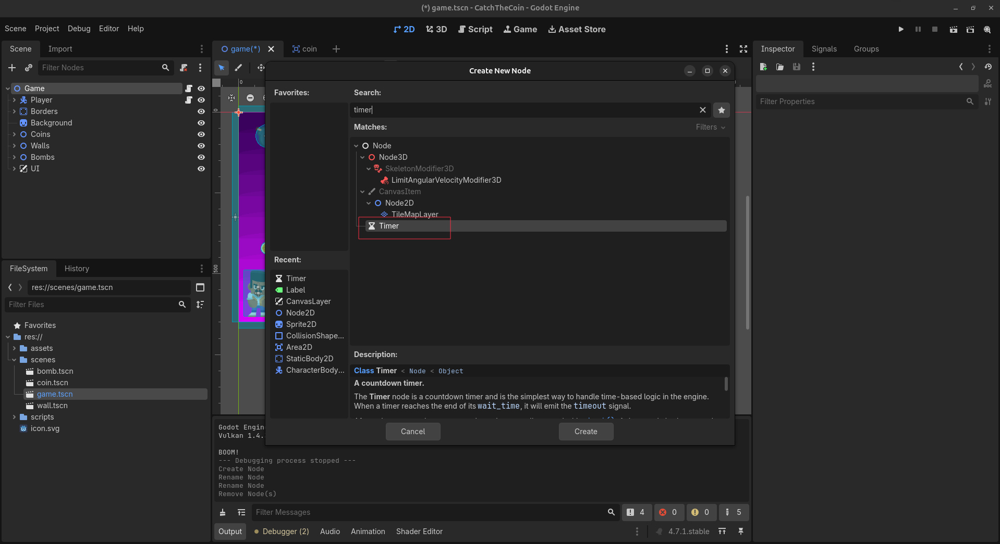

Структура Scene теперь выглядит примерно так:

```text
Game
├── Player
├── Borders
├── Background
├── Coins
├── Walls
├── Bombs
├── UI
│   ├── ScoreLabel
│   └── TimerLabel
└── GameTimer
```

`Timer` позволяет запускать событие через определённый промежуток времени. В нашем случае он будет срабатывать:

```text
каждую 1 секунду
```

---

### Настраиваем GameTimer

Выбираем:

```text
GameTimer
```

и устанавливаем:

```text
Wait Time = 1.0
```

Это означает, что Timer будет срабатывать каждые:

```text
1 секунду
```

Параметр:

```text
One Shot
```

оставляем выключенным. Если его включить, Timer сработает только один раз. Нам нужен постоянный отсчёт:

```text
30
↓
29
↓
28
↓
27
```

Поэтому Timer должен продолжать работать. Также включаем:

```text
Autostart = On
```

Теперь GameTimer автоматически запускается вместе с игрой.

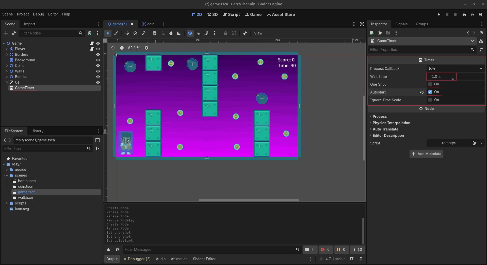

---

### Добавляем переменную времени

Открываем:

```text
scripts/game.gd
```

У нас уже есть переменная Score:

```gdscript
var score = 0
```

Добавляем ещё одну:

```gdscript
var time_left = 30
```

Получаем:

```gdscript
extends Node2D


var score = 0
var time_left = 30
```

`time_left` будет хранить количество оставшихся секунд.

В начале игры:

```text
time_left = 30
```

Через одну секунду:

```text
time_left = 29
```

Затем:

```text
28
27
26
...
```

---

### Подключаем сигнал timeout

У `Timer` есть сигнал:

```text
timeout()
```

Он срабатывает каждый раз, когда заканчивается установленный промежуток времени.

В нашем случае:

```text
Wait Time = 1
```

поэтому:

```text
1 секунда
↓
timeout()
↓
ещё 1 секунда
↓
timeout()
↓
ещё 1 секунда
↓
timeout()
```

Выбираем:

```text
GameTimer
```

открываем:

```text
Signals
```

и дважды нажимаем:

```text
timeout()
```

Сигнал подключаем к:

```text
Game
```

потому что именно к `Game` подключён наш:

```text
game.gd
```

В качестве функции используем:

```text
_on_game_timer_timeout
```

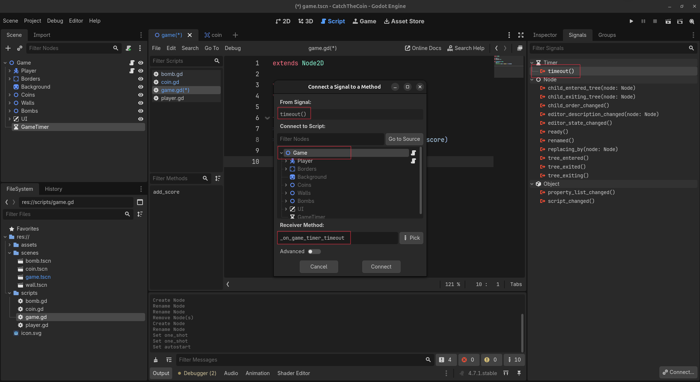

Нажимаем:

```text
Connect
```

После этого Godot создаст новую функцию внутри `game.gd`.

---

### Уменьшаем время

В созданной функции пишем:

```gdscript
func _on_game_timer_timeout() -> void:
	time_left -= 1
	$UI/TimerLabel.text = "Time: " + str(time_left)
```

Теперь каждый сигнал:

```text
timeout()
```

уменьшает `time_left` на `1`.

Строка:

```gdscript
time_left -= 1
```

работает так:

```text
30 → 29
29 → 28
28 → 27
```

После этого обновляем текст:

```gdscript
$UI/TimerLabel.text = "Time: " + str(time_left)
```

Поэтому изменение переменной сразу становится видно в интерфейсе.

---

### Останавливаем Timer на нуле

Если ничего больше не сделать, отсчёт продолжится:

```text
Time: 0
Time: -1
Time: -2
Time: -3
```

Нам это не нужно. Добавляем условие:

```gdscript
if time_left <= 0:
	$GameTimer.stop()
```

Готовая функция:

```gdscript
func _on_game_timer_timeout() -> void:
	time_left -= 1
	$UI/TimerLabel.text = "Time: " + str(time_left)

	if time_left <= 0:
		$GameTimer.stop()
```

Вместе с системой Score наш `game.gd` теперь выглядит примерно так:

```gdscript
extends Node2D


var score = 0
var time_left = 30


func add_score() -> void:
	score += 1
	$UI/ScoreLabel.text = "Score: " + str(score)


func _on_game_timer_timeout() -> void:
	time_left -= 1
	$UI/TimerLabel.text = "Time: " + str(time_left)

	if time_left <= 0:
		$GameTimer.stop()
```

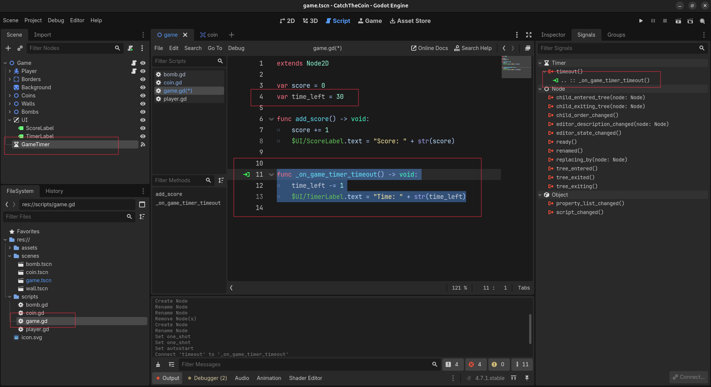

Теперь логика Timer выглядит так:

```text
GameTimer
↓
проходит 1 секунда
↓
timeout()
↓
time_left -= 1
↓
TimerLabel обновляется
↓
если time_left = 0
↓
GameTimer останавливается
```

---

### Проверяем обратный отсчёт

Сохраняем:

```text
Ctrl + S
```

и запускаем игру:

```text
F6
```

В начале:

```text
Score: 0
Time: 30
```

Через несколько секунд:

```text
Score: 0
Time: 26
```

При этом система Score продолжает работать независимо.

Например:

```text
Score: 2
Time: 24
```

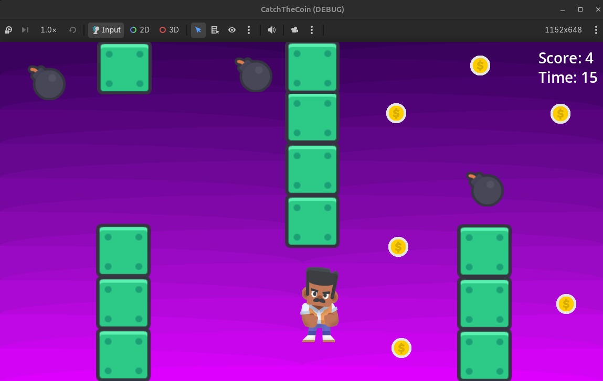

Теперь одновременно работают две игровые системы:

```text
Coin
↓
изменяет Score

GameTimer
↓
изменяет Time
```

Интерфейс постоянно показывает актуальное состояние игры. Пока при достижении:

```text
Time: 0
```

Timer просто останавливается. Следующая задача:

```text
Time: 0
↓
игрок не успел
↓
GAME OVER
```

То есть теперь мы можем добавить настоящее условие поражения.

---

## Добавляем Game Over

Теперь Timer умеет отсчитывать время до нуля:

```text
Time: 30
↓
Time: 29
↓
Time: 28
↓
...
↓
Time: 0
```

Но пока после окончания времени ничего не происходит. Player всё ещё может продолжать двигаться по уровню. Добавим настоящее условие поражения:

```text
Time: 0
↓
GAME OVER
↓
Timer останавливается
↓
Player больше не может двигаться
```

---

### Создаём GameOverPanel

Выбираем:

```text
UI
```

и добавляем:

```text
Panel
```

Переименовываем:

```text
GameOverPanel
```

Размещаем панель примерно по центру игрового окна.

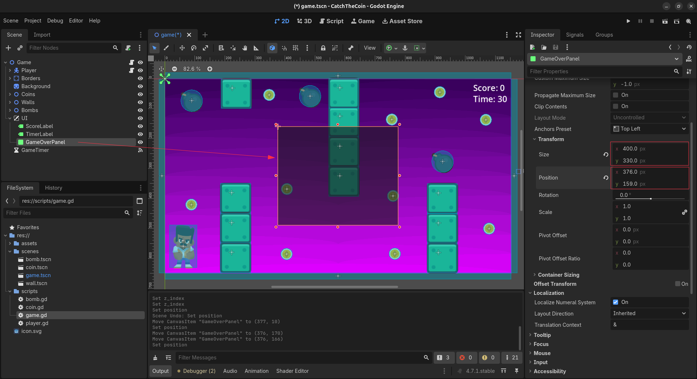

Теперь внутрь `GameOverPanel` добавляем:

```text
Label
```

Переименовываем его:

```text
GameOverLabel
```

В `Text` пишем:

```text
GAME OVER
```

Увеличиваем размер текста и располагаем его по центру панели. Получаем:

```text
UI
├── ScoreLabel
├── TimerLabel
└── GameOverPanel
    └── GameOverLabel
```

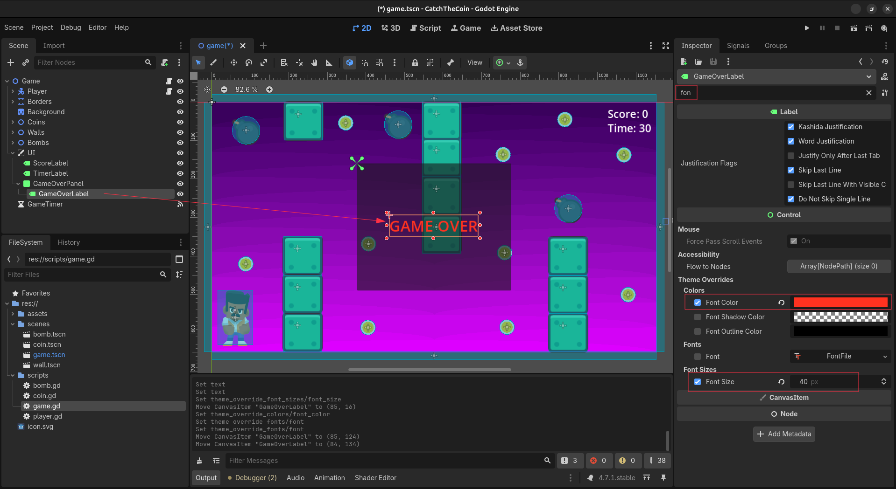

---

### Скрываем Game Over в начале игры

При запуске игры надпись:

```text
GAME OVER
```

не должна быть видна. Выбираем:

```text
GameOverPanel
```

и в `Inspector` выключаем:

```text
Visibility
→ Visible
```

Теперь панель остаётся внутри Scene, но в начале игры она скрыта. Позже мы сможем показать её с помощью кода.

---

### Создаём функцию game_over()

Открываем:

```text
scripts/game.gd
```

и создаём новую функцию:

```gdscript
func game_over() -> void:
	$GameTimer.stop()
	$UI/GameOverPanel.show()
```

Теперь вызов:

```gdscript
game_over()
```

выполняет сразу несколько действий:

```text
game_over()
↓
GameTimer останавливается
↓
GameOverPanel появляется
```

---

### Вызываем Game Over при окончании времени

Сейчас функция Timer выглядит примерно так:

```gdscript
func _on_game_timer_timeout() -> void:
	time_left -= 1
	$UI/TimerLabel.text = "Time: " + str(time_left)

	if time_left <= 0:
		$GameTimer.stop()
```

Меняем последнюю часть:

```gdscript
if time_left <= 0:
	game_over()
```

Получаем:

```gdscript
func _on_game_timer_timeout() -> void:
	time_left -= 1
	$UI/TimerLabel.text = "Time: " + str(time_left)

	if time_left <= 0:
		game_over()
```

Теперь логика игры выглядит так:

```text
GameTimer
↓
Time уменьшается
↓
Time становится 0
↓
game_over()
↓
GAME OVER
```

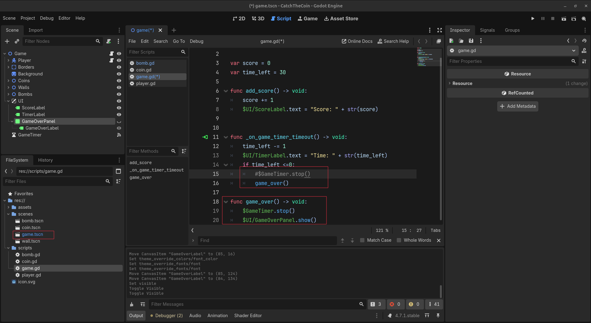

---

### Останавливаем Player

После появления `GAME OVER` игра должна действительно закончиться. Сейчас Player всё ещё может двигаться, потому что его:

```gdscript
_physics_process()
```

продолжает выполняться. Поэтому добавляем в `game_over()` ещё одну строку:

```gdscript
$Player.set_physics_process(false)
```

Функция становится такой:

```gdscript
func game_over() -> void:
	$GameTimer.stop()
	$Player.set_physics_process(false)
	$UI/GameOverPanel.show()
```

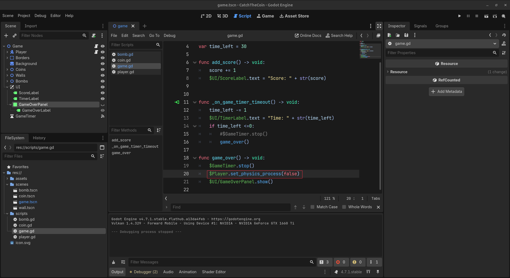

Строка:

```gdscript
$Player.set_physics_process(false)
```

отключает выполнение физического процесса Player. А именно там у нас находится движение:

```gdscript
func _physics_process(_delta):
```

Поэтому после Game Over Player перестаёт реагировать на управление. Теперь функция поражения выполняет сразу три действия:

```text
game_over()
↓
останавливает GameTimer
↓
отключает движение Player
↓
показывает GameOverPanel
```

---

### Проверяем Game Over

Для быстрой проверки можно временно уменьшить время:

```gdscript
var time_left = 5
```

Запускаем:

```text
F6
```

Получаем:

```text
Time: 5
↓
Time: 4
↓
Time: 3
↓
Time: 2
↓
Time: 1
↓
Time: 0
↓
GAME OVER
```

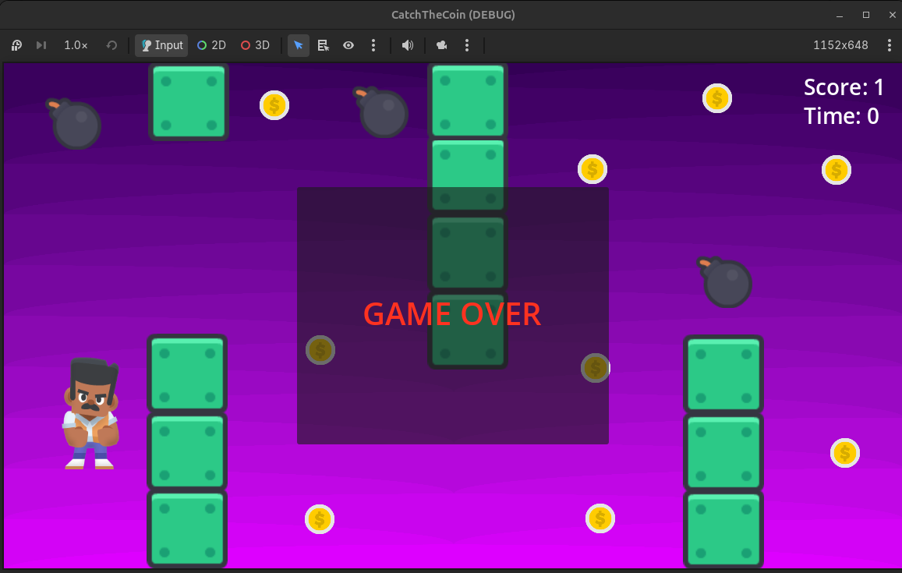

После появления `GAME OVER` пробуем нажимать клавиши движения. Player больше не должен двигаться. После проверки возвращаем обычное значение:

```gdscript
var time_left = 30
```

---

Теперь в игре появилось первое полноценное условие поражения:

```text
игрок не успел собрать монетки
↓
время закончилось
↓
game_over()
↓
игра останавливается
↓
GAME OVER
```

При этом вся логика поражения находится в одной функции:

```gdscript
game_over()
```

Это пригодится дальше, потому что вызвать поражение можно будет не только по окончании времени. Следующая задача:

```text
Player касается Bomb
↓
game_over()
```

Так у нашей игры появится второе условие поражения.

---

## Game Over при касании Bomb

Теперь у нашей игры уже есть первое условие поражения:

```text
Time = 0
↓
GAME OVER
```

Добавим второе условие. Если Player касается Bomb, игра должна закончиться сразу, даже если время ещё не закончилось. Получаем:

```text
Player касается Bomb
        ↓
body_entered
        ↓
game_over()
        ↓
Timer останавливается
        ↓
Player перестаёт двигаться
        ↓
GAME OVER
```

---

### Изменяем поведение Bomb

Открываем:

```text
scripts/bomb.gd
```

Раньше Bomb только выводила сообщение:

```gdscript
func _on_body_entered(body: Node2D) -> void:
	print("BOOM!")
```

Теперь вместо `print()` вызываем уже готовую функцию:

```gdscript
game_over()
```

Полный код:

```gdscript
extends Area2D


func _on_body_entered(body: Node2D) -> void:
	get_tree().current_scene.game_over()
```

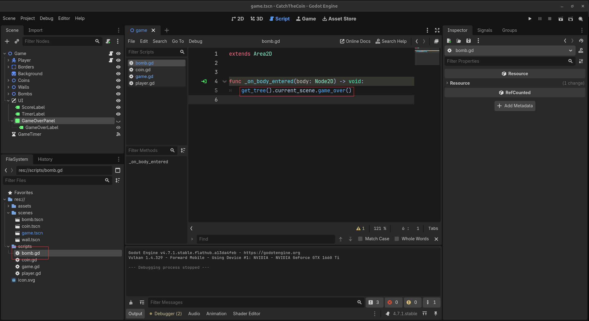

Строка:

```gdscript
get_tree().current_scene
```

обращается к текущей Scene:

```text
Game
```

А затем вызывается функция:

```gdscript
game_over()
```

---

### Почему мы используем уже готовую функцию

В `game.gd` у нас уже есть:

```gdscript
func game_over() -> void:
	$GameTimer.stop()
	$Player.set_physics_process(false)
	$UI/GameOverPanel.show()
```

Поэтому Bomb не нужно отдельно:

```text
останавливать Timer
отключать Player
показывать GAME OVER
```

Она просто сообщает Game:

```text
Player коснулся Bomb
↓
запусти game_over()
```

Вся логика поражения остаётся в одном месте. Теперь одну функцию можно использовать для разных игровых ситуаций:

```text
Time = 0
        ↓
    game_over()

Player касается Bomb
        ↓
    game_over()
```

---

### Проверяем Bomb

Сохраняем изменения:

```text
Ctrl + S
```

и запускаем игру:

```text
F6
```

Не ждём окончания времени. Подводим Player к Bomb. Как только Player касается её:

```text
GAME OVER
```

должен появиться сразу.

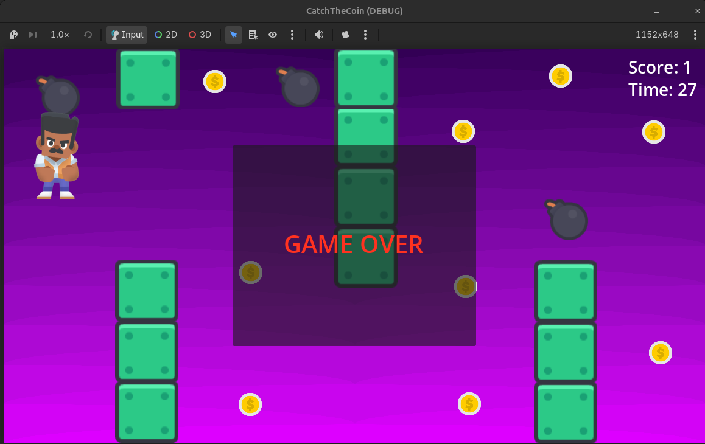

Проверяем, что после столкновения:

- `GameTimer` остановился;
- время больше не уменьшается;
- Player больше не реагирует на управление;
- `GameOverPanel` появился.

Если, например, столкновение произошло при:

```text
Score: 2
Time: 24
```

игра должна остановиться именно на этих значениях.

---

Теперь у `Catch the Coin` есть два разных условия поражения:

```text
УСЛОВИЕ 1

Time = 0
↓
GAME OVER
```

```text
УСЛОВИЕ 2

Player касается Bomb
↓
GAME OVER
```

При этом оба условия используют одну и ту же функцию:

```gdscript
game_over()
```

Следующая задача будет противоположной:

```text
Player собирает все Coin
↓
YOU WIN
```

То есть теперь добавим игре настоящее условие победы.

---

## Добавляем условие победы

Теперь у игры уже есть два условия поражения:

```text
Time = 0
↓
GAME OVER
```

и:

```text
Player касается Bomb
↓
GAME OVER
```

Но у игры пока нет победы. Сделаем так, чтобы после сбора всех монеток появлялось:

```text
YOU WIN!
```

Логика будет такой:

```text
Player собирает Coin
        ↓
Score увеличивается
        ↓
проверяем количество собранных Coin
        ↓
если собраны все
        ↓
YOU WIN!
```

---

### Создаём WinPanel

Выбираем:

```text
UI
```

и добавляем:

```text
Panel
```

Переименовываем:

```text
WinPanel
```

Размещаем панель примерно по центру игрового окна. Внутрь добавляем:

```text
Label
```

Переименовываем:

```text
WinLabel
```

В `Text` пишем:

```text
YOU WIN!
```

Увеличиваем размер текста и располагаем его по центру панели.

Получаем:

```text
UI
├── ScoreLabel
├── TimerLabel
├── GameOverPanel
│   └── GameOverLabel
└── WinPanel
    └── WinLabel
```

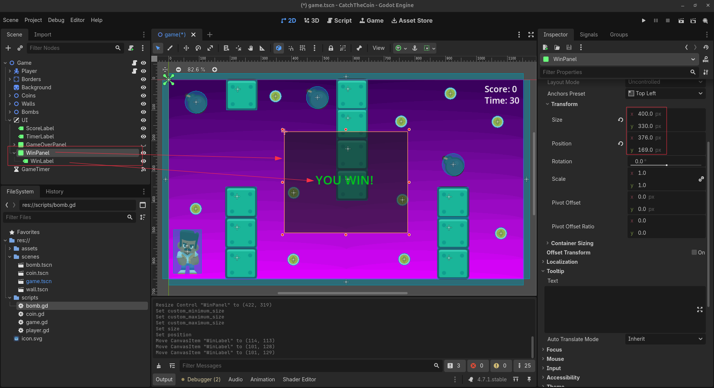

В начале игры WinPanel не должен быть виден. Выбираем:

```text
WinPanel
```

и выключаем:

```text
Visibility
→ Visible
```

Теперь панель существует в Scene, но появится только после победы.

---

### Считаем количество Coin

Чтобы определить момент победы, игре нужно знать:

```text
сколько Coin находится на уровне
```

Открываем:

```text
scripts/game.gd
```

и добавляем новую переменную:

```gdscript
var total_coins = 0
```

Теперь у нас есть:

```gdscript
var score = 0
var time_left = 30
var total_coins = 0
```

После этого создаём:

```gdscript
func _ready() -> void:
	total_coins = $Coins.get_child_count()
```

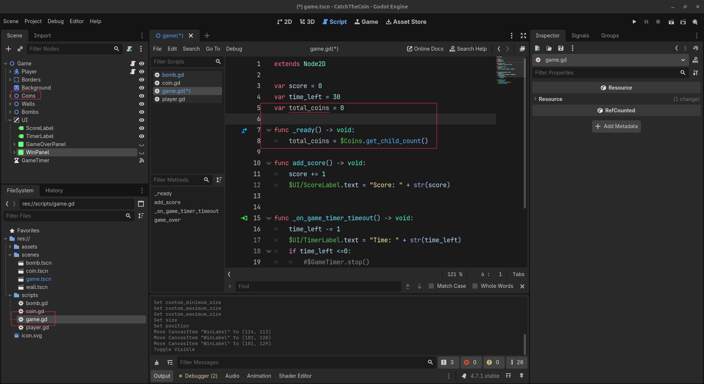

Функция:

```gdscript
_ready()
```

запускается, когда Scene готова к работе. Строка:

```gdscript
$Coins.get_child_count()
```

считает количество объектов внутри:

```text
Coins
```

Например:

```text
Coins
├── Coin
├── Coin2
├── Coin3
├── Coin4
└── Coin5
```

Тогда:

```text
total_coins = 5
```

Теперь Game знает, сколько монет нужно собрать для победы.

---

### Проверяем Score после каждой монетки

Раньше функция `add_score()` только увеличивала Score:

```gdscript
func add_score() -> void:
	score += 1
	$UI/ScoreLabel.text = "Score: " + str(score)
```

Теперь после увеличения Score добавляем проверку:

```gdscript
if score >= total_coins:
	win_game()
```

Получаем:

```gdscript
func add_score() -> void:
	score += 1
	$UI/ScoreLabel.text = "Score: " + str(score)

	if score >= total_coins:
		win_game()
```

Логика:

```text
Coin собрана
↓
score += 1
↓
проверяем:
score >= total_coins ?
```

Если ещё не все Coin собраны:

```text
игра продолжается
```

Если собрана последняя:

```text
win_game()
```

---

### Создаём функцию win_game()

Добавляем новую функцию:

```gdscript
func win_game() -> void:
	$GameTimer.stop()
	$Player.set_physics_process(false)
	$UI/WinPanel.show()
```

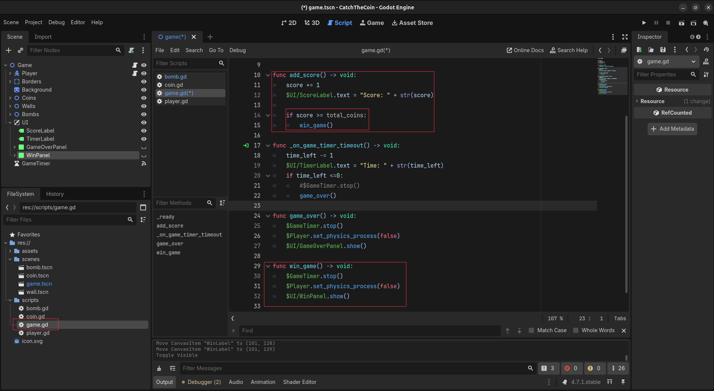

Она очень похожа на уже знакомую:

```gdscript
game_over()
```

При победе происходит сразу несколько действий:

```text
win_game()
↓
GameTimer останавливается
↓
Player перестаёт двигаться
↓
WinPanel появляется
```

Теперь у нас есть две отдельные функции завершения игры:

```gdscript
game_over()
```

для поражения и:

```gdscript
win_game()
```

для победы.

---

### Проверяем условие победы

Сохраняем:

```text
Ctrl + S
```

и запускаем:

```text
F6
```

Собираем монетки одну за другой. Например, если на уровне находится `5` Coin:

```text
Score: 1
↓
Score: 2
↓
Score: 3
↓
Score: 4
```

Игра продолжается. После последней:

```text
Score: 5
↓
YOU WIN!
```

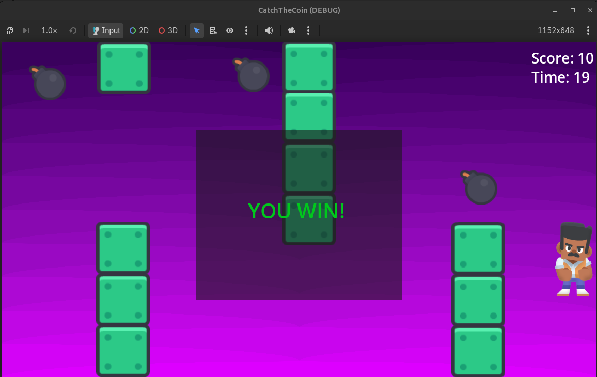

После победы проверяем, что:

- все Coin собраны;
- появился `YOU WIN!`;
- Timer остановился;
- Player больше не двигается;
- `GAME OVER` не появился.

---

Теперь у нашей игры появились полноценные условия завершения:

```text
Time = 0
↓
GAME OVER
```

```text
Player касается Bomb
↓
GAME OVER
```

```text
Все Coin собраны
↓
YOU WIN!
```

Теперь `Catch the Coin` уже умеет определять, когда игрок проиграл и когда победил. Следующий шаг - добавить возможность начать игру заново:

```text
GAME OVER / YOU WIN
↓
Restart
↓
игра начинается сначала
```

---

## Добавляем Restart

Теперь игра умеет завершаться двумя способами:

```text
GAME OVER
```

или:

```text
YOU WIN!
```

Но после этого игрок пока не может начать заново. Добавим кнопку:

```text
RESTART
```

которая полностью перезапустит текущую Scene. Логика будет такой:

```text
GAME OVER / YOU WIN!
        ↓
      RESTART
        ↓
Game загружается заново
        ↓
Score = 0
Time = 30
Player снова двигается
Coin снова появляются
```

---

### Добавляем RestartButton в GameOverPanel

Выбираем:

```text
GameOverPanel
```

и добавляем:

```text
Button
```

Переименовываем:

```text
RestartButton
```

В параметре `Text` пишем:

```text
RESTART
```

Размещаем кнопку под надписью:

```text
GAME OVER
```

Получаем:

```text
GameOverPanel
├── GameOverLabel
└── RestartButton
```

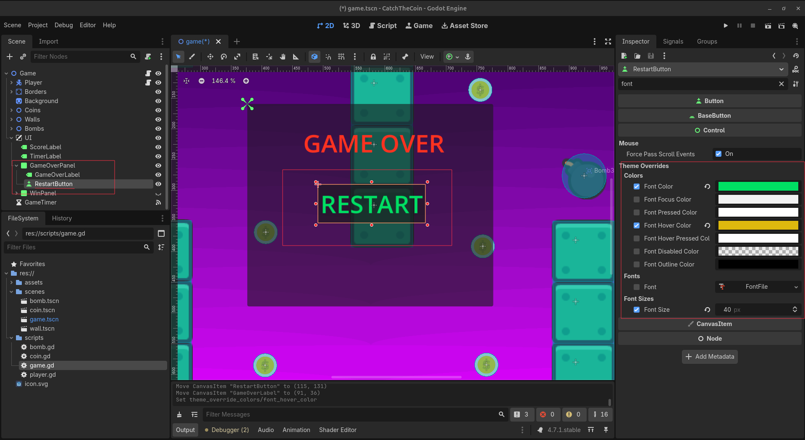

Теперь после поражения игрок будет видеть не только результат, но и кнопку для новой попытки.

---

### Подключаем сигнал pressed

У `Button` есть сигнал:

```text
pressed()
```

Он срабатывает в момент нажатия на кнопку. Выбираем:

```text
RestartButton
```

открываем:

```text
Signals
```

находим:

```text
pressed()
```

и подключаем его к:

```text
Game
```

Используем функцию:

```text
_on_restart_button_pressed
```

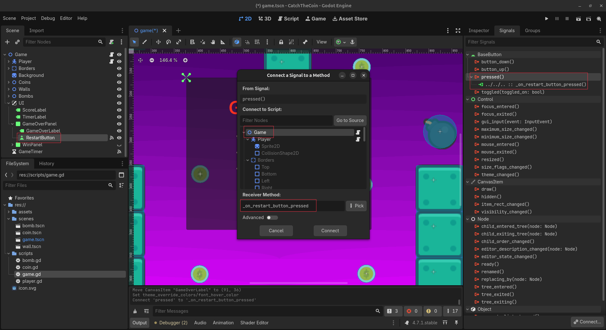

После подключения Godot создаст новую функцию в:

```text
game.gd
```

---

### Перезапускаем текущую Scene

В созданной функции вместо:

```gdscript
pass
```

пишем:

```gdscript
get_tree().reload_current_scene()
```

Получаем:

```gdscript
func _on_restart_button_pressed() -> void:
	get_tree().reload_current_scene()
```

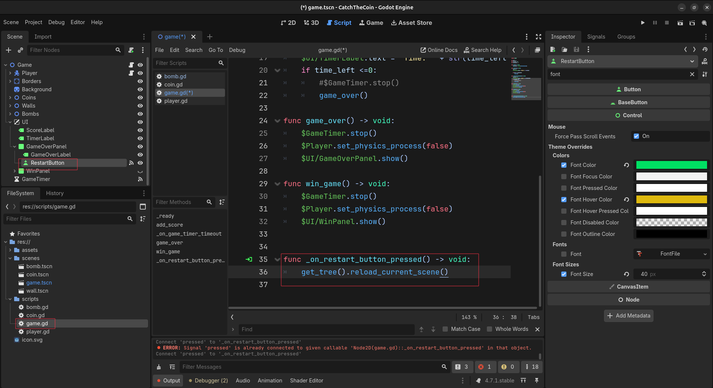

Команда:

```gdscript
get_tree().reload_current_scene()
```

полностью перезапускает текущую Scene. В нашем случае заново загружается:

```text
game.tscn
```

Поэтому после Restart:

```text
Score
→ снова 0

Time
→ снова 30

Player
→ снова может двигаться

Coin
→ снова появляются

GameOverPanel
→ снова скрыт
```

Игра возвращается в первоначальное состояние.

---

### Добавляем RestartButton в WinPanel

После победы игрок тоже должен иметь возможность начать заново.

Выбираем:

```text
WinPanel
```

и добавляем ещё одну:

```text
Button
```

Называем её:

```text
RestartButton
```

Это возможно, потому что кнопки находятся внутри разных родителей:

```text
GameOverPanel
└── RestartButton

WinPanel
└── RestartButton
```

Текст второй кнопки:

```text
RESTART
```

Размещаем её под:

```text
YOU WIN!
```

В результате структура UI выглядит так:

```text
UI
├── ScoreLabel
├── TimerLabel
├── GameOverPanel
│   ├── GameOverLabel
│   └── RestartButton
└── WinPanel
    ├── WinLabel
    └── RestartButton
```

Для второй кнопки также подключаем:

```text
pressed()
```

к `Game`.

Обе кнопки выполняют одно и то же действие:

```text
RESTART
↓
перезапустить game.tscn
```

---

### Проверяем Restart

Сначала проверяем поражение. Запускаем игру:

```text
F6
```

Касаемся Bomb или ждём окончания времени. Появляется:

```text
GAME OVER
RESTART
```

Нажимаем:

```text
RESTART
```

Игра должна полностью начаться сначала.

Проверяем:

- `Score` снова равен `0`;
- `Time` снова равен `30`;
- Player снова двигается;
- все Coin снова появились;
- стены и Bomb снова работают.

Теперь проверяем победу. Собираем все Coin:

```text
YOU WIN!
RESTART
```

Нажимаем кнопку. Результат должен быть таким же - Scene загружается заново.

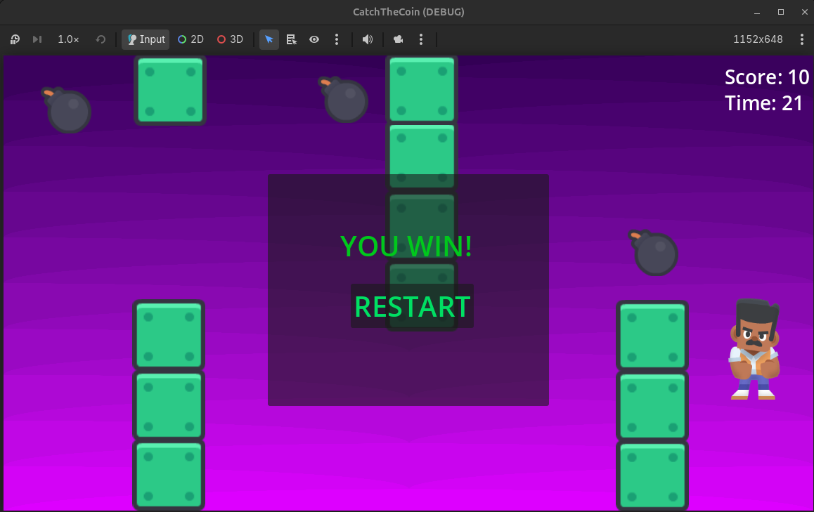

---

Теперь игроку больше не нужно вручную закрывать и запускать игру после победы или поражения. Получается полноценный игровой цикл:

```text
START
↓
играем
↓
победа или поражение
↓
RESTART
↓
START
```

`Catch the Coin` уже можно пройти несколько раз подряд, не перезапуская проект вручную.

---

## Добавляем главное меню

Сейчас игра запускается сразу с уровня `Catch the Coin`. Добавим отдельное главное меню, чтобы игрок сначала видел стартовый экран и сам решал, когда начать игру. Логика будет такой:

```text
Запуск проекта
↓
Main Menu
↓
PLAY
↓
game.tscn
```

Также добавим кнопку:

```text
EXIT
```

которая закрывает игру.

---

### Создаём отдельную Scene меню

Создаём новую Scene:

```text
New Scene
→ User Interface
```

Корневой Node переименовываем:

```text
MainMenu
```

Сохраняем Scene:

```text
res://scenes/main_menu.tscn
```

Размер меню делаем таким же, как размер игрового окна:

```text
1152 × 648
```

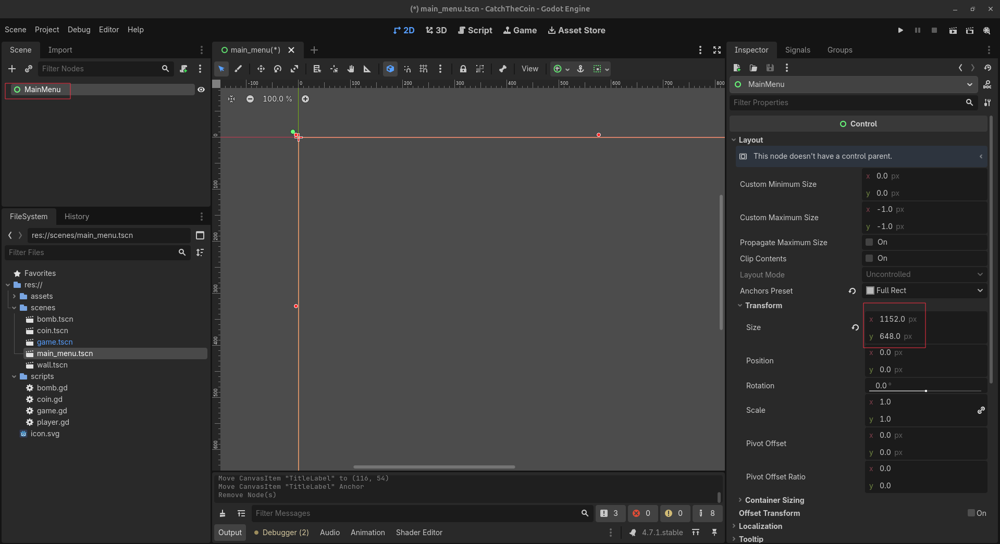

Теперь `MainMenu` занимает всё игровое пространство.

---

### Добавляем Background

Внутрь `MainMenu` добавляем:

```text
TextureRect
```

Переименовываем:

```text
Background
```

В `Texture` устанавливаем изображение фона. Растягиваем Background на всю область меню.

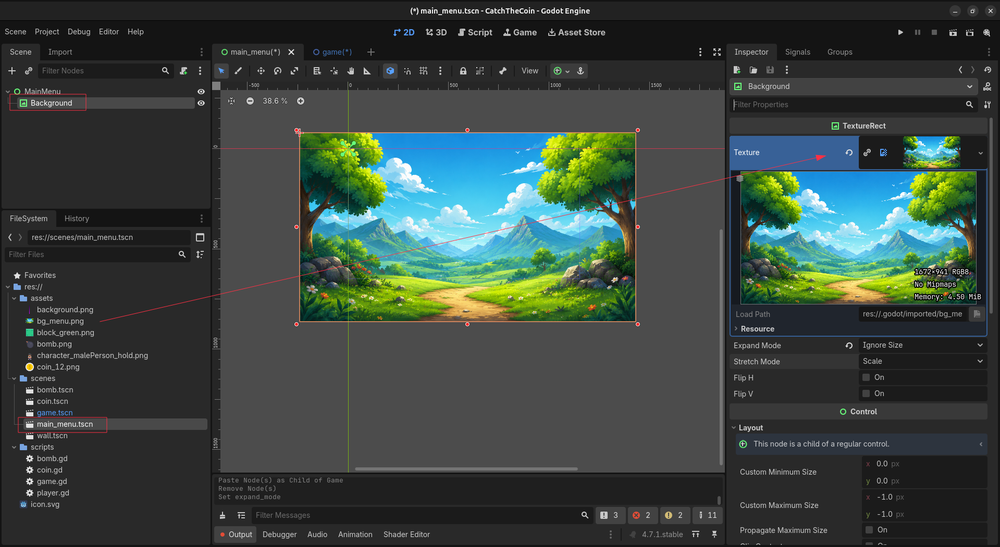

Теперь меню имеет отдельное визуальное оформление.

---

### Добавляем элементы меню

Внутрь `MainMenu` добавляем:

```text
TitleLabel
PlayButton
ExitButton
```

Структура становится такой:

```text
MainMenu
├── Background
├── TitleLabel
├── PlayButton
└── ExitButton
```

Для `TitleLabel` используем текст:

```text
CATCH THE COIN
```

Для кнопок:

```text
PLAY
EXIT
```

Внешний вид, размер, цвет и расположение элементов можно настроить самостоятельно.

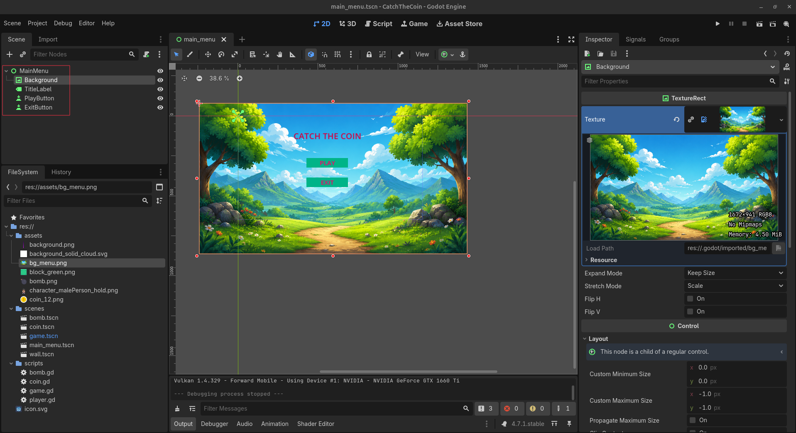

После запуска меню должно выглядеть примерно так:

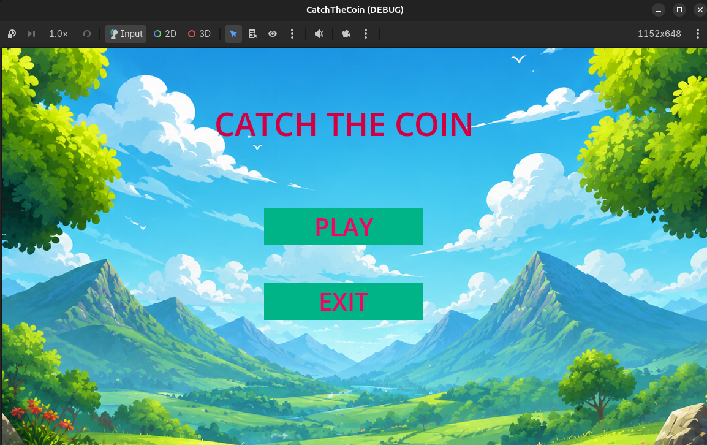

---

### Подключаем скрипт меню

К `MainMenu` подключаем новый скрипт:

```text
res://scripts/main_menu.gd
```

В начале:

```gdscript
extends Control
```

Теперь нужно подключить кнопки.

---

### Подключаем PlayButton

Выбираем:

```text
PlayButton
```

Открываем:

```text
Signals
```

и подключаем:

```text
pressed()
```

к `MainMenu`.

Используем функцию:

```text
_on_play_button_pressed
```

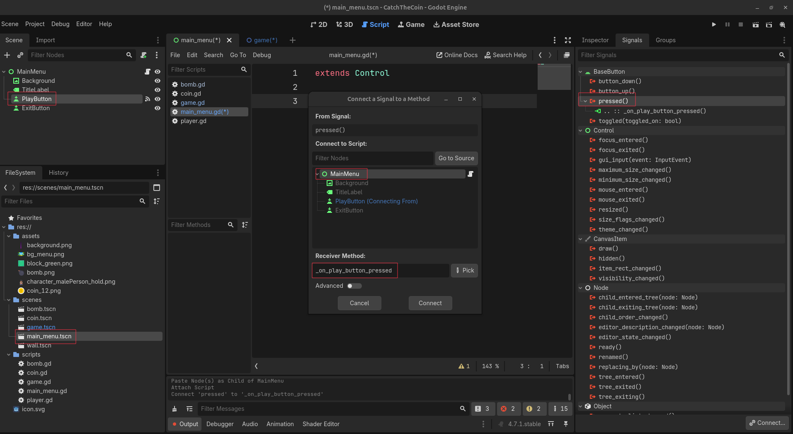

В скрипте добавляем:

```gdscript
func _on_play_button_pressed() -> void:
	get_tree().change_scene_to_file("res://scenes/game.tscn")
```

Теперь при нажатии:

```text
PLAY
```

происходит переход:

```text
main_menu.tscn
↓
game.tscn
```

---

### Подключаем ExitButton

Для `ExitButton` также подключаем:

```text
pressed()
```

к `MainMenu`. Создаём функцию:

```gdscript
func _on_exit_button_pressed() -> void:
	get_tree().quit()
```

Полный скрипт меню:

```gdscript
extends Control


func _on_play_button_pressed() -> void:
	get_tree().change_scene_to_file("res://scenes/game.tscn")


func _on_exit_button_pressed() -> void:
	get_tree().quit()
```

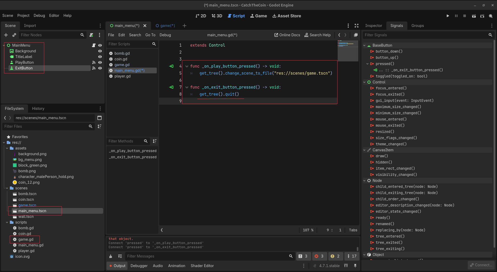

Теперь кнопки работают так:

```text
PLAY
↓
открывает Game
```

```text
EXIT
↓
закрывает игру
```

---

### Делаем MainMenu главной Scene

Теперь нужно указать Godot, что проект должен запускаться именно с меню. Открываем:

```text
Project
→ Project Settings
→ Application
→ Run
```

В параметре:

```text
Main Scene
```

выбираем:

```text
res://scenes/main_menu.tscn
```

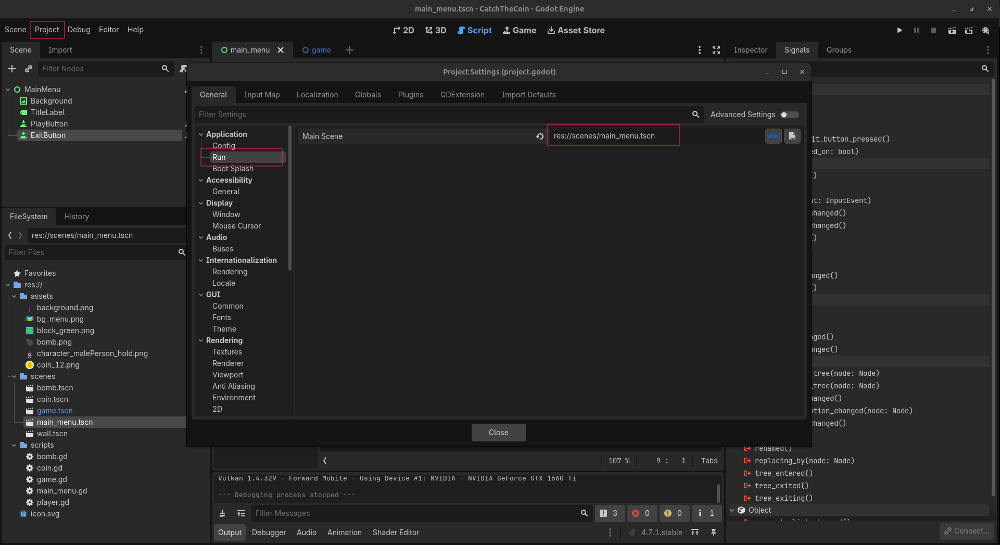

Теперь при запуске проекта через:

```text
F5
```

первой открывается не игра, а главное меню. Получаем:

```text
Запуск проекта
↓
MainMenu
↓
PLAY
↓
Game
```

---

### Проверяем меню

Запускаем проект:

```text
F5
```

Проверяем кнопку:

```text
PLAY
```

После нажатия должна открыться игра:

```text
Score: 0
Time: 30
```

Затем снова запускаем проект и проверяем:

```text
EXIT
```

После нажатия окно игры должно закрыться. Теперь у `Catch the Coin` появился полноценный стартовый экран. Игровой цикл становится таким:

```text
MAIN MENU
↓
PLAY
↓
GAME
↓
YOU WIN / GAME OVER
↓
RESTART
```

А игрок теперь сам выбирает момент начала игры.

---

## Добавляем кнопку MENU

Теперь после победы или поражения игрок может нажать:

```text
RESTART
```

и начать игру заново. Добавим ещё одну возможность - вернуться в главное меню. Получим:

```text
GAME OVER
[ RESTART ]
[ MENU ]
```

и:

```text
YOU WIN!
[ RESTART ]
[ MENU ]
```

При нажатии `MENU` игрок должен перейти обратно в:

```text
main_menu.tscn
```

---

### Добавляем MenuButton в GameOverPanel

Выбираем:

```text
GameOverPanel
```

и добавляем:

```text
Button
```

Переименовываем:

```text
MenuButton
```

В `Text` пишем:

```text
MENU
```

Размещаем кнопку под `RestartButton`. Получаем:

```text
GameOverPanel
├── GameOverLabel
├── RestartButton
└── MenuButton
```

---

### Добавляем MenuButton в WinPanel

Теперь выбираем:

```text
WinPanel
```

и также добавляем:

```text
Button
```

Переименовываем:

```text
MenuButton
```

Текст:

```text
MENU
```

Размещаем кнопку под `RestartButton`.

Структура становится такой:

```text
UI
├── ScoreLabel
├── TimerLabel
├── GameOverPanel
│   ├── GameOverLabel
│   ├── RestartButton
│   └── MenuButton
└── WinPanel
    ├── WinLabel
    ├── RestartButton
    └── MenuButton
```

Теперь и после победы, и после поражения игрок может выбрать:

```text
RESTART
```

или:

```text
MENU
```

---

### Подключаем обе кнопки к одной функции

Обе кнопки `MENU` выполняют одно и то же действие:

```text
вернуться в главное меню
```

Поэтому создавать две одинаковые функции не нужно. У первой `MenuButton` подключаем сигнал:

```text
pressed()
```

к `Game`. Создаём функцию:

```text
_on_menu_button_pressed
```

После этого подключаем `pressed()` второй `MenuButton` к той же самой функции:

```text
_on_menu_button_pressed
```

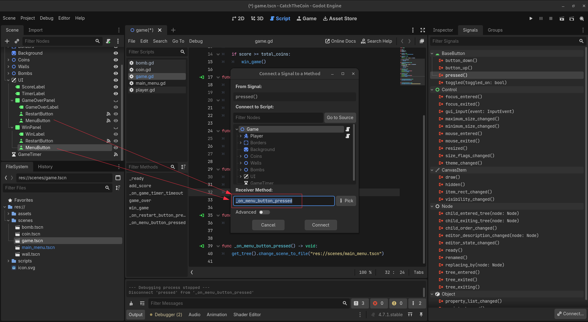

Получается:

```text
GameOverPanel
└── MenuButton
        ↓
_on_menu_button_pressed()
        ↑
WinPanel
└── MenuButton
```

Разные кнопки могут вызывать одну функцию, если должны выполнять одинаковое действие.

---

### Возвращаемся в MainMenu

В `game.gd` добавляем:

```gdscript
func _on_menu_button_pressed() -> void:
	get_tree().change_scene_to_file("res://scenes/main_menu.tscn")
```

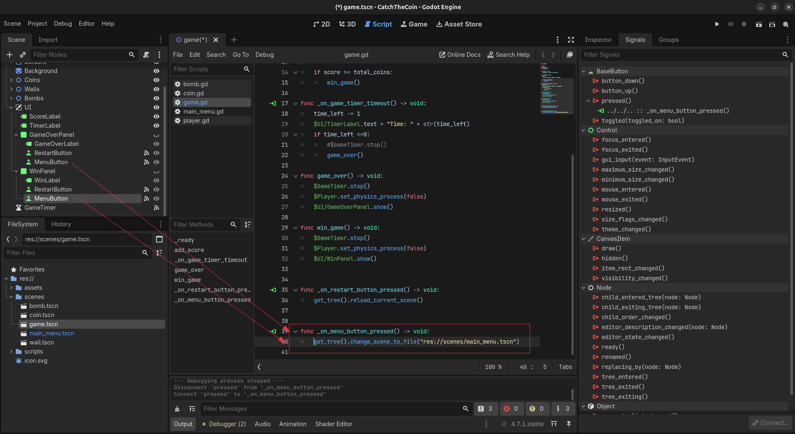

Команда:

```gdscript
get_tree().change_scene_to_file()
```

позволяет перейти на другую Scene.

В нашем случае:

```text
game.tscn
↓
main_menu.tscn
```

---

### Проверяем кнопку после поражения

Запускаем проект:

```text
F5
```

Нажимаем:

```text
PLAY
```

и проигрываем, например касаясь Bomb. Получаем:

```text
GAME OVER

[ RESTART ]
[ MENU ]
```

Нажимаем:

```text
MENU
```

После этого должно открыться главное меню:

```text
CATCH THE COIN

[ PLAY ]
[ EXIT ]
```

---

### Проверяем кнопку после победы

Снова запускаем игру и собираем все Coin. Получаем:

```text
YOU WIN!

[ RESTART ]
[ MENU ]
```

Нажимаем:

```text
MENU
```

и снова возвращаемся в `MainMenu`.

---

Теперь игровой цикл полностью завершён:

```text
MAIN MENU
↓
PLAY
↓
GAME
↓
YOU WIN / GAME OVER
↓
RESTART → начать заново

или

MENU → вернуться в главное меню
```

При этом две разные кнопки `MENU` используют одну и ту же функцию, потому что выполняют одинаковое действие.

---

## Практика

На этой лекции мы добавили много новых элементов, поэтому практика будет короткой. Ваша задача - немного изменить игру самостоятельно и проверить, что весь игровой цикл продолжает работать правильно.

### Задание

Выберите любые `2–3` изменения:

- измените стартовое время игры;
- поменяйте текст `YOU WIN!`;
- поменяйте текст `GAME OVER`;
- измените цвет или размер текста интерфейса;
- измените оформление кнопок;
- переместите `Score` и `Timer`;
- измените фон главного меню;
- поменяйте название игры в `MainMenu`.

После изменений обязательно проверьте игру полностью.

### Проверка

Игра должна проходить весь цикл:

```text
MAIN MENU
↓
PLAY
↓
GAME
↓
сбор Coin
↓
Score увеличивается
↓
Timer уменьшается
↓
YOU WIN или GAME OVER
↓
RESTART или MENU
```

Проверьте, что:

- кнопка PLAY запускает игру;
- Score изменяется после сбора Coin;
- Bomb вызывает GAME OVER;
- после окончания времени появляется GAME OVER;
- после сбора всех Coin появляется YOU WIN!;
- кнопка RESTART начинает игру заново;
- кнопка MENU возвращает в главное меню;

Проверьте, что после внесённых изменений весь игровой цикл продолжает работать корректно.

---

## Домашнее задание

Продолжите проект, который вы развивали после первой и второй лекций. Не создавайте новый проект. Используйте свой Player, собственный уровень, собираемые предметы, препятствия и опасные объекты из предыдущей домашней работы. Теперь ваша задача - превратить этот проект в законченную мини-игру.

### Задание

Добавьте игровой интерфейс. В игре должны отображаться:

```text
Score
Time
```

`Score` должен увеличиваться после сбора каждого предмета. `Time` должен показывать оставшееся время и уменьшаться во время игры.

---

Добавьте условие победы. Когда Player соберёт все предметы на уровне, игра должна завершиться победой:

```text
все предметы собраны
↓
YOU WIN!
```

После победы:

- время останавливается;
- Player перестаёт двигаться;
- появляется экран победы.

---

Добавьте условия поражения. Игра должна завершаться поражением минимум в двух случаях:

```text
Time = 0
↓
GAME OVER
```

и:

```text
Player касается опасного объекта
↓
GAME OVER
```

После поражения:

- время останавливается;
- Player перестаёт двигаться;
- появляется экран `GAME OVER`.

---

Добавьте кнопки завершения игры. На экранах победы и поражения должны находиться:

```text
RESTART
MENU
```

`RESTART` должен начинать игру заново.

`MENU` должен возвращать игрока в главное меню.

---

Создайте отдельное главное меню. В нём должны быть:

```text
Название вашей игры

PLAY
EXIT
```

`PLAY` запускает игровой уровень.

`EXIT` закрывает игру.

Оформление меню выберите самостоятельно.

---

### Результат

После выполнения домашнего задания у вас должна получиться законченная мини-игра со своим оформлением и игровым уровнем. Полный игровой цикл должен работать так:

```text
MAIN MENU
↓
PLAY
↓
GAME
↓
Player собирает предметы
↓
Score увеличивается
↓
Timer уменьшается
↓
YOU WIN или GAME OVER
↓
RESTART или MENU
```

Проверьте, что:

- Player продолжает правильно двигаться;
- границы игрового мира работают;
- препятствия блокируют движение;
- собираемые предметы исчезают;
- `Score` правильно считает собранные предметы;
- `Timer` отсчитывает время;
- опасный объект вызывает поражение;
- окончание времени вызывает поражение;
- сбор всех предметов вызывает победу;
- после завершения игры Player больше не двигается;
- `RESTART` полностью перезапускает уровень;
- `MENU` возвращает в главное меню;
- `PLAY` запускает игру;
- `EXIT` закрывает игру.

Главное условие - продолжить именно тот проект, который вы создавали в предыдущих домашних работах, и самостоятельно завершить его с помощью механик третьей лекции.

### Дополнительное задание

Если хотите развить проект дальше:

- измените оформление `YOU WIN!` и `GAME OVER`;
- сделайте собственный дизайн кнопок;
- измените стартовое время;
- измените сложность уровня;
- добавьте больше собираемых предметов или опасностей;
- создайте собственный фон для главного меню;
- придумайте название для своей игры;
- измените игровой интерфейс под стиль своего проекта.

После любых изменений игра должна продолжать правильно работать от главного меню до победы или поражения.

---

## Итоги

На третьей лекции мы завершили `Catch the Coin` и превратили игровой уровень в полноценную мини-игру.

Мы добавили:

- UI с `Score` и `Timer`;
- условия победы и поражения;
- экраны `YOU WIN!` и `GAME OVER`;
- кнопки `RESTART` и `MENU`;
- отдельное главное меню с `PLAY` и `EXIT`.

Теперь игра имеет полный цикл:

```text
MAIN MENU
↓
PLAY
↓
GAME
↓
YOU WIN / GAME OVER
↓
RESTART или MENU
```

На этом первый модуль завершён. В нём мы уже использовали переменные, функции, условия и Signals, но пока только как инструменты для создания игровых механик.

Во втором модуле мы вернёмся к этим вещам и разберём их уже системно: как работает `GDScript`, как создавать свои функции, использовать условия, массивы, циклы и строить игровую логику самостоятельно.
