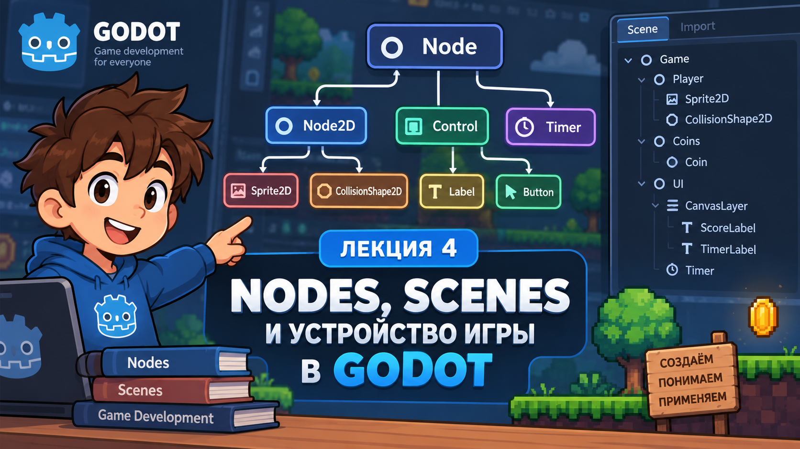

# Лекция 4. Node, Scene и устройство игры в Godot



На первых трёх занятиях мы уже успели создать небольшую игру. В ней появились Player, монетки, препятствия, интерфейс, счёт и таймер. Для каждого элемента мы использовали разные Node: Player создавали на основе `CharacterBody2D`, монетки - `Area2D`, препятствия - `StaticBody2D`, а изображение персонажа находилось внутри `Sprite2D`.

До этого нам было достаточно знать, какой Node нужно добавить в конкретной ситуации. Но при создании собственных игр этого уже недостаточно. Нужно понимать, почему Player является `CharacterBody2D`, чем `Area2D` отличается от `StaticBody2D`, зачем внутри игрового объекта отдельно находятся `Sprite2D` и `CollisionShape2D` и почему элементы интерфейса устроены иначе, чем объекты игрового мира.

Godot строит игру из небольших отдельных элементов - **Node**. Каждый тип Node отвечает за определённую задачу. Одни Node работают с положением объекта в двумерном мире, другие отображают изображения, третьи участвуют в физике, четвёртые создают интерфейс, а некоторые вообще ничего не показывают на экране и выполняют только внутреннюю работу программы.

На этой лекции разберём устройство Scene в Godot и основные Node, которые уже использовали в наших проектах. Главная задача - научиться выбирать Node не потому, что так написано в инструкции, а потому, что мы понимаем его назначение.

---

## Node и Scene

Почти всё, что мы добавляем в Godot, является **Node**. `Sprite2D`, `CharacterBody2D`, `Area2D`, `Label`, `Timer` - это разные типы Node. Они находятся в одной системе, но предназначены для разных задач.

Node можно представить как отдельный строительный элемент игры. Само слово `Node` ещё не говорит, как объект будет выглядеть или что именно он будет делать. Всё зависит от конкретного типа Node.

Например, `Sprite2D` используется для отображения изображения, `Timer` работает со временем, `CharacterBody2D` подходит для управляемого физического объекта, а `Area2D` позволяет обнаруживать пересечения с другими объектами.

Поэтому при создании нового элемента игры важно сначала понять:

```text
Что должен делать этот объект?
```

и только после этого выбирать подходящий Node.

Один игровой объект часто состоит сразу из нескольких Node. Например, наш Player имеет такую структуру:

```text
Player
├── Sprite2D
└── CollisionShape2D
```

Здесь один Node отвечает за сам игровой объект, другой - за его изображение, а ещё один - за форму столкновения. Каждый Node выполняет только свою часть задачи, но вместе они образуют один полноценный объект.

Такую структуру можно сохранить как **Scene**.

Scene - это сохранённое дерево из одного или нескольких Node. Она может представлять целый уровень, меню, интерфейс или отдельный игровой объект.

Например, сцену Player можно сохранить в отдельный файл:

```text
player.tscn
```

Внутри неё может находиться вся структура персонажа:

```text
Player
├── Sprite2D
└── CollisionShape2D
```

После этого эту Scene можно использовать в других частях проекта как готовый объект.

Точно так же можно создать отдельную сцену для монетки:

```text
coin.tscn
```

и затем добавить её в игровую сцену несколько раз:

```text
Game
├── Coin
├── Coin
├── Coin
└── Coin
```

Все эти объекты создаются на основе одной Scene, но после добавления становятся отдельными экземплярами.

Это позволяет один раз настроить объект, сохранить его и затем использовать повторно, вместо того чтобы каждый раз заново создавать одни и те же Node и повторять их настройки.

Важно различать два понятия:

`Node` - это отдельный элемент игры.

`Scene` - это сохранённая структура из Node, которую можно использовать как готовую часть проекта.

Именно из таких Node и Scenes постепенно строится вся игра.

---

## Scene Tree, Root, Parent и Child

Когда внутри Scene находится несколько Node, Godot показывает их в виде дерева. Эта структура называется **Scene Tree**.

Например, сцена игры может выглядеть так:

```text
Game
├── Player
│   ├── Sprite2D
│   └── CollisionShape2D
├── Coins
│   ├── Coin
│   ├── Coin
│   └── Coin
├── Borders
│   ├── Top
│   ├── Bottom
│   ├── Left
│   └── Right
└── UI
    ├── ScoreLabel
    └── TimerLabel
```

Scene Tree показывает не просто список всех Node, а то, как они связаны между собой. По дереву можно понять, какие элементы относятся к Player, какие являются частью интерфейса, где находятся границы уровня и какие объекты существуют отдельно.

Самый верхний Node называется **Root Node**. Это главный Node конкретной Scene, с которого начинается всё её дерево.

Например:

```text
Game
├── Player
├── Coins
└── UI
```

Здесь `Game` является Root Node.

В другой Scene Root Node может быть совсем другим. Например, если мы создаём отдельную сцену Player:

```text
Player
├── Sprite2D
└── CollisionShape2D
```

то Root Node этой Scene уже будет `Player`.

Тип Root Node зависит от задачи самой сцены. Для игрового уровня это может быть `Node2D`, для персонажа - `CharacterBody2D`, для собираемого объекта - `Area2D`, а для интерфейса - `Control`.

Помимо Root Node, внутри дерева существуют отношения **Parent** и **Child**.

Рассмотрим знакомую структуру:

```text
Player
├── Sprite2D
└── CollisionShape2D
```

Здесь `Player` является Parent для `Sprite2D` и `CollisionShape2D`, а `Sprite2D` и `CollisionShape2D` являются Child для `Player`.

Эта связь важна не только для порядка в дереве. Для объектов семейства `Node2D` положение Child рассчитывается относительно Parent. Поэтому если переместить Player, его `Sprite2D` и `CollisionShape2D` переместятся вместе с ним.

Если структура выглядела бы так:

```text
Game
├── Player
├── Sprite2D
└── CollisionShape2D
```

то это уже были бы три независимых Node. Перемещение `Player` не означало бы автоматическое перемещение `Sprite2D` и `CollisionShape2D`.

Поэтому связанные части одного объекта обычно располагают внутри общего Parent.

То же самое касается других частей игры. Например, границы уровня удобно объединить:

```text
Borders
├── Top
├── Bottom
├── Left
└── Right
```

А элементы интерфейса:

```text
UI
├── ScoreLabel
├── TimerLabel
└── RestartButton
```

Так Scene Tree становится не просто списком Node, а отражением устройства самой игры.

Один Node при этом может одновременно быть и Child, и Parent.

Например:

```text
Game
└── Player
    └── Sprite2D
```

`Player` является Child для `Game`, но одновременно Parent для `Sprite2D`.

Именно благодаря таким связям Godot может строить большие сцены из небольших вложенных частей.

Правильная структура Scene Tree сильно упрощает работу с проектом. Когда Node расположены логично, по дереву сразу видно, какие элементы относятся друг к другу и за какую часть игры они отвечают.

Поэтому при создании Scene важно думать не только о том, какие Node нужны, но и о том, **как они должны быть связаны между собой**.

---

## Node2D и Sprite2D

После того как мы разобрались с Scene Tree и связями между Node, можно перейти к основным типам Node, которые используются в 2D-играх.

Один из самых базовых Node - `Node2D`.

`Node2D` используется для объектов, которые находятся в двумерном игровом мире. Он имеет положение, поворот и масштаб, поэтому его можно размещать внутри Scene и изменять его положение относительно других объектов.

Например, у `Node2D` есть свойства:

```text
Position
Rotation
Scale
```

Если изменить `Position`, объект переместится в другое место сцены. Если изменить `Rotation`, он повернётся. Если изменить `Scale`, объект станет больше или меньше.

Поэтому `Node2D` часто используется как основа для различных частей 2D-сцены.

Например:

```text
Game (Node2D)
```

может быть главным Node игрового уровня и содержать внутри Player, монетки, препятствия и другие объекты.

Но важно понимать, что сам `Node2D` ничего не рисует на экране. Если создать пустой `Node2D` и запустить игру, мы его не увидим. Он существует внутри Scene Tree и имеет координаты, но у него нет изображения.

Чтобы объект стал видимым, обычно добавляется другой Node, который отвечает именно за отображение.

Для этого часто используется `Sprite2D`.

### Sprite2D

`Sprite2D` предназначен для отображения изображения в двумерной сцене.

Например, если у нас есть файл:

```text
player.png
```

мы можем добавить `Sprite2D` и установить это изображение в свойство `Texture`. После этого изображение появится в игровом мире.

Например:

```text
Player
└── Sprite2D
```

`Sprite2D` отвечает только за внешний вид Player.

Это очень важное отличие. Само изображение персонажа ещё не является полноценным Player.

Если создать только:

```text
Sprite2D
```

мы получим картинку на экране, но у неё автоматически не появятся столкновения, физическое движение, здоровье, управление или игровая логика.

Поэтому в настоящем игровом объекте `Sprite2D` обычно является одной из его частей.

Например:

```text
Player (CharacterBody2D)
└── Sprite2D
```

Здесь `CharacterBody2D` является основным Node персонажа, а `Sprite2D` отвечает только за его изображение.

### Локальная позиция

У `Sprite2D` тоже есть собственное свойство `Position`.

Но если `Sprite2D` находится внутри другого `Node2D`:

```text
Player
└── Sprite2D
```

его позиция считается относительно Parent.

Например, Player находится:

```text
X = 500
Y = 300
```

а `Sprite2D` внутри него:

```text
X = 0
Y = 0
```

В этом случае изображение будет находиться прямо в центре Player.

Если изменить позицию `Sprite2D`:

```text
X = 50
Y = 0
```

сам Player останется на месте, но изображение сместится вправо относительно Parent.

Это называется **локальной позицией**.

### Global Position

Иногда нам нужно узнать не позицию относительно Parent, а реальную позицию объекта внутри всей игровой сцены.

Для этого существует:

```gdscript
global_position
```

Например, если Player находится в позиции:

```text
500, 300
```

а `Sprite2D` внутри него имеет локальную позицию:

```text
20, 0
```

то его глобальная позиция будет примерно:

```text
520, 300
```

Таким образом:

```text
position
```

показывает положение относительно Parent.

А:

```text
global_position
```

показывает положение объекта относительно мировых координат Canvas.

На первых проектах чаще всего достаточно обычного `position`, но понимание разницы между локальными и глобальными координатами становится важным при работе со сложными вложенными сценами.

### Node2D и Sprite2D - это не одно и то же

Несмотря на то что оба Node работают в двумерном пространстве, их задачи отличаются.

`Node2D` используется как базовый объект двумерной сцены и даёт положение, поворот и масштаб.

`Sprite2D` относится к тому же 2D-миру, но дополнительно умеет отображать Texture.

Например, если нам нужен невидимый контейнер для нескольких объектов:

```text
Enemies (Node2D)
├── Enemy
├── Enemy
└── Enemy
```

нам не обязательно показывать сам `Enemies` на экране.

Если же нужно показать изображение дерева, монетки или персонажа, для этого понадобится `Sprite2D`.

Но если объект должен ещё участвовать в физике, одного `Sprite2D` уже недостаточно.

Для таких задач в Godot существуют физические Node.

---

## Физические Node

До этого мы разобрали `Node2D` и `Sprite2D`. Они позволяют разместить объект в двумерной сцене и показать его изображение, но сами по себе не делают объект частью физического мира.

Например, если создать:

```text
Player
└── Sprite2D
```

мы увидим персонажа на экране, но он не будет автоматически сталкиваться со стенами или другими объектами.

Для этого в Godot существуют специальные физические Node. В наших проектах мы уже использовали:

```text
CharacterBody2D
StaticBody2D
Area2D
```

На первый взгляд они похожи, потому что все связаны с физикой, но задачи у них разные.

### CharacterBody2D

`CharacterBody2D` используется для объектов, которыми мы хотим управлять и двигать с помощью кода.

Самый знакомый пример - наш Player:

```text
Player (CharacterBody2D)
├── Sprite2D
└── CollisionShape2D
```

Player должен двигаться по сцене, сталкиваться с препятствиями и реагировать на физический мир. Именно поэтому основой Player является `CharacterBody2D`.

Для движения такого объекта мы уже использовали:

```gdscript
velocity = direction * speed
move_and_slide()
```

`velocity` хранит направление и скорость движения объекта, а `move_and_slide()` перемещает `CharacterBody2D` с учётом столкновений.

`CharacterBody2D` подходит не только для Player. Его можно использовать для персонажей, NPC, врагов, машин и других объектов, движение которых мы контролируем самостоятельно.

### StaticBody2D

Не все физические объекты должны двигаться.

Например, стены уровня обычно стоят на месте. Нам не нужно каждый кадр изменять их координаты, но Player должен сталкиваться с ними.

Для таких объектов используется:

```text
StaticBody2D
```

В нашей игре мы уже применяли его для границ:

```text
Borders
├── Top
├── Bottom
├── Left
└── Right
```

`StaticBody2D` хорошо подходит для стен, пола, границ карты, камней и неподвижных препятствий.

Если Player движется в сторону `StaticBody2D`, физическая система Godot не позволит ему пройти сквозь препятствие.

### Area2D

`Area2D` тоже относится к физическим Node, но работает совсем иначе.

Его задача не в том, чтобы остановить другой объект, а в том, чтобы **обнаружить пересечение**.

Например, наша монетка может быть:

```text
Coin (Area2D)
├── Sprite2D
└── CollisionShape2D
```

Когда Player касается Coin, он не должен упереться в неё как в стену. Наоборот, Player проходит через область монетки, а сама Coin должна определить, что произошло пересечение.

После этого можно увеличить Score, удалить Coin, включить эффект или выполнить другое действие.

`Area2D` удобно использовать для бонусов, зон урона, финиша, телепортов, триггеров дверей и областей обнаружения.

Поэтому разница между `StaticBody2D` и `Area2D` особенно важна.

Если сделать стену через `Area2D`, Player сможет пройти через неё.

Если сделать Coin через `StaticBody2D`, она начнёт работать как физическое препятствие.

### Сравнение физических Node

| Node                | Для чего используется                                       |
| ------------------- | ------------------------------------------------------------------------------ |
| `CharacterBody2D` | объект, которым мы управляем и двигаем         |
| `StaticBody2D`    | неподвижное физическое препятствие             |
| `Area2D`          | область, которая обнаруживает пересечения |

Например:

```text
Player → CharacterBody2D
Wall   → StaticBody2D
Coin   → Area2D
```

При выборе Node нужно задавать вопрос не «как выглядит объект?», а «как он должен вести себя?».

Но для работы физической системы одного такого Node недостаточно. Godot ещё должен знать, **какую именно форму имеет объект**.

Для этого используется `CollisionShape2D`.

---

## CollisionShape2D

Физические Node определяют, **как объект должен вести себя**, но Godot всё ещё нужно понимать, какую форму этого объекта использовать для столкновений.

Например, Player может выглядеть как робот, персонаж или машина. На экране мы видим изображение через `Sprite2D`, но физическая система не использует картинку как готовую форму столкновения.

Для этого добавляется:

```text
CollisionShape2D
```

Рассмотрим Player:

```text
Player (CharacterBody2D)
├── Sprite2D
└── CollisionShape2D
```

Здесь `Sprite2D` показывает изображение персонажа, а `CollisionShape2D` определяет область, которая участвует в столкновениях.

Можно представить это так:

```text
Sprite2D
→ что видит игрок

CollisionShape2D
→ какую форму видит физическая система
```

В `CollisionShape2D` выбирается специальный ресурс `Shape`.

Например:

```text
RectangleShape2D
CircleShape2D
CapsuleShape2D
```

Для прямоугольного объекта удобно использовать `RectangleShape2D`, для круглого - `CircleShape2D`, а для персонажа часто подходит `CapsuleShape2D`.

### CollisionShape2D не является физическим объектом

Важно понимать, что `CollisionShape2D` сам по себе не создаёт столкновение.

Если добавить в сцену только:

```text
CollisionShape2D
```

он не станет стеной и не остановит Player.

`CollisionShape2D` работает вместе с физическим Node:

```text
CharacterBody2D
└── CollisionShape2D
```

или:

```text
StaticBody2D
└── CollisionShape2D
```

или:

```text
Area2D
└── CollisionShape2D
```

Основной Node определяет поведение объекта, а `CollisionShape2D` сообщает физической системе его форму.

### Размер Collision и размер изображения

Размер `CollisionShape2D` не обязан полностью совпадать с размером `Sprite2D`.

Например, у персонажа может быть большое изображение, но Collision можно сделать немного меньше. Это часто делает управление приятнее: игрок не будет сталкиваться со стеной из-за небольшого края изображения.

Если Collision слишком большой, объект будет сталкиваться с другими элементами раньше, чем изображения визуально соприкоснутся.

Если слишком маленький, изображения смогут заметно проходить друг через друга до момента столкновения.

Главное, чтобы Collision примерно соответствовал той части изображения, которая должна участвовать в физике.

### Один объект может иметь несколько CollisionShape2D

Иногда одной простой формы недостаточно.

Например:

```text
Object
├── Sprite2D
├── CollisionShape2D
└── CollisionShape2D
```

Каждая форма может описывать свою часть объекта.

Но в большинстве наших первых игр достаточно одной простой формы. Лучше использовать максимально простую Collision, которая хорошо подходит объекту, чем пытаться идеально повторить его изображение.

---

## Control и интерфейс

До этого мы в основном работали с объектами игрового мира: Player, монетками, стенами и другими элементами, которые находятся внутри двумерной сцены.

Но кроме игрового мира почти в любой игре существует ещё одна большая часть - **интерфейс**.

К интерфейсу относятся элементы, которые показывают игроку информацию или позволяют управлять игрой:

```text
Score
Time
Health
кнопки
меню
панели
текст
иконки
```

Для создания интерфейса в Godot используется система Node, основанная на:

```text
Control
```

`Control` - это базовый Node для пользовательского интерфейса. Он определяет прямоугольную область на экране, имеет положение и размер и предоставляет возможности для размещения элементов относительно окна игры.

На основе `Control` построены многие знакомые нам UI Node:

```text
Control
├── Label
├── Button
├── Panel
└── TextureRect
```

Все они относятся к одной системе интерфейса, но каждый выполняет свою задачу.

Например, `Label` показывает текст, `Button` создаёт кнопку, `Panel` отображает визуальную панель, а `TextureRect` используется для изображения внутри интерфейса.

Сам обычный `Control` тоже можно использовать в Scene. Он может быть невидимой основой, внутри которой находятся другие элементы интерфейса.

Например:

```text
UI (Control)
├── ScoreLabel
├── TimeLabel
└── RestartButton
```

В этом случае сам `UI` необязательно будет что-то рисовать. Его задача - объединить связанные элементы интерфейса в одну часть Scene Tree.

### Чем Control отличается от Node2D

`Node2D` и `Control` оба могут находиться в двумерной сцене, но используются для разных задач.

`Node2D` предназначен прежде всего для объектов игрового мира:

```text
Player
Coin
Enemy
дерево
препятствие
```

`Control` предназначен для интерфейса:

```text
ScoreLabel
TimeLabel
StartButton
GameOverPanel
```

Для UI важно не только положение, но и размер элемента и его расположение относительно окна игры.

Можно представить основное различие так:

```text
Node2D
→ игровой мир

Control
→ интерфейс
```

### Label

`Label` используется для отображения текста.

Например:

```text
Score: 10
Time: 45
GAME OVER
```

Сам `Label` не знает, что такое Score или сколько времени осталось до конца игры. Его задача - просто показать текст, который находится в свойстве `Text`.

Этот текст можно изменить из кода:

```gdscript
$ScoreLabel.text = "Score: 10"
```

То есть игровая логика определяет значение Score, а `Label` только показывает его игроку.

### Button

`Button` используется, когда игрок должен нажать на элемент интерфейса.

Например:

```text
START
RESTART
CONTINUE
EXIT
```

Button тоже является одним из видов `Control`, но дополнительно умеет реагировать на действия пользователя.

Когда игрок нажимает кнопку, она может отправить сигнал:

```text
pressed
```

Сама кнопка не знает, как перезапускать игру. Она только сообщает, что пользователь её нажал, а уже наш код определяет, какое действие выполнить.

### Panel

`Panel` - это ещё один вид `Control`.

Он обладает основными возможностями системы интерфейса: имеет положение, размер и может содержать внутри другие UI Node.

Но в отличие от обычного `Control`, который может быть полностью невидимым, `Panel` предназначен для отображения **видимой области интерфейса**.

Например:

```text
GameOverPanel (Panel)
├── GameOverLabel
└── RestartButton
```

В этом случае `GameOverPanel` создаёт визуальную область, внутри которой находятся текст и кнопка.

Обычный `Control` можно использовать, когда нам нужно просто объединить несколько элементов интерфейса:

```text
HUD (Control)
├── ScoreLabel
└── TimeLabel
```

А если нужен видимый блок с фоном:

```text
StatsPanel (Panel)
├── HealthLabel
├── CoinsLabel
└── LivesLabel
```

для этого подходит `Panel`.

Таким образом, `Panel` - это специализированный `Control`, который дополнительно отображает визуальную панель.

### TextureRect

Иногда внутри интерфейса нужно показать изображение.

Для игрового мира мы обычно используем `Sprite2D`, а для интерфейса существует:

```text
TextureRect
```

Его можно использовать для иконок, логотипов, портретов персонажей, изображений предметов и фона меню.

---

## Container и автоматическое расположение интерфейса

Когда элементов интерфейса становится больше, размещать каждый `Label` или `Button` вручную становится неудобно.

Для таких задач в Godot существуют специальные UI Node - `Container`.

`Container` тоже относится к системе `Control`, но его главная задача - **автоматически размещать дочерние элементы интерфейса**.

То есть:

```text
Control
→ основа интерфейса

Panel
→ Control с видимой панелью

Container
→ Control, который автоматически размещает Child Node
```

### VBoxContainer

`VBoxContainer` располагает дочерние элементы вертикально, один под другим.

Например:

```text
Menu (VBoxContainer)
├── StartButton
├── SettingsButton
└── ExitButton
```

### HBoxContainer

`HBoxContainer` размещает элементы горизонтально, слева направо.

Например:

```text
Stats (HBoxContainer)
├── HealthLabel
├── ScoreLabel
└── TimeLabel
```

На экране получится примерно:

```text
Health: 100    Score: 20    Time: 45
```

### GridContainer

`GridContainer` размещает элементы в виде сетки.

Например, если у инвентаря шесть ячеек:

```text
Inventory (GridContainer)
├── Slot
├── Slot
├── Slot
├── Slot
├── Slot
└── Slot
```

и установлено:

```text
Columns: 3
```

получится:

```text
[ Slot ] [ Slot ] [ Slot ]
[ Slot ] [ Slot ] [ Slot ]
```

### Panel и Container решают разные задачи

`Panel` и `Container` часто используются вместе, но выполняют разные задачи.

Например:

```text
InventoryPanel (Panel)
└── ItemsGrid (GridContainer)
    ├── Slot
    ├── Slot
    ├── Slot
    └── Slot
```

Здесь `InventoryPanel` создаёт видимую область интерфейса, а `ItemsGrid` автоматически располагает ячейки внутри.

Можно запомнить так:

```text
Panel
→ как выглядит область

Container
→ как располагаются элементы внутри
```

На первых проектах чаще всего будут использоваться `VBoxContainer`, `HBoxContainer` и `GridContainer`.

---

## CanvasLayer

После того как мы разобрали `Control` и основные элементы интерфейса, появляется ещё один важный вопрос: что произойдёт с UI, если игровой мир начнёт двигаться?

Если добавить `Camera2D` и начать перемещаться по большому уровню, Player, стены, монетки и другие объекты будут менять своё положение на экране. Но элементы интерфейса должны оставаться на месте.

Например:

```text
Score: 25
Health: 100
Time: 40
```

обычно должны постоянно оставаться в одном и том же месте экрана независимо от того, где находится Player.

Для этого в Godot используется:

```text
CanvasLayer
```

`CanvasLayer` создаёт отдельный слой отображения.

Например:

```text
Game
├── Player
├── Coins
├── Borders
├── Camera2D
└── UI (CanvasLayer)
    ├── ScoreLabel
    ├── TimeLabel
    └── GameOverPanel
```

Player, Coins и Borders находятся в игровом мире. Если камера перемещается по уровню, положение этих объектов на экране изменяется.

Элементы внутри `UI` остаются частью отдельного CanvasLayer.

Важно понимать, что `CanvasLayer` сам по себе не является кнопкой, текстом или панелью и не заменяет `Control`.

Например:

```text
UI (CanvasLayer)
└── HUD (Control)
    ├── ScoreLabel
    ├── HealthLabel
    └── TimeLabel
```

Здесь `CanvasLayer` отделяет интерфейс от игрового мира, а `Control` используется для организации самого интерфейса.

---

## Timer

Не все Node в Godot обязательно должны что-то показывать на экране или участвовать в физике. Некоторые из них выполняют только определённую внутреннюю задачу.

Один из таких Node - `Timer`.

`Timer` используется для работы со временем. Он может отсчитать определённое количество секунд и после завершения сообщить программе, что время закончилось.

Например:

```text
Game
├── Player
├── Coins
├── GameTimer
└── SpawnTimer
```

Здесь оба объекта являются `Timer`, но выполняют разные задачи.

`GameTimer` может отвечать за продолжительность игры, а `SpawnTimer` - за промежуток между появлением новых объектов.

Сам `Timer` при этом не отображается на экране. Если игрок видит:

```text
Time: 45
```

это обычно показывает `Label`, а сам отсчёт выполняет `Timer`.

То есть:

```text
Timer
→ работает со временем

Label
→ показывает информацию игроку
```

Подробно работу `Timer`, его настройки и управление из кода мы разберём отдельно позже.

---

## Camera2D

Если уровень становится больше размера окна игры, игроку нужно показывать только определённую часть этого мира.

Для этого используется:

```text
Camera2D
```

`Camera2D` определяет, какую часть двумерного игрового мира видит игрок.

Например, камера может находиться внутри Player:

```text
Player
├── Sprite2D
├── CollisionShape2D
└── Camera2D
```

Так как `Camera2D` является Child для Player, она перемещается вместе с ним и может следить за персонажем по большому уровню.

При этом сама камера не является изображением. Её задача - управлять тем, **что попадает на экран**.

`Camera2D` особенно хорошо показывает, зачем мы отделяем UI от игрового мира:

```text
Game
├── Player
│   └── Camera2D
└── UI (CanvasLayer)
    ├── ScoreLabel
    └── TimeLabel
```

Камера меняет видимую часть мира, а интерфейс внутри `CanvasLayer` остаётся на месте.

---

## Node и Script

До этого мы в основном разбирали, какой Node выбрать для конкретной задачи. Но сам по себе Node предоставляет только готовые возможности Godot.

Чтобы объект начал вести себя именно так, как нужно нашей игре, к нему можно добавить **Script**.

Например:

```text
Player (CharacterBody2D)
├── Sprite2D
├── CollisionShape2D
└── player.gd
```

Здесь `CharacterBody2D` определяет тип объекта, а `player.gd` добавляет его собственное поведение.

Можно представить это так:

```text
Node
→ даёт базовые возможности

Script
→ определяет поведение конкретного объекта
```

Например, два разных объекта могут использовать один и тот же тип Node:

```text
Player (CharacterBody2D)
Enemy (CharacterBody2D)
```

Оба умеют двигаться и участвовать в физике, потому что являются `CharacterBody2D`, но их Script может задавать совершенно разное поведение.

### Script прикрепляется к Node

Script в Godot обычно прикрепляется к определённому Node.

Например:

```text
Player
└── player.gd
```

Это означает, что код внутри `player.gd` относится именно к этому Player.

Тип Node влияет и на то, какие свойства и методы доступны внутри Script.

Например, для `CharacterBody2D` мы можем использовать:

```gdscript
velocity
move_and_slide()
```

### extends

В начале GDScript мы постоянно видим:

```gdscript
extends CharacterBody2D
```

или:

```gdscript
extends Node2D
```

или:

```gdscript
extends Area2D
```

`extends` указывает, возможности какого типа Node использует Script.

Например:

```gdscript
extends CharacterBody2D
```

означает, что Script получает свойства и методы `CharacterBody2D`.

Не каждому Node нужен собственный Script. Если объект просто показывает изображение или является обычной неподвижной стеной, отдельный Script может вообще не понадобиться.

Главное понимать общую структуру:

```text
Node
→ что это за объект

Child Node
→ из каких частей он состоит

Script
→ как он себя ведёт
```

Подробно переменные и функции внутри Script мы разберём на следующих лекциях.

---

## Основные группы Node

Упрощённо Node, которые мы разобрали на этой лекции, можно разделить по назначению:

```text
Node
│
├── 2D-мир
│   ├── Node2D
│   ├── Sprite2D
│   ├── CharacterBody2D
│   ├── StaticBody2D
│   ├── Area2D
│   └── Camera2D
│
├── Интерфейс
│   ├── Control
│   ├── Label
│   ├── Button
│   ├── Panel
│   └── Container
│
└── Другие задачи
    └── Timer
```

Это не полное дерево всех классов Godot, а упрощённая схема по назначению. Она помогает увидеть, что разные Node относятся к разным частям игры и решают разные задачи.

---

## Как выбрать правильный Node

После разбора основных Node становится проще выбирать подходящий вариант для нового объекта.

Главный вопрос всегда один:

```text
Что должен делать этот объект?
```

Не нужно выбирать Node только по внешнему виду. Два объекта могут выглядеть похоже, но вести себя совершенно по-разному.

Например, дерево может быть просто декорацией:

```text
Tree (Sprite2D)
```

А если Player не должен проходить сквозь него:

```text
Tree (StaticBody2D)
├── Sprite2D
└── CollisionShape2D
```

То есть структура зависит от поведения объекта.

### Основные Node

| Node                 | Когда использовать                                                             |
| -------------------- | ----------------------------------------------------------------------------------------------- |
| `Node2D`           | основа или контейнер для объектов 2D-мира                      |
| `Sprite2D`         | нужно показать изображение в игровом мире                   |
| `CharacterBody2D`  | объект должен двигаться и участвовать в физике          |
| `StaticBody2D`     | неподвижное физическое препятствие                              |
| `Area2D`           | нужно обнаруживать пересечения с другими объектами |
| `CollisionShape2D` | нужно задать физическую форму объекта                          |
| `Control`          | основа интерфейса                                                               |
| `Label`            | нужно показать текст                                                          |
| `Button`           | нужна кнопка                                                                         |
| `Panel`            | нужна видимая область интерфейса                                   |
| `TextureRect`      | нужно показать изображение внутри UI                              |
| `VBoxContainer`    | автоматически расположить элементы вертикально       |
| `HBoxContainer`    | автоматически расположить элементы горизонтально   |
| `GridContainer`    | расположить элементы в виде сетки                                  |
| `CanvasLayer`      | отделить интерфейс от игрового мира                              |
| `Timer`            | работать со временем                                                          |
| `Camera2D`         | определить, какую часть игрового мира видит игрок     |

Не обязательно запоминать всю таблицу сразу. Важнее понимать принцип.

Например:

```text
Player → CharacterBody2D
Wall   → StaticBody2D
Coin   → Area2D
Score  → Label
Menu   → Control
```

Один игровой объект при этом часто состоит сразу из нескольких Node.

Например:

```text
Player (CharacterBody2D)
├── Sprite2D
├── CollisionShape2D
└── Camera2D
```

Каждая часть отвечает только за свою задачу.

Поэтому при создании объекта сначала определяем его поведение, а затем собираем подходящую структуру из Node.

---

## Практика. Разбираем CatchTheCoin

На этой практике мы не создаём новую игру. Наша задача - разобрать уже знакомый проект `CatchTheCoin` и понять, почему его Scene построена именно так.

До этого многие Node мы добавляли по инструкции. Теперь нужно посмотреть на проект уже с другой стороны и определить, какую задачу выполняет каждый элемент.

### Часть 1. Разбираем структуру игры

Откройте Scene Tree проекта `CatchTheCoin` и по очереди разберите основные объекты.

Для каждого Node ответьте на три вопроса:

```text
Какой это Node?

Что он делает в игре?

Почему для этой задачи выбран именно этот тип Node?
```

Особое внимание уделите:

```text
Player
Coin
Borders
Sprite2D
CollisionShape2D
UI
Timer
```

Нужно уметь объяснить не просто:

```text
Player → CharacterBody2D
```

а почему Player является именно `CharacterBody2D`, а не `Sprite2D` или `Area2D`.

То же самое касается Coin:

```text
Coin → Area2D
```

Нужно объяснить, почему монетка не должна быть `StaticBody2D` и почему Player не должен упираться в неё как в стену.

### Часть 2. Выбираем Node самостоятельно

Представьте, что в игру нужно добавить новые объекты.

Для каждого объекта определите, какой Node или какая структура из нескольких Node подходит лучше всего.

Объекты:

```text
лава
декоративное дерево
каменная стена
финишная зона
кнопка START
инвентарь 3 × 3
большой уровень с камерой
```

Для каждого варианта нужно не только выбрать Node, но и объяснить решение.

Если объект должен только отображаться на экране, одного `Sprite2D` может быть достаточно.

Если объект должен блокировать Player, понадобится физический Node и `CollisionShape2D`.

Если нужно только определить, что Player вошёл в определённую область, лучше использовать `Area2D`.

Если создаётся элемент интерфейса, нужно выбирать Node из системы `Control`.

### Challenge

Придумайте собственный игровой объект, которого нет в списке.

Опишите:

- что он должен делать;
- какой Node будет основным;
- какие Child Node ему понадобятся;
- нужен ли ему Script.

Нарисуйте его Scene Tree.

### Результат

После практики вы должны уметь смотреть на новый игровой объект и самостоятельно определять:

```text
что он должен делать
↓
какой Node подходит для этой задачи
↓
какие Child Node ему понадобятся
```

Главная задача практики - не запомнить названия Node, а научиться понимать их назначение и самостоятельно выбирать подходящую структуру для новых объектов.

---

## Домашнее задание

Продолжите работу над своим проектом `CatchTheCoin`.

На этой лекции мы разобрали, из каких Node строится игра и почему для разных задач используются разные типы Node. Теперь нужно самостоятельно расширить свою игру и выбрать подходящую структуру для новых объектов.

Добавьте в уровень минимум **3 новых элемента разных типов**.

Один объект должен быть обычной декорацией. Например:

```text
дерево
камень
лампа
облако
растение
```

Он нужен только для внешнего вида и не должен участвовать в физике.

Второй объект должен быть физическим препятствием, через которое Player не сможет пройти.

Третий объект должен определять пересечение с Player, но не блокировать его движение. Например:

```text
опасная зона
финиш
бонус
телепорт
новый собираемый предмет
```

Самостоятельно определите, какой основной Node нужен каждому объекту и какие Child Node необходимо добавить внутрь.

Также приведите Scene Tree проекта в порядок. Связанные объекты должны быть объединены логично, а названия Node должны отражать их назначение.

### Дополнительное задание

Добавьте в интерфейс небольшую панель с несколькими элементами и самостоятельно выберите подходящую структуру из:

```text
Control
Panel
VBoxContainer
HBoxContainer
GridContainer
Label
Button
```

Не обязательно использовать их все. Выберите только те Node, которые нужны вашей идее.

### Что нужно уметь объяснить

Для каждого нового объекта вы должны уметь ответить:

```text
Какой основной Node я выбрал?

Почему выбрал именно его?

Какие Child Node ему нужны?

Почему они находятся внутри этого объекта?
```

### Результат

После выполнения домашнего задания ваш `CatchTheCoin` должен получить несколько новых объектов с разным поведением, а Scene Tree должен оставаться понятным и аккуратным.

Главная задача - не просто добавить новые элементы, а **самостоятельно выбрать подходящие Node и понимать, зачем используется каждый из них**.

---

## Итог

На этой лекции мы разобрали, как устроены сцены в Godot и почему разные части игры создаются на основе разных Node.

Мы познакомились с основными понятиями:

- `Node`;
- `Scene`;
- `Scene Tree`;
- `Root Node`;
- `Parent` и `Child`;
- `Node2D`;
- `Sprite2D`;
- `CharacterBody2D`;
- `StaticBody2D`;
- `Area2D`;
- `CollisionShape2D`;
- `Control`;
- `Panel`;
- `Container`;
- `CanvasLayer`;
- `Timer`;
- `Camera2D`.

Главная идея лекции заключается в том, что каждый Node отвечает за свою задачу.

Например:

```text
CharacterBody2D
→ движущийся физический объект

StaticBody2D
→ неподвижное препятствие

Area2D
→ обнаружение пересечений

Sprite2D
→ изображение

CollisionShape2D
→ физическая форма

Control
→ интерфейс

Container
→ автоматическое расположение UI

Timer
→ работа со временем

Camera2D
→ отображаемая часть игрового мира
```

Мы также разобрали, что один игровой объект часто состоит сразу из нескольких Node.

Например:

```text
Player (CharacterBody2D)
├── Sprite2D
├── CollisionShape2D
└── Camera2D
```

Здесь каждый Node выполняет только свою часть работы, а вместе они образуют полноценный игровой объект.

Отдельно разобрали связь между `Node` и `Script`. Node предоставляет готовые возможности Godot, а Script добавляет собственное поведение конкретного объекта.

При создании нового элемента игры теперь важно начинать не с вопроса:

```text
Какой Node добавить?
```

а с вопроса:

```text
Что должен делать этот объект?
```

После этого уже можно выбрать подходящий основной Node, добавить нужные Child Node и собрать понятную структуру Scene.

На следующих лекциях мы начнём подробнее работать с GDScript и будем добавлять объектам собственные данные и поведение.
