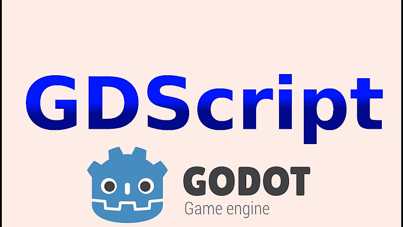
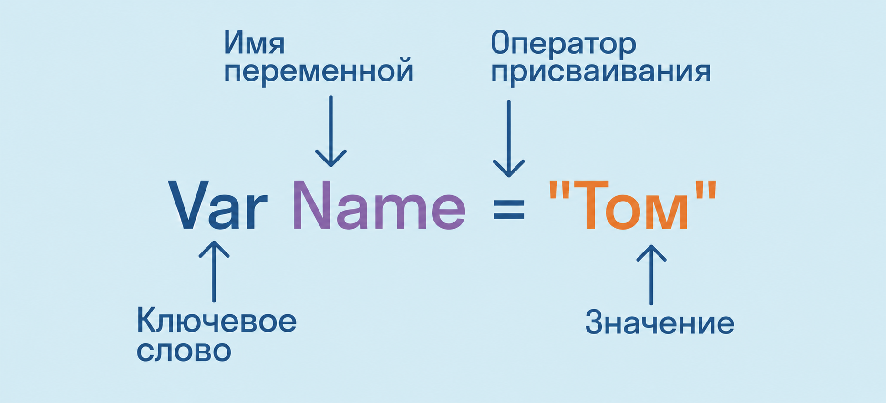
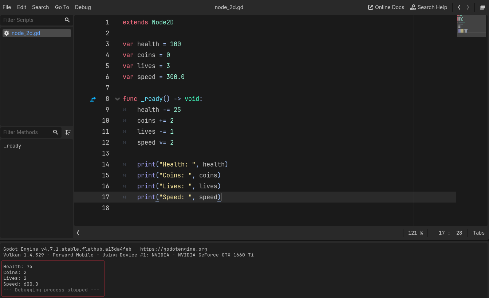

# Лекция 4. GDScript: переменные и данные игры



В первом модуле мы уже написали достаточно много кода. Player двигался, Score увеличивался, Timer отсчитывал время, а игра определяла момент победы и поражения.

Например, в `Catch the Coin` мы использовали такие строки:

```gdscript

var score = 0

var time_left = 30

```

До этого нам было достаточно понимать их назначение: одна переменная хранит количество очков, другая - оставшееся время. Теперь мы начнём разбирать GDScript значительно подробнее.

Во втором модуле основное внимание будет уделено программированию и игровой логике: как игра хранит данные, выполняет действия, принимает решения и управляет большим количеством объектов.

Начнём с основы - переменных и типов данных.

## GDScript и код игры

Godot предоставляет множество готовых возможностей: отображение графики, физику, столкновения, работу со сценами, звуком, интерфейсом и другими элементами игры. Но движок не знает правил конкретной игры.

Например, Godot не может самостоятельно решить:

- сколько здоровья должно быть у Player;

- сколько очков давать за собранный предмет;

- сколько времени должен длиться уровень;

- что произойдёт после столкновения с противником;

- когда игрок победил;

- когда должна закончиться игра.

Эти правила задаёт разработчик с помощью кода. Для написания игровой логики в Godot мы используем ****GDScript**** - язык программирования, разработанный специально для Godot.

Например:

```gdscript

var health = 100

var coins = 0

var speed = 300.0

```

Эти несколько строк уже описывают часть состояния игры:

- `health` хранит здоровье персонажа;

- `coins` - количество собранных предметов;

- `speed` - скорость движения.

Во время игры значения могут изменяться.

Player получил урон:

```gdscript

health = health - 20

```

Собрал монетку:

```gdscript

coins = coins + 1

```

Получил ускорение:

```gdscript

speed = speed * 2

```

Получается, что игровой процесс - это не только движение объектов и изображения на экране. Внутри игры постоянно хранятся и изменяются данные.

В этой лекции разберём основу работы с такими данными: переменные, их значения и основные типы данных.

---

## Переменные

Практически любая игра постоянно хранит информацию о своём текущем состоянии.

Например, во время игры нам может понадобиться знать:

- текущее здоровье Player;

- количество собранных предметов;

- количество жизней;

- скорость движения;

- имя персонажа;

- оставшееся время;

- закончилась игра или ещё продолжается.

Для хранения таких данных используются ****переменные****.



****Переменная**** - это имя, связанное с определённым значением, которое программа может использовать и изменять во время своей работы.

Рассмотрим простой пример:

```gdscript

var health = 100

```

Здесь:

- `var` сообщает GDScript, что мы создаём новую переменную;

- `health` - имя переменной;

- `100` - значение, которое в ней хранится.

Эту строку можно прочитать так:

*> Создать переменную `health` и сохранить в ней значение `100`.*

### Почему переменная называется переменной

Значение переменной не обязательно остаётся одинаковым на протяжении всей игры.

Представим, что в начале у Player есть `100` единиц здоровья:

```gdscript

var health = 100

```

Player получает урон, и количество здоровья уменьшается:

```gdscript

health = 80

```

Теперь `health` хранит значение `80`.

После следующего удара:

```gdscript

health = 50

```

Значение снова изменилось.

```text

Начало игры     health = 100

После удара     health = 80

Ещё один удар   health = 50

```

Имя переменной осталось тем же - `health`, но значение внутри неё изменялось во время игры.

Именно поэтому она называется переменной.

---

### Переменные описывают состояние игры

Один игровой объект обычно описывается сразу несколькими переменными.

Например:

```gdscript

var health = 100

var coins = 0

var lives = 3

var speed = 300.0

var player_name = "Alex"

var is_alive = true

```

Здесь хранится разная информация о Player:

- `health` - здоровье;

- `coins` - количество собранных предметов;

- `lives` - количество жизней;

- `speed` - скорость движения;

- `player_name` - имя персонажа;

- `is_alive` - жив ли персонаж.

Когда в игре происходит какое-либо событие, часть этих данных может измениться.

Например, Player собирает предмет:

```gdscript

coins = coins + 1

```

Получает урон:

```gdscript

health = health - 20

```

Теряет жизнь:

```gdscript

lives = lives - 1

```

Получает ускорение:

```gdscript

speed = speed * 2

```

Таким образом, переменные позволяют хранить ****текущее состояние игры****, а игровые события изменяют это состояние.

---

### Создание и изменение переменной

Важно различать два действия:

1. создание новой переменной;

2. изменение значения уже существующей переменной.

Создание:

```gdscript

var score = 0

```

Здесь появляется новая переменная `score`.

После этого её значение можно изменить:

```gdscript

score = 10

```

При создании используется `var`.

При дальнейшем изменении переменной писать `var` повторно не нужно.

Неправильно:

```gdscript

var score = 0

var score = 10

```

В таком случае мы пытаемся снова создать переменную `score` с тем же именем.

Правильно:

```gdscript

var score = 0

score = 10

```

Сначала переменная создаётся, а затем получает новое значение.

---

### Оператор присваивания

Знак `=` называется ****оператором присваивания****.

Например:

```gdscript

var coins = 5

```

означает:

*> Сохранить значение `5` в переменной `coins`.*

Позже мы можем написать:

```gdscript

coins = 10

```

Теперь в этой же переменной хранится значение `10`.

Важно понимать, что `=` в программировании - это не математический знак равенства.

Рассмотрим строку:

```gdscript

coins = coins + 1

```

Предположим, сейчас:

```gdscript

coins = 5

```

Сначала программа берёт текущее значение:

```text

5

```

затем прибавляет:

```text

5 + 1

```

получает:

```text

6

```

и сохраняет результат обратно в `coins`.

Теперь:

```text

coins = 6

```

Таким способом значение переменной можно изменять на основе её предыдущего значения.

---

### Переменные из Catch the Coin

В предыдущем модуле мы уже использовали переменные:

```gdscript

var score = 0

var time_left = 30

var total_coins = 0

```

Тогда нас в первую очередь интересовал результат работы игры. Теперь можно посмотреть на этот код уже с точки зрения программирования.

`score` хранил количество собранных Coin:

```gdscript

var score = 0

```

`time_left` хранил оставшееся время:

```gdscript

var time_left = 30

```

`total_coins` хранил количество Coin на уровне:

```gdscript

var total_coins = 0

```

Во время игры эти значения изменялись.

Например:

```gdscript

score = score + 1

```

и:

```gdscript

time_left = time_left - 1

```

Получается, что большая часть логики `Catch the Coin` уже была построена вокруг переменных.

Теперь мы будем использовать их не просто как готовые строки кода, а понимать, какие данные они хранят и как эти данные изменяются.

---

## Создаём GDScriptLab

До этого мы рассматривали отдельные строки кода как примеры. Теперь создадим проект, в котором сможем правильно запускать и проверять их.

Для изучения GDScript создадим отдельный небольшой проект:

```text

GDScriptLab

```

Здесь нам не понадобятся Player, CollisionShape2D, Coin или другие игровые объекты. Проект нужен только для экспериментов с кодом.

Создайте новую Scene с корневым `Node2D` и подключите к нему скрипт.

В начале получится:

```gdscript

extends Node2D

```

Переменные можно создавать непосредственно в скрипте:

```gdscript

extends Node2D

var health = 100

var coins = 0

```

Но команды, которые должны выполняться во время запуска программы, нельзя просто писать между объявлениями переменных.

Для наших экспериментов будем использовать:

```gdscript

func _ready() -> void:

```

`_ready()` автоматически выполняется Godot после запуска Scene.

Например:

```gdscript

extends Node2D

var health = 100

func _ready() -> void:

    health = health - 20

```

Пока воспринимайте `_ready()` просто как место, куда мы будем помещать код, который необходимо выполнить после запуска Scene.

Подробно функции, `func`, `_ready()` и другие функции Godot разберём на следующей лекции.

---

## Как посмотреть значение переменной

Переменная хранит данные внутри программы, но во время разработки нам часто необходимо увидеть её текущее значение.

Например, мы написали:

```gdscript

var health = 100

```

Затем изменили здоровье:

```gdscript

health = health - 20

```

Мы ожидаем, что теперь:

```text

health = 80

```

Но как это проверить? Для вывода информации в Godot используется `print()`.

Добавим его внутрь `_ready()`:

```gdscript

extends Node2D

func _ready() -> void:

    print("Hello")

```

После запуска проекта результат появится во вкладке `Output`:

```text

Hello

```

`print()` выводит информацию в `Output`.

Важно: этот текст ****не появляется внутри самой игры****. `print()` используется разработчиком для проверки работы программы.

---

### Вывод значения переменной

В `print()` можно передать переменную:

```gdscript

extends Node2D

var health = 100

func _ready() -> void:

    print(health)

```

После запуска в `Output` появится:

```text

100

```

Теперь изменим значение:

```gdscript

extends Node2D

var health = 100

func _ready() -> void:

    health = health - 20

    print(health)

```

Получим:

```text

80

```

Так мы можем проверить, действительно ли переменная изменилась.

---

### Добавляем описание к результату

Если программа содержит много переменных, просто числа в `Output` читать неудобно.

Например:

```text

100

5

3

```

Не сразу понятно, что означает каждое значение. Поэтому вместе с переменной можно вывести поясняющий текст:

```gdscript

extends Node2D

var health = 100

var coins = 5

var lives = 3

func _ready() -> void:

    print("Health: ", health)

    print("Coins: ", coins)

    print("Lives: ", lives)

```

В `Output` получим:

```text

Health: 100

Coins: 5

Lives: 3

```

Такой результат читать намного удобнее.

---

### print() как инструмент проверки

`print()` особенно полезен во время разработки игровой логики. Например, внутри `_ready()` мы можем проверить изменение здоровья:

```gdscript

health = health - 20

print("Health: ", health)

```

Или количество собранных предметов:

```gdscript

coins = coins + 1

print("Coins: ", coins)

```

Также можно просто вывести сообщение:

```gdscript

print("Player collected item")

```

или:

```gdscript

print("Player touched enemy")

```

Если сообщение появляется в `Output`, значит соответствующая строка кода была выполнена. Именно так мы уже использовали `Output` во время работы с Bomb:

```text

BOOM!

```

Теперь мы понимаем, откуда такие сообщения появляются и зачем они нужны.

На этом этапе главное запомнить:

*> `print()` выводит данные в `Output` и позволяет разработчику проверять, что происходит внутри программы.*

Дальше мы будем активно использовать `print()` в примерах, поэтому теперь сможем сразу видеть значения переменных и результат выполнения кода.

---

## Типы данных

Мы уже знаем, что переменная хранит определённое значение.

Например:

```gdscript

var health = 100

var speed = 300.0

var player_name = "Alex"

var is_alive = true

```

Но значения в этих переменных разные:

- `100` - целое число;

- `300.0` - число с дробной частью;

- `"Alex"` - текст;

- `true` - логическое значение.

Для каждого вида данных существует свой ****тип данных****. Тип данных определяет, ****какую информацию хранит переменная и как с этой информацией можно работать****. В GDScript существует много разных типов данных, но сейчас нам достаточно четырёх основных:

```text

int

float

String

bool

```

---

### int - целые числа

Тип `int` используется для хранения целых чисел.

Например:

```gdscript

var health = 100

var coins = 5

var lives = 3

var score = 0

```

Все эти значения являются целыми числами:

```text

0

3

25

100

-10

```

В играх целые числа встречаются постоянно.

С помощью `int` удобно хранить:

- количество жизней;

- количество собранных предметов;

- количество патронов;

- очки;

- уровень персонажа;

- количество противников;

- здоровье, если в игре оно считается целыми единицами.

Например:

```gdscript

var health = 100

var coins = 5

var lives = 3

```

Для проверки значений используем уже знакомый `print()`.

Добавим внутри `_ready()`:

```gdscript

print("Health: ", health)

print("Coins: ", coins)

print("Lives: ", lives)

```

В `Output` получим:

```text

Health: 100

Coins: 5

Lives: 3

```

Значения таких переменных можно изменять:

```gdscript

health = health - 20

coins = coins + 1

lives = lives - 1

```

Теперь внутри переменных будут находиться другие значения:

```text

health = 80

coins = 6

lives = 2

```

Для этих данных дробная часть обычно не нужна. Например, количество жизней:

```text

Lives: 3

```

выглядит логично.

А значение:

```text

Lives: 2.7

```

для большинства игр уже не имеет смысла. Поэтому для количества жизней лучше подходит `int`.

---

### float - числа с дробной частью

Тип `float` используется для хранения чисел с дробной частью.

Например:

```gdscript

var speed = 300.0

var damage = 12.5

var cooldown = 1.5

```

Обратите внимание на разницу:

```text

100      → целое число

100.0    → число с дробной частью

```

В играх `float` используется очень часто.

Например, для хранения:

- скорости;

- времени;

- координат;

- ускорения;

- силы прыжка;

- задержки между действиями;

- различных физических значений.

С одним таким значением мы уже работали в первой игре:

```gdscript

var speed = 300.0

```

Переменная `speed` определяла скорость движения Player. Если изменить значение:

```gdscript

speed = 150.0

```

Player сможет двигаться медленнее. Если увеличить:

```gdscript

speed = 500.0

```

движение станет быстрее. Можно хранить и более точные значения:

```gdscript

var attack_delay = 1.5

var jump_power = 425.5

var enemy_speed = 185.25

```

То есть `float` нужен там, где целого числа недостаточно и требуется дробная часть.

---

### int и float

Оба типа используются для хранения чисел, но назначение у них немного разное.

```text

int

↓

целые числа

float

↓

числа с дробной частью

```

Например:

```gdscript

var lives = 3

var speed = 300.0

```

Для количества жизней достаточно целого числа:

```text

3

```

А скорость вполне может быть:

```text

300.5

```

Поэтому выбор типа зависит от того, ****какие данные мы хотим хранить****.

---

### String - текст

Для хранения текста используется тип `String`.

Например:

```gdscript

var player_name = "Alex"

var weapon_name = "Sword"

var message = "GAME OVER"

```

Строковые значения записываются в кавычках:

```gdscript

"Player"

"Hello"

"Level 1"

"YOU WIN!"

```

Кавычки здесь обязательны.

Рассмотрим:

```gdscript

var player_name = "Alex"

```

`"Alex"` - текстовое значение.

Если убрать кавычки:

```gdscript

var player_name = Alex

```

GDScript уже не будет воспринимать `Alex` как обычный текст. Он будет искать в коде имя `Alex`, например переменную или другой существующий элемент. Если такого имени нет, появится ошибка. Поэтому текст записывается в кавычках.

---

### Где используется String

Строки встречаются практически в любой игре. Например, они могут хранить:

- имя персонажа;

- название оружия;

- название уровня;

- текст диалога;

- сообщение игроку;

- название предмета;

- текст интерфейса.

Создадим несколько строк:

```gdscript

var player_name = "Alex"

var weapon_name = "Sword"

var level_name = "Dark Forest"

```

Внутри `_ready()` проверим их:

```gdscript

print("Player: ", player_name)

print("Weapon: ", weapon_name)

print("Level: ", level_name)

```

В `Output`:

```text

Player: Alex

Weapon: Sword

Level: Dark Forest

```

Здесь `print()` получает обычный текст:

```gdscript

"Player: "

```

и значение переменной:

```gdscript

player_name

```

Поэтому в результате мы можем увидеть оба значения рядом.

---

### bool - логические значения

Иногда игре не нужно хранить число или текст. Нужно сохранить только одно из двух состояний:

```text

да / нет

```

Для этого используется тип `bool`. Он может содержать только два значения:

```gdscript

true

false

```

Например:

```gdscript

var is_alive = true

var has_key = false

var is_game_over = false

```

Такие переменные удобно воспринимать как ответы на вопросы.

```text

is_alive

Player жив?

→ true

```

```text

has_key

Есть ли у Player ключ?

→ false

```

```text

is_game_over

Игра закончена?

→ false

```

---

### Изменение bool

Значение `bool` тоже может изменяться во время игры. Например, в начале у Player нет ключа:

```gdscript

var has_key = false

```

После того как Player его получил:

```gdscript

has_key = true

```

Теперь состояние изменилось:

```text

до получения ключа:

has_key = false

после получения ключа:

has_key = true

```

Другой пример:

```gdscript

var is_alive = true

```

Пока Player жив:

```text

is_alive = true

```

После его смерти значение можно изменить:

```gdscript

is_alive = false

```

Внутри `_ready()` проверим значения:

```gdscript

print("Alive: ", is_alive)

print("Has key: ", has_key)

```

Например, в `Output` можем получить:

```text

Alive: false

Has key: true

```

Позже мы научим игру использовать такие значения для принятия решений. Например, состояние `has_key` сможет определять, можно ли открыть дверь. Но сами условия и проверку таких состояний мы разберём отдельно.

---

### Один объект - разные типы данных

Один игровой объект обычно содержит сразу несколько видов информации. Например, Player можно описать такими переменными:

```gdscript

var player_name = "Alex"

var health = 100

var speed = 300.0

var lives = 3

var is_alive = true

```

Здесь используются сразу четыре типа данных:

| Переменная | Значение | Тип данных |

| -------------------- | ---------------- | ------------------- |

| `player_name`      | `"Alex"`       | `String`          |

| `health`           | `100`          | `int`             |

| `speed`            | `300.0`        | `float`           |

| `lives`            | `3`            | `int`             |

| `is_alive`         | `true`         | `bool`            |

Все эти переменные относятся к одному Player, но хранят совершенно разную информацию. Можно представить состояние персонажа так:

```text

Player

Name: Alex

Health: 100

Speed: 300.0

Lives: 3

Alive: true

```

Во время игры значения могут изменяться:

```gdscript

health = 70

speed = 450.0

lives = 2

is_alive = false

```

Сам Player остаётся тем же объектом, но его ****состояние**** уже изменилось.

---

### Как GDScript определяет тип данных

Когда мы пишем:

```gdscript

var health = 100

```

GDScript видит значение `100` и определяет, что это целое число. То же самое происходит с другими значениями:

```gdscript

var speed = 300.0

var player_name = "Alex"

var is_alive = true

```

GDScript понимает:

```text

100       → int

300.0     → float

"Alex"    → String

true      → bool

```

То есть сейчас нам не нужно отдельно указывать тип каждой переменной. Мы можем написать:

```gdscript

var health = 100

```

и GDScript определит тип по значению самостоятельно. В дальнейшем мы познакомимся и с записью, где тип указывается явно:

```gdscript

var health: int = 100

```

Но пока она нам не нужна.

---

### Почему тип данных важен

Посмотрим на два значения:

```gdscript

var coins = 5

```

и:

```gdscript

var coins_text = "5"

```

Визуально:

```text

5

"5"

```

они очень похожи. Но для программы это разные данные.

Первое значение:

```text

5

```

является числом. С ним можно выполнять математические операции:

```gdscript

coins = coins + 2

```

Результат:

```text

7

```

А:

```text

"5"

```

является текстом. Даже если внутри строки записана цифра, для программы она всё равно остаётся частью текста.

Поэтому при работе с переменными важно понимать не только ****какое значение мы сохраняем****, но и ****к какому типу данных оно относится****.

---

### Основные типы данных

| Тип     | Что хранит                       | Пример |

| ---------- | ----------------------------------------- | ------------ |

| `int`    | целые числа                     | `100`      |

| `float`  | числа с дробной частью | `300.0`    |

| `String` | текст                                | `"Alex"`   |

| `bool`   | логическое состояние   | `true`     |

Эти четыре типа данных будут постоянно использоваться в следующих лекциях и игровых проектах.

---

## Изменение значений и арифметические операции

Значение переменной можно изменять во время работы программы.

Например:

```gdscript

var health = 100

```

А внутри `_ready()`:

```gdscript

health = health - 20

```

Программа берёт текущее значение `health`, вычитает `20` и сохраняет результат обратно.

После выполнения:

```text

health = 80

```

Проверим через `print()`:

```gdscript

print("Health: ", health)

```

В `Output`:

```text

Health: 80

```

---

### Арифметические операции

С числовыми переменными можно выполнять обычные математические операции.

```gdscript

coins = coins + 1

```

```gdscript

health = health - 25

```

```gdscript

speed = speed * 2

```

```gdscript

damage = damage / 2

```

Основные операторы:

| Оператор | Действие   | Пример             |

| ---------------- | ------------------ | ------------------------ |

| `+`            | сложение   | `coins = coins + 1`    |

| `-`            | вычитание | `health = health - 20` |

| `*`            | умножение | `speed = speed * 2`    |

| `/`            | деление     | `damage = damage / 2`  |

Такие операции постоянно используются в играх:

- увеличить Score;

- уменьшить здоровье;

- потратить патрон;

- увеличить скорость;

- уменьшить оставшееся время.

---

## Сокращённая запись

GDScript позволяет записывать изменение переменной короче.

Вместо:

```gdscript

coins = coins + 1

```

можно написать:

```gdscript

coins += 1

```

То же самое работает с другими операциями:

```gdscript

health -= 20

speed *= 2

damage /= 2

```

| Полная запись | Сокращённая запись |

| ------------------------- | ----------------------------------- |

| `coins = coins + 1`     | `coins += 1`                      |

| `health = health - 20`  | `health -= 20`                    |

| `speed = speed * 2`     | `speed *= 2`                      |

| `damage = damage / 2`   | `damage /= 2`                     |

С такими записями мы уже встречались в `Catch the Coin`:

```gdscript

score += 1

time_left -= 1

```

Теперь понятно, что это просто сокращённая форма изменения текущего значения переменной.

---

### Пример

Соберём всё вместе в `GDScriptLab`:

```gdscript

extends Node2D

var health = 100

var coins = 0

var lives = 3

var speed = 300.0

func _ready() -> void:

    health -= 25

    coins += 2

    lives -= 1

    speed *= 2

    print("Health: ", health)

    print("Coins: ", coins)

    print("Lives: ", lives)

    print("Speed: ", speed)

```

В `Output`:

```text

Health: 75

Coins: 2

Lives: 2

Speed: 600.0

```



Так игровые события изменяют состояние объекта через обычные операции с переменными.

---

## Преобразование значения в текст

Мы уже видели, что `print()` умеет выводить числа и текст вместе:

```gdscript

var score = 5

print("Score: ", score)

```

В `Output` получим:

```text

Score: 5

```

Но при работе с интерфейсом ситуация немного другая. Например, свойство `text` у `Label` ожидает именно текст:

```gdscript

$UI/ScoreLabel.text = "Score: 5"

```

Если количество очков хранится в переменной:

```gdscript

var score = 5

```

нам нужно превратить число `5` в строку. Для этого используется `str()`:

```gdscript

str(score)

```

Теперь числовое значение можно объединить с текстом:

```gdscript

$UI/ScoreLabel.text = "Score: " + str(score)

```

Если:

```gdscript

score = 5

```

на экране появится:

```text

Score: 5

```

---

### Зачем нужен str()

Рассмотрим два значения:

```gdscript

var score = 5

var message = "Score: "

```

`score` хранит число, а `message` - текст. Чтобы объединить их:

```gdscript

message + str(score)

```

получим:

```text

Score: 5

```

`str()` преобразует значение в текстовое представление. Например:

```gdscript

str(100)

```

даст:

```text

"100"

```

А:

```gdscript

str(25.5)

```

даст:

```text

"25.5"

```

---

### str() в Catch the Coin

В предыдущей игре мы уже использовали:

```gdscript

$UI/ScoreLabel.text = "Score: " + str(score)

```

и:

```gdscript

$UI/TimerLabel.text = "Time: " + str(time_left)

```

Теперь понятно, зачем там был нужен `str()`. Переменные:

```gdscript

score

time_left

```

хранили числа, а `Label.text` должен был получить готовый текст. Поэтому:

```text

число

↓

str()

↓

текст

↓

Label

```

Подробно встроенные функции GDScript мы разберём на следующей лекции. Пока достаточно знать, что `str()` позволяет преобразовать значение в строку.

---

## Имена переменных

Переменной можно дать практически любое допустимое имя, но хорошее имя должно сразу объяснять, ****какие данные в ней хранятся****.

Например:

```gdscript

var a = 100

var x = 3

var value = false

```

Такой код работает, но спустя некоторое время становится сложно понять, что означают эти переменные.

Гораздо понятнее:

```gdscript

var health = 100

var lives = 3

var is_alive = false

```

По имени сразу видно назначение каждой переменной.

---

### snake_case

В GDScript для имён переменных обычно используется стиль `snake_case`.

Слова записываются маленькими буквами и разделяются символом `_`:

```gdscript

var player_health = 100

var move_speed = 300.0

var collected_coins = 0

var player_name = "Alex"

var has_golden_key = false

```

Если имя состоит из одного слова:

```gdscript

var health = 100

var score = 0

var speed = 300.0

```

символ `_` не нужен.

---

### Хорошие и плохие имена

Неудачно:

```gdscript

var h = 100

var s = 300.0

var c = 5

```

Лучше:

```gdscript

var health = 100

var speed = 300.0

var coins = 5

```

Не стоит делать имя и слишком длинным:

```gdscript

var current_amount_of_coins_collected_by_player = 5

```

Достаточно:

```gdscript

var collected_coins = 5

```

Главное правило:

*> По имени переменной должно быть понятно, какую информацию она хранит.*

---

### Имена для bool

Для переменных типа `bool` особенно удобно использовать имена, которые можно прочитать как вопрос:

```gdscript

var is_alive = true

var has_key = false

var is_game_over = false

```

Например:

```text

is_alive

→ Player жив?

has_key

→ У Player есть ключ?

is_game_over

→ Игра закончена?

```

Такие имена делают игровую логику значительно понятнее, особенно когда позже мы начнём использовать условия.

---

## Vector2

Кроме обычных типов данных, в Godot есть специальные типы, которые используются для работы с игровыми объектами. Один из самых распространённых - `Vector2`. Мы уже встречали его при движении Player.

Например:

```gdscript

var start_position = Vector2(100, 200)

```

`Vector2` хранит сразу два числовых значения:

```text

X = 100

Y = 200

```

Обычно они используются для координат, направления и движения в 2D-пространстве.

Например:

```gdscript

var direction = Vector2(1, 0)

```

Такое значение означает направление вправо:

```text

X = 1

Y = 0

```

А:

```gdscript

var position = Vector2(400, 250)

```

может описывать положение объекта на экране. В первой игре мы уже использовали `Vector2`, когда получали направление движения Player:

```gdscript

var direction = Input.get_vector(

    "ui_left",

    "ui_right",

    "ui_up",

    "ui_down"

)

```

Результатом `Input.get_vector()` был именно `Vector2`. То есть переменная может хранить не только число, текст или `true / false`, но и специальные данные Godot.

Например:

```text

int

float

String

bool

Vector2

```

Позже мы встретим и другие типы Godot, когда они понадобятся в игровых проектах.

---

## Практика

Создайте в `GDScriptLab` собственный набор характеристик игрового персонажа.

### Задание

Добавьте минимум шесть переменных:

- имя персонажа;

- здоровье;

- скорость;

- количество жизней;

- количество монет или другого ресурса;

- одну переменную типа `bool`.

Например:

```gdscript

var player_name = "Knight"

var health = 120

var speed = 250.0

var lives = 3

var coins = 10

var has_key = false

```

Внутри `_ready()` смоделируйте несколько игровых событий.

Например:

- Player получил урон;

- нашёл монеты;

- потерял одну жизнь;

- получил ускорение;

- нашёл ключ.

Используйте сокращённые операции:

```gdscript

health -= 20

coins += 5

lives -= 1

speed *= 2

has_key = true

```

После изменений выведите текущие значения в `Output`:

```gdscript

print("Player: ", player_name)

print("Health: ", health)

print("Speed: ", speed)

print("Lives: ", lives)

print("Coins: ", coins)

print("Has key: ", has_key)

```

### Результат

В `Output` должны отображаться актуальные характеристики персонажа после всех изменений. Главное - самостоятельно выбрать названия переменных, их начальные значения и игровые события.

---

## Домашнее задание

На своём компьютере создайте новый проект Godot для практики GDScript. Назовите его, например: `GDScriptLab`

Создайте простую Scene с корневым `Node2D` и подключите к нему скрипт.

### Задание

Создайте собственный набор данных для игрового персонажа.

Добавьте минимум:

- имя персонажа;

- здоровье;

- скорость;

- количество жизней;

- количество очков или другого ресурса;

- один параметр типа `bool`;

- одну переменную типа `Vector2`.

Например:

```gdscript

var player_name = "Ranger"

var health = 150

var speed = 280.0

var lives = 3

var score = 0

var has_key = false

var start_position = Vector2(200, 150)

```

Внутри `_ready()` самостоятельно придумайте несколько игровых событий и измените значения переменных.

Например:

- Player получил урон;

- получил очки;

- потерял жизнь;

- получил ускорение;

- нашёл ключ;

- изменил позицию.

Используйте обычные и сокращённые операции:

```gdscript

health -= 30

score += 100

lives -= 1

speed *= 1.5

has_key = true

```

После изменений выведите итоговые значения в `Output` с помощью `print()`.

### Результат

После запуска Scene в `Output` должны отображаться актуальные характеристики персонажа.

По коду должно быть понятно:

- какие данные хранит каждая переменная;

- какие типы данных используются;

- какие значения изменились;

- какие игровые события были смоделированы.

### Дополнительное задание

Добавьте несколько характеристик по своей идее.

Например:

- `mana`;

- `armor`;

- `ammo`;

- `level`;

- `experience`;

- `is_invisible`;

- `has_weapon`.

Главное - использовать понятные имена переменных и подходящие типы данных.

---

## Итоги

На этой лекции мы начали подробно разбирать GDScript и то, как игра хранит данные.

Мы изучили:

- переменные и `var`;

- изменение значений;

- типы данных `int`, `float`, `String`, `bool`;

- `print()` и вкладку `Output`;

- арифметические операции;

- сокращённую запись `+=`, `-=`, `*=`, `/=`;

- преобразование значения в текст через `str()`;

- правила понятных имён переменных;

- `Vector2` как один из типов Godot.

Теперь мы умеем описывать состояние игрового объекта с помощью данных и изменять это состояние во время работы программы.

На следующей лекции перейдём к ****функциям**** и разберём, как объединять действия в отдельные блоки кода и вызывать их тогда, когда это необходимо.