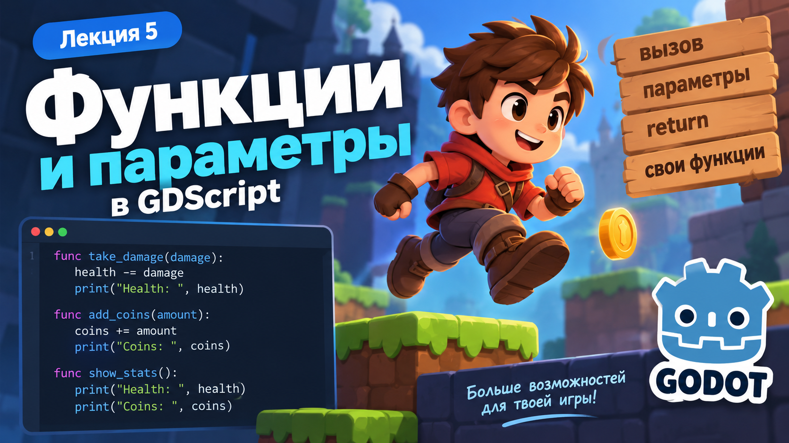
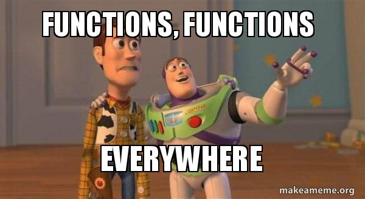
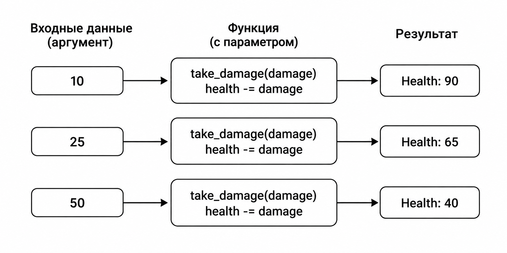
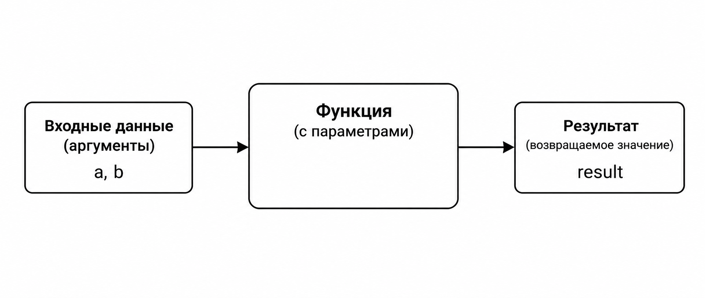

# Лекция 5. Функции и параметры в GDScript



На прошлой лекции мы разобрали, как игра хранит данные с помощью переменных. Например:

```gdscript
var health = 100
var coins = 0
var speed = 300.0
```

Мы научились изменять эти значения:

```gdscript
health -= 20
coins += 1
speed *= 2
```

Но по мере роста программы возникает новая проблема: одни и те же действия приходится выполнять несколько раз. Например, Player может получать урон не один раз за игру:

```gdscript
health -= 20
print("Health: ", health)

health -= 20
print("Health: ", health)

health -= 20
print("Health: ", health)
```

Такой код работает, но постоянно повторять одинаковые строки неудобно. Если позже мы захотим изменить механику получения урона, придётся искать и исправлять каждый повторяющийся участок. Для решения этой проблемы используются **функции**.

---

## Что такое функция



**Функция** - это отдельный блок кода, которому мы даём имя и который можно выполнять тогда, когда он нужен. Например:

```gdscript
func say_hello():
    print("Hello")
```

У функции есть имя и тело. Имя функции позволяет нам её вызывать, а тело содержит действия, которые будут выполнены при вызове. Здесь мы создали функцию с именем:

```text
say_hello
```

Внутри неё находится действие:

```gdscript
print("Hello")
```

Разберём запись:

```gdscript
func say_hello():
    print("Hello")
```

- `func` сообщает GDScript, что мы создаём функцию;
- `say_hello` - имя функции;
- `()` используются при создании и вызове функции;
- `:` обозначает начало блока кода;
- код функции записывается с отступом.

Код внутри функции называется её **телом**. Например:

```gdscript
func say_hello():
    print("Hello")
```

Здесь строка:

```gdscript
print("Hello")
```

является телом функции. Важно: создание функции ещё не означает, что её код сразу выполнится. Чтобы функция начала работать, её необходимо **вызвать**.

---

## Функция \_ready()

На прошлой лекции в `GDScriptLab` мы уже использовали такую запись:

```gdscript
func _ready() -> void:
    print("Hello")
```

Тогда мы договорились воспринимать `_ready()` просто как место, где можно запускать код. Теперь разберём, что это такое.

`_ready()` - это функция Godot, которая автоматически вызывается, когда Node становится готов к работе после запуска Scene.

Например:

```gdscript
extends Node2D

func _ready() -> void:
    print("Scene started")
```

После запуска Scene в `Output` появится:

```text
Scene started
```

При этом мы нигде не писали:

```gdscript
_ready()
```

Godot вызвал эту функцию самостоятельно.

---

### Почему имя начинается с \_

В Godot есть специальные функции, которые движок знает заранее.

Например:

```gdscript
_ready()
_process()
_physics_process()
```

Такие функции вызываются Godot автоматически в определённый момент. Многие специальные функции Godot имеют _ в начале имени. Но сам символ _ не делает функцию автоматической - Godot вызывает только те функции, которые предусмотрены движком.

Например:

```gdscript
func _ready():
```

- функция Godot.

А:

```gdscript
func say_hello():
```

- функция, которую создали мы.

---

### Что происходит при запуске Scene

Рассмотрим:

```gdscript
extends Node2D

var health = 100

func _ready() -> void:
    health -= 20
    print("Health: ", health)
```

После запуска Scene происходит следующее:

```text
Scene запускается
↓
Node становится готов
↓
Godot вызывает _ready()
↓
health уменьшается
↓
print() выводит результат
```

Именно поэтому `_ready()` был удобен в `GDScriptLab`: весь код внутри него выполнялся сразу после запуска Scene.

---

### \_ready() тоже является функцией

Запись:

```gdscript
func _ready() -> void:
```

содержит те же основные элементы, что и обычная функция:

- `func` - создание функции;
- `_ready` - имя;
- `()` - круглые скобки;
- `:` - начало тела функции;
- код с отступом - тело функции.

Но есть важное отличие. Обычную функцию:

```gdscript
func say_hello():
    print("Hello")
```

Godot сам не вызовет. Её нужно вызвать самостоятельно. А `_ready()` Godot запускает автоматически.

---

### Что означает -> void

В записи:

```gdscript
func _ready() -> void:
```

часть:

```gdscript
-> void
```

означает, что функция не возвращает результат. Пока достаточно просто понимать эту запись. Позже в этой лекции мы разберём функции, которые умеют возвращать значения с помощью `return`.

---

Таким образом:

```text
_ready()
→ вызывает Godot

обычная функция
→ вызываем сами
```

Теперь можно перейти к тому, как самостоятельно вызывать созданные функции.

---

## Вызов функции

Обычная функция не выполняется автоматически. После её создания нужно указать программе, **когда именно её запустить**. Например, создадим функцию:

```gdscript
func say_hello():
    print("Hello")
```

Сейчас функция существует, но её код ещё не выполнялся. Чтобы запустить функцию, нужно написать её имя и круглые скобки:

```gdscript
say_hello()
```

Это называется **вызовом функции**.

---

### Создание и вызов функции

В `GDScriptLab` можно использовать `_ready()` для запуска нашей функции:

```gdscript
extends Node2D

func _ready() -> void:
    say_hello()

func say_hello():
    print("Hello")
```

После запуска Scene происходит следующее:

```text
Godot вызывает _ready()
↓
внутри _ready() вызывается say_hello()
↓
выполняется код функции
↓
в Output появляется Hello
```

Результат:

```text
Hello
```

Обратите внимание на разницу:

```gdscript
func say_hello():
```

- создаёт функцию.

А:

```gdscript
say_hello()
```

- вызывает её.

---

### Функцию можно вызывать несколько раз

После создания функцию можно использовать столько раз, сколько необходимо.

```gdscript
func _ready() -> void:
    say_hello()
    say_hello()
    say_hello()

func say_hello():
    print("Hello")
```

В `Output`:

```text
Hello
Hello
Hello
```

Код функции написан один раз, но выполнился три раза.

---

### Игровой пример

Создадим переменную здоровья:

```gdscript
var health = 100
```

Теперь вынесем получение урона в отдельную функцию:

```gdscript
func take_damage():
    health -= 20
    print("Health: ", health)
```

Вызовем её несколько раз:

```gdscript
func _ready() -> void:
    take_damage()
    take_damage()
    take_damage()
```

После запуска:

```text
Health: 80
Health: 60
Health: 40
```

Вместо того чтобы каждый раз повторять:

```gdscript
health -= 20
print("Health: ", health)
```

мы используем один короткий вызов:

```gdscript
take_damage()
```

---

### Зачем разделять код на функции

Функции помогают разбивать программу на отдельные понятные действия.

Например:

```gdscript
take_damage()
add_coins()
show_stats()
restart_game()
```

По названию уже видно, какую задачу выполняет каждый участок кода.

Это делает программу:

- короче;
- понятнее;
- удобнее для изменения;
- проще для повторного использования.

Но пока наша функция `take_damage()` всегда уменьшает здоровье только на `20`. В реальной игре разные объекты могут наносить разный урон. Чтобы одна функция могла работать с разными значениями, используются **параметры**.

---

## Параметры функции

До этого наша функция `take_damage()` всегда уменьшала здоровье на одно и то же значение:

```gdscript
func take_damage():
    health -= 20
```

Если вызвать её несколько раз:

```gdscript
take_damage()
take_damage()
take_damage()
```

каждый вызов будет уменьшать `health` именно на `20`. Но в реальной игре источники урона могут быть разными:

- слабый Enemy наносит `10`;
- сильный Enemy - `25`;
- Bomb - `50`.

Создавать отдельную функцию для каждого случая неудобно. Вместо этого функция может получать данные при вызове. Для этого используются **параметры**.

---

### Добавляем параметр



Изменим функцию:

```gdscript
func take_damage(damage):
    health -= damage
    print("Health: ", health)
```

Теперь внутри круглых скобок появился:

```gdscript
damage
```

`damage` - это параметр функции. Параметр позволяет функции получить значение извне и использовать его внутри своего кода. Теперь функцию можно вызывать с разным уроном:

```gdscript
take_damage(10)
take_damage(25)
take_damage(50)
```

При каждом вызове значение параметра `damage` будет другим. Первый вызов:

```gdscript
take_damage(10)
```

означает:

```text
damage = 10
```

Второй:

```gdscript
take_damage(25)
```

означает:

```text
damage = 25
```

---

### Проверим в GDScriptLab

```gdscript
extends Node2D

var health = 100

func _ready() -> void:
    take_damage(10)
    take_damage(25)

func take_damage(damage):
    health -= damage
    print("Health: ", health)
```

В `Output`:

```text
Health: 90
Health: 65
```

Одна функция смогла выполнить одно и то же действие с разными значениями.

---

### Параметр и аргумент

Здесь важно различать два понятия. При создании функции:

```gdscript
func take_damage(damage):
```

`damage` называется **параметром**.

А при вызове:

```gdscript
take_damage(25)
```

значение `25` называется **аргументом**.

```text
func take_damage(damage)
                 ↑
              параметр

take_damage(25)
            ↑
         аргумент
```

Параметр показывает, какие данные функция ожидает получить. Аргумент - это конкретное значение, которое мы передаём при вызове.

---

### Зачем нужны параметры

Без параметра:

```gdscript
func take_damage():
    health -= 20
```

функция умеет выполнять только один конкретный вариант действия.

С параметром:

```gdscript
func take_damage(damage):
    health -= damage
```

она становится универсальнее. Теперь можно использовать:

```gdscript
take_damage(5)
take_damage(20)
take_damage(100)
```

и не создавать отдельную функцию для каждого значения. Параметры позволяют передавать в функцию данные и использовать одну и ту же логику в разных ситуациях.

---

## Несколько параметров

Функция может получать не одно, а сразу несколько значений. Например, создадим функцию, которая выводит информацию о полученном предмете:

```gdscript
func add_item(item_name, amount):
    print("Item: ", item_name)
    print("Amount: ", amount)
```

У функции два параметра:

```text
item_name
amount
```

При вызове нужно передать два аргумента:

```gdscript
add_item("Coin", 5)
```

Здесь:

```text
"Coin" → item_name
5      → amount
```

В `Output`:

```text
Item: Coin
Amount: 5
```

---

### Порядок аргументов

Аргументы передаются в том же порядке, в котором параметры записаны при создании функции.

```gdscript
func add_item(item_name, amount):
```

Правильный вызов:

```gdscript
add_item("Potion", 2)
```

Здесь:

```text
item_name = "Potion"
amount = 2
```

Если поменять аргументы местами:

```gdscript
add_item(2, "Potion")
```

функция получит данные уже в другом порядке. Поэтому при вызове важно понимать, какое значение соответствует каждому параметру.

---

### Игровой пример

Можно передать сразу несколько характеристик действия. Например:

```gdscript
func show_attack(enemy_name, damage):
    print("Enemy: ", enemy_name)
    print("Damage: ", damage)
```

Теперь одну функцию можно использовать для разных противников:

```gdscript
show_attack("Slime", 10)
show_attack("Skeleton", 25)
show_attack("Boss", 50)
```

В `Output`:

```text
Enemy: Slime
Damage: 10

Enemy: Skeleton
Damage: 25

Enemy: Boss
Damage: 50
```

Одна и та же функция работает с разными данными благодаря параметрам.

---

### Сколько параметров может быть

Функция может иметь:

```gdscript
func say_hello():
```

ни одного параметра;

```gdscript
func take_damage(damage):
```

один параметр;

```gdscript
func add_item(item_name, amount):
```

несколько параметров. Параметры записываются внутри круглых скобок и разделяются запятыми:

```gdscript
func function_name(parameter1, parameter2, parameter3):
```

Количество параметров зависит от того, какие данные нужны функции для выполнения её задачи.

---

## Возврат значения из функции



До этого наши функции в основном выполняли действия. Например:

```gdscript
func take_damage(damage):
    health -= damage
```

Такая функция изменяет значение `health`, но ничего не возвращает обратно. Иногда функция нужна не для изменения состояния, а для получения результата вычисления. Например, мы хотим рассчитать итоговый урон:

```gdscript
func calculate_damage(base_damage, multiplier):
    return base_damage * multiplier
```

Здесь используется `return`. `return` завершает работу функции и возвращает результат туда, откуда функция была вызвана.

---

### Получаем результат функции

Вызовем функцию:

```gdscript
calculate_damage(20, 2)
```

Она вычислит:

```text
20 * 2
```

и вернёт:

```text
40
```

Результат можно сохранить в переменную:

```gdscript
var final_damage = calculate_damage(20, 2)
```

Теперь:

```text
final_damage = 40
```

Проверим через `print()`:

```gdscript
print("Damage: ", final_damage)
```

В `Output`:

```text
Damage: 40
```

---

### Функция с return

Полный пример:

```gdscript
extends Node2D

func _ready() -> void:
    var final_damage = calculate_damage(20, 2)
    print("Damage: ", final_damage)

func calculate_damage(base_damage, multiplier):
    return base_damage * multiplier
```

Сначала вызывается:

```gdscript
calculate_damage(20, 2)
```

Параметры получают значения:

```text
base_damage = 20
multiplier = 2
```

Функция выполняет вычисление:

```text
20 * 2 = 40
```

После этого:

```gdscript
return 40
```

возвращает результат, и он сохраняется в:

```gdscript
final_damage
```

---

### Действие и возвращаемое значение

Сравним две функции.

Функция выполняет действие:

```gdscript
func take_damage(damage):
    health -= damage
```

Она изменяет `health`.

А эта функция возвращает результат:

```gdscript
func calculate_damage(base_damage, multiplier):
    return base_damage * multiplier
```

Она ничего не изменяет сама по себе, а вычисляет и отдаёт значение обратно.

Можно представить это так:

```text
take_damage(20)
↓
изменяет health
```

```text
calculate_damage(20, 2)
↓
вычисляет
↓
return 40
```

---

### Что означает -> void

Теперь можно вернуться к уже знакомой записи:

```gdscript
func _ready() -> void:
```

`void` означает, что функция не возвращает значение.

Например:

```gdscript
func show_message() -> void:
    print("Hello")
```

Функция выполняет действие, но не возвращает результат.

Если функция возвращает число, можно указать тип результата:

```gdscript
func calculate_damage(base_damage, multiplier) -> int:
    return base_damage * multiplier
```

Здесь:

```text
-> int
```

означает, что функция возвращает целое число.

На данном этапе достаточно понимать разницу:

```text
-> void
→ функция ничего не возвращает

return
→ функция возвращает результат
```

Позже типизацию функций мы будем использовать чаще.

---

## Готовые функции и методы Godot

До этого мы создавали собственные функции:

```gdscript
func take_damage(damage):
    health -= damage
```

```gdscript
func calculate_damage(base_damage, multiplier):
    return base_damage * multiplier
```

Имена таких функций, параметры и код внутри них определяем мы сами. Но в Godot существует большое количество уже готовых функций, которыми можно пользоваться без их создания. С некоторыми из них мы уже знакомы.

Например:

```gdscript
print("Hello")
```

`print()` выводит данные в `Output`.

```gdscript
str(score)
```

`str()` преобразует значение в текст. В первой игре мы использовали:

```gdscript
queue_free()
```

Эта функция удаляла Coin после сбора. Также встречали:

```gdscript
get_child_count()
```

которая позволяла узнать количество дочерних Node.

---

### Функции объектов

Некоторые функции принадлежат определённым объектам. Например:

```gdscript
$GameTimer.stop()
```

Здесь:

```text
$GameTimer
```

- объект Timer,

а:

```text
stop()
```

- функция, которая останавливает этот Timer.

Другой пример:

```gdscript
$UI/GameOverPanel.show()
```

`show()` делает объект видимым.

Или:

```gdscript
$Player.set_physics_process(false)
```

`set_physics_process()` управляет выполнением физического кода Node.

---

### Свои и готовые функции

Можно разделить функции на две большие группы. **Готовые функции** уже существуют в GDScript или Godot:

```gdscript
print()
str()
queue_free()
show()
stop()
get_child_count()
```

Мы просто вызываем их. **Собственные функции** создаём сами:

```gdscript
func take_damage(damage):
    health -= damage
```

```gdscript
func add_coins(amount):
    coins += amount
```

```gdscript
func show_stats():
    print("Health: ", health)
    print("Coins: ", coins)
```

Собственные функции нужны для логики именно нашей игры.

---

### Функции могут использовать другие функции

Внутри собственной функции можно вызывать другие функции.

Например:

```gdscript
func take_damage(damage):
    health -= damage
    print("Health: ", health)
```

Здесь внутри нашей функции `take_damage()` используется готовая функция `print()`. Можно вызвать и другую собственную функцию:

```gdscript
func take_damage(damage):
    health -= damage
    show_stats()

func show_stats():
    print("Health: ", health)
```

Теперь после получения урона `take_damage()` вызывает `show_stats()`. Так программа постепенно разделяется на небольшие части, каждая из которых отвечает за свою задачу.

---

## Собираем всё вместе

Теперь объединим основные возможности функций в одном небольшом примере. Создадим данные Player:

```gdscript
var health = 100
var coins = 0
```

Добавим функцию получения урона:

```gdscript
func take_damage(damage):
    health -= damage
```

Функцию получения монет:

```gdscript
func add_coins(amount):
    coins += amount
```

Функцию для расчёта усиленного урона:

```gdscript
func calculate_damage(base_damage, multiplier):
    return base_damage * multiplier
```

И функцию для вывода текущего состояния Player:

```gdscript
func show_stats():
    print("Health: ", health)
    print("Coins: ", coins)
```

Теперь используем их внутри `_ready()`:

```gdscript
extends Node2D

var health = 100
var coins = 0

func _ready() -> void:
    take_damage(20)
    add_coins(5)

    var strong_damage = calculate_damage(15, 2)
    take_damage(strong_damage)

    show_stats()

func take_damage(damage):
    health -= damage

func add_coins(amount):
    coins += amount

func calculate_damage(base_damage, multiplier):
    return base_damage * multiplier

func show_stats():
    print("Health: ", health)
    print("Coins: ", coins)
```

Разберём, что происходит после запуска Scene.

Сначала:

```gdscript
take_damage(20)
```

уменьшает здоровье:

```text
100 → 80
```

Затем:

```gdscript
add_coins(5)
```

добавляет монеты:

```text
0 → 5
```

После этого:

```gdscript
var strong_damage = calculate_damage(15, 2)
```

функция рассчитывает:

```text
15 * 2 = 30
```

и возвращает результат.

Значение `30` сохраняется в переменную:

```gdscript
strong_damage
```

После этого:

```gdscript
take_damage(strong_damage)
```

ещё раз уменьшает здоровье:

```text
80 → 50
```

В конце:

```gdscript
show_stats()
```

выводит итоговое состояние:

```text
Health: 50
Coins: 5
```

В этом небольшом примере используются сразу все основные возможности, которые мы разобрали:

- создание собственных функций;
- вызов функций;
- параметры;
- аргументы;
- несколько параметров;
- `return`;
- использование результата одной функции в другой функции.

Теперь можно переходить к самостоятельной практике.

---

## Практика. Function Arena

Перед вами готовый проект `Function Arena`. Интерфейс уже создан:

- отображается `Health`;
- отображается `Coins`;
- добавлены кнопки действий;
- дизайн полностью готов;
- к `Main` подключён пустой `main.gd`.

Но игровая логика отсутствует. Ваша задача - самостоятельно написать функции и подключить кнопки так, чтобы интерфейс начал работать.

### Исходные данные

В начале игры:

```text
Health: 100
Coins: 0
```

Создайте две переменные:

```text
health
coins
```

Начальные значения:

```text
health = 100
coins = 0
```

---

### Функции

Необходимо создать следующие функции.

#### Получение урона

```text
take_damage(damage)
```

Функция получает количество урона и уменьшает `health` на это значение. Одна функция должна использоваться сразу для двух кнопок:

```text
-10 HP
-25 HP
```

---

#### Лечение

```text
heal(amount)
```

Функция получает количество здоровья и увеличивает `health`. Кнопка:

```text
+20 HP
```

должна добавлять `20` здоровья.

---

#### Получение монет

```text
add_coins(amount)
```

Функция получает количество монет и увеличивает `coins`. Кнопка:

```text
+5 COINS
```

должна добавлять `5` монет.

---

#### Расчёт бонуса

Создайте функцию:

```text
calculate_bonus(amount, multiplier)
```

Она должна получить два параметра:

- количество монет;
- множитель.

Функция должна **вернуть результат с помощью `return`**.

Кнопка:

```text
DOUBLE BONUS
```

должна использовать:

```text
amount = 10
multiplier = 2
```

и добавить игроку:

```text
20 Coins
```

---

### Обновление интерфейса

Создайте отдельную функцию:

```text
update_ui()
```

Она должна обновлять:

```text
HealthLabel
CoinsLabel
```

После любого действия на экране должны отображаться актуальные значения.

---

### Подключение кнопок

Самостоятельно подключите сигнал:

```text
pressed()
```

для каждой кнопки к `Main`. После нажатия кнопка должна вызвать нужную функцию с нужным аргументом. Должно работать так:

```text
-10 HP
→ take_damage(10)

-25 HP
→ take_damage(25)

+20 HP
→ heal(20)

+5 COINS
→ add_coins(5)

DOUBLE BONUS
→ calculate_bonus(10, 2)
→ return 20
→ добавить 20 Coins
```

После каждого действия необходимо обновить интерфейс.

---

### Результат

После выполнения практики все кнопки `Function Arena` должны работать. Например:

```text
Health: 100
Coins: 0
```

Нажимаем:

```text
-25 HP
```

Получаем:

```text
Health: 75
Coins: 0
```

Нажимаем:

```text
+20 HP
```

Получаем:

```text
Health: 95
Coins: 0
```

Нажимаем:

```text
+5 COINS
```

Получаем:

```text
Health: 95
Coins: 5
```

Нажимаем:

```text
DOUBLE BONUS
```

Получаем:

```text
Health: 95
Coins: 25
```

### Главное условие

Не создавайте отдельную функцию для каждой кнопки. Используйте параметры, чтобы одна функция могла работать с разными значениями. Например, кнопки `-10 HP` и `-25 HP` должны использовать одну функцию:

```text
take_damage(damage)
```

но передавать в неё разные аргументы.

---

## Домашнее задание

Создайте на своём компьютере новый проект Godot для практики функций. Назовите его, например:

```text
FunctionLab
```

Создайте простую Scene с корневым `Node2D` и подключите к нему скрипт.

### Задание

Придумайте собственного игрового персонажа или объект. Например:

- рыцарь;
- маг;
- космический корабль;
- робот;
- гонщик;
- герой RPG.

Создайте для него несколько переменных.

Например:

```gdscript
var health = 100
var coins = 0
var energy = 50
```

После этого создайте минимум четыре собственные функции.

Обязательно должны быть:

- функция с одним параметром;
- ещё одна функция с одним параметром;
- функция с двумя параметрами;
- функция, которая возвращает результат с помощью `return`.

Например:

```text
take_damage(damage)

heal(amount)

add_reward(amount, multiplier)

calculate_power(base_value, multiplier)
```

Названия функций и их назначение выберите самостоятельно.

---

### Использование функций

Внутри `_ready()` вызовите созданные функции несколько раз с разными аргументами. Одна и та же функция должна использоваться с разными значениями.

Например:

```gdscript
take_damage(10)
take_damage(30)
```

После выполнения действий выведите итоговое состояние объекта в `Output` с помощью `print()`.

---

### Функция с return

Минимум одна функция должна вычислять значение и возвращать его.

Например:

```gdscript
func calculate_power(base_value, multiplier):
    return base_value * multiplier
```

Результат функции необходимо сохранить в переменную или использовать в другом действии.

---

### Результат

После запуска Scene в `Output` должно быть видно, как изменилось состояние вашего игрового объекта. По коду должно быть понятно:

- какие функции вы создали;
- какие параметры они получают;
- какие аргументы передаются при вызове;
- какая функция возвращает значение;
- как результат `return` используется дальше.

Главное условие - не создавать отдельную функцию для каждого значения. Одна функция должна уметь работать с разными аргументами.

### Дополнительное задание

Добавьте ещё одну функцию по своей идее. Например:

- восстановление энергии;
- получение опыта;
- покупка предмета;
- расчёт бонуса;
- изменение скорости;
- усиление атаки.

Попробуйте использовать внутри неё другую созданную вами функцию.

---

## Итоги

На этой лекции мы подробно разобрали функции в GDScript.

Мы изучили:

- что такое функция;
- как работает `_ready()`;
- как создавать и вызывать свои функции;
- зачем нужны параметры;
- чем параметр отличается от аргумента;
- как передавать несколько параметров;
- как возвращать значение с помощью `return`;
- чем отличаются собственные и готовые функции Godot;
- как одна функция может использовать другую.

На практике мы применили всё это в `Function Arena` и связали функции с реальными действиями интерфейса.

Теперь мы умеем не только хранить состояние игры с помощью переменных, но и создавать отдельные действия, которые работают с этими данными.

На следующей лекции перейдём к **условиям** и разберём, как заставить игру принимать решения в зависимости от текущего состояния.
