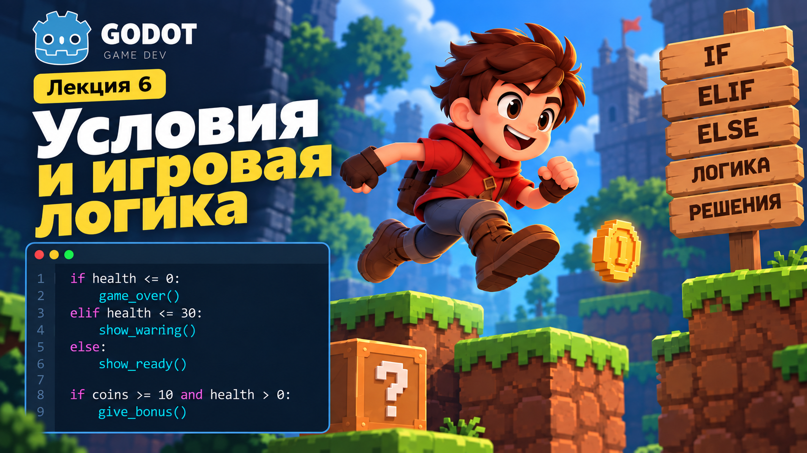
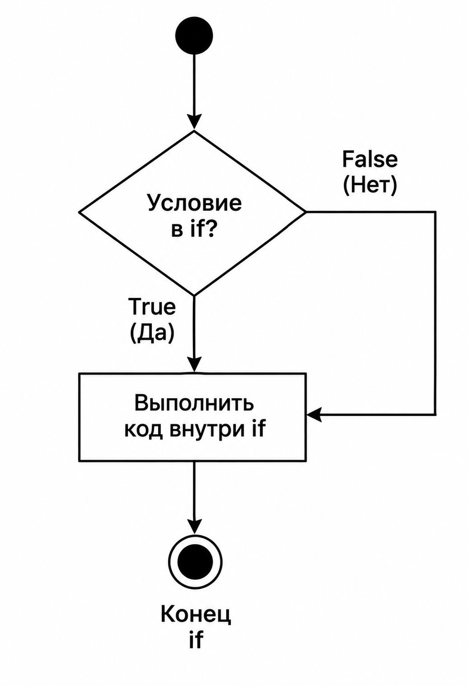

# Лекция 6. Условия и игровая логика



На прошлой лекции мы научились создавать функции, передавать в них параметры и возвращать результат с помощью `return`. У нас появились действия:

```text
-10 HP
-25 HP
+20 HP
+5 COINS
DOUBLE BONUS
```

Каждая кнопка вызывает нужную функцию, а значения `Health` и `Coins` изменяются. Но у нашей программы появилась новая проблема. Попробуем несколько раз нажать:

```text
+20 HP
```

Получим:

```text
Health: 100
↓
Health: 120
↓
Health: 140
↓
Health: 160
```

Хотя максимальное здоровье Player должно быть `100`. Теперь уменьшим здоровье:

```text
Health: 10
```

и нажмём:

```text
-25 HP
```

Получим:

```text
Health: -15
```

Код выполняет команды правильно, но программа пока не понимает, **можно ли выполнять это действие при текущем состоянии игры**. Нам необходимо научить игру принимать решения:

```text
Если Health больше 100
→ установить Health = 100
Если Health закончился
→ Player теряет одну жизнь
Если жизни ещё есть
→ восстановить Health до 100
Если Lives закончились
→ Game Over
```

Для таких проверок в программировании используются **условия**. На этой лекции мы разберём:

- `if`;
- операторы сравнения;
- `else`;
- `elif`;
- несколько условий с `and`, `or`, `not`;
- вложенные условия;
- применение условий в игровой логике.

Продолжим работать с `Function Arena` и постепенно исправим её логику с помощью условий.

---

## Условия if



**Условия** - это конструкции, которые позволяют программе принимать решения в зависимости от текущего состояния игры или значений переменных. Например, мы можем проверить, если здоровье игрока меньше нуля, и тогда установить его в ноль.

Для создания условия в GDScript используется `if`. Общая конструкция выглядит так:

```gdscript
if условие:
    код
```

Сначала программа проверяет условие. Результатом проверки всегда будет одно из двух значений:

```text
true
false
```

Если условие имеет значение `true`, код внутри `if` выполняется. Если условие имеет значение `false`, программа пропускает этот блок и продолжает выполнение дальше. Например, у нас может быть переменная:

```gdscript
var is_game_over = true
```

Тогда мы можем проверить её:

```gdscript
if is_game_over:
    print("Game Over")
```

Так как `is_game_over` содержит:

```text
true
```

код внутри `if` будет выполнен. Если изменить значение:

```gdscript
var is_game_over = false
```

код внутри `if` будет пропущен.

### Структура if

Разберём запись:

```gdscript
if is_game_over:
    print("Game Over")
```

- `if` - начало условия;
- `is_game_over` - значение, которое проверяет программа;
- `:` - начало блока кода;
- код с отступом выполняется только тогда, когда условие имеет значение `true`.

Отступ здесь особенно важен:

```gdscript
if is_game_over:
    print("Game Over")
```

Строка:

```gdscript
print("Game Over")
```

относится к условию `if`. Таким образом, `if` позволяет выполнять определённый код только тогда, когда выполняется нужное условие. Но в игре мы чаще будем проверять не готовое значение `true` или `false`, а сравнивать между собой разные значения.

---

## Операторы сравнения

Чтобы `if` мог принимать решение, программе часто нужно сравнить два значения. Например:

```text
Health меньше 0?
Coins больше 10?
Score равен 100?
Time больше или равно 30?
```

Для этого используются **операторы сравнения**.

| Оператор | Значение               |
| ---------------- | ------------------------------ |
| `==`           | равно                     |
| `!=`           | не равно                |
| `>`            | больше                   |
| `<`            | меньше                   |
| `>=`           | больше или равно |
| `<=`           | меньше или равно |

Результатом любого сравнения будет:

```text
true
```

или:

```text
false
```

---

### Равно

Оператор:

```gdscript
==
```

проверяет, равны ли два значения. Например:

```gdscript
health == 100
```

Если:

```text
health = 100
```

результат:

```text
true
```

Если:

```text
health = 50
```

результат:

```text
false
```

Важно не путать:

```gdscript
health = 100
```

и:

```gdscript
health == 100
```

Первая запись:

```text
=
```

присваивает значение переменной. Вторая:

```text
==
```

сравнивает два значения.

---

### Не равно

Оператор:

```gdscript
!=
```

проверяет, что значения отличаются. Например:

```gdscript
coins != 0
```

Если:

```text
coins = 5
```

результат:

```text
true
```

А если:

```text
coins = 0
```

результат:

```text
false
```

---

### Больше и меньше

Операторы:

```gdscript
>
<
```

проверяют, какое значение больше или меньше. Например:

```gdscript
coins > 10
```

Если:

```text
coins = 15
```

результат будет:

```text
true
```

А:

```gdscript
health < 0
```

позволяет проверить, стало ли здоровье отрицательным.

---

### Больше или равно и меньше или равно

Иногда нужно учитывать и само граничное значение.

Для этого используются:

```gdscript
>=
<=
```

Например:

```gdscript
score >= 100
```

будет `true`, если:

```text
score = 100
```

или:

```text
score > 100
```

А:

```gdscript
health <= 0
```

будет `true`, если здоровье равно `0` или стало меньше него.

---

### Используем сравнение внутри if

Теперь можно объединить `if` и оператор сравнения:

```gdscript
if health < 0:
    health = 0
```

Программа сначала проверяет:

```gdscript
health < 0
```

Если результат:

```text
true
```

выполняется:

```gdscript
health = 0
```

Если результат:

```text
false
```

код внутри `if` пропускается. Теперь мы можем использовать условия, чтобы исправить игровую логику `Function Arena`.

---

## Условие else

`if` позволяет выполнить код, если условие имеет значение `true`. Но часто игре нужно выбрать один из двух вариантов:

```text
если условие выполняется
→ сделать одно
иначе
→ сделать другое
```

Для этого используется `else`. Общая конструкция выглядит так:

```gdscript
if условие:
    код
else:
    другой код
```

`else` означает:

```text
иначе
```

То есть код внутри `else` выполняется только тогда, когда условие в `if` имеет значение `false`.

---

### Простой пример

Представим, что у Player есть здоровье:

```gdscript
var health = 50
```

Проверим его:

```gdscript
if health > 0:
    print("Player is alive")
else:
    print("Game Over")
```

Сейчас:

```text
health = 50
```

Проверка:

```gdscript
health > 0
```

даёт:

```text
true
```

Поэтому выполнится:

```gdscript
print("Player is alive")
```

А блок `else` будет пропущен.

---

Если изменить значение:

```gdscript
var health = 0
```

тогда проверка:

```gdscript
health > 0
```

даст:

```text
false
```

Код внутри `if` будет пропущен, а программа перейдёт в `else`:

```gdscript
print("Game Over")
```

---

### Как работает if и else

Можно представить конструкцию так:

```text
условие
↓
true или false
↓
true → выполнить код внутри if
false → выполнить код внутри else
```

Важно понимать, что выполняется только один из двух блоков.

Например:

```gdscript
if coins >= 10:
    print("Bonus available")
else:
    print("Not enough coins")
```

Если:

```text
coins = 15
```

получим:

```text
Bonus available
```

Если:

```text
coins = 5
```

получим:

```text
Not enough coins
```

---

`else` не содержит собственного условия. Он просто выполняется во всех случаях, когда условие в `if` оказалось `false`. Но иногда двух вариантов недостаточно. Например, нам нужно определить состояние Player:

```text
Health больше 30
→ READY
Health от 1 до 30
→ DANGER
Health <= 0
→ DEFEATED
```

Для проверки нескольких вариантов используется `elif`.

---

## Условие elif

`if` и `else` подходят, когда у программы есть только два варианта. Но в игре часто нужно проверить сразу несколько состояний.

Например:

```text
Health больше 30
→ READY
Health от 1 до 30
→ DANGER
Health <= 0
→ DEFEATED
```

Для этого используется `elif`. `elif` можно прочитать как:

```text
иначе если
```

Общая конструкция выглядит так:

```gdscript
if условие_1:
    код
elif условие_2:
    другой код
else:
    ещё один код
```

Программа проверяет условия сверху вниз. Как только одно из условий становится `true`, выполняется соответствующий блок, а остальные проверки пропускаются.

---

### Пример

```gdscript
var health = 20
if health <= 0:
    print("DEFEATED")
elif health <= 30:
    print("DANGER")
else:
    print("READY")
```

Разберём этот код. Сначала программа проверяет:

```gdscript
health <= 0
```

При:

```text
health = 20
```

результат:

```text
false
```

Поэтому программа переходит к следующей проверке:

```gdscript
health <= 30
```

Результат:

```text
true
```

Выполняется:

```gdscript
print("DANGER")
```

А `else` уже не проверяется.

---

### Порядок условий важен

Рассмотрим:

```gdscript
if health <= 30:
    print("DANGER")
elif health <= 0:
    print("DEFEATED")
else:
    print("READY")
```

Если:

```text
health = 0
```

первая проверка:

```gdscript
health <= 30
```

уже даст:

```text
true
```

Поэтому программа выведет:

```text
DANGER
```

и до `health <= 0` уже не дойдёт. Поэтому более конкретные условия обычно нужно ставить выше:

```gdscript
if health <= 0:
    print("DEFEATED")
elif health <= 30:
    print("DANGER")
else:
    print("READY")
```

Теперь результат будет правильным.

---

### Несколько elif

`elif` может быть несколько:

```gdscript
if score >= 100:
    print("Gold")
elif score >= 50:
    print("Silver")
elif score >= 20:
    print("Bronze")
else:
    print("No reward")
```

Программа снова проверяет варианты сверху вниз и выполняет только первый подходящий.

---

Таким образом:

```text
if
→ первая проверка
elif
→ дополнительная проверка
else
→ вариант, если ничего выше не подошло
```

Теперь мы умеем выбирать один вариант из нескольких. Следующий шаг - научиться объединять несколько проверок в одно условие с помощью `and`, `or` и `not`.

---

## Логические операторы

Иногда одного сравнения недостаточно. Например, мы хотим проверить сразу несколько условий:

```text
Health больше 0
и
Coins не меньше 10
```

Для объединения условий в GDScript используются логические операторы:

```text
and
or
not
```

---

### Оператор and

`and` означает:

```text
и
```

Все условия должны быть `true`. Например:

```gdscript
if health > 0 and coins >= 10:
    print("Bonus available")
```

Этот код выполнится только тогда, когда одновременно:

```text
health > 0
```

и:

```text
coins >= 10
```

имеют значение `true`. Например:

```text
health = 50
coins = 20
health > 0 → true
coins >= 10 → true
true and true
→ true
```

Код внутри `if` выполнится.

Но если:

```text
health = 50
coins = 5
```

получим:

```text
true and false
→ false
```

и код будет пропущен.

---

### Оператор or

`or` означает:

```text
или
```

Достаточно, чтобы хотя бы одно условие было `true`. Например:

```gdscript
if health <= 20 or coins == 0:
    print("Warning")
```

Условие выполнится, если:

```text
health <= 20
```

или:

```text
coins == 0
```

Например:

```text
health = 15
coins = 10
health <= 20 → true
coins == 0 → false
true or false
→ true
```

Код внутри `if` выполнится.

---

### Оператор not

`not` меняет результат условия на противоположный.

```text
true → false
false → true
```

Например:

```gdscript
var is_game_over = false
```

Проверка:

```gdscript
if not is_game_over:
    print("Game continues")
```

Так как:

```text
is_game_over = false
```

то:

```text
not false
→ true
```

и код внутри `if` выполнится.

---

## Вложенные условия

Иногда после одной проверки программе нужно выполнить ещё одну. В таком случае один `if` можно разместить внутри другого:

```gdscript
if условие_1:
	if условие_2:
		код
```

Вторая проверка выполняется только тогда, когда первая получила значение `true`.

Например, в игре можно сначала проверить, закончилось ли здоровье Player, а затем проверить, остались ли у него жизни:

```gdscript
if health <= 0:
	lives -= 1
	if lives > 0:
		health = 100
	else:
		print("Game Over")
```

Здесь программа работает по шагам:

```text
Health закончился?
↓
да
↓
убрать одну жизнь
↓
Lives больше 0?
↓
да → восстановить Health
нет → Game Over
```

Обратите внимание на отступы. Вложенный `if` находится внутри первого условия, поэтому его код имеет дополнительный уровень отступа. Вложенные условия полезны, когда одна проверка должна выполняться только после другой.

---

## Практика. Улучшаем Function Arena

Продолжим работу с проектом `Function Arena` из прошлой лекции. Сейчас в игре уже работают:

```text
Health: 100
Coins: 0
-10 HP
-25 HP
+20 HP
+5 COINS
DOUBLE BONUS
```

Но игровая логика пока слишком простая:

- `Health` может стать меньше `0`;
- `Health` может стать больше `100`;
- у Player нет жизней;
- игра не заканчивается после поражения;
- `DOUBLE BONUS` можно использовать в любой момент.

Ваша задача - расширить интерфейс и добавить игровую логику с помощью условий.

---

### Жизни Player

Добавьте в интерфейс новый `Label`:

```text
LivesLabel
```

В начале игры у Player должно быть:

```text
❤️❤️❤️
```

Создайте переменную:

```text
lives
```

с начальным значением:

```text
3
```

Количество сердечек на экране должно соответствовать количеству оставшихся жизней. Для отображения повторяющихся сердечек можно использовать:

```gdscript
"❤️".repeat(lives)
```

В результате интерфейс должен отображать примерно:

```text
Health: 100
Lives: ❤️❤️❤️
Coins: 0
```

---

### Ограничение Health

Исправьте существующие функции получения урона и лечения. `Health` не должен становиться:

```text
меньше 0
```

или:

```text
больше 100
```

Например:

```text
Health: 90
↓
+20 HP
↓
Health: 100
```

А не:

```text
Health: 110
```

---

### Потеря жизни

Если после получения урона:

```text
Health <= 0
```

Player должен потерять одну жизнь. Например:

```text
Health: 10
Lives: ❤️❤️❤️
```

После:

```text
-25 HP
```

должно произойти:

```text
Health заканчивается
↓
Player теряет одну жизнь
↓
Lives: ❤️❤️
↓
Health восстанавливается до 100
```

То же самое должно происходить при следующем поражении:

```text
❤️❤️
↓
❤️
```

---

### Game Over

Если Player потерял последнюю жизнь:

```text
Lives <= 0
```

игра должна закончиться.

Добавьте в Scene собственный интерфейс Game Over.

Например:

```text
GameOverPanel
├── GameOverLabel
└── RestartButton
```

Панель должна быть скрыта при запуске игры.

Когда жизни заканчиваются:

```text
❤️
↓
Health <= 0
↓
Lives = 0
↓
GAME OVER
```

покажите `GameOverPanel`. После поражения `Health` должен оставаться:

```text
0
```

Кнопка:

```text
RESTART
```

должна полностью перезапускать Scene и возвращать начальное состояние:

```text
Health: 100
Lives: ❤️❤️❤️
Coins: 0
```

### Блокируем действия после Game Over

После появления `GameOverPanel` игровые кнопки не должны продолжать изменять `Health` и `Coins`.

Добавьте логическую переменную:

```gdscript
var is_game_over = false
```

Пока игра продолжается, её значение равно `false`.

Когда Player теряет последнюю жизнь, измените состояние на:

```gdscript
is_game_over = true
```

Используйте `not`, чтобы игровые действия выполнялись только пока игра не закончена:

```text
not is_game_over
→ игра продолжается
→ кнопки работают
is_game_over
→ Game Over
→ игровые действия больше не выполняются
```

---

### Статус Player

Добавьте ещё один элемент интерфейса:

```text
StatusLabel
```

Он должен показывать состояние Player в зависимости от количества `Health`. Используйте:

```text
if
elif
else
```

Логика:

```text
Health <= 0
→ DEFEATED
Health <= 30
→ DANGER
во всех остальных случаях
→ NORMAL
```

Примеры:

```text
Health: 80
Status: NORMAL
```

```text
Health: 25
Status: DANGER
```

```text
Health: 0
Status: DEFEATED
```

Важно правильно расположить условия, потому что программа проверяет `if` и `elif` сверху вниз.

---

### Обновление интерфейса

Дополните существующую функцию:

```text
update_ui()
```

Теперь она должна обновлять:

```text
HealthLabel
CoinsLabel
LivesLabel
StatusLabel
```

После любого действия интерфейс должен показывать актуальное состояние игры.

---

### Ограничиваем DOUBLE BONUS

Сейчас `DOUBLE BONUS` работает всегда. Измените его логику. Бонус должен срабатывать только тогда, когда одновременно выполняются два условия:

```text
Coins >= 10
```

и:

```text
Lives > 0
```

Для этого используйте логический оператор:

```text
and
```

Логика должна выглядеть так:

```text
Coins достаточно
И
Player ещё жив
↓
DOUBLE BONUS работает
```

Если хотя бы одно условие не выполняется, бонус не должен добавляться.

---

### Проверьте игру

После завершения работы протестируйте несколько ситуаций.

#### Проверка лечения

```text
Health: 90
↓
+20 HP
↓
Health: 100
```

#### Проверка жизни

```text
Health: 10
Lives: ❤️❤️❤️
↓
-25 HP
↓
Health: 100
Lives: ❤️❤️
```

#### Проверка статуса

```text
Health: 20
↓
Status: DANGER
```

#### Проверка поражения

```text
Lives: ❤️
Health: 10
↓
-25 HP
↓
Lives: 0
Health: 0
Status: DEFEATED
↓
GAME OVER
```

#### Проверка перезапуска

```text
GAME OVER
↓
RESTART
↓
Health: 100
Lives: ❤️❤️❤️
Coins: 0
Status: NORMAL
```

---

### Результат

К концу практики `Function Arena` должна содержать:

```text
Health
Coins
Lives ❤️❤️❤️
Status
-10 HP
-25 HP
+20 HP
+5 COINS
DOUBLE BONUS
Game Over
Restart
```

При этом игровая логика должна использовать:

```text
if
elif
else
and
not
```

Главная задача практики - не просто написать несколько условий, а использовать их для создания полноценного поведения игры: ограничить значения, определить состояние Player, добавить жизни и завершение игры.

---

## Домашнее задание

Продолжите работу над проектом `FunctionLab`, который вы создавали в домашнем задании прошлой лекции. Не создавайте новый проект. На прошлой лекции вы придумали собственного игрового персонажа или объект, добавили ему характеристики и создали функции. Теперь нужно улучшить этот проект с помощью **условий**.

---

### Ограничьте характеристики

Посмотрите на переменные своего объекта. Например:

```gdscript
var health = 100
var energy = 50
var coins = 0
```

Добавьте проверки, чтобы значения не могли выходить за допустимые границы. Например:

```text
Health не может быть меньше 0
Health не может быть больше 100
Energy не может быть меньше 0
```

Выберите ограничения, подходящие именно вашему проекту.

---

### Добавьте состояние объекта

Создайте функцию, которая определяет текущее состояние персонажа или объекта. Например:

```text
check_status()
```

Используйте:

```text
if
elif
else
```

Пример логики:

```text
Health <= 0
→ DEFEATED
Health <= 30
→ DANGER
иначе
→ NORMAL
```

Не обязательно использовать именно `Health`. Для космического корабля это может быть:

```text
Fuel
Shield
Damage
```

Для мага:

```text
Health
Mana
Energy
```

Для гонщика:

```text
Fuel
Speed
Car Health
```

Придумайте состояния, подходящие вашему мини-проекту.

---

### Добавьте условие для действия

Минимум одна функция должна выполняться только при определённом условии. Например:

```text
атака возможна только если Energy > 0
```

или:

```text
покупка возможна только если Coins >= 20
```

или:

```text
лечение возможно только если Health < 100
```

или:

```text
ускорение возможно только если Fuel > 0
```

---

### Используйте логические операторы

Добавьте минимум одну проверку с:

```text
and
```

или:

```text
or
```

Например:

```text
Health > 0
И
Energy > 0
→ Player может атаковать
```

или:

```text
Health <= 20
ИЛИ
Energy <= 10
→ WARNING
```

---

### Проверьте разные ситуации

В `_ready()` вызовите функции с разными аргументами так, чтобы программа попала в разные состояния.

Например:

```text
NORMAL
↓
получили урон
↓
DANGER
↓
получили ещё урон
↓
DEFEATED
```

Результаты проверок выводите в `Output`.

---

### Результат

После выполнения домашнего задания ваш проект из прошлой лекции должен стать сложнее. В нём должны использоваться:

```text
функции
параметры
return
if
elif
else
```

и минимум один логический оператор:

```text
and
or
not
```

Главное - не создавать отдельные примеры только ради условий. **Добавляйте условия в уже существующую механику своего мини-проекта.**

### Дополнительное задание

Добавьте в проект простую визуальную часть.

Например:

```text
Label с Health
Label с Energy
Label со статусом
```

Сделайте так, чтобы значения на экране изменялись вместе с состоянием вашего объекта.

---

## Итоги

На этой лекции мы разобрали, как с помощью условий управлять логикой игры.

Мы изучили:

- конструкцию `if`;
- операторы сравнения;
- `else`;
- `elif`;
- логические операторы `and`, `or`, `not`;
- вложенные условия;
- порядок проверки условий;
- как ограничивать значения переменных;
- как создавать несколько состояний Player;
- как связывать условия с функциями и интерфейсом.

На практике мы продолжили развивать `Function Arena`:

- добавили жизни;
- ограничили `Health`;
- добавили состояния Player;
- реализовали `Game Over`;
- заблокировали игровые действия после завершения игры;
- ограничили работу некоторых действий с помощью условий;
- связали игровую логику с интерфейсом.

Теперь наша программа умеет не только выполнять функции, но и **принимать решения в зависимости от текущего состояния игры**.

На следующей лекции перейдём к **массивам и циклам** и разберём, как работать сразу с группами данных и повторяющимися действиями.
