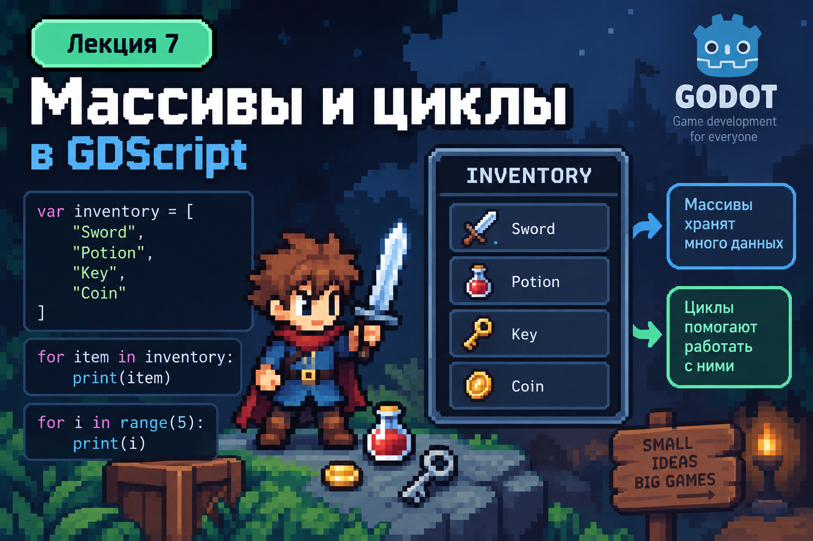
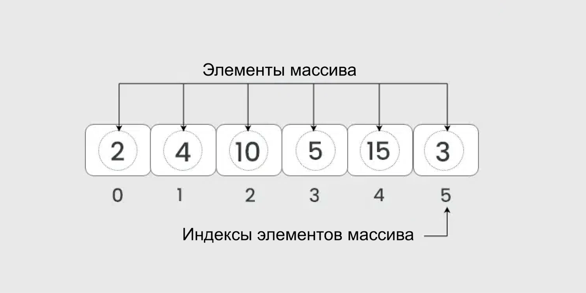
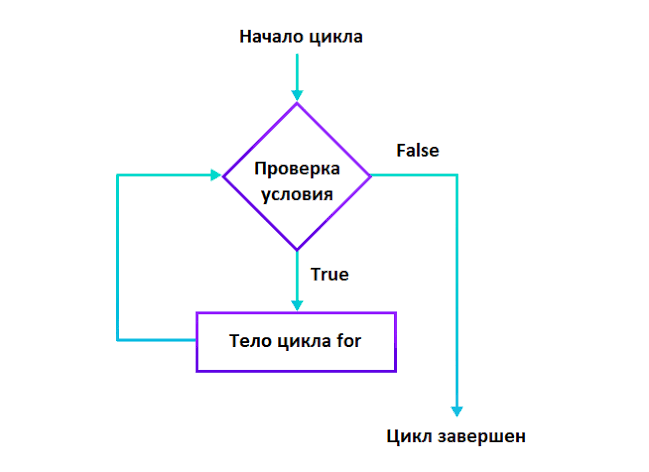
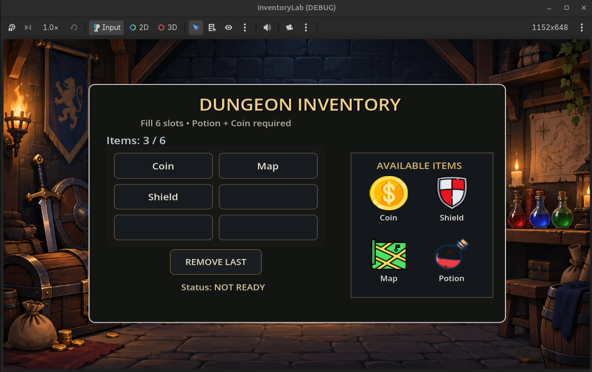

# Лекция 7. Массивы и циклы в GDScript



На прошлых лекциях мы научились хранить данные в переменных, создавать функции и использовать условия. Например:

```gdscript
var health = 100
var coins = 0
var energy = 50
```

Такой подход работает, пока данных немного. Но представим, что у Player появился инвентарь:

```text
Sword
Potion
Key
Coin
Shield
Map
```

Можно создать отдельную переменную для каждого предмета:

```gdscript
var item_1 = "Sword"
var item_2 = "Potion"
var item_3 = "Key"
var item_4 = "Coin"
var item_5 = "Shield"
var item_6 = "Map"
```

Но если предметов станет:

```text
10
20
50
100
```

такой код быстро станет неудобным. Нам нужен способ хранить много связанных значений в одном месте. Для этого используются **массивы**.

Но появляется ещё одна проблема. Допустим, мы хотим вывести все предметы инвентаря:

```gdscript
print(item_1)
print(item_2)
print(item_3)
print(item_4)
print(item_5)
print(item_6)
```

Если предметов десятки, повторять одну и ту же команду для каждого значения тоже неудобно. Для повторения действий используются **циклы**.

На этой лекции мы разберём:

- что такое массив;
- как хранить в одном массиве несколько значений;
- что такое индекс;
- как получать и изменять элементы массива;
- как добавлять и удалять элементы;
- как узнать размер массива;
- как работает цикл `for`;
- как перебрать все элементы массива;
- как использовать `range()`;
- чем `while` отличается от `for`.

В конце мы создадим `Dungeon Inventory` - небольшую систему инвентаря, в которой предметы будут храниться в массиве, а интерфейс будет обновляться с помощью цикла.

---

## Что такое массив



**Массив** - это структура данных, которая позволяет хранить несколько значений в одной переменной. Например, вместо нескольких отдельных переменных:

```gdscript
var item_1 = "Sword"
var item_2 = "Potion"
var item_3 = "Key"
var item_4 = "Coin"
```

можно создать один массив:

```gdscript
var inventory = ["Sword", "Potion", "Key", "Coin"]
```

Теперь все предметы находятся внутри одной переменной:

```text
inventory
```

А отдельные значения внутри массива называются **элементами**. В нашем примере элементами являются:

```text
Sword
Potion
Key
Coin
```

---

### Как создаётся массив

Массив записывается внутри квадратных скобок:

```gdscript
[]
```

Например:

```gdscript
var inventory = ["Sword", "Potion", "Key"]
```

Элементы массива разделяются запятыми:

```text
"Sword", "Potion", "Key"
```

Массив может храниться в обычной переменной:

```gdscript
var inventory = ["Sword", "Potion", "Key"]
```

И затем использоваться в других частях программы.

---

### Массивы могут хранить разные данные

В массиве можно хранить числа:

```gdscript
var scores = [10, 25, 50, 100]
```

Строки:

```gdscript
var enemies = ["Slime", "Skeleton", "Boss"]
```

Логические значения:

```gdscript
var states = [true, false, true]
```

Можно даже хранить разные типы данных в одном массиве:

```gdscript
var data = ["Sword", 100, true]
```

Но обычно удобнее, когда элементы массива относятся к одной задаче.

Например:

```gdscript
var inventory = ["Sword", "Potion", "Key"]
```

или:

```gdscript
var damage_values = [10, 25, 50]
```

---

### Пустой массив

Иногда массив создаётся без элементов:

```gdscript
var inventory = []
```

Сейчас он пустой. Позже мы сможем добавлять в него новые значения. Например, когда Player подбирает предмет:

```text
пустой Inventory

↓

Player нашёл Sword

↓

Sword добавляется в массив
```

Массив позволяет объединить связанные данные в одном месте. Но чтобы получить конкретный элемент массива, нужно понимать, **на какой позиции он находится**. Для этого используются индексы.

---

## Индексы массива

У каждого элемента массива есть своя позиция. Эта позиция называется **индексом**.

Например:

```gdscript
var inventory = ["Sword", "Potion", "Key", "Coin"]
```

Элементы имеют такие индексы:

```text
0 → Sword
1 → Potion
2 → Key
3 → Coin
```

Важно запомнить:

> Индексация массива начинается с `0`, а не с `1`.

Поэтому первый элемент находится под индексом:

```text
0
```

а не:

```text
1
```

---

### Получаем элемент по индексу

Чтобы обратиться к конкретному элементу массива, после имени массива указывают индекс в квадратных скобках.

Например:

```gdscript
print(inventory[0])
```

Результат:

```text
Sword
```

Если написать:

```gdscript
print(inventory[2])
```

получим:

```text
Key
```

---

### Индекс и значение

Важно различать:

```text
индекс
```

и:

```text
значение
```

Например:

```gdscript
var inventory = ["Sword", "Potion", "Key"]
```

Здесь:

```text
0 → "Sword"
1 → "Potion"
2 → "Key"
```

`0`, `1`, `2` - индексы.

`"Sword"`, `"Potion"`, `"Key"` - значения элементов.

---

### Изменяем элемент массива

Через индекс можно не только получить значение, но и заменить его.

Например:

```gdscript
inventory[1] = "Super Potion"
```

До изменения массив был таким:

```text
0 → Sword
1 → Potion
2 → Key
```

После:

```text
0 → Sword
1 → Super Potion
2 → Key
```

---

### Ошибка индекса

Если в массиве три элемента:

```gdscript
var inventory = ["Sword", "Potion", "Key"]
```

доступны индексы:

```text
0
1
2
```

Если попробовать обратиться к:

```gdscript
inventory[3]
```

такого элемента уже нет. Это приведёт к ошибке. Поэтому при работе с индексами важно понимать, сколько элементов находится в массиве. Для этого используется метод:

```gdscript
size()
```

Но сначала разберём, как добавлять и удалять элементы массива.

---

## Добавление и удаление элементов массива

Массив можно изменять во время работы программы. Например, когда Player подбирает новый предмет, его можно добавить в `inventory`.

Для этого используется:

```gdscript
append()
```

---

### Добавляем элемент

Создадим массив:

```gdscript
var inventory = ["Sword", "Potion", "Key"]
```

Добавим новый предмет:

```gdscript
inventory.append("Coin")
```

Теперь массив содержит:

```text
Sword
Potion
Key
Coin
```

То есть `append()` добавляет новый элемент **в конец массива**.

Можно добавить ещё один предмет:

```gdscript
inventory.append("Shield")
```

Получим:

```text
0 → Sword
1 → Potion
2 → Key
3 → Coin
4 → Shield
```

В игре это можно использовать, когда Player:

```text
подбирает предмет

↓

предмет добавляется в inventory
```

---

### Удаляем элемент

Чтобы удалить конкретное значение из массива, можно использовать:

```gdscript
erase()
```

Например:

```gdscript
inventory.erase("Potion")
```

До удаления:

```text
Sword
Potion
Key
Coin
```

После:

```text
Sword
Key
Coin
```

`erase()` ищет указанное значение и удаляет его из массива.

Например:

```gdscript
inventory.erase("Key")
```

удалит:

```text
Key
```

из `inventory`.

---

### Индексы после удаления

После удаления элемента индексы остальных элементов изменяются. Например, было:

```text
0 → Sword
1 → Potion
2 → Key
3 → Coin
```

Удаляем:

```gdscript
inventory.erase("Potion")
```

Получаем:

```text
0 → Sword
1 → Key
2 → Coin
```

Массив автоматически перестраивается, и индексы снова идут подряд.

---

### Размер массива

Чтобы узнать количество элементов, используется:

```gdscript
size()
```

Например:

```gdscript
var inventory = ["Sword", "Potion", "Key"]

print(inventory.size())
```

В `Output`:

```text
3
```

После:

```gdscript
inventory.append("Coin")
```

размер станет:

```text
4
```

---

### Используем size() в игре

Количество предметов можно вывести так:

```gdscript
print("Items: ", inventory.size())
```

Например:

```text
Items: 4
```

Позже в `Dungeon Inventory` мы будем использовать `size()` для отображения количества предметов прямо в интерфейсе.

---

Теперь мы умеем:

```text
получать элемент
изменять элемент
добавлять элемент
удалять элемент
узнавать размер массива
```

Но если в массиве десятки предметов, обращаться к каждому вручную всё равно неудобно. Для работы сразу со всеми элементами используются **циклы**.

---

### Основные методы массива

У массива есть готовые методы, которые позволяют изменять его и получать информацию о его содержимом.

| Метод        | Что делает                                                  | Пример                   |
| ----------------- | -------------------------------------------------------------------- | ------------------------------ |
| `append(value)` | добавляет элемент в конец массива       | `inventory.append("Potion")` |
| `pop_back()`    | удаляет последний элемент массива      | `inventory.pop_back()`       |
| `erase(value)`  | удаляет первое найденное значение      | `inventory.erase("Potion")`  |
| `size()`        | возвращает количество элементов         | `inventory.size()`           |
| `has(value)`    | проверяет, есть ли значение в массиве | `inventory.has("Key")`       |
| `clear()`       | удаляет все элементы массива                | `inventory.clear()`          |

Например:

```gdscript
var inventory = ["Sword", "Potion", "Key"]

inventory.append("Coin")
```

Получим:

```text
["Sword", "Potion", "Key", "Coin"]
```

Удалим последний элемент:

```gdscript
inventory.pop_back()
```

Получим:

```text
["Sword", "Potion", "Key"]
```

Проверим наличие предмета:

```gdscript
print(inventory.has("Potion"))
```

Результат:

```text
true
```

А количество элементов можно получить:

```gdscript
print(inventory.size())
```

Результат:

```text
3
```

Не обязательно запоминать все методы сразу. Главное понимать, что массив можно изменять во время работы программы, а для самых частых операций уже существуют готовые методы.

---

## Что такое цикл



Мы уже умеем хранить несколько значений в массиве.

Например:

```gdscript
var inventory = ["Sword", "Potion", "Key", "Coin"]
```

Теперь представим, что нам нужно вывести все предметы. Без цикла пришлось бы обращаться к каждому элементу отдельно:

```gdscript
print(inventory[0])
print(inventory[1])
print(inventory[2])
print(inventory[3])
```

Такой код работает, пока элементов мало. Но если в массиве будет:

```text
10
20
50
100
```

элементов, писать отдельную строку для каждого уже неудобно.

Для повторения одинаковых действий используются **циклы**.

Цикл позволяет выполнить один и тот же блок кода несколько раз.

Например:

```text
взять первый предмет

↓

выполнить действие

взять следующий предмет

↓

выполнить то же действие

повторять, пока элементы не закончатся
```

В GDScript для такой задачи часто используется цикл:

```gdscript
for
```

Например:

```gdscript
for item in inventory:
    print(item)
```

Этот код автоматически пройдёт по всем элементам массива и выведет:

```text
Sword
Potion
Key
Coin
```

Мы написали:

```gdscript
print(item)
```

только один раз, но команда выполнилась для каждого элемента массива.

---

### Зачем нужны циклы в игре

Циклы используются постоянно.

Например, с их помощью можно:

```text
показать все предметы Inventory
проверить всех Enemy
обработать список игроков
создать несколько объектов
вывести все задания
повторить действие несколько раз
```

Главная идея цикла:

> не повторять одинаковый код вручную, если программа может повторить его сама.

В следующем блоке подробно разберём, как работает цикл `for`.

---

## Цикл for

Цикл `for` удобно использовать, когда нужно пройти по всем элементам массива и выполнить действие для каждого из них.

Например, у нас есть Inventory:

```gdscript
var inventory = ["Sword", "Potion", "Key", "Coin"]
```

Чтобы вывести все предметы, можно написать:

```gdscript
for item in inventory:
    print(item)
```

В `Output` получим:

```text
Sword
Potion
Key
Coin
```

---

### Разберём конструкцию for

```gdscript
for item in inventory:
    print(item)
```

Здесь:

- `for` - начало цикла;
- `item` - переменная, в которую по очереди попадает каждый элемент;
- `in` - указывает, откуда брать значения;
- `inventory` - массив, который мы перебираем;
- `:` - начало блока цикла;
- код с отступом выполняется для каждого элемента.

Общая конструкция выглядит так:

```gdscript
for элемент in массив:
    код
```

---

### Как работает цикл

Рассмотрим:

```gdscript
var inventory = ["Sword", "Potion", "Key"]

for item in inventory:
    print(item)
```

Сначала цикл берёт первый элемент:

```text
item = "Sword"
```

и выполняет:

```gdscript
print(item)
```

Затем берёт следующий:

```text
item = "Potion"
```

и снова выполняет тот же код. После этого:

```text
item = "Key"
```

Когда элементы заканчиваются, цикл завершается. Получается:

```text
inventory

["Sword", "Potion", "Key"]

↓

item = "Sword"
→ print(item)

↓

item = "Potion"
→ print(item)

↓

item = "Key"
→ print(item)

↓

цикл завершён
```

---

### Переменная цикла

Имя:

```gdscript
item
```

мы выбираем самостоятельно.

Например:

```gdscript
var enemies = ["Slime", "Skeleton", "Boss"]

for enemy in enemies:
    print(enemy)
```

Или:

```gdscript
var scores = [10, 20, 50]

for score in scores:
    print(score)
```

Лучше выбирать название, которое объясняет, что находится в массиве:

```text
inventory → item
enemies → enemy
scores → score
```

Так код легче читать.

---

### Выполняем несколько действий

Внутри цикла может находиться несколько строк:

```gdscript
for item in inventory:
    print("Item: ", item)
    print("Found in inventory")
```

Обе команды выполнятся для каждого элемента массива. Например:

```text
Item: Sword
Found in inventory

Item: Potion
Found in inventory

Item: Key
Found in inventory
```

Все строки, относящиеся к циклу, должны иметь отступ:

```gdscript
for item in inventory:
    print(item)
    print("Next item")

print("Inventory finished")
```

Строка:

```gdscript
print("Inventory finished")
```

находится уже за пределами цикла, поэтому выполнится только один раз после его завершения.

---

### Условия внутри for

Внутри цикла можно использовать уже знакомые нам условия. Например, найдём `Potion`:

```gdscript
var inventory = ["Sword", "Potion", "Key"]

for item in inventory:
    if item == "Potion":
        print("Potion found!")
```

Цикл проверит каждый элемент:

```text
Sword
→ не Potion

Potion
→ Potion found!

Key
→ не Potion
```

Таким образом, циклы можно объединять с функциями, условиями и массивами.

---

### Главное преимущество for

Если в массив добавить новые элементы:

```gdscript
inventory.append("Shield")
inventory.append("Map")
```

нам не нужно изменять сам цикл:

```gdscript
for item in inventory:
    print(item)
```

Он автоматически обработает все элементы, сколько бы их ни было.

```text
3 предмета → 3 повторения
10 предметов → 10 повторений
50 предметов → 50 повторений
```

Именно поэтому `for` особенно удобен при работе с массивами.

Но иногда нам нужно повторить действие определённое количество раз, даже если массива нет. Для этого вместе с `for` используется `range()`.

---

## Функция range()

Иногда нужно повторить действие несколько раз, но массива для этого нет.

Например, мы хотим:

```text
создать 5 Enemy
выдать 3 награды
сделать 10 попыток
вывести числа от 0 до 4
```

В таких случаях вместе с `for` удобно использовать:

```gdscript
range()
```

---

### Простой пример

```gdscript
for i in range(5):
    print(i)
```

В `Output` получим:

```text
0
1
2
3
4
```

Хотя внутри `range()` указано:

```text
5
```

последнее значение будет:

```text
4
```

Потому что отсчёт начинается с `0`.

---

### Как работает range()

Запись:

```gdscript
range(5)
```

создаёт последовательность:

```text
0
1
2
3
4
```

А цикл:

```gdscript
for i in range(5):
    print(i)
```

по очереди помещает каждое значение в переменную:

```text
i
```

Получается:

```text
i = 0
↓
print(i)

i = 1
↓
print(i)

i = 2
↓
print(i)

i = 3
↓
print(i)

i = 4
↓
print(i)
```

После этого цикл заканчивается.

---

### Переменная i

В циклах с `range()` часто используется имя:

```gdscript
i
```

Например:

```gdscript
for i in range(3):
    print("Enemy ", i)
```

Результат:

```text
Enemy 0
Enemy 1
Enemy 2
```

`i` - это обычная переменная цикла. Её значение изменяется автоматически на каждом повторении.

---

### Начало и конец диапазона

В `range()` можно указать не только количество повторений.

Например:

```gdscript
for i in range(2, 6):
    print(i)
```

Получим:

```text
2
3
4
5
```

Первое число:

```text
2
```

указывает, откуда начать.

Второе:

```text
6
```

указывает границу, до которой нужно идти.

Само значение `6` в последовательность уже не входит.

---

### Шаг

Можно указать и третий параметр:

```gdscript
range(начало, конец, шаг)
```

Например:

```gdscript
for i in range(0, 10, 2):
    print(i)
```

Получим:

```text
0
2
4
6
8
```

Здесь цикл каждый раз увеличивает `i` на:

```text
2
```

---

### range() и массивы

`range()` можно использовать вместе с размером массива.

Например:

```gdscript
var inventory = ["Sword", "Potion", "Key"]

for i in range(inventory.size()):
    print(i, ": ", inventory[i])
```

Сначала:

```gdscript
inventory.size()
```

вернёт:

```text
3
```

Значит:

```gdscript
range(3)
```

создаст:

```text
0
1
2
```

И эти значения совпадают с индексами массива.

В `Output` получим:

```text
0: Sword
1: Potion
2: Key
```

---

### Когда использовать for с массивом, а когда range()

Если нужно просто получить каждый элемент массива:

```gdscript
for item in inventory:
    print(item)
```

это самый простой вариант.

Если нужен ещё и индекс элемента:

```gdscript
for i in range(inventory.size()):
    print(i, inventory[i])
```

можно использовать `range()`.

То есть:

```text
нужны сами элементы
→ for item in inventory

нужны номера / индексы
→ for i in range(...)
```

---

## Цикл while

Цикл `while` используется, когда заранее неизвестно, сколько раз нужно повторить действие. Он работает **до тех пор, пока условие имеет значение `true`**. Общая конструкция:

```gdscript
while условие:
    код
```

Программа проверяет условие перед каждым повторением. Если условие:

```text
true
```

код внутри цикла выполняется. Если условие:

```text
false
```

цикл заканчивается.

---

### Простой пример

Создадим переменную:

```gdscript
var count = 3
```

И цикл:

```gdscript
while count > 0:
    print(count)
    count -= 1
```

В `Output` получим:

```text
3
2
1
```

Разберём, что происходит:

```text
count = 3

↓

3 > 0 → true

↓

print(3)

↓

count = 2

2 > 0 → true

↓

print(2)

↓

count = 1

1 > 0 → true

↓

print(1)

↓

count = 0

0 > 0 → false

↓

цикл завершён
```

---

### Почему важно изменять условие

Внутри `while` обычно должно происходить что-то, что со временем сделает условие `false`. В нашем примере:

```gdscript
count -= 1
```

уменьшает `count`. Без этой строки:

```gdscript
var count = 3

while count > 0:
    print(count)
```

значение `count` всегда останется:

```text
3
```

Условие:

```gdscript
count > 0
```

всегда будет:

```text
true
```

и цикл никогда не закончится. Это называется **бесконечным циклом**.

---

### Бесконечный цикл

Например:

```gdscript
while true:
    print("Hello")
```

Условие здесь всегда:

```text
true
```

поэтому цикл будет выполняться бесконечно. В обычной игре такой код может привести к зависанию программы. Поэтому при работе с `while` важно понимать:

> Что должно произойти, чтобы условие стало `false`?

---

### Игровой пример

Представим, что программе нужно увеличить значение энергии шагами до максимального:

```gdscript
var energy = 0

while energy < 100:
    energy += 20
    print("Energy: ", energy)
```

Получим:

```text
Energy: 20
Energy: 40
Energy: 60
Energy: 80
Energy: 100
```

Когда:

```text
energy = 100
```

условие:

```gdscript
energy < 100
```

становится:

```text
false
```

и цикл завершается.

---

### for и while

Оба цикла позволяют повторять код, но используются немного по-разному. `for` удобно использовать, когда:

```text
нужно перебрать массив
```

или:

```text
количество повторений известно заранее
```

Например:

```gdscript
for item in inventory:
    print(item)
```

или:

```gdscript
for i in range(5):
    print(i)
```

`while` удобно использовать, когда:

```text
нужно повторять действие,
пока выполняется условие
```

Например:

```gdscript
while energy < 100:
    energy += 20
```

Можно запомнить так:

```text
for
→ перебрать элементы
→ повторить известное количество раз

while
→ повторять, пока условие true
```

На практике чаще всего для работы с массивами мы будем использовать `for`. Теперь у нас есть всё необходимое, чтобы собрать небольшой игровой инвентарь, который будет хранить предметы в массиве и выводить их на экран с помощью цикла.

---

## Практика. Dungeon Inventory

Создадим собственный игровой Inventory. Механика у всех будет одинаковой, но предметы и внешний вид каждый выберет самостоятельно.



### Подготовка

Выберите **4 разных предмета** для своей игры и найдите для них изображения PNG с прозрачным фоном.

Сохраните изображения в:

```text
assets/items
```

В `AVAILABLE ITEMS` уже находится один готовый Item-блок:

```text
Item
├── TextureButton
└── Label
```

Продублируйте готовый блок ещё 3 раза, чтобы получить 4 предмета. Для каждого измените картинку и название. Также выберите **2 обязательных предмета**, без которых игрок не сможет отправиться в Dungeon:

```gdscript
var required_items = ["Potion", "Key"]
```

Названия должны соответствовать вашим предметам.

### Задание

Создайте рабочую систему Inventory. Начальный Inventory пустой:

```gdscript
var inventory = []
```

Игрок должен иметь возможность:

- добавлять предметы нажатием на их изображения;
- хранить максимум **6 предметов**;
- видеть выбранные предметы в слотах;
- видеть текущее количество предметов;
- удалить последний предмет кнопкой `REMOVE LAST`;
- получить статус `READY FOR DUNGEON`, если Inventory заполнен и содержит оба обязательных предмета.

Используйте:

```text
append()
pop_back()
size()
has()

for
range()
индексы массива
```

Для добавления предметов создайте одну общую функцию:

```gdscript
add_item(item_name)
```

Для обновления слотов также используйте одну функцию, а не изменяйте каждый слот отдельно.

### Результат

В конце должен получиться Inventory, в котором предметы добавляются и удаляются через массив, количество обновляется автоматически, а статус зависит от содержимого Inventory.

```text
AVAILABLE ITEMS

      ↓

   inventory

      ↓

слоты Inventory

      ↓

READY / NOT READY
```

---

## Домашнее задание

Продолжите проект из домашнего задания к прошлой лекции. Теперь добавьте в него данные, которых может быть несколько, и храните их в массиве. Это могут быть:

```text
способности персонажа
враги
задания
предметы
заклинания
устройства
достижения
события
```

Выберите вариант, который подходит именно вашему проекту.

### Задание

Создайте массив минимум из **4 элементов** и добавьте механику работы с ним. В проекте необходимо:

- вывести все элементы массива с помощью `for`;
- добавить новый элемент через функцию с параметром;
- реализовать удаление элемента;
- использовать `size()` для проверки количества элементов;
- использовать `has()` для проверки наличия нужного элемента;
- хотя бы один раз обратиться к элементу по индексу;
- использовать условие внутри цикла или при работе с массивом.

Например, если ваш проект связан с персонажем:

```gdscript
var skills = ["Dash", "Heal", "Fireball", "Shield"]
```

Можно проверять наличие способности, добавлять новые способности и выводить весь список. Если проект связан с заданиями:

```gdscript
var quests = ["Find key", "Open gate", "Defeat boss"]
```

Можно добавлять новые задания, удалять выполненные и проверять, есть ли определённое задание в списке.

### Главное условие

Массив должен быть частью логики вашего проекта, а не просто отдельным примером кода. Используйте изученные ранее:

```text
функции
параметры
if / elif / else
and / or / not
```

и новые инструменты:

```text
Array
индексы
append()
erase() или pop_back()
size()
has()
for
range()
```

### Результат

После выполнения проект из прошлых домашних заданий должен получить новую механику, в которой несколько связанных значений хранятся и обрабатываются через массив.

---

## Итоги

На этой лекции мы разобрали, как работать сразу с несколькими связанными значениями в GDScript.

Теперь вы умеете:

- создавать массивы;
- получать элементы по индексу;
- добавлять и удалять элементы;
- проверять количество элементов через `size()`;
- искать значения с помощью `has()`;
- перебирать массив через `for`;
- использовать `range()` для работы с индексами;
- применять `while`, когда действие должно повторяться, пока выполняется условие.

На практике мы собрали `Dungeon Inventory`, где массив стал частью игровой механики:

```text
выбираем предмет

↓

добавляем его в Array

↓

обновляем слоты

↓

проверяем количество и содержимое

↓

меняем состояние игры
```

Главная идея урока:

> Когда в игре появляется несколько однотипных данных, не нужно создавать отдельную переменную для каждого значения. Их можно объединить в массив и обрабатывать общей логикой.

В следующих проектах массивы будут использоваться всё чаще: для врагов, предметов, заданий, точек появления, объектов уровня и других игровых данных.
