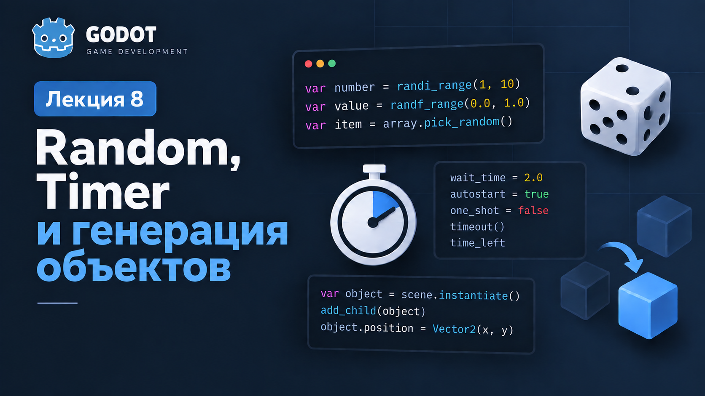
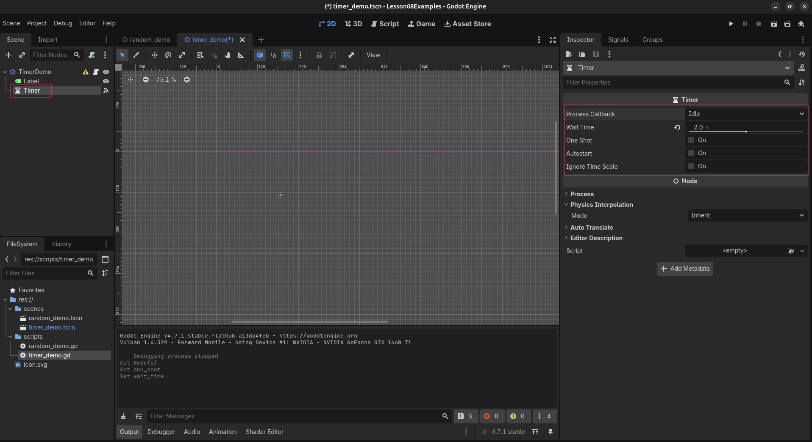

# Лекция 8. Random, Timer и генерация объектов



До этого большая часть кода, который мы писали, работала предсказуемо. Если переменной присвоить значение `20`, она будет содержать `20`. Если объекту задать определённую позицию, он каждый раз окажется в одном и том же месте.

Но в программах часто нужны ситуации, результат которых заранее неизвестен. Это может быть бросок кубика, выбор случайного вопроса, случайное число, случайный элемент массива или случайная позиция объекта. Для таких задач используется генерация случайных значений.

Кроме случайности нам понадобится ещё один новый инструмент - `Timer`. До этого наши функции в основном выполнялись сразу после какого-либо действия: запуска программы, нажатия кнопки или вызова другой функции. `Timer` позволяет выполнять действие через определённое время или повторять его через заданные промежутки.

На этой лекции мы разберём случайные числа, выбор случайных элементов, случайные координаты, работу с `Timer` и создание новых объектов во время выполнения программы. После этого объединим эти инструменты в практике.

---

## Случайные числа

Начнём с самого простого примера - обычного игрального кубика. После броска может выпасть число от `1` до `6`, но заранее определить результат мы не можем.

Для получения случайного целого числа в заданном диапазоне в GDScript используется функция:

```gdscript
randi_range()
```

Например:

```gdscript
var dice = randi_range(1, 6)
print(dice)
```

При одном запуске программа может вывести:

```text
4
```

а при следующем:

```text
1
```

Запись:

```gdscript
randi_range(1, 6)
```

означает, что программа должна выбрать случайное целое число от `1` до `6`. В отличие от `range()`, который мы использовали в циклах, здесь верхняя граница тоже может попасть в результат.

Диапазон может быть любым. Например:

```gdscript
var number = randi_range(10, 20)
print(number)
```

Теперь программа будет получать случайное целое число от `10` до `20`. Результат `randi_range()` можно сохранить в обычную переменную и использовать дальше так же, как любое другое значение:

```gdscript
var random_number = randi_range(1, 100)
print("Random number: ", random_number)
```

Каждый новый вызов `randi_range()` создаёт новое случайное значение. Поэтому следующий код:

```gdscript
var first_number = randi_range(1, 10)
var second_number = randi_range(1, 10)
print(first_number)
print(second_number)
```

может вывести, например:

```text
3
8
```

При следующем запуске значения уже могут быть другими.

---

### Случайные дробные значения

`randi_range()` возвращает целые числа. Но иногда программе нужны случайные значения с дробной частью. Например, случайная скорость может быть `125.4`, а коэффициент - `0.72`.

Для этого используется:

```gdscript
randf_range()
```

Например:

```gdscript
var temperature = randf_range(15.0, 30.0)
print(temperature)
```

В результате можно получить:

```text
23.4817
```

или другое значение внутри указанного диапазона. Таким образом, разница между двумя функциями простая:

```gdscript
var count = randi_range(1, 10)
var speed = randf_range(100.0, 200.0)
```

`count` будет целым числом, а `speed` может иметь дробную часть. Случайность при этом всё равно контролируется программистом. Если мы указываем диапазон:

```gdscript
randi_range(1, 6)
```

программа не сможет вернуть `0` или `20`. Мы определяем допустимые границы, а случайность только выбирает одно из значений внутри них.

---

## Случайный элемент массива

На прошлой лекции мы научились хранить несколько значений в массиве:

```gdscript
var names = ["Alex", "Max", "Anna", "Kate"]
```

Обычно мы получали конкретный элемент по индексу:

```gdscript
print(names[0])
```

В этом случае результат всегда будет одинаковым:

```text
Alex
```

Но иногда нам неважно, какой именно элемент будет выбран. Нужно получить **случайное значение из массива**. Для этого в GDScript у массива есть метод:

```gdscript
pick_random()
```

Например:

```gdscript
var names = ["Alex", "Max", "Anna", "Kate"]
var random_name = names.pick_random()
print(random_name)
```

При одном запуске программа может вывести:

```text
Max
```

при следующем:

```text
Kate
```

а затем:

```text
Alex
```

Метод `pick_random()` самостоятельно выбирает один из элементов массива. Нам не нужно генерировать индекс и затем обращаться к массиву вручную. Можно использовать этот метод и без отдельной переменной:

```gdscript
var colors = ["Red", "Green", "Blue", "Yellow"]
print(colors.pick_random())
```

При каждом вызове будет выбран один из существующих элементов массива. Важно понимать, что `pick_random()` не создаёт новое значение. Он выбирает одно из тех значений, которые уже находятся в массиве.

Например:

```gdscript
var directions = ["Left", "Right", "Up", "Down"]
print(directions.pick_random())
```

Результатом может быть только:

```text
Left
Right
Up
Down
```

Никакое другое значение появиться не может.

Таким образом, мы можем использовать разные способы получения случайных данных. `randi_range()` позволяет выбрать случайное целое число из диапазона, `randf_range()` - случайное дробное число, а `pick_random()` - случайный элемент уже существующего массива.

---

## Случайная позиция

Позиция 2D-объекта в Godot хранится с помощью `Vector2`.

Например:

```gdscript
var position = Vector2(300, 200)
```

Здесь:

```text
300 - координата X
200 - координата Y
```

Если мы каждый раз используем одинаковые значения, позиция объекта тоже всегда будет одинаковой. Но теперь мы умеем получать случайные числа. Значит, можем отдельно получить случайную координату `X` и случайную координату `Y`:

```gdscript
var x = randi_range(100, 900)
var y = randi_range(100, 500)
var random_position = Vector2(x, y)
print(random_position)
```

Например, программа может получить:

```text
(347.0, 418.0)
```

При следующем запуске:

```text
(762.0, 153.0)
```

Мы по-прежнему используем обычный `Vector2`, но теперь его значения определяются во время выполнения программы.

Код можно записать и короче:

```gdscript
var random_position = Vector2(
    randi_range(100, 900),
    randi_range(100, 500)
)
```

Первый `randi_range()` отвечает за координату `X`, а второй - за `Y`. Такой подход позволяет размещать объекты в разных местах, но при этом мы всё равно контролируем допустимую область. Если для `X` указан диапазон от `100` до `900`, объект не получит координату `20` или `1500`.

Случайность не отменяет правила программы. Мы определяем границы, а программа случайно выбирает значения внутри этих границ.

---

### Основные функции Random

В GDScript есть несколько функций для работы со случайными значениями. Не обязательно запоминать их все - достаточно понимать, какую задачу решает каждая из них.

| Функция                   | Что возвращает                                         |
| ------------------------- | ------------------------------------------------------ |
| `randi()`                 | случайное целое число                                  |
| `randi_range(from, to)`   | случайное целое число в заданном диапазоне             |
| `randf()`                 | случайное дробное число от `0.0` до `1.0`               |
| `randf_range(from, to)`   | случайное дробное число в заданном диапазоне           |

При работе с массивами также можно использовать:

| Метод           | Что делает                                        |
| --------------- | ------------------------------------------------- |
| `pick_random()` | возвращает случайный элемент массива              |
| `shuffle()`     | перемешивает элементы массива в случайном порядке |

В большинстве обычных задач нам будут нужны:

```text
randi_range()
randf_range()
pick_random()
```

Остальные функции пригодятся позже для более сложной работы со случайностью.

---

## Timer

Случайные значения позволяют сделать программу менее предсказуемой, но сами по себе они не решают вопрос времени. Иногда действие должно произойти не сразу, а через несколько секунд или повторяться через определённый промежуток.

Для работы со временем в Godot используется отдельный Node:

```text
Timer
```

`Timer` работает как обратный отсчёт. Мы задаём ему длительность, он начинает считать время до `0`, а после завершения отправляет сигнал:

```text
timeout
```

К этому сигналу можно подключить функцию и выполнить нужное действие.

Например, если `Timer` настроен на `2` секунды, его работа выглядит примерно так:

```text
2.0
1.9
1.8
...
0.1
0
```

После этого отправляется сигнал `timeout`.

---

### Основные настройки Timer



После добавления `Timer` в Scene его основные параметры можно изменить через Inspector.

`Wait Time` определяет длительность одного отсчёта:

```text
Wait Time: 2
```

В этом случае Timer будет считать две секунды до `timeout`. `Autostart` отвечает за автоматический запуск. Если он включён, Timer начнёт работать сразу после запуска Scene.

Если `Autostart` выключен, Timer можно запустить самостоятельно из кода:

```gdscript
$Timer.start()
```

Параметр `One Shot` определяет, должен ли Timer работать один раз или повторяться.

Если `One Shot` выключен, после каждого `timeout` Timer автоматически начинает новый отсчёт:

```text
2 секунды
→ timeout
2 секунды
→ timeout
2 секунды
→ timeout
```

Если `One Shot` включён, Timer выполнит отсчёт один раз, отправит `timeout` и остановится.

---

### Сигнал timeout

Сам Timer не знает, какое действие должно произойти после окончания времени. Он только отправляет сигнал.

Подключим:

```text
timeout
```

к скрипту. Godot создаст функцию:

```gdscript
func _on_timer_timeout() -> void:
    print("Timer finished")
```

Если установить:

```text
Wait Time: 2
Autostart: On
One Shot: Off
```

в `Output` каждые две секунды будет появляться:

```text
Timer finished
```

Можно добавить переменную и увидеть работу Timer ещё нагляднее:

```gdscript
var count = 0

func _on_timer_timeout() -> void:
    count += 1
    print("Count: ", count)
```

Теперь значение будет увеличиваться после каждого `timeout`:

```text
Count: 1
Count: 2
Count: 3
Count: 4
```

Timer при этом продолжает работать независимо от нашего счётчика. Он просто сообщает программе, что очередной отсчёт завершён.

---

### Запуск Timer из кода

Если `Autostart` выключен, Timer можно запустить вручную:

```gdscript
$Timer.start()
```

В этом случае будет использовано значение из `Wait Time`. Например, если в Inspector указано:

```text
Wait Time: 10
```

то:

```gdscript
$Timer.start()
```

запустит обратный отсчёт с десяти секунд. Можно передать другое значение прямо в `start()`:

```gdscript
$Timer.start(5)
```

Теперь Timer начнёт отсчёт с пяти секунд. Это позволяет использовать один и тот же Timer с разной длительностью в зависимости от ситуации.

---

### Оставшееся время

Во время работы Timer хранит количество секунд, которое осталось до `timeout`. Получить его можно через:

```gdscript
$Timer.time_left
```

Например, во время десятисекундного отсчёта значение может выглядеть так:

```text
9.84
8.91
7.63
6.27
```

`time_left` возвращает дробное значение, потому что Timer считает время точнее, чем целыми секундами. Если нужно показать обычный обратный отсчёт без дробной части, можно использовать:

```gdscript
ceil()
```

Например:

```gdscript
func _process(_delta) -> void:
    $Label.text = "Time: " + str(int(ceil($Timer.time_left)))
```

На экране получим:

```text
Time: 10
Time: 9
Time: 8
Time: 7
...
Time: 1
```

Когда Timer завершит работу, в `timeout` можно установить:

```gdscript
func _on_timer_timeout() -> void:
    $Label.text = "Time: 0"
```

Получится полноценный обратный отсчёт от `10` до `0`.

---

### Останавливаем Timer

Timer можно полностью остановить:

```gdscript
$Timer.stop()
```

После этого текущий отсчёт прекращается. Важно понимать, что `stop()` - это не пауза. Timer больше не хранит продолжение текущего отсчёта как активный процесс. Если после `stop()` снова вызвать:

```gdscript
$Timer.start()
```

Timer начнёт новый отсчёт. Например:

```text
10
9
8
↓
stop()
↓
start()
↓
10
9
8
...
```

Если нужно не начинать заново, а временно остановить время и позже продолжить с того же места, используется другой механизм.

---

### Пауза Timer

У Timer есть свойство:

```gdscript
paused
```

Чтобы поставить его на паузу:

```gdscript
$Timer.paused = true
```

Теперь `time_left` перестаёт уменьшаться.

Например:

```text
Time: 8
```

После:

```gdscript
$Timer.paused = true
```

можно подождать несколько секунд, но значение останется:

```text
Time: 8
```

Чтобы продолжить отсчёт:

```gdscript
$Timer.paused = false
```

Timer продолжит с того же места:

```text
8
7
6
5
...
```

Таким образом, разница между `stop()` и `paused` очень важна:

```text
stop()
→ полностью остановить Timer
→ следующий start() начинает новый отсчёт
paused = true
→ временно заморозить Timer
paused = false
→ продолжить с оставшегося времени
```

Для кнопки `PAUSE` можно написать:

```gdscript
func _on_pause_button_pressed() -> void:
    $Timer.paused = true
```

А для продолжения:

```gdscript
func _on_start_button_pressed() -> void:
    $Timer.paused = false
```

---

### Проверяем состояние Timer

Иногда программе нужно понять, работает Timer или уже остановлен. Для этого существует:

```gdscript
$Timer.is_stopped()
```

Метод возвращает:

```text
true
```

если Timer остановлен, и:

```text
false
```

если он находится в процессе отсчёта.

Например:

```gdscript
if $Timer.is_stopped():
    $Timer.start()
```

Так можно запустить Timer только в том случае, если он действительно остановлен.

Это особенно удобно, когда одна кнопка должна работать и как продолжение после паузы, и как новый запуск после окончания Timer:

```gdscript
func _on_start_button_pressed() -> void:
    if $Timer.paused:
        $Timer.paused = false
    elif $Timer.is_stopped():
        $Timer.start()
```

Если Timer был на паузе, он продолжит с оставшегося времени. Если отсчёт уже закончился, будет запущен новый.

---

### Управляем Timer кнопками

Сделаем небольшой пример управления Timer. Структура Scene:

```text
TimerDemo
├── Label
├── Timer
└── Buttons
    ├── PauseButton
    ├── StartButton
    └── ResetButton
```

У `Timer` установим:

```text
Wait Time: 10
One Shot: On
Autostart: Off
```

Скрипт:

```gdscript
extends Node2D

func _ready() -> void:
    $Timer.start()

func _process(_delta) -> void:
    $Label.text = "Time: " + str(int(ceil($Timer.time_left)))

func _on_timer_timeout() -> void:
    $Label.text = "Time: 0"

func _on_pause_button_pressed() -> void:
    $Timer.paused = true

func _on_start_button_pressed() -> void:
    if $Timer.paused:
        $Timer.paused = false
    elif $Timer.is_stopped():
        $Timer.start()

func _on_reset_button_pressed() -> void:
    $Timer.paused = false
    $Timer.stop()
    $Timer.start()
```

Теперь можно проверить несколько ситуаций. Если нажать `PAUSE` во время отсчёта:

```text
10
9
8
```

Timer остановится на текущем значении. После нажатия `START` отсчёт продолжится:

```text
8
7
6
5
...
```

Если Timer уже дошёл до:

```text
0
```

кнопка `START` запустит новый десятисекундный отсчёт. Кнопка `RESET` полностью сбрасывает текущее состояние и сразу начинает отсчёт заново.

Этот пример показывает, что `Timer` можно не только настроить через Inspector, но и полностью контролировать из кода: запускать, ставить на паузу, продолжать, сбрасывать и получать оставшееся время.

> *Функция `_process()` выполняется каждый кадр и постоянно обновляет текст метки, используя текущее значение `time_left`. Она полезна для визуального отображения текущего состояния Timer в реальном времени.*

---

## Создание объектов во время работы программы

До этого большинство объектов мы добавляли в Scene вручную через редактор Godot. Если нам был нужен `Player`, `Label` или другой Node, мы создавали его заранее и видели в дереве Scene ещё до запуска проекта.

Но иногда заранее неизвестно, сколько объектов понадобится. Например, программа может создать один объект, затем через некоторое время ещё один, а потом ещё несколько. Добавлять все возможные копии вручную неудобно.

В Godot для этого можно использовать уже созданную Scene как **шаблон**, а новые её экземпляры создавать прямо во время работы программы.

Представим, что у нас есть отдельная Scene:

```text
Box.tscn
```

В ней уже настроен внешний вид объекта и всё, что ему необходимо. Вместо того чтобы несколько раз копировать `Box` вручную, мы можем загрузить эту Scene и создавать её экземпляры из кода.

---

### Загружаем Scene

Сначала программе нужно получить доступ к Scene, которую мы хотим создавать. Для этого можно использовать:

```gdscript
preload()
```

Например:

```gdscript
var box_scene = preload("res://scenes/box.tscn")
```

Теперь переменная:

```gdscript
box_scene
```

содержит загруженную Scene `Box`. `preload()` загружает ресурс заранее, поэтому после этого мы можем использовать его для создания новых объектов.

---

### Создаём экземпляр

Чтобы создать новый объект на основе загруженной Scene, используется:

```gdscript
instantiate()
```

Например:

```gdscript
var box = box_scene.instantiate()
```

После этой строки в памяти уже существует новый экземпляр `Box`. Но пока он ещё не находится в текущей Scene и поэтому не отображается на экране. Чтобы добавить его в дерево Scene, используется:

```gdscript
add_child()
```

Полный пример:

```gdscript
var box_scene = preload("res://scenes/box.tscn")

func _ready() -> void:
    var box = box_scene.instantiate()
    add_child(box)
```

После запуска программы новый `Box` появится в текущей Scene. Получается, что здесь происходят два разных действия:

```gdscript
var box = box_scene.instantiate()
```

создаёт экземпляр объекта, а:

```gdscript
add_child(box)
```

добавляет его в дерево Scene.

---

### Одна Scene - много объектов

Главное преимущество такого подхода в том, что одну Scene можно использовать много раз.

Например:

```gdscript
var first_box = box_scene.instantiate()
add_child(first_box)
var second_box = box_scene.instantiate()
add_child(second_box)
var third_box = box_scene.instantiate()
add_child(third_box)
```

Все три объекта созданы на основе одного файла:

```text
Box.tscn
```

Но после создания это уже три отдельных экземпляра. Изменение позиции одного экземпляра не изменяет остальные:

```gdscript
first_box.position = Vector2(200, 200)
second_box.position = Vector2(500, 200)
third_box.position = Vector2(800, 200)
```

На экране появятся три одинаковых объекта в разных местах. Это позволяет создать один настроенный шаблон и затем использовать его столько раз, сколько потребуется программе.

---

### Объединяем instantiate() и Random

Теперь можно соединить создание объектов со случайными координатами, которые мы уже разобрали.

Например:

```gdscript
var box_scene = preload("res://scenes/box.tscn")

func _ready() -> void:
    var box = box_scene.instantiate()
    box.position = Vector2(
        randi_range(100, 900),
        randi_range(100, 500)
    )
    add_child(box)
```

При каждом запуске создаётся экземпляр одной и той же `Box.tscn`, но его позиция определяется случайно. Мы можем создавать несколько экземпляров:

```gdscript
func _ready() -> void:
    for i in range(5):
        var box = box_scene.instantiate()
        box.position = Vector2(
            randi_range(100, 900),
            randi_range(100, 500)
        )
        add_child(box)
```

Теперь программа создаст пять объектов. Каждый из них получит собственную случайную позицию. Здесь мы одновременно используем несколько уже знакомых инструментов:

```gdscript
for
range()
Vector2
randi_range()
```

и добавляем новый:

```gdscript
instantiate()
```

Таким образом, одна Scene может выступать шаблоном, из которого программа создаёт любое количество независимых объектов во время своей работы.

### Объединяем Timer и создание объектов

Теперь можем соединить `Timer`, `instantiate()` и случайные координаты. Добавим в Scene `Timer` и подключим его сигнал:

```text
timeout
```

В обработчике будем создавать новый экземпляр:

```gdscript
var box_scene = preload("res://scenes/box.tscn")

func _on_timer_timeout() -> void:
    var box = box_scene.instantiate()
    box.position = Vector2(
        randi_range(100, 900),
        randi_range(100, 500)
    )
    add_child(box)
```

Если у `Timer` установлены:

```text
Wait Time: 1.5
Autostart: On
One Shot: Off
```

новый объект будет создаваться каждые `1.5` секунды. При этом каждый экземпляр получает собственную случайную позицию.

Так мы объединяем три инструмента:

```text
Timer - определяет, когда создать объект
instantiate() - создаёт новый экземпляр
Random - определяет его позицию
```

Такую комбинацию можно использовать для автоматического появления объектов во время работы программы.

---

### Удаление объекта

Объекты, которые больше не нужны программе, можно удалить из Scene с помощью:

```gdscript
queue_free()
```

Например, если объект вышел за пределы экрана:

```gdscript
if position.y > 700:
    queue_free()
```

После вызова `queue_free()` объект будет удалён из дерева Scene и больше не будет участвовать в работе программы.

---

## Практика. Dodge Game - начинаем проект

Начинаем новый игровой проект - **Dodge Game**. Игрок управляет персонажем внутри игровой зоны. Во время игры на поле появляются монеты, а сверху прилетают вражеские дроны.

На этой практике наша задача - создать систему, которая будет автоматически генерировать игровые объекты во время работы игры.

Стартовый проект уже содержит:

- игровую сцену `Game`;
- фон;
- `Player` с готовым управлением;
- границы игровой зоны;
- изображения для Coin и Enemy.

### Задача

Создать отдельные сцены:

- `Coin`;
- `Enemy`.

Монетки должны появляться в случайных местах игровой зоны.

Враги должны:

- появляться сверху экрана;
- получать случайную позицию по `X`;
- двигаться вниз;
- удаляться после выхода за пределы игрового поля.

Для появления объектов создать `SpawnTimer`. Через определённый промежуток времени он должен создавать:

- новую Coin;
- нового Enemy.

Для создания объектов использовать:

- `preload()`;
- `instantiate()`;
- `Random`;
- `Timer`.

Также добавить отдельный `GameTimer`.

Продолжительность одной игры:

```text
60 секунд
```

Оставшееся время должно отображаться на экране.

### Результат

После запуска игры:

- Player свободно двигается по игровой зоне;
- монетки автоматически появляются в случайных местах;
- враги появляются сверху в случайных позициях;
- враги движутся вниз;
- вышедшие за экран враги удаляются;
- новые объекты появляются автоматически по Timer;
- на экране идёт обратный отсчёт от 60 до 0.

На этой лекции мы пока не добавляем сбор монет, очки и проигрыш при столкновении с Enemy. Эту игровую логику продолжим на следующем занятии.

---

## Домашнее задание

Продолжите проект из прошлых домашних заданий. Новый проект создавать не нужно. На прошлых занятиях в вашем проекте уже появились:

- характеристики персонажа или объекта;
- функции;
- условия;
- массив с несколькими связанными значениями.

Теперь добавьте в проект **случайные события**, которые будут происходить автоматически во время работы программы. Создайте несколько разных событий, связанных именно с вашим проектом. Например:

```text
получить урон
восстановить здоровье
получить энергию
найти предмет
потерять предмет
получить бонус
встретить врага
активировать способность
```

Не обязательно использовать эти варианты - придумайте события под собственную идею проекта.

События должны храниться в массиве. Через определённый промежуток времени `Timer` должен запускать одно случайное событие.

Для выбора события используйте возможности `Random`.

Каждое событие должно влиять на уже существующие данные проекта. Используйте функции и условия, которые создавали на прошлых лекциях.

Например:

```text
случайное событие
↓
персонаж получает урон
↓
изменяется Health
↓
проверяется состояние персонажа
```

или:

```text
случайное событие
↓
найден новый предмет
↓
предмет добавляется в массив
↓
обновляется информация о персонаже
```

Добавьте минимум **3 разных случайных события**.

Также создайте одну отдельную сцену, связанную с вашим проектом. Это может быть:

```text
Item
Enemy
Reward
Effect
Crystal
Battery
Spell
```

Одно из случайных событий должно создавать этот объект во время работы программы с помощью:

```text
preload()
instantiate()
```

Созданный объект должен появляться в подходящем месте вашей сцены.

### Результат

После запуска проекта он должен продолжать работать самостоятельно:

- `Timer` периодически запускает событие;
- событие выбирается случайно;
- события влияют на характеристики или массивы проекта;
- используются функции и условия из прошлых лекций;
- минимум одно событие создаёт новый объект через `instantiate()`;
- каждый запуск проекта может развиваться немного по-разному.

В результате ваш проект из прошлых домашних заданий должен получить новую систему случайных событий и стать более похожим на настоящую игровую систему.

---

## Итог

На этой лекции мы добавили в игру сразу несколько важных инструментов, которые позволяют создавать объекты и события автоматически во время работы проекта.

Мы разобрали:

- случайные числа с помощью `randi_range()` и `randf_range()`;
- выбор случайного элемента из массива через `pick_random()`;
- создание случайной позиции через `Vector2`;
- работу `Timer`;
- свойства `Wait Time`, `One Shot`, `Autostart`;
- сигнал `timeout`;
- запуск и остановку Timer;
- `time_left`;
- создание объектов через `preload()` и `instantiate()`;
- автоматическое удаление ненужных объектов через `queue_free()`.

На практике начали проект **Dodge Game**.

Мы создали систему, в которой:

```text
SpawnTimer
↓
создаёт Coin и Enemy
↓
Coin получает случайную позицию
Enemy появляется сверху
↓
Enemy движется вниз
↓
вышедшие за экран объекты удаляются
```

Также добавили `GameTimer`, который отсчитывает время игры:

```text
60 → 0
```

Теперь наш игровой мир уже может сам создавать новые объекты без ручного размещения каждого экземпляра в сцене.

Главная идея этой лекции:

```text
Timer → когда происходит событие
Random → где или что выбрать
instantiate() → что создать
```

На следующей лекции продолжим `Dodge Game` и добавим взаимодействие между объектами, очки, проигрыш и управление состоянием игры.
