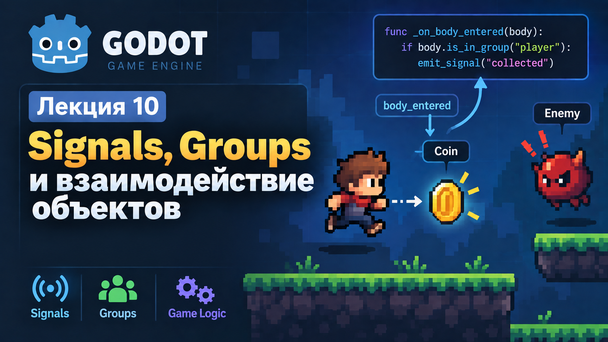

# Лекция 10. Signals, Groups и взаимодействие объектов



На прошлой лекции мы начали `Dodge Game`: Player уже умеет двигаться, Coin появляются в случайных местах, Enemy летят сверху вниз, а Timer управляют временем и созданием объектов. Но пока эти части игры почти не связаны между собой. Player может пройти через Coin, столкнуться с Enemy или дождаться окончания времени - и игра никак на это не отреагирует.

На этой лекции мы не будем отдельно изучать Signals и Groups, а сразу применим их в нашей игре. По ходу работы разберём, как один объект может сообщить другому о событии, как определить роль объекта через Group и как собрать из этого полноценную игровую логику.

В конце лекции `Dodge Game` должна работать как законченная мини-игра: Coin исчезает после сбора и увеличивает Score, столкновение с Enemy завершает игру, GameTimer тоже может вызвать Game Over, все объекты останавливаются, появляется панель завершения и игру можно перезапустить кнопкой Restart.

---

## Coin и первое взаимодействие

Начнём с самой простой задачи: Coin должна понять, что её коснулся Player.

Откроем `coin.tscn`. Корневой Node у нас - `Area2D`, внутри находятся `Sprite2D` и `CollisionShape2D`.

```text
Coin (Area2D)
├── Sprite2D
└── CollisionShape2D
```

`Area2D` как раз предназначена для отслеживания объектов, которые входят в её область. Выберем `Coin`, откроем вкладку `Node`, найдём Signal:

```text
body_entered(body)
```

и подключим его к `coin.gd`. Godot создаст функцию:

```gdscript
func _on_body_entered(body: Node2D) -> void:
	pass
```

Параметр `body` - это объект, который вошёл внутрь `Area2D`. Чтобы убедиться, что всё работает, временно выведем имя объекта:

```gdscript
func _on_body_entered(body: Node2D) -> void:
	print(body.name)
```

Запускаем игру и подходим Player к Coin. В `Output` должно появиться:

```text
Player
```

Здесь мы впервые в этой лекции используем **Signal**. 

Signal - это сообщение о событии. `Area2D` сама отслеживает момент, когда внутрь неё входит физический объект, и отправляет `body_entered`. Подключённая функция получает это событие и может на него отреагировать.

Мы уже встречали Signals раньше. Например, `Button` отправляет `pressed`, а `Timer` - `timeout`. Сейчас разница только в том, что начинаем использовать Signals не просто по инструкции, а как основной способ связи между объектами игры.

Пока Coin знает только, что внутрь неё кто-то вошёл. Теперь нужно понять, что это именно Player.

---

## Groups

Можно было бы проверить имя объекта:

```gdscript
if body.name == "Player":
	print("Player entered Coin")
```

Но такая проверка слишком зависит от конкретного имени Node. Если позже Player будет переименован, этот код придётся менять.

В Godot для таких задач используются **Groups**. Group описывает роль объекта в игре. Например, Player можно отнести к группе `player`, а все Enemy - к группе `enemies`.

Выберем `Player`, откроем:

```text
Node → Groups
```

создадим группу:

```text
player
```

и добавим Player в неё.

Теперь в `coin.gd` проверим не имя объекта, а его группу:

```gdscript
func _on_body_entered(body: Node2D) -> void:
	if body.is_in_group("player"):
		print("Player entered Coin")
```

Метод `is_in_group()` возвращает `true`, если Node находится в указанной группе. Поэтому Coin теперь реагирует только на объект с ролью `player`.

На этом первый шаг готов: Coin уже умеет определить, что её коснулся именно Player. Но пока она просто пишет сообщение в `Output`. Следующая задача - сообщить основной Scene `Game`, что монетка действительно была собрана.

---

## Собственный Signal и Score

У `Area2D` есть готовый Signal `body_entered`, но события «монетку собрали» в Godot не существует. Это уже логика нашей игры, поэтому создадим собственный Signal.

В `coin.gd` после `extends` добавим:

```gdscript
extends Area2D

signal collected
```

Теперь Coin имеет собственное событие `collected`. Чтобы отправить его, используется метод `emit()`.

Изменим обработчик столкновения:

```gdscript
extends Area2D

signal collected


func _on_body_entered(body: Node2D) -> void:
	if body.is_in_group("player"):
		collected.emit()
		queue_free()
```

Теперь Coin делает только две вещи: определяет Player и сообщает, что была собрана. После этого она удаляет себя через `queue_free()`.

Важно, что Coin сама не должна хранить общий Score, искать `ScoreLabel` или управлять всей игрой. Её задача заканчивается на событии `collected`.

Но теперь этот Signal нужно получить в `Game`.

Наши Coin создаются во время игры через `instantiate()`, поэтому подключать `collected` нужно в момент создания каждой новой Coin.

В `game.gd` найдём функцию создания монетки и добавим подключение:

```gdscript
func spawn_coin():
	var coin = coin_scene.instantiate()

	coin.position = Vector2(
		randi_range(50, 1100),
		randi_range(50, 600)
	)

	coin.collected.connect(_on_coin_collected)
	add_child(coin)
```

Строка:

```gdscript
coin.collected.connect(_on_coin_collected)
```

означает: когда эта Coin отправит `collected`, нужно вызвать функцию `_on_coin_collected()` в `Game`.

Теперь добавим общий Score:

```gdscript
var score = 0
```

В `UI` создадим новый `Label`:

```text
ScoreLabel
```

и поставим начальный текст:

```text
Score: 0
```

После этого создадим функцию:

```gdscript
func _on_coin_collected() -> void:
	score += 1
	$UI/ScoreLabel.text = "Score: " + str(score)
```

Запускаем игру и собираем несколько Coin. После каждой собранной монетки Score должен увеличиваться:

```text
Score: 0
Score: 1
Score: 2
Score: 3
```

Теперь цепочка уже полностью работает: Coin обнаруживает Player, отправляет `collected`, Game получает Signal, увеличивает Score и обновляет интерфейс. Здесь важно запомнить три команды:

```gdscript
signal collected
```

создаёт собственный Signal,

```gdscript
collected.emit()
```

отправляет его,

а:

```gdscript
coin.collected.connect(_on_coin_collected)
```

подключает Signal к функции, которая должна его обработать.

---

## Enemy и player_hit

Теперь применим тот же принцип к Enemy. Откроем `enemy.tscn`, выберем корневой `Enemy` и подключим Signal:

```text
body_entered(body)
```

к `enemy.gd`.

Godot снова создаст:

```gdscript
func _on_body_entered(body: Node2D) -> void:
	pass
```

Player уже находится в группе `player`, поэтому проверка будет такой же:

```gdscript
func _on_body_entered(body: Node2D) -> void:
	if body.is_in_group("player"):
		print("Player hit Enemy")
```

Если при столкновении сообщение появляется в `Output`, значит Enemy правильно определяет Player. Теперь вместо `print()` создадим собственный Signal:

```gdscript
signal player_hit
```

И отправим его при столкновении:

```gdscript
extends Area2D

signal player_hit

var speed = 200


func _process(delta):
	position.y += speed * delta

	if position.y > 700:
		queue_free()


func _on_body_entered(body: Node2D) -> void:
	if body.is_in_group("player"):
		player_hit.emit()
```

Enemy, как и Coin, не должен самостоятельно останавливать Timer, Player или показывать интерфейс Game Over. Он только сообщает Game, что произошло столкновение.

Поэтому в функции создания Enemy подключим Signal:

```gdscript
func spawn_enemy():
	var enemy = enemy_scene.instantiate()

	enemy.position = Vector2(
		randi_range(50, 1100),
		-50
	)

	enemy.player_hit.connect(_on_player_hit)
	add_child(enemy)
```

Теперь добавим функцию:

```gdscript
func _on_player_hit() -> void:
	game_over()
```

Мы снова используем тот же принцип, только событие уже другое. Coin отправляет `collected`, а Enemy - `player_hit`.

---

## Game Over и управление группой enemies

Теперь `Game` знает, что Player столкнулся с Enemy. Осталось решить, что именно должно произойти после этого.

Добавим переменную:

```gdscript
var is_game_over = false
```

Она будет хранить состояние игры. Создадим функцию:

```gdscript
func game_over() -> void:
	if is_game_over:
		return

	is_game_over = true

	$SpawnTimer.stop()
	$GameTimer.stop()

	$Player.set_physics_process(false)
```

Сначала проверяем:

```gdscript
if is_game_over:
	return
```

Если игра уже завершена, функция сразу остановится. Это защищает нас от повторного запуска Game Over, если несколько Enemy почти одновременно коснутся Player.

После этого:

```gdscript
is_game_over = true
```

фиксирует состояние завершённой игры. Дальше останавливаем Timer:

```gdscript
$SpawnTimer.stop()
$GameTimer.stop()
```

`SpawnTimer` больше не создаёт Coin и Enemy, а `GameTimer` перестаёт отсчитывать время. Player двигается внутри `_physics_process()`, поэтому отключаем его:

```gdscript
$Player.set_physics_process(false)
```

Теперь Player перестаёт реагировать на управление. Но уже созданные Enemy продолжают двигаться. Здесь снова пригодятся Groups. Откроем `enemy.tscn`, выберем корневой `Enemy` и добавим его в группу:

```text
enemies
```

Теперь все Enemy, созданные из этой Scene, будут находиться в одной группе. Получить все Node из группы можно так:

```gdscript
get_tree().get_nodes_in_group("enemies")
```

Пройдём по ним циклом:

```gdscript
for enemy in get_tree().get_nodes_in_group("enemies"):
	enemy.set_process(false)
```

Enemy двигается внутри `_process(delta)`, поэтому `set_process(false)` останавливает его движение. Функция `game_over()` теперь выглядит так:

```gdscript
func game_over() -> void:
	if is_game_over:
		return

	is_game_over = true

	$SpawnTimer.stop()
	$GameTimer.stop()

	$Player.set_physics_process(false)

	for enemy in get_tree().get_nodes_in_group("enemies"):
		enemy.set_process(false)
```

После столкновения должны остановиться Player, все Enemy, SpawnTimer и GameTimer.

Здесь мы используем Groups уже двумя способами. `is_in_group("player")` позволяет проверить один конкретный объект, а `get_nodes_in_group("enemies")` - получить сразу все объекты определённой группы.

---

## Game Over UI и Restart

Логика завершения уже работает, но игрок пока видит только то, что всё остановилось. Добавим понятный экран Game Over.

В `UI` создадим:

```text
UI
├── TimeLabel
├── ScoreLabel
└── GameOverPanel
    ├── GameOverLabel
    └── RestartButton
```

Для `GameOverLabel` установим текст:

```text
GAME OVER
```

Для кнопки:

```text
Restart
```

`GameOverPanel` разместим по центру экрана. При запуске игры она не должна быть видна, поэтому в Inspector отключим `Visible`.

Теперь в конце `game_over()` добавим:

```gdscript
$UI/GameOverPanel.show()
```

Полная функция станет такой:

```gdscript
func game_over() -> void:
	if is_game_over:
		return

	is_game_over = true

	$SpawnTimer.stop()
	$GameTimer.stop()

	$Player.set_physics_process(false)

	for enemy in get_tree().get_nodes_in_group("enemies"):
		enemy.set_process(false)

	$UI/GameOverPanel.show()
```

После столкновения с Enemy игра должна остановиться и показать панель Game Over. Теперь подключим `pressed()` от `RestartButton` к `game.gd`.

Godot создаст:

```gdscript
func _on_restart_button_pressed() -> void:
	pass
```

Внутри вызовем:

```gdscript
func _on_restart_button_pressed() -> void:
	get_tree().reload_current_scene()
```

`reload_current_scene()` полностью перезапускает текущую Scene. Благодаря этому нам не нужно вручную возвращать Score в 0, включать Player, запускать Timer и удалять старых Enemy. Scene просто создаётся заново в исходном состоянии.

---

## Завершение игры по Timer

Сейчас Game Over происходит только после столкновения с Enemy. Но у нашей игры есть ещё одно условие завершения - окончание времени. Выберем `GameTimer` и подключим Signal:

```text
timeout()
```

к `game.gd`.

Godot создаст:

```gdscript
func _on_game_timer_timeout() -> void:
	pass
```

Новая логика завершения нам не нужна, потому что `game_over()` уже умеет полностью останавливать игру.

Поэтому просто вызываем:

```gdscript
func _on_game_timer_timeout() -> void:
	game_over()
```

Теперь одна и та же функция используется для двух разных событий: Enemy отправляет `player_hit`, а GameTimer отправляет `timeout`.

Это хороший пример того, зачем разделять событие и реакцию. Причины завершения игры могут быть разными, но сама логика Game Over остаётся в одном месте.

---

## Итоговый игровой цикл

Теперь `Dodge Game` полностью работает.

Player двигается по игровой зоне и собирает Coin. Каждая Coin отправляет `collected`, после чего Game увеличивает Score и обновляет интерфейс. Enemy определяет столкновение с Player и отправляет `player_hit`. GameTimer может завершить игру через `timeout`.

В обоих случаях вызывается одна функция:

```gdscript
game_over()
```

Она останавливает Timer, отключает управление Player, останавливает всех Enemy из группы `enemies` и показывает GameOverPanel.

Кнопка Restart перезапускает Scene, и новый раунд начинается сначала.

Главный принцип этой лекции можно представить так:

```text
объект обнаруживает событие
→ отправляет Signal
→ другой объект получает Signal
→ выполняется нужная реакция
```

---

## Итоги

На этой лекции мы закончили основную игровую логику `Dodge Game` и научились связывать разные объекты между собой.

Мы использовали встроенные Signals `body_entered`, `pressed` и `timeout`, а также создали собственные Signals `collected` и `player_hit`.

Научились создавать Signal:

```gdscript
signal collected
```

отправлять его:

```gdscript
collected.emit()
```

и подключать:

```gdscript
coin.collected.connect(_on_coin_collected)
```

Также разобрали Groups. Через:

```gdscript
body.is_in_group("player")
```

мы проверяем роль одного объекта, а через:

```gdscript
get_tree().get_nodes_in_group("enemies")
```

можем получить сразу все объекты группы.

В результате наша игра умеет собирать Coin, увеличивать Score, определять столкновение с Enemy, завершать игру по столкновению или по Timer, показывать Game Over и перезапускаться через Restart.

---

## Домашнее задание

Продолжите работу над `Dodge Game` и добавьте в игру ещё один объект, который взаимодействует с Player через собственный Signal.

Это может быть `Bonus`, `Heart`, `SpeedBoost` или `Shield`.

Новый объект должен быть отдельной Scene на основе `Area2D`, определять Player через группу `player`, отправлять собственный Signal и исчезать после взаимодействия. Изменение состояния игры должно происходить через `Game`, а не напрямую внутри нового объекта.

Например, `Bonus` может добавлять несколько очков, `Heart` - давать дополнительную жизнь, а `SpeedBoost` - временно увеличивать скорость Player.

Главная задача домашней работы - самостоятельно повторить принцип, который мы использовали на лекции:

```text
событие
→ Signal
→ Game
→ реакция
```

### Дополнительное задание

Добавьте новый тип Enemy или Danger Zone и отнесите его к группе:

```text
enemies
```

При Game Over новый объект должен останавливаться вместе с остальными Enemy.
