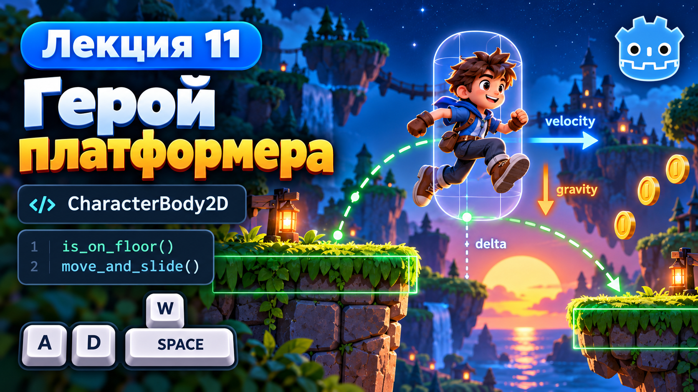
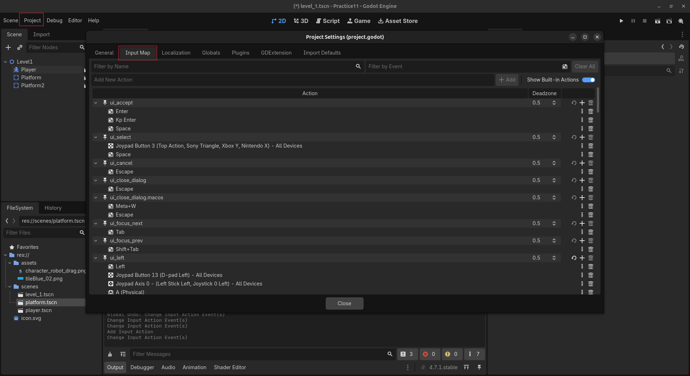
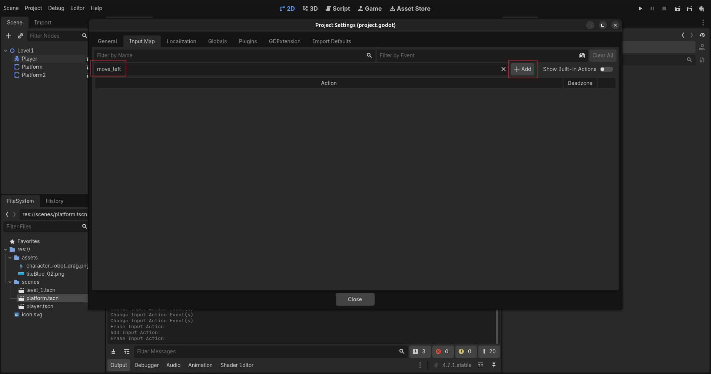
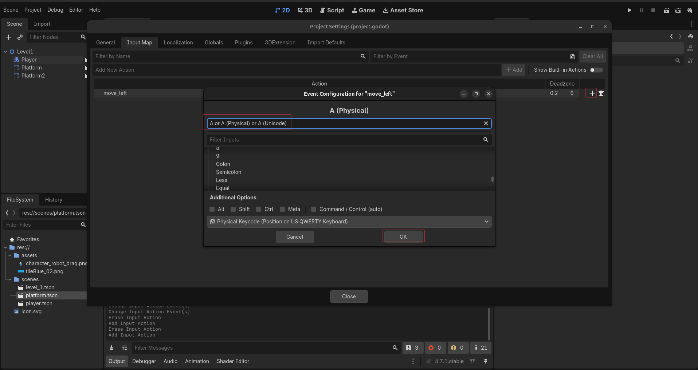
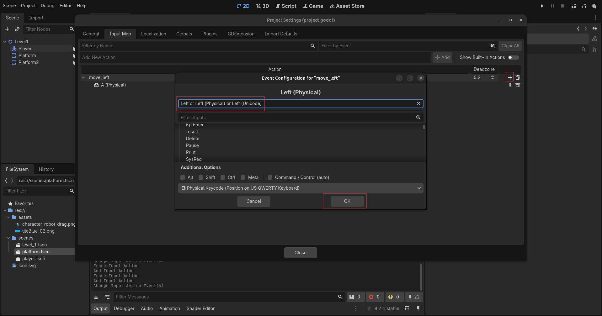
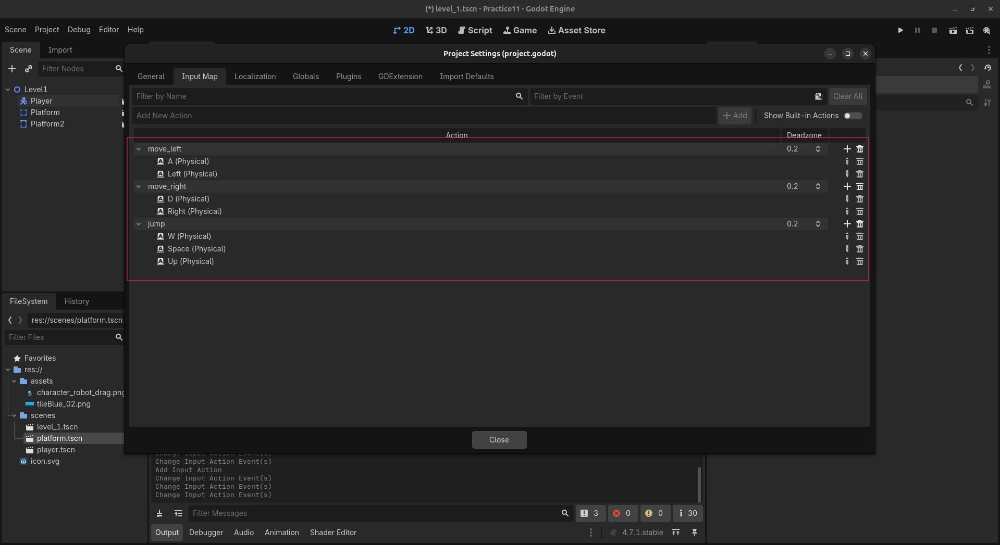

# Лекция 11. Герой платформера



Сегодня мы начинаем создавать новый большой проект - **2D-платформер**.

На этом занятии мы:

- создадим персонажа;
- настроим управление с клавиатуры;
- научим героя двигаться;
- добавим гравитацию;
- сделаем прыжок;
- создадим первые платформы.

Каждый новый инструмент будем сразу применять в нашей игре.

---

## Подготавливаем уровень, платформу и героя

Создайте сцену `Level1` на основе `Node2D` и сохраните её:

```text
scenes/level_1.tscn
```

Создайте отдельную сцену платформы:

```text
Platform (StaticBody2D)
├── Sprite2D
└── CollisionShape2D
```

Для `CollisionShape2D` используйте `RectangleShape2D`.

Сохраните сцену:

```text
scenes/platform.tscn
```

Теперь создайте отдельную сцену персонажа:

```text
Player (CharacterBody2D)
├── Sprite2D
└── CollisionShape2D
```

Сохраните её:

```text
scenes/player.tscn
```

Добавьте `Platform` и `Player` в сцену `Level1`. Расположите персонажа над платформой.

```text
Level1 (Node2D)
├── Platform
└── Player
```

Запустите игру. Персонаж появился, но пока не двигается и не падает. Следующая задача - добавить игровую физику и управление.

---

## Настраиваем клавиши управления

Для управления персонажем создадим три действия:

```text
move_left
move_right
jump
```

Откройте:

```text
Project → Project Settings → Input Map
```



Выключите **Show Built-in Actions**, чтобы скрыть стандартные действия Godot.

В поле **Add New Action** напишите:

```text
move_left
```

и нажмите **Add**.



Раскройте действие `move_left` и нажмите кнопку `+` справа.

Нажмите на клавиатуре `A`. Убедитесь, что выбран вариант **Physical Keycode**, и нажмите **OK**.



Снова нажмите `+`, добавьте стрелку влево и подтвердите выбор кнопкой **OK**.



Таким же способом создайте остальные действия:

```text
move_right
├── D (Physical)
└── Right (Physical)

jump
├── W (Physical)
├── Space (Physical)
└── Up (Physical)
```

После настройки список действий должен выглядеть так:



Теперь в коде мы сможем обращаться не к отдельным клавишам, а к названиям созданных действий:

```gdscript
Input.get_axis("move_left", "move_right")
Input.is_action_just_pressed("jump")
```

Клавишу `S` пока не добавляем, потому что у персонажа ещё нет действия для движения вниз.

---

## Добавляем горизонтальное движение

Откройте сцену `player.tscn` и добавьте к `Player` новый скрипт:

```text
scripts/player.gd
```

Создадим скорость персонажа и получим направление из настроенных действий `move_left` и `move_right`:

```gdscript
extends CharacterBody2D

const SPEED = 300.0


func _physics_process(_delta):
	var direction = Input.get_axis("move_left", "move_right")

	velocity.x = direction * SPEED

	move_and_slide()
```

Метод `Input.get_axis()` возвращает направление движения:

```text
A или ← → -1
D или → → 1
ничего не нажато → 0
```

Значение записывается в горизонтальную скорость персонажа:

```gdscript
velocity.x = direction * SPEED
```

Запустите игру и проверьте движение с помощью `A`, `D` и стрелок. Персонаж уже может двигаться влево и вправо.

---

## Добавляем гравитацию

После запуска игры мы видим, что Player уже двигается влево и вправо, но продолжает висеть в воздухе. `CharacterBody2D` не получает гравитацию автоматически, поэтому её нужно добавить в скрипте.

Движение персонажа находится внутри функции:

```gdscript
func _physics_process(_delta):
```

Godot автоматически вызывает `_physics_process()` много раз в секунду. Внутри этой функции обычно размещают движение, гравитацию и работу со столкновениями.

При каждом вызове Godot передаёт в функцию значение `delta`. Оно показывает, сколько секунд прошло с предыдущего физического кадра.

Например, если игра обрабатывает физику 60 раз в секунду, значение `delta` будет примерно таким:

```text
0.016
```

`delta` нужна для того, чтобы скорость движения и сила гравитации не зависели от количества кадров. Без неё на разных компьютерах или при изменении частоты физики персонаж мог бы падать с разной скоростью.

Раньше параметр назывался:

```gdscript
_delta
```

Нижнее подчёркивание перед названием означает, что параметр пока не используется внутри функции. Так мы сообщаем Godot: «Я знаю, что этот параметр существует, но сейчас он мне не нужен».

`delta` и `_delta` получают одинаковое значение. Нижнее подчёркивание не изменяет работу переменной - это только обозначение для неиспользуемого параметра.

Теперь `delta` понадобится для расчёта гравитации, поэтому убираем нижнее подчёркивание:

```gdscript
func _physics_process(delta):
```

Добавим гравитацию перед горизонтальным движением:

```gdscript
if not is_on_floor():
	velocity += get_gravity() * delta
```

Полный код персонажа теперь выглядит так:

```gdscript
extends CharacterBody2D

const SPEED = 300.0


func _physics_process(delta):
	if not is_on_floor():
		velocity += get_gravity() * delta

	var direction = Input.get_axis("move_left", "move_right")
	velocity.x = direction * SPEED

	move_and_slide()
```

Метод:

```gdscript
get_gravity()
```

возвращает направление и силу гравитации. В двумерной игре гравитация направлена вниз по оси `Y`.

Каждый физический кадр мы немного увеличиваем скорость падения:

```gdscript
velocity += get_gravity() * delta
```

Благодаря умножению на `delta` скорость изменяется с учётом прошедшего времени, а падение остаётся одинаковым при разной частоте обработки физики.

Перед добавлением гравитации мы проверяем:

```gdscript
if not is_on_floor():
```

Метод `is_on_floor()` возвращает `true`, когда персонаж стоит на поверхности. Поэтому гравитация добавляется только во время падения или прыжка.

Запустите игру. Теперь Player должен упасть вниз и остановиться на платформе.

Если персонаж проваливается сквозь неё, проверьте `CollisionShape2D` у `Player` и `Platform`.

Теперь герой умеет двигаться и падать на платформу. Следующая задача - использовать действие `jump` и научить персонажа прыгать.

---

## Добавляем прыжок

Гравитация тянет персонажа вниз. Чтобы герой подпрыгнул, нужно на короткое время изменить его вертикальную скорость в противоположную сторону.

Добавим рядом со скоростью движения новую константу:

```gdscript
const SPEED = 300.0
const JUMP_VELOCITY = -400.0
```

В Godot ось `Y` направлена сверху вниз:

```text
отрицательное значение Y → движение вверх
положительное значение Y → движение вниз
```

Поэтому скорость прыжка имеет отрицательное значение:

```gdscript
const JUMP_VELOCITY = -400.0
```

После гравитации добавим проверку действия `jump`:

```gdscript
if Input.is_action_just_pressed("jump"):
	velocity.y = JUMP_VELOCITY
```

Код будет выглядеть так:

```gdscript
extends CharacterBody2D

const SPEED = 300.0
const JUMP_VELOCITY = -400.0


func _physics_process(delta):
	if not is_on_floor():
		velocity += get_gravity() * delta

	if Input.is_action_just_pressed("jump"):
		velocity.y = JUMP_VELOCITY

	var direction = Input.get_axis("move_left", "move_right")
	velocity.x = direction * SPEED

	move_and_slide()
```

Метод:

```gdscript
Input.is_action_just_pressed("jump")
```

возвращает `true` только один раз - в момент нажатия клавиши. Это подходит для прыжка, потому что одно нажатие должно запускать один прыжок.

Если использовать:

```gdscript
Input.is_action_pressed("jump")
```

проверка будет срабатывать каждый физический кадр, пока клавиша остаётся зажатой. Вертикальная скорость будет постоянно возвращаться к `JUMP_VELOCITY`, и персонаж начнёт неестественно лететь вверх.

Запустите игру и попробуйте прыгнуть с помощью `W`, `Space` или стрелки вверх.

Прыжок работает, но теперь можно снова нажать клавишу уже в воздухе. Персонаж получит новую скорость вверх и сможет прыгать сколько угодно раз, не касаясь платформы.

Чтобы запретить прыжки в воздухе, добавим проверку `is_on_floor()`:

```gdscript
if Input.is_action_just_pressed("jump") and is_on_floor():
	velocity.y = JUMP_VELOCITY
```

Теперь прыжок выполнится только тогда, когда одновременно соблюдены два условия:

```text
нажато действие jump
и
персонаж стоит на поверхности
```

Итоговый код персонажа:

```gdscript
extends CharacterBody2D

const SPEED = 300.0
const JUMP_VELOCITY = -400.0


func _physics_process(delta):
	if not is_on_floor():
		velocity += get_gravity() * delta

	if Input.is_action_just_pressed("jump") and is_on_floor():
		velocity.y = JUMP_VELOCITY

	var direction = Input.get_axis("move_left", "move_right")
	velocity.x = direction * SPEED

	move_and_slide()
```

Запустите игру ещё раз. Теперь Player может прыгнуть только после соприкосновения с платформой.

Значение `JUMP_VELOCITY` можно изменять:

```text
-300 → низкий прыжок
-400 → средний прыжок
-600 → высокий прыжок
```

Чем меньше отрицательное значение, тем выше поднимается персонаж.

---

## Дополнительная механика: двойной прыжок

Сейчас персонаж может прыгать только тогда, когда `is_on_floor()` возвращает `true`. Чтобы сделать двойной прыжок, разрешим ему ещё один раз изменить вертикальную скорость уже в воздухе.

Создадим переменную:

```gdscript
var can_double_jump = false
```

Она будет хранить информацию о том, доступен ли второй прыжок.

Когда персонаж касается платформы, возможность двойного прыжка восстанавливается:

```gdscript
if is_on_floor():
	can_double_jump = true
```

Теперь изменим проверку действия `jump`:

```gdscript
if Input.is_action_just_pressed("jump"):
	if is_on_floor():
		velocity.y = JUMP_VELOCITY
	elif can_double_jump:
		velocity.y = JUMP_VELOCITY
		can_double_jump = false
```

Если Player стоит на платформе, выполняется обычный прыжок.

Если Player уже находится в воздухе, проверяется переменная `can_double_jump`. После второго прыжка она получает значение `false`, поэтому третий раз прыгнуть уже не получится.

Полный код персонажа:

```gdscript
extends CharacterBody2D

const SPEED = 300.0
const JUMP_VELOCITY = -400.0

var can_double_jump = false


func _physics_process(delta):
	if is_on_floor():
		can_double_jump = true
	else:
		velocity += get_gravity() * delta

	if Input.is_action_just_pressed("jump"):
		if is_on_floor():
			velocity.y = JUMP_VELOCITY
		elif can_double_jump:
			velocity.y = JUMP_VELOCITY
			can_double_jump = false

	var direction = Input.get_axis("move_left", "move_right")
	velocity.x = direction * SPEED

	move_and_slide()
```

После приземления:

```gdscript
can_double_jump = true
```

снова разрешает дополнительный прыжок. После его использования:

```gdscript
can_double_jump = false
```

запрещает прыгать третий раз. Запустите игру и проверьте:

```text
первое нажатие - обычный прыжок;
второе нажатие в воздухе - двойной прыжок;
третье нажатие - ничего не происходит;
приземление - двойной прыжок снова доступен.
```

---

## Строим первый игровой маршрут

Сейчас мы проверяли движение и прыжок только на одной платформе. Теперь используем готовую сцену `platform.tscn`, чтобы построить первый игровой маршрут.

Вернитесь в сцену:

```text
scenes/level_1.tscn
```

Добавьте несколько экземпляров `platform.tscn`. Уже добавленную платформу можно выделить и продублировать:

```text
Ctrl + D
```

Расположите платформы на разной высоте и оставьте между ними небольшие промежутки.

```text
Level1
├── Player
├── Platform
├── Platform2
├── Platform3
├── Platform4
└── Platform5
```

Первую платформу оставьте под стартовой позицией Player. Следующие платформы разместите так, чтобы персонаж мог перепрыгивать с одной на другую.

Не создавайте весь маршрут сразу. Добавьте одну платформу, запустите игру и попробуйте до неё допрыгнуть. Если прыжок получился, добавляйте следующую.

Так мы сразу проверяем уровень на практике и не создаём непроходимые участки.

Расстояние между платформами зависит от двух значений:

```gdscript
const SPEED = 300.0
const JUMP_VELOCITY = -400.0
```

`SPEED` влияет на то, как далеко Player сможет пролететь по горизонтали, а `JUMP_VELOCITY` - на высоту прыжка.

Если платформа находится слишком далеко, можно приблизить её. Если она расположена слишком высоко, можно опустить её или увеличить силу прыжка.

Если вы добавили двойной прыжок, создайте дополнительный путь с высокой платформой. До неё нельзя добраться обычным прыжком, но можно допрыгнуть после второго нажатия `jump`.

В результате на уровне должно появиться два варианта маршрута:

```text
обычный путь → доступен с обычным прыжком
сложный путь → требует двойного прыжка
```

Пройдите уровень от начала до конца и проверьте каждую платформу.

Во время тестирования Player может не попасть на платформу и упасть вниз. Сейчас он будет падать бесконечно, потому что у уровня ещё нет нижней границы.

---

## Добавляем DeathZone

Во время прохождения маршрута Player может промахнуться мимо платформы и упасть вниз. Сейчас он продолжает падать бесконечно, потому что у уровня нет нижней границы. Создадим невидимую область `DeathZone`. Когда Player попадёт внутрь неё, текущий уровень начнётся заново. Сначала откройте сцену `player.tscn`, выберите корневой `Player` и перейдите во вкладку:

```text
Node → Groups
```

Создайте группу:

```text
player
```

и добавьте в неё персонажа. Теперь создайте новую сцену с корневым Node `Area2D` и назовите его:

```text
DeathZone
```

Внутрь добавьте `CollisionShape2D`:

```text
DeathZone (Area2D)
└── CollisionShape2D
```

Для `CollisionShape2D` создайте форму:

```text
RectangleShape2D
```

Сделайте прямоугольник достаточно широким. Он должен закрывать всю область под игровым маршрутом.

`Sprite2D` добавлять не нужно. `DeathZone` будет невидимой во время игры. В отличие от платформы, `Area2D` не останавливает Player, а только обнаруживает момент, когда персонаж входит внутрь области.

Сохраните сцену:

```text
scenes/death_zone.tscn
```

Добавьте к `DeathZone` новый скрипт:

```text
scripts/death_zone.gd
```

Выберите корневой `DeathZone`, откройте вкладку **Node** и найдите сигнал:

```text
body_entered(body)
```

Подключите его к `death_zone.gd`.

Godot создаст функцию:

```gdscript
func _on_body_entered(body: Node2D) -> void:
	pass
```

Параметр `body` содержит объект, который вошёл внутрь `DeathZone`.

Проверим, находится ли этот объект в группе `player`. Если это Player, отложенно перезапустим текущую сцену:

```gdscript
extends Area2D


func _on_body_entered(body: Node2D) -> void:
	if body.is_in_group("player"):
		get_tree().call_deferred("reload_current_scene")
```

Проверка:

```gdscript
body.is_in_group("player")
```

нужна для того, чтобы `DeathZone` реагировала только на персонажа.

Сигнал `body_entered` срабатывает во время обработки физики. В этот момент Godot ещё проверяет столкновения и не разрешает сразу удалять физические объекты текущей сцены.

Поэтому мы используем:

```gdscript
get_tree().call_deferred("reload_current_scene")
```

`call_deferred()` откладывает выполнение команды до завершения текущего физического кадра. После этого Godot безопасно удаляет старую сцену и загружает её заново.

Вернитесь в `level_1.tscn` и добавьте `death_zone.tscn` на уровень:

```text
Level1
├── Player
├── Platform
├── Platform2
├── Platform3
├── Platform4
├── Platform5
└── DeathZone
```

Расположите `DeathZone` ниже всех платформ. Она не должна касаться обычного маршрута или Player в момент запуска игры.

Запустите уровень и специально промахнитесь мимо платформы. Player должен упасть в `DeathZone`, после чего сцена автоматически загрузится заново.

Если перезапуск не происходит, проверьте, добавлен ли Player в группу `player`, подключён ли сигнал `body_entered` и создана ли форма внутри `CollisionShape2D`.

---

## Создаём падающий и отскакивающий мяч

Для движения Player мы самостоятельно добавляли гравитацию, изменяли `velocity` и вызывали `move_and_slide()`.

Но не всеми объектами в игре должен управлять скрипт. Например, мяч должен самостоятельно падать, сталкиваться с платформами, катиться и отскакивать.

Для таких объектов в Godot используется:

```text
RigidBody2D
```

Создайте новую сцену с корневым Node `RigidBody2D` и назовите его:

```text
Ball
```

Добавьте внутрь:

```text
Ball (RigidBody2D)
├── Sprite2D
└── CollisionShape2D
```

В `Sprite2D` установите изображение мяча или другого круглого предмета.

Для `CollisionShape2D` создайте форму:

```text
CircleShape2D
```

Измените размер круга так, чтобы он совпадал с изображением мяча.

Сохраните сцену:

```text
scenes/ball.tscn
```

Добавьте `ball.tscn` в `Level1` и расположите его над одной из платформ.

```text
Level1
├── Player
├── Platform
├── Platform2
├── Ball
└── DeathZone
```

Запустите игру.

Ball самостоятельно упадёт вниз и остановится на платформе. Для него мы не создавали скрипт и не добавляли гравитацию вручную.

`RigidBody2D` получает гравитацию и обрабатывает столкновения автоматически. Его движение рассчитывает физический движок Godot.

Сейчас мяч падает, но почти не отскакивает. Чтобы изменить свойства его поверхности, выберите `Ball` и найдите в Inspector:

```text
Physics Material Override
```

Нажмите на пустое поле и выберите:

```text
New PhysicsMaterial
```

Откройте созданный `PhysicsMaterial` и измените:

```text
Bounce → 0.8
Friction → 0.2
```

`Bounce` отвечает за силу отскока:

```text
0.0 → мяч не отскакивает
0.3 → слабый отскок
0.8 → сильный отскок
1.0 → максимальный отскок
```

`Friction` отвечает за трение. При большом трении мяч быстрее замедляется, а при маленьком дольше скользит и катится по поверхности.

Запустите игру ещё раз. Теперь после столкновения с платформой Ball должен отскочить вверх.

Попробуйте изменить `Bounce` и сравнить результат:

```text
Bounce = 0.2
Bounce = 0.5
Bounce = 0.8
Bounce = 1.0
```

Даже при значении `1.0` мяч может постепенно терять высоту из-за сопротивления и других настроек физики.

Также можно изменить параметр:

```text
Gravity Scale
```

Он определяет, насколько сильно гравитация действует на конкретный объект:

```text
Gravity Scale = 0.5 → мяч падает медленнее
Gravity Scale = 1.0 → обычная гравитация
Gravity Scale = 2.0 → мяч падает быстрее
```

Добавьте на уровень несколько экземпляров `ball.tscn` и расположите их над разными платформами.

Во время запуска мячи должны падать с разной высоты, сталкиваться с платформами и отскакивать от них.

Теперь на одном уровне работают разные типы физических объектов:

```text
StaticBody2D    → неподвижные платформы
CharacterBody2D → персонаж, которым управляет код
RigidBody2D     → объект, которым управляет физический движок
Area2D          → область, обнаруживающая другие объекты
```

Попробуйте подойти Player к мячу и столкнуться с ним. Поведение Ball будет зависеть от его массы, скорости, формы CollisionShape и настроек PhysicsMaterial.

## Настраиваем физику мяча

Теперь изменим физические свойства мяча и посмотрим, как они влияют на его поведение.

Выберите корневой узел `Ball` и найдите в `Inspector` параметр:

```text
Mass
```

Он отвечает за массу объекта. По умолчанию установлено:

```text
Mass = 1.0
```

Попробуйте увеличить значение:

```text
Mass = 5.0
```

Теперь персонажу будет сложнее сдвинуть мяч. При этом тяжёлый мяч не падает быстрее лёгкого - скорость падения настраивается отдельно с помощью `Gravity Scale`.

```text
Gravity Scale = 0.5 - мяч падает медленнее
Gravity Scale = 1.0 - обычная гравитация
Gravity Scale = 2.0 - мяч падает быстрее
```

Откройте созданный ранее `Physics Material`:

```text
Physics Material Override
```

Здесь можно настроить трение и отскок:

```text
Friction - насколько легко мяч скользит и начинает двигаться
Bounce - насколько сильно мяч отскакивает
```

Для нашего мяча установим:

```text
Mass = 1.0
Gravity Scale = 1.0
Friction = 0.1
Bounce = 0.8
```

Запустите игру и толкните мяч персонажем. Он должен легко начинать движение, катиться по платформе и отскакивать после падения.

Попробуйте по очереди изменить параметры:

```text
Mass = 5.0
Friction = 1.0
Bounce = 0.2
Gravity Scale = 2.0
```

После каждого изменения запускайте игру и наблюдайте за результатом. Так мы сразу видим, за что отвечает каждый параметр.

Если мяч по-разному двигается влево и вправо, проверьте его `CollisionShape2D`. Форма коллизии должна находиться точно в центре мяча.

Добавьте на маршрут несколько экземпляров `Ball`. Разместите их над разными платформами, чтобы они падали, отскакивали и мешали игроку проходить уровень.

---

## Практика

Доработайте собственный уровень платформера:

- постройте маршрут минимум из шести платформ;
- добавьте простые и сложные прыжки;
- разместите `DeathZone` под уровнем;
- добавьте несколько падающих мячей;
- настройте мячам разные значения `Mass`, `Friction` и `Bounce`;
- пройдите созданный уровень от начала до конца.

Убедитесь, что персонаж может пройти весь маршрут, а после падения за пределы уровня сцена начинается заново.

---

## Домашнее задание

Создайте новый проект, собственный тренировочный маршрут для персонажа.

### Обязательная часть

- добавьте минимум восемь платформ;
- расположите платформы на разной высоте;
- сделайте маршрут, который можно пройти от начала до конца;
- разместите `DeathZone` под всем уровнем;
- добавьте минимум два физических мяча;
- настройте одному мячу большой `Bounce`, а другому - большую `Mass`;
- проверьте, что после падения за пределы уровня игра начинается заново.

### Дополнительное задание

Создайте второй, более сложный путь, для прохождения которого потребуется двойной прыжок.

Проверьте свой уровень несколько раз. Все прыжки должны быть сложными, но выполнимыми.

## Итоги

На этом занятии мы начали создавать большой проект - собственный 2D-платформер.

Мы научились:

- настраивать управление через `Input Map`;
- двигать персонажа влево и вправо;
- использовать `velocity`;
- добавлять гравитацию с помощью `delta`;
- создавать обычный и двойной прыжок;
- проверять поверхность через `is_on_floor()`;
- строить маршрут из отдельных платформ;
- перезапускать сцену с помощью `DeathZone`;
- добавлять физические объекты через `RigidBody2D`;
- настраивать массу, трение, гравитацию и силу отскока.

Теперь наш герой умеет двигаться, прыгать и взаимодействовать с физическими объектами. На следующем занятии мы начнём создавать полноценный игровой уровень с помощью `TileSet` и `TileMapLayer`.
